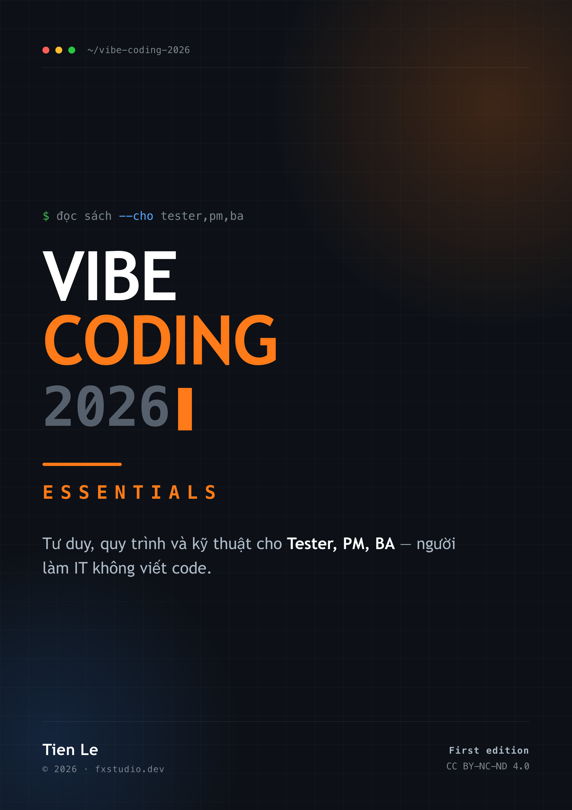

# Vibe Coding 2026 — Essentials

**Tư duy, quy trình và kỹ thuật cho Tester, PM, BA — người làm IT không viết code**

  

Sách miễn phí, tiếng Việt, dành cho người làm trong ngành IT nhưng **không viết code hàng ngày** — Tester/QA, Project Manager, Business Analyst — muốn hiểu và chỉ đạo được AI coding thay vì chỉ ngồi ngoài nhìn.

**20 chương · 7 phần · 3 phụ lục · 54 hình minh họa**

## Tải sách

| Định dạng | Link | Ghi chú |
|---|---|---|
| PDF | [tải ở Releases](../../releases/latest) | 308 trang, mục lục kèm số trang, bookmark hai cấp, in được khổ A4 |
| EPUB | [tải ở Releases](../../releases/latest) | cho Kindle, Apple Books, Google Play Books |
| Đọc trên GitHub | [mục lục](mucluc.md) | từng chương dạng markdown |

## Sách này cho bạn gì

- Hiểu vibe coding đủ sâu để **đánh giá và ra quyết định**, không chỉ nghe kể lại
- Nắm **quy trình 5 giai đoạn** và biết viết PRD, prompt, rules file cho AI
- **Đọc hiểu** được code AI sinh ra: HTML, CSS, JavaScript, cấu trúc project
- Biết cách **test, debug và soát bảo mật** code AI sinh ra — phần mà đa số bỏ qua

## Sách này KHÔNG cho bạn gì

Nói trước để bạn không mất thời gian:

- **Không** hướng dẫn thao tác từng bước trên một công cụ cụ thể. Không có ảnh chụp giao diện, không có "bấm vào nút ở góc phải".
- **Không** có bảng giá, hạn mức free tier, hay so sánh công cụ cập nhật liên tục. Những thứ này lỗi thời trong vài tháng; chúng nằm ở trang [Đề xuất công cụ](manuscript/de-xuat-cong-cu.md) và được cập nhật riêng.

Lý do của lựa chọn này: phần lỗi thời nhanh nhất của một cuốn sách kỹ thuật là phần mô tả giao diện phần mềm. Cắt nó đi, phần còn lại dùng được lâu hơn nhiều.

## Nội dung

Mục lục đầy đủ ở [mucluc.md](mucluc.md).

| Phần | Chương | Nội dung |
|---|---|---|
| 1. Nỗi đau | 1–2 | Vibe coding là gì; lợi thế bị bỏ quên của Tester/PM/BA |
| 2. Tư duy và quy trình | 3–6 | Quy trình 5 giai đoạn, prompting, PRD, rules file |
| 3. Nền tảng kỹ thuật vừa đủ | 7–10 | Web, HTML/CSS, JavaScript, cấu trúc project |
| 4. Dữ liệu, triển khai, phiên bản | 11–13 | Database, auth & deploy, Git |
| 5. Chất lượng và bảo mật | 14–16 | Debug, tư duy test case, bảo mật AI code |
| 6. Đi xa hơn | 17–19 | Hiểu LLM, agentic workflows & MCP, lộ trình nghề |
| 7. Capstone | 20 | Dựng Bug/Issue Tracker — walkthrough kiến trúc |
| Phụ lục | A–C | 30 prompt mẫu, checklist bảo mật, thuật ngữ Anh–Việt |

## Kèm theo sách

- [templates/](templates/) — mẫu PRD, rules file, `.gitignore` dùng được luôn
- [manuscript/de-xuat-cong-cu.md](manuscript/de-xuat-cong-cu.md) — cách chọn công cụ, cập nhật độc lập với sách

## Đóng góp

Mọi đóng góp & góp ý thì bạn có thể gửi [Pull Requests](../../pulls) hoặc [Issues](../../issues) trực tiếp trên repo này. Hoặc bạn có thể liên hệ theo các thông tin ở dưới đây.

Thấy lỗi kỹ thuật, số liệu sai, hay chỗ khó hiểu thì đừng ngại mở Issue. Đặc biệt hoan nghênh góp ý từ chính đối tượng của sách — nếu bạn là Tester/PM/BA và đọc một chương thấy tắc ở đâu, đó là thông tin quý nhất.

## Liên hệ

- Website: [fxstudio.dev](https://fxstudio.dev/)
- Email: [contacts@fxstudio.dev](mailto:contacts@fxstudio.dev)
- [Buy me a coffee!](https://fxstudio.dev/donate/)

  

## Giấy phép

Nội dung sách: [CC BY-NC-ND 4.0](./LICENSE.md) — miễn phí đọc và chia sẻ cho mục đích học tập, **không dùng cho mục đích thương mại**, không phát hành bản đã sửa đổi hay bản dịch mà chưa xin phép.

Phần code và file trong `templates/`: **MIT** — dùng thoải mái trong dự án của bạn, kể cả dự án thương mại.

© 2026 Tien Le · [fxstudio.dev](https://fxstudio.dev)

---

> *Về bản quyền của repo và nội dung trong repo: hoàn toàn miễn phí cho các mục đích
> phi lợi nhuận và học tập. Tất cả các hành vi sao chép hay sử dụng vì mục đích thương
> mại thì đều là vi phạm.*
