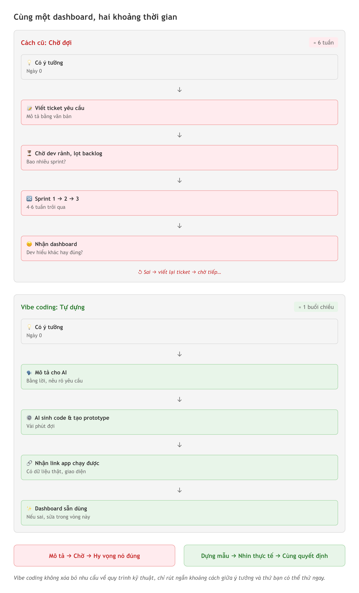
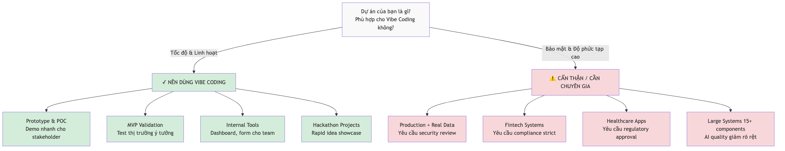
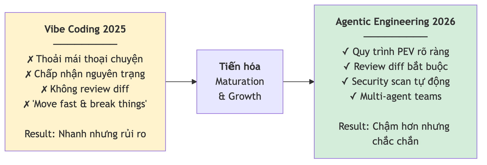

# Chương 1: Vibe coding là gì, và tại sao 2026 khác 2025

Bạn là PM, và trong buổi retro tuần trước cả team lại nhắc tới cái dashboard theo dõi bug. Ai cũng đồng ý là nó hữu ích: một màn hình gom số lượng bug đang mở, thời gian xử lý trung bình, phân bố theo mức độ nghiêm trọng. Bạn đã mô tả nó rõ đến từng cột. Vấn đề không nằm ở chỗ bạn không biết mình muốn gì — bạn biết chính xác. Vấn đề là để có nó, bạn phải chờ.

Chờ một dev rảnh tay. Chờ nó lọt vào backlog, rồi được ưu tiên, rồi được ước lượng story point. Ba sprint trôi qua — sáu tuần — và cái dashboard vẫn là một dòng ghi chú trong Jira. Trong khi đó, mỗi lần stakeholder hỏi "tuần này bug tình hình sao rồi", bạn lại mở spreadsheet ra đếm tay. Cảm giác quen thuộc đến mức chua chát: bạn hiểu bài toán hơn bất kỳ ai trong phòng, nhưng bạn là người duy nhất không thể tự tay dựng ra lời giải.

Rồi một hôm, một đồng nghiệp gửi cho bạn đường link tới một app. "Cái này tôi làm chiều qua," anh nói. Đó chính là cái dashboard bạn mô tả trong retro. Không phải bản mockup — một app chạy được, có dữ liệu thật, lọc được theo trạng thái. Bạn hỏi anh học code từ bao giờ. Anh cười: "Tôi không code. Tôi chỉ mô tả cho AI những gì tôi muốn." Chương này nói về đúng cái khoảnh khắc đó — khi ba tuần chờ đợi bỗng co lại thành một buổi chiều, và tại sao năm 2026 đã biến chuyện đó từ giai thoại thành chuyện thường ngày.

*HÌNH 1.1: Hai khung cảnh đặt cạnh nhau. Bên trái — một PM ngồi trước Jira, cái dashboard là dòng ghi chú "backlog", đồng hồ chỉ "sprint 3". Bên phải — cùng người đó, màn hình hiện app dashboard chạy được, ghi chú "một buổi chiều". Mũi tên ở giữa: "mô tả bằng lời → AI dựng".*

## Bài post đặt tên cho một hiện tượng

Thứ mà đồng nghiệp bạn làm không phải phép màu, và cũng không hẳn là mới. Các công cụ AI viết code đã âm thầm tồn tại từ trước. Nhưng nó chưa có tên — cho tới khi một trong những người có ảnh hưởng nhất giới AI đặt tên cho nó.

Ngày 2 tháng 2 năm 2025, **Andrej Karpathy** — cựu Giám đốc AI của Tesla, một trong những thành viên sáng lập của phòng lab AI đứng sau nhiều mô hình ngôn ngữ lớn hàng đầu — đăng một bài trên mạng xã hội X, đại ý: có một kiểu lập trình mới mà ông gọi là *"vibe coding"*, nơi bạn hoàn toàn đặt niềm tin vào cảm nhận, chấp nhận sự phát triển theo cấp số nhân, và "quên đi rằng code tồn tại". Ông mô tả việc nói chuyện với AI, chấp nhận toàn bộ code nó tạo ra mà không đọc diff (bản so sánh giữa phiên bản cũ và mới), và khi gặp lỗi thì chỉ copy thông báo lỗi paste lại cho AI tự sửa. Với người ngoài ngành, nghe như trò đùa; với những ai đã thử, đó là mô tả chính xác đến khó chịu về cái cảm giác vừa phấn khích vừa mất kiểm soát khi lần đầu để AI viết code hộ mình.

Nghe liều lĩnh? Đúng vậy. Nhưng Karpathy không nói cho vui. Chính ông, từ năm 2023, đã tuyên bố *"ngôn ngữ lập trình hot nhất bây giờ là tiếng Anh"* — và chỉ hai năm sau, phát biểu đó thành hiện thực. Bài post của ông giống que diêm ném vào đồng cỏ khô: nó không phát minh ra vibe coding, nhưng nó đặt tên cho một hiện tượng mà hàng triệu người đang làm mà chưa biết gọi là gì. Và một khi thứ gì đó đã có tên, nó bắt đầu sống cuộc đời riêng.

> 💡 **Tip:** Bạn không cần theo dõi Karpathy mỗi ngày, nhưng nên biết ông là ai. Trong giới AI, ông có vai trò gần giống Martin Fowler trong giới phát triển phần mềm — khi ông đặt tên cho một khái niệm, giới trong ngành coi nó là "chính thức".

## Vibe coding là gì — nói bằng ngôn ngữ đời thường

Hãy nghĩ về việc xây nhà. Trước đây, muốn có một căn nhà bạn có hai lựa chọn: học xây dựng rồi tự tay xếp gạch, hoặc thuê một đội thợ và chờ. **Vibe coding** là lựa chọn thứ ba — bạn mô tả căn nhà bạn muốn cho một kiến trúc sư AI cực nhanh, và nó dựng cho bạn trong vài giờ. Bạn nói: "Tôi muốn nhà hai tầng, phòng khách rộng, bếp mở, ban công hướng đông nam." AI thiết kế và "xây" gần như ngay lập tức.

Nói chính xác hơn: vibe coding là cách tạo phần mềm bằng việc **mô tả điều bạn muốn bằng ngôn ngữ tự nhiên** — tiếng Việt, tiếng Anh, ngôn ngữ nào cũng được — rồi để AI sinh ra code tương ứng. Thay vì viết từng dòng code bằng những ngôn ngữ lập trình như JavaScript hay Python, bạn tập trung vào **ý định** (*intent*): bạn muốn cái gì, chứ không phải làm như thế nào.

Định nghĩa nghe đơn giản, nhưng cú lật tâm lý đằng sau nó thì rất lớn. Trong lập trình truyền thống, rào cản chính là **cú pháp** (*syntax*) — bạn phải nhớ chính xác cách viết từng lệnh, từng dấu chấm phẩy, từng ngoặc nhọn. Trong vibe coding, rào cản chuyển sang **giao tiếp** — bạn phải biết mô tả rõ ràng điều bạn muốn. Và đây chính là lý do những người như bạn — Tester, PM, BA — có một lợi thế bất ngờ, thứ mà chúng ta sẽ mổ xẻ kỹ ở Chương 2.

> 🧪 **Dành cho Tester/QA:** Bạn đã quen viết "expected vs. actual behavior" trong bug report? Đó chính là kỹ năng lõi của vibe coding. Khi bạn nói với AI "Tôi muốn form đăng ký có validation email, hiện lỗi màu đỏ khi sai định dạng", bạn đang viết một prompt chất lượng cao mà không ít developer còn chưa làm tốt bằng bạn.

## Vibe coding và lập trình truyền thống, đặt cạnh nhau

Để thấy rõ hơn, hãy để hai cách tiếp cận đứng cạnh nhau:

| Tiêu chí | Lập trình truyền thống | Vibe coding |
|----------|----------------------|-------------|
| **Ngôn ngữ** | JavaScript, Python, Java… | Tiếng Việt, tiếng Anh, ngôn ngữ tự nhiên |
| **Trọng tâm** | Viết code chính xác, cú pháp đúng | Mô tả ý định, kết quả mong muốn |
| **Tốc độ** | Hàng tuần đến hàng tháng cho một tính năng | Hàng giờ đến hàng ngày cho một prototype |
| **Kiểm soát** | Cao — hiểu từng dòng code | Trung bình đến thấp — có thể không hiểu hết code AI tạo |
| **Rào cản gia nhập** | Cao — cần học nhiều năm | Thấp — bắt đầu được ngay |
| **Rủi ro** | Lỗi do người viết, dễ truy vết | Lỗi do AI "ảo giác", cần kiểm tra kỹ |
| **Hợp cho** | Hệ thống phức tạp, dài hạn, production | Prototype, MVP, tool nội bộ, hackathon |

Vibe coding **không thay thế** lập trình truyền thống. Nó là công cụ bổ sung, hợp cho những tình huống cụ thể. Giống như bạn có thể dùng một dịch vụ dịch tự động để đọc lướt một bài báo tiếng Nhật, nhưng bạn sẽ không dùng nó để dịch một hợp đồng pháp lý — công cụ phù hợp cho mục đích phù hợp.

> 📋 **Dành cho PM/BA:** Nếu bạn từng viết requirements document hay user story, vibe coding sẽ quen thuộc một cách bất ngờ. Viết prompt cho AI giống viết acceptance criteria — càng cụ thể, càng rõ, kết quả càng tốt. Kỹ năng "chia nhỏ yêu cầu" (*decomposition*) bạn dùng hằng ngày chính là vũ khí ngầm của một vibe coder giỏi.

## Khi nào nên dùng: prototype, MVP, tool nội bộ, hackathon

Vibe coding tỏa sáng nhất khi tình huống cần **tốc độ và sự linh hoạt** hơn là sự hoàn hảo. Đây là mấy trường hợp lý tưởng.

**Prototype và proof-of-concept.** Bạn có một ý tưởng và cần demo cho sếp hay khách hàng ngay trong buổi chiều? Thay vì làm slide mô tả ý tưởng, bạn dựng một app thật chạy được để người khác "sờ, chạm, thử" trực tiếp. Sức thuyết phục của một thứ bấm được cao hơn hẳn một trang trình chiếu. Cái dashboard bug ở đầu chương chính là ví dụ mẫu: một tool nội bộ, không cần hoàn hảo, chỉ cần đúng và chạy được cho team bạn.

**MVP** (*Minimum Viable Product* — sản phẩm khả dụng tối thiểu). Khi bạn muốn kiểm chứng một ý tưởng kinh doanh trước khi đầu tư lớn, vibe coding cho bạn dựng phiên bản đầu tiên đủ nhanh để thử phản ứng thị trường thật, thay vì tranh luận trên giấy.

**Tool nội bộ cho team.** Một dashboard theo dõi bug, một form thu thập feedback, một công cụ tính sprint velocity — những tool nội bộ kiểu này là "đất vàng" của vibe coding. Chúng không cần đạt chuẩn production, chỉ cần phục vụ tốt cho một nhóm người bạn biết mặt.

**Hackathon và kiểm chứng ý tưởng cấp tốc.** Khi thời gian là ràng buộc lớn nhất, khả năng cho ra một sản phẩm chạy được trong vài giờ là lợi thế không thể chối cãi.

> 🧰 **Đề xuất công cụ:** *Tính đến 2026-07.* Nhóm công cụ dựng app từ prompt hiện có Lovable, Bolt.new, v0, Replit; nhóm AI IDE (viết code ngay trong trình soạn thảo) có Cursor, Windsurf. Danh sách và tính năng đổi rất nhanh — kiểm tra trang chủ trước khi chọn, đừng tin con số trong bất kỳ cuốn sách nào. Xem thêm trang [Đề xuất công cụ](../de-xuat-cong-cu.md).

## Khi nào KHÔNG dùng — và đây là phần quan trọng nhất

Cũng như mọi công cụ, vibe coding có giới hạn. Và những giới hạn này không phải để dọa bạn — chúng là thực tế cần biết để ra quyết định đúng. Thật ra, biết khi nào *không* dùng một công cụ là dấu hiệu rõ nhất của người dùng nó thành thạo. Bốn ranh giới dưới đây đáng thuộc lòng.

**Hệ thống xử lý dữ liệu người dùng thật.** Khi app của bạn động tới thông tin cá nhân, dữ liệu tài chính, hay hồ sơ y tế của người dùng thật, bạn cần người có chuyên môn bảo mật review code trước khi đưa lên chạy thật. Đây không phải lời cảnh báo suông: nghiên cứu về bảo mật code do AI sinh ra ghi nhận **khoảng 40–62% code AI tạo ra chứa lỗ hổng bảo mật** (theo Veracode và Contrast Security/NYU, 2025) — một khoảng đủ lớn để không thể xem nhẹ. Chúng ta sẽ mổ xẻ kỹ chuyện bảo mật AI code, mười lỗi phổ biến nhất và một framework để kiểm tra, ở Chương 16.

**Ngành tài chính và y tế (fintech, healthcare).** Các ngành này bị ràng buộc pháp lý nghiêm ngặt. Một lỗi nhỏ trong logic xử lý giao dịch hay tính liều thuốc có thể gây hậu quả nghiêm trọng. Bạn hoàn toàn có thể dùng vibe coding để dựng prototype cho các ngành này, nhưng phiên bản chạy thật cần một đội ngũ chuyên nghiệp đứng sau.

**Hệ thống lớn, phức tạp, phải bảo trì lâu dài.** Khi một project vượt quá **khoảng 15–20 component** — một ngưỡng nhiều người làm vibe coding ghi nhận từ thực tế — chất lượng đầu ra của các công cụ bắt đầu giảm rõ rệt: AI bắt đầu quên những phần nó đã viết, tạo mâu thuẫn giữa các phần, và càng sửa càng rối. Hệ thống doanh nghiệp với hàng trăm tính năng đan vào nhau cần kiến trúc sư và developer có kinh nghiệm, không phải một chuỗi prompt.

**Business logic phức tạp.** Những hệ thống có quy tắc nghiệp vụ (*business logic*) nhiều tầng, nhiều điều kiện kết hợp, trạng thái thay đổi liên hoàn — đây là nơi vibe coding dễ sinh ra bug ẩn mà khó phát hiện nhất. Với dân QA, đây cũng là nơi trực giác test của bạn có giá trị nhất: bạn đánh hơi được chỗ logic dễ gãy trước cả khi nó gãy.

Điểm chung của bốn ranh giới trên là gì? Không phải chuyện AI "dốt" — mà là chuyện *hậu quả của một lỗi*. Với cái dashboard bug nội bộ, một lỗi tệ nhất chỉ làm bạn phải bấm refresh lại. Với một API xử lý giao dịch tiền, một lỗi tương tự có thể chuyển nhầm tiền của người thật. Cùng một công cụ, cùng một xác suất sai, nhưng cái giá phải trả khác nhau một trời một vực. Vì thế, câu hỏi đúng không phải "vibe coding có đủ giỏi không", mà là "nếu nó sai ở đây thì ai chịu, và chịu tới đâu". Trả lời được câu đó, bạn đã biết mình nên tự làm hay nên gọi người chuyên môn. Đây cũng chính là kiểu tư duy đánh giá rủi ro mà một Tester hay BA giỏi vốn làm trong đầu mỗi khi nhìn một tính năng mới — chỉ là giờ bạn áp nó cho chính công cụ mình đang cầm.

> ⚠️ **Lưu ý:** Quy tắc vàng nên khắc trong đầu: vibe coding tuyệt vời để **bắt đầu** một dự án, nhưng càng tiến về phía production, bạn càng cần thêm chuyên môn kỹ thuật. Tư duy đúng là **prototype bằng vibe coding, validate với người dùng thật, rồi rebuild với đội ngũ chuyên nghiệp** khi bài toán đủ nghiêm túc. Ai bán cho bạn ý tưởng "AI thay thế hoàn toàn developer" là đang bán quá lời.

*HÌNH 1.2: Cây quyết định "Nên dùng / Không nên dùng vibe coding". Gốc là câu hỏi "Dự án của bạn là gì?", rẽ nhánh theo tính chất: prototype / tool nội bộ / hackathon → nhánh "Nên"; production xử lý dữ liệu thật / fintech / healthcare / hệ thống lớn > 15–20 component → nhánh "Cần chuyên gia review".*

## Từ "vibes" sang "agentic engineering": vì sao 2026 khác 2025

Câu chuyện không dừng ở bài post năm 2025. Đến tháng 2 năm 2026, chính Karpathy tuyên bố vibe coding đã "lỗi thời" (*passé*) và giới thiệu một khái niệm mới: **agentic engineering** — lập trình có AI hỗ trợ nhưng đặt dưới sự giám sát chuyên nghiệp.

Thực ra đó là sự trưởng thành tự nhiên. Giai đoạn "vibes" — chấp nhận mọi thứ AI tạo ra mà không kiểm tra — là giai đoạn thí nghiệm, khi ai cũng phấn khích thử xem AI làm được tới đâu. Giai đoạn "agentic engineering" là khi ngành đã học được bài học từ những app sập lúc nửa đêm và những lỗ hổng bảo mật lộ ra sau khi go-live, rồi bắt đầu dựng kỷ luật quanh nó.

Tâm của sự tiến hóa này là **vòng lặp PEV** (*PEV loop*): **Plan** (lên kế hoạch) — **Execute** (thực thi) — **Verify** (kiểm chứng). Thay vì nhảy thẳng vào viết prompt rồi chấp nhận kết quả, bạn bắt đầu bằng việc nói rõ mình muốn làm gì, để AI thực thi, rồi kiểm tra cẩn thận trước khi đi tiếp. Nghe quen không? Nếu bạn là Tester, đây gần như chu kỳ test planning — test execution — test verification. Nếu bạn là PM, đây gần như sprint planning — sprint execution — sprint review. Vibe coding đang học lại chính những quy trình bạn làm mỗi ngày, và đó là lý do năm 2026 lại là thời điểm tốt cho dân QA/PM/BA nhập cuộc: cái ngành này đang cần đúng thứ kỷ luật mà bạn đã có sẵn trong tay.

Ngoài PEV loop, ngành cũng chuyển sang bắt buộc review diff trước khi chấp nhận code AI tạo ra, quét bảo mật tự động cho mọi thay đổi, lên kế hoạch kiến trúc trước khi bắt tay dựng, và dùng đội AI đa agent (*multi-agent teams*) với vai trò riêng biệt — một agent viết code, một agent test, một agent soát bảo mật. Toàn bộ chiều hướng này cho thấy vibe coding không mất đi, nó đang lớn lên và chuyên nghiệp hơn.

> 💡 **Tip:** Suốt cuốn sách này, tư duy PEV loop sẽ lặp lại ở mọi thứ bạn dựng. Nó cũng là xương sống của quy trình năm giai đoạn mà chúng ta sẽ đi qua ở Chương 3. Còn cách một AI *agent* thật sự tự chạy vòng lặp này — khác gì với một trợ lý chat thông thường — là nội dung của Chương 18.

*HÌNH 1.3: Sơ đồ tiến hóa "Vibe Coding (2025) → Agentic Engineering (2026)". Bên trái: người nói chuyện thoải mái với AI, không kiểm tra. Bên phải: người có vòng PEV, có security scan, có diff review. Mũi tên ở giữa thể hiện sự trưởng thành, không phải thay thế.*

## Vài dấu mốc để bạn không nghĩ mình đang đuổi theo trào lưu nhất thời

Trước khi khép chương, cần đặt câu chuyện vào bối cảnh — để bạn thấy đây không phải một trào lưu sớm nở tối tàn, mà là một dịch chuyển đủ lớn để đáng đầu tư thời gian học.

Cuối năm 2025, **Collins Dictionary chọn "vibe coding" là Word of the Year 2025**. Khi một thuật ngữ công nghệ được một nhà từ điển lớn vinh danh, nó đã vượt khỏi phạm vi một xu hướng ngách để thành một hiện tượng văn hóa mà công chúng nói tới.

Sang năm sau, **MIT Technology Review xếp "generative coding" (bao gồm vibe coding) vào nhóm 10 Công nghệ Đột phá của năm 2026** — danh sách mà trước đó từng vinh danh những công nghệ làm thay đổi thế giới. Một xu hướng được cả một nhà từ điển lớn lẫn một tạp chí công nghệ có uy tín đánh dấu trong hai năm liên tiếp thì khó gọi là bong bóng qua đường.

Và một chi tiết đáng chú ý hơn cả: phần lớn người thực hành vibe coding không phải là developer chuyên nghiệp, mà là những người như bạn — dân IT không viết code, founder, nhà giáo dục, những người có ý tưởng nhưng không có nền lập trình truyền thống. Đây chính là bằng chứng rõ nhất rằng cánh cửa đã mở cho đúng nhóm người mà cuốn sách này viết cho. Nói cách khác, bạn không phải người đến muộn cố bắt kịp một cuộc chơi của dân kỹ thuật — bạn nằm trong nhóm đông đảo nhất đang định hình nó.

> 📋 **Dành cho PM/BA:** Hai dấu mốc trên là "đạn" tốt cho lần tới bạn cần thuyết phục management đầu tư vào công cụ AI. Nhưng hãy dùng đúng cách: chúng chứng minh xu hướng đáng để thử, *không* chứng minh rằng cứ dùng là ra sản phẩm chạy thật. Ranh giới đó — giữa "nên thử" và "đã sẵn sàng cho production" — chính là thứ phần "Khi nào KHÔNG dùng" ở trên bảo vệ bạn khỏi vượt qua ẩu.

## Tóm tắt

- **Vibe coding** là cách tạo phần mềm bằng việc mô tả ý định bằng ngôn ngữ tự nhiên rồi để AI sinh code — thuật ngữ do Andrej Karpathy đặt tên ngày 2 tháng 2 năm 2025.
- Khác lập trình truyền thống vốn xoay quanh cú pháp, vibe coding xoay quanh **ý định và kết quả mong muốn**, kéo rào cản gia nhập xuống rất thấp.
- Nó hợp nhất cho **prototype, MVP, tool nội bộ, hackathon** — những tình huống cần tốc độ hơn sự hoàn hảo.
- **KHÔNG** nên dùng cho production xử lý dữ liệu thật, fintech, healthcare, hay hệ thống lớn mà không có người chuyên môn review — nghiên cứu ghi nhận khoảng 40–62% code AI sinh ra chứa lỗ hổng bảo mật, và chất lượng đầu ra giảm rõ khi project vượt khoảng 15–20 component.
- Đến 2026, vibe coding đã tiến hóa thành **agentic engineering** với vòng lặp PEV (Plan — Execute — Verify) và kỷ luật chuyên nghiệp hơn — đây là điểm khác biệt cốt lõi giữa 2026 và 2025.
- Các dấu mốc như Collins Word of the Year 2025 và nhóm 10 Công nghệ Đột phá 2026 của MIT Technology Review cho thấy đây là một dịch chuyển thật, không phải trào lưu nhất thời.
- Bạn — Tester, PM, BA — đang đứng ở vị trí lý tưởng để tận dụng nó, vì rào cản đã chuyển từ cú pháp sang giao tiếp, thứ bạn vốn làm mỗi ngày.

## Bài tập

**BT 1.1 — Bảng so sánh của riêng bạn**

Dùng một công cụ AI dạng trợ lý chat mà bạn có sẵn để tạo bảng so sánh giữa vibe coding và lập trình truyền thống. Sau đó tự tay chỉnh lại bảng để phản ánh hiểu biết của bạn sau chương này.

*Gợi ý:* Bắt đầu bằng một prompt đơn giản — "Tạo bảng so sánh vibe coding và lập trình truyền thống theo các tiêu chí: ngôn ngữ, tốc độ, kiểm soát, rủi ro, hợp cho ai." Rồi đọc kết quả và tự hỏi: "AI bỏ sót điểm nào? Điểm nào chưa chính xác?" Chính bước chỉnh sửa này là hình thức sơ khai của tư duy "Human in the Loop" mà bạn sẽ gặp lại ở Chương 18.

*Đầu ra:* Một file markdown hoặc tài liệu chứa bảng so sánh hoàn chỉnh, có ít nhất một dòng bạn tự sửa lại khác với bản AI đưa ra ban đầu.

**BT 1.2 — Phân loại mười tình huống: nên hay không nên**

Với mười tình huống sau, phân loại từng cái vào "Nên dùng vibe coding" hoặc "Không nên / cần cẩn thận", và giải thích lý do:

1. Dashboard nội bộ cho team QA theo dõi bug
2. Hệ thống thanh toán của một ngân hàng
3. Prototype app cho hackathon cuối tuần
4. Tool tính sprint velocity cho Scrum team
5. Hệ thống quản lý hồ sơ bệnh nhân
6. Landing page cho một startup mới thành lập
7. API xử lý giao dịch chứng khoán
8. Form thu thập feedback khách hàng
9. Hệ thống quản lý kho cho công ty logistics
10. Công cụ cá nhân theo dõi thói quen hằng ngày

*Gợi ý:* Với mỗi tình huống, hỏi ba câu: (1) Có dữ liệu nhạy cảm không? (2) Có yêu cầu pháp lý đặc biệt không? (3) Quy mô và độ phức tạp tới đâu? Ba câu này giúp bạn phân loại nhanh và chắc.

*Đầu ra:* Một bảng ba cột — "Tình huống", "Phân loại", "Lý do" — điền đủ mười dòng.

## Tiếp theo

Bạn đã hiểu vibe coding là gì, hợp cho tình huống nào, và vì sao 2026 khác 2025. Nhưng có lẽ bạn đang tự hỏi: "Nghe hay đấy, nhưng tôi là Tester / PM / BA — tôi đâu phải developer, làm sao bắt đầu?"

Câu trả lời sẽ khiến bạn bất ngờ. Ở Chương 2, chúng ta lật lại đúng những kỹ năng bạn dùng mỗi ngày — viết test case, chia nhỏ requirement, phân tích user story — và thấy tại sao chúng lại là lợi thế lớn nhất khi bước vào thế giới vibe coding. Bạn không bắt đầu từ số không. Bạn bắt đầu từ nửa đường.
