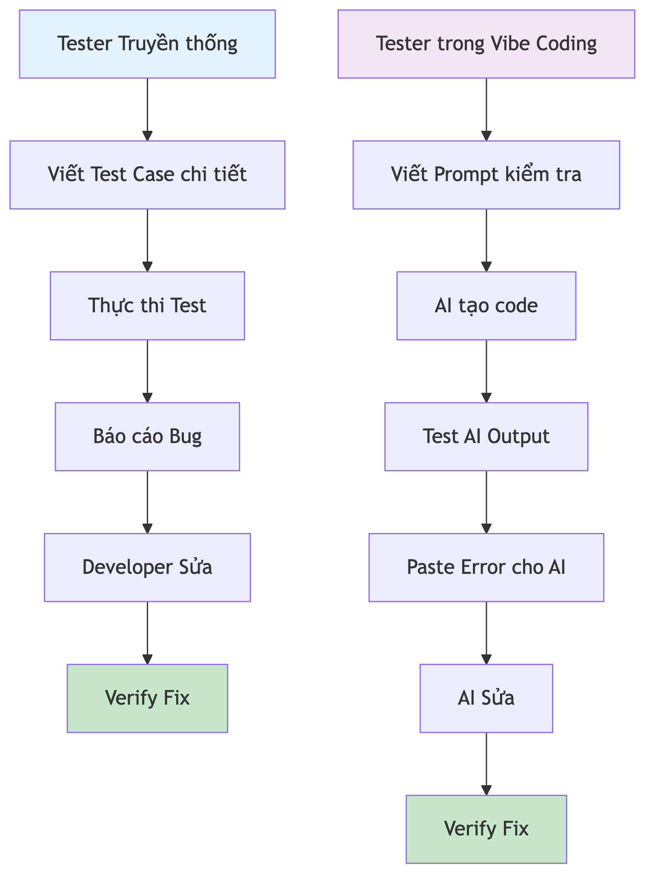
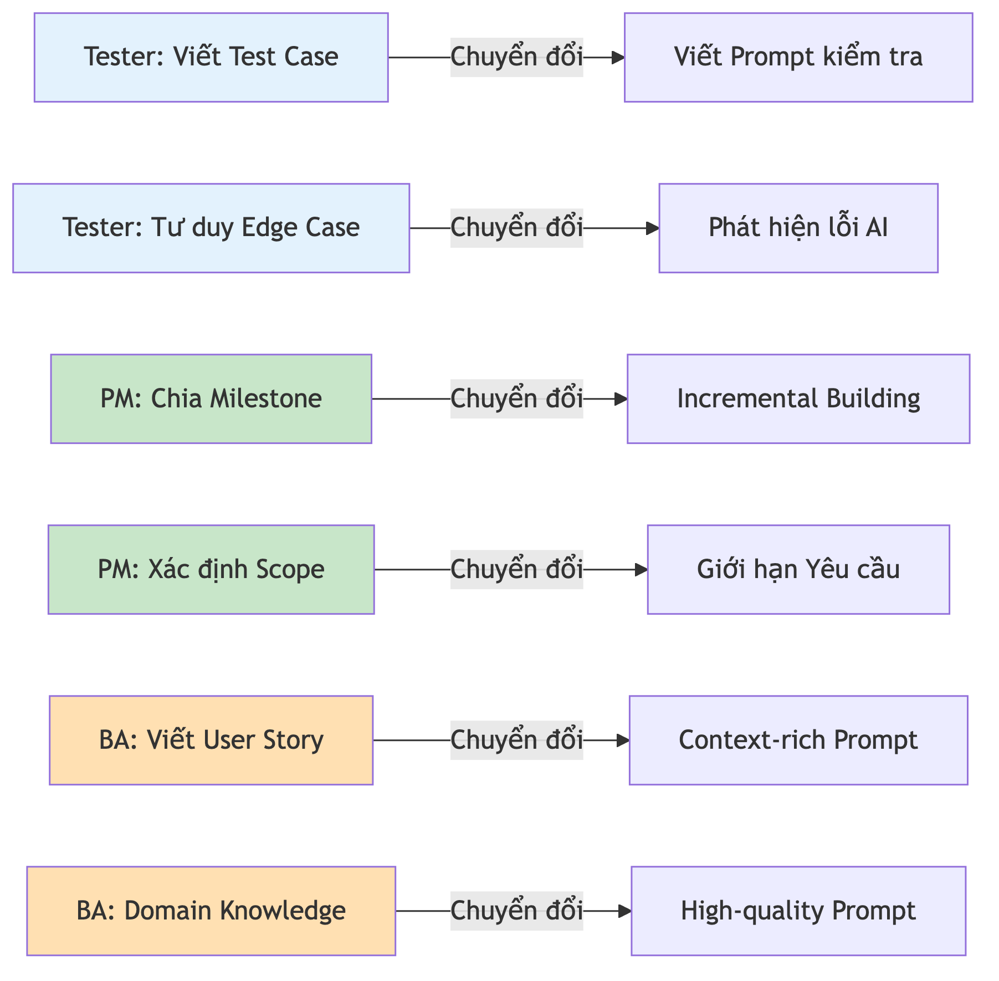

# Chương 2: Lợi thế bị bỏ quên của Tester, PM, BA

Buổi standup sáng thứ Hai, cả đội nói về "refactor cái service layer", "tách component", "cái regression suite đang đỏ". Bạn gật gù, ghi chép, nhưng có một cảm giác quen thuộc len vào: mình đang ngồi ở rìa cuộc chơi. Khi có người đề xuất "hay là mình dựng nhanh một dashboard theo dõi bug cho team", ánh mắt tự động đổ dồn về phía các bạn dev. Còn bạn — Tester, PM, hay BA — thì nghĩ ngay: *"Việc đó không phải của mình. Mình có code được đâu."*

Câu nói đó nghe hợp lý đến mức gần như không ai chất vấn nó. Nhưng nó dựa trên một giả định đã hết hạn. Giả định rằng để tạo ra phần mềm, thứ bạn cần trước tiên là biết viết code. Suốt mấy chục năm, giả định đó đúng. Rào cản để bước vào phòng là *cú pháp* — bạn phải biết dấu chấm phẩy đặt ở đâu, vòng lặp viết thế nào, framework cấu hình ra sao — trước khi được phép đóng góp bất cứ điều gì.

Đây là tin làm đảo lộn cả bức tranh: rào cản lớn nhất để tạo phần mềm chưa bao giờ là *tư duy* — nó luôn là *cú pháp*. Và cú pháp chính là thứ AI vừa xóa bỏ. Khi rào cản đó biến mất, những kỹ năng bạn dùng mỗi ngày — viết test case, chia nhỏ dự án, phân tích yêu cầu — bỗng trở thành lợi thế lớn nhất để bước vào thế giới mới này. Bạn không bắt đầu từ số không. Bạn bắt đầu từ nửa đường.

## Rào cản cũ là cú pháp, không phải tư duy

Trước khi vibe coding xuất hiện, để dựng một ứng dụng web đơn giản — dù chỉ là một form đăng ký email — bạn cần biết ít nhất ba ngôn ngữ: một để tạo cấu trúc trang, một để tạo giao diện, một để xử lý logic. Chưa kể framework, thư viện, cấu hình server, database. Danh sách cứ dài thêm mãi. Rào cản này không phải vì bạn "không đủ thông minh", mà đơn giản vì bạn chưa từng có thời gian và cơ hội để học cú pháp của từng ngôn ngữ.

Giờ hãy nhìn lại việc bạn làm mỗi ngày. Khi viết một test case chi tiết, bạn đang làm gì? Bạn mô tả chính xác hệ thống cần làm gì, với đầu vào nào, và kết quả mong đợi ra sao. Khi viết một user story, bạn đang dịch nhu cầu người dùng thành yêu cầu kỹ thuật rõ ràng. Khi chia một dự án lớn thành các milestone, bạn đang *decomposition* — chia nhỏ một vấn đề phức tạp thành những phần quản lý được.

Tất cả những điều đó chính là thứ AI cần để sinh ra code tốt. CEO của một nền tảng lập trình trực tuyến phổ biến từng nhận xét rằng *product manager là một trong những vibe coder giỏi nhất* — bởi PM biết cách chia nhỏ vấn đề thành từng bước rõ ràng và giao tiếp chính xác. Đó đúng là thứ AI đang chờ ở đầu vào.

Hãy thử một ẩn dụ đời thường. Có hai người muốn nấu một tô phở ngon: một đầu bếp chuyên nghiệp và một người đã ăn phở cả đời, biết chính xác nước dùng phải trong ra sao, bánh phở mềm đến đâu, vị phải như thế nào. Cả hai được cấp một robot đầu bếp nấu theo lời nói. Ai ra chỉ dẫn tốt hơn? Đầu bếp biết kỹ thuật cắt thái, nhưng người am hiểu phở biết chính xác món ăn cuối cùng phải như thế nào — và đó mới là thứ robot cần nghe. Trong vibe coding, bạn chính là người am hiểu món phở, còn AI là con robot đầu bếp.

> 💡 **Tip:** Rào cản để tạo phần mềm đã dịch chuyển từ "biết viết code" sang "biết mô tả rõ ràng mình muốn gì". Đây là tin tốt cho bất kỳ ai đã quen viết requirement, test case, hay user story — bạn đang sở hữu chính cái phần khó chuyển giao nhất.

## Tester/QA: từ người gác cổng thành người kiểm soát chất lượng AI

Nếu bạn là Tester hoặc QA, bạn có một lợi thế mà nhiều developer phải mất nhiều năm mới học được: tư duy về edge case. Mỗi khi test một tính năng, bạn không chỉ thử con đường hạnh phúc (*happy path*). Bạn nghĩ ngay đến: nếu người dùng nhập email trống thì sao? Nếu mật khẩu chỉ có hai ký tự? Nếu họ nhấn nút Submit hai lần liên tiếp?

Tư duy này cực kỳ quý khi làm việc với AI. Lý do: AI rất giỏi tạo ra code chạy được cho trường hợp lý tưởng, nhưng thường "quên" xử lý các tình huống ngoại lệ. Một người mới có thể nhận code AI sinh ra rồi kết luận "chạy được rồi, xong!". Còn một tester sẽ tự động hỏi: *"Nhưng nếu…?"*

Giả sử AI vừa tạo cho bạn một trang đăng nhập. Người không có kinh nghiệm QA sẽ chỉ thử đăng nhập thành công rồi nghĩ là xong. Bạn thì nghĩ ngay đến cả một danh sách:

```
Tình huống test cho trang đăng nhập AI vừa tạo:

1. Happy path: đúng email + đúng password -> vào được?
2. Email trống, password trống -> có báo lỗi không?
3. Email sai định dạng (không có @) -> xử lý thế nào?
4. Password đúng nhưng email không tồn tại -> báo gì?
5. Sai 5 lần liên tiếp -> có khóa tài khoản tạm thời không?
6. Nhấn Login khi đang xử lý -> có chống double-submit không?
7. Quay lại trang login sau khi đã đăng nhập -> redirect hay hiện form?
```

Danh sách này không phải code — nhưng nó là "prompt ẩn" giúp bạn kiểm tra chất lượng đầu ra của AI một cách có hệ thống. Trong vibe coding, người biết kiểm tra chất lượng chính là người tạo ra sản phẩm tốt nhất.

Khái niệm **vibe testing** đã xuất hiện như một vai trò mới: thay vì viết test script bằng code, tester định nghĩa hành vi mong đợi bằng ngôn ngữ tự nhiên, rồi AI sinh ra test tương ứng. Thay vì học một framework test automation từ đầu, bạn mô tả — "kiểm tra form đăng ký với email không hợp lệ, mật khẩu dưới tám ký tự, và trường tên để trống" — và AI dựng test cases. Một hướng dẫn vibe coding của DataCamp khuyên đúng quy trình mà tester đã quen: *"paste the exact error message or stack trace back into the AI"* — dán chính xác thông báo lỗi, rồi mô tả kết quả mong đợi so với kết quả thực tế.

Điều này không làm QA mất việc — nó làm QA *mạnh hơn*. Bạn vẫn là người biết test case nào quan trọng, edge case nào có thể gây lỗi nghiêm trọng, và khi nào một kết quả "pass" nhưng thực ra vẫn có vấn đề. QA và Dev đang tiến gần nhau hơn bao giờ hết: ranh giới "người tìm bug" và "người viết code" mờ dần, còn bạn chuyển từ *người thực thi test* thành *người định nghĩa chất lượng*.

> 🧪 **Dành cho Tester/QA:** Tư duy "expected vs. actual" của bạn chính là siêu năng lực trong vibe coding. Mỗi khi AI sinh code, hãy tự động chạy vòng lặp: (1) xác định expected behavior, (2) test actual behavior, (3) nếu sai — dán lỗi kèm mô tả expected behavior vào prompt tiếp theo. Đây là vòng lặp debug hiệu quả nhất, và bạn đã làm nó cả sự nghiệp rồi. Chương 15 sẽ đào sâu tư duy test case cho vibe coding.



*HÌNH 2.1: Hai cột song song so sánh quy trình của Tester truyền thống và Tester trong vibe coding — viết test case ↔ viết prompt kiểm tra; báo cáo bug ↔ dán error cho AI; verify fix ↔ test lại sau khi AI sửa. Sơ đồ giản lược có nhãn cho thấy các bước gần như trùng khớp một-một.*

## PM: từ người quản lý dự án thành người chỉ huy AI

Nếu bạn là Project Manager, bạn có một kỹ năng mà hầu hết developer thiếu: chia một dự án lớn thành các phần nhỏ quản lý được. Nghe đơn giản, nhưng đây là một trong những kỹ năng quan trọng nhất khi làm việc với AI.

Vì sao? Sai lầm số một của người mới vibe coding là cố nhồi mọi thứ vào một prompt duy nhất: "Tạo cho tôi một app quản lý dự án có đăng nhập, dashboard, biểu đồ, phân quyền, thông báo email…". AI sẽ cố làm tất cả cùng lúc, và kết quả thường là một mớ hỗn độn không có gì chạy đúng. Một PM thì phản xạ khác: *"Chậm lại. Trước tiên xác định scope. Rồi chia milestone. Rồi làm từng phần một."* Đó chính xác là cách vibe coding hoạt động hiệu quả nhất — như quy trình năm giai đoạn mà chúng ta sẽ mổ xẻ ở Chương 3.

Khả năng **scoping** cũng là một lợi thế lớn. Bạn biết khi nào nên nói "không, tính năng này chưa cần cho phiên bản đầu tiên" — đó là tư duy MVP mà developer thường thiếu. Trong vibe coding, *scope creep* (phạm vi cứ phồng dần) là kẻ thù số một, và PM có sẵn phản xạ chống lại nó.

Một case study đáng chú ý là **Dennis Yang**, Principal Product Manager tại Chime — một công ty fintech lớn ở Mỹ. Yang biến một AI IDE thành hệ thống quản lý sản phẩm gần như hoàn chỉnh: tạo PRD (*Product Requirements Document* — tài liệu mô tả yêu cầu sản phẩm), quản lý ticket, báo cáo tiến độ, tất cả mà không viết code theo lối truyền thống. Anh chia sẻ với Lenny's Newsletter rằng công cụ AI đó "là một product manager giỏi hơn chính anh từng làm được". Điều đáng chú ý: Yang không trở thành developer. Anh vẫn là PM — chỉ là một PM đã mở rộng tầm với, từ người *mô tả* yêu cầu thành người có thể *validate* ý tưởng của chính mình.

> 📋 **Dành cho PM/BA:** Kỹ năng viết requirement rõ ràng của bạn tương đương kỹ năng viết prompt tốt. Mỗi lần bạn viết "As a [user], I want [feature] so that [benefit]", bạn đang viết một prompt gần như hoàn hảo cho AI. Thử lấy một user story có sẵn, chuyển thành prompt, và xem kết quả — bạn sẽ ngạc nhiên vì mình đã ở gần đích đến mức nào.

## BA: domain knowledge là vũ khí bí mật

Nếu bạn là Business Analyst, bạn có một lợi thế mà không ai học được trong vài tháng: *domain knowledge* — hiểu biết sâu về lĩnh vực công việc của mình.

Hãy hình dung hai người cùng yêu cầu AI tạo một app quản lý bug cho team QA. Người thứ nhất — một developer không có kinh nghiệm QA — viết: "Tạo app quản lý bug." Người thứ hai — một BA đã làm với team QA nhiều năm — viết:

```
Tạo app quản lý bug cho team QA 15 người. Mỗi bug cần có:
- Severity: Critical / Major / Minor / Trivial
- Status flow: New -> Assigned -> In Progress -> Fixed -> Verified -> Closed
  (cho phép Reopen từ Verified về In Progress)
- Mỗi bug gắn với 1 project và 1 sprint
- Người báo cáo (reporter) và người được gán (assignee) khác nhau
- Dashboard: bug theo severity, bug theo sprint,
  thời gian trung bình từ New đến Closed
```

Prompt nào cho kết quả tốt hơn? Rõ ràng là prompt thứ hai, vì người viết hiểu chính xác quy trình thực tế. Như một practitioner đã nhận xét: *"The most successful apps often come from people who understand real problems, not just programming languages."* — những app thành công nhất thường đến từ người hiểu vấn đề thật, không chỉ từ người biết ngôn ngữ lập trình.

Domain knowledge không chỉ giúp bạn viết prompt tốt hơn — nó còn giúp bạn *phát hiện sai sót* của AI. Khi AI tạo một status flow thiếu bước "Reopen", developer có thể không nhận ra. Nhưng BA biết ngay: trong thực tế bug thường bị mở lại sau khi verify, phải có Reopen. Khả năng bắt những "lỗ hổng logic" như vậy là thứ mà không AI và không developer thiếu context nào thay thế được.

> 💡 **Tip:** Acceptance criteria trong user story của bạn chính là test case tự nhiên cho đầu ra của AI. Sau khi AI làm xong một tính năng, hãy đối chiếu với acceptance criteria. Thiếu điều nào, đó là prompt tiếp theo của bạn.

## Bảng ánh xạ: kỹ năng hiện tại thành kỹ năng vibe coding

Để thấy rõ sự chuyển đổi này, đây là bảng ánh xạ trực tiếp từng kỹ năng cụ thể của bạn sang vibe coding. Đọc bảng này như một tấm gương: gần như mọi thứ bạn đã giỏi đều có một chỗ dùng mới.

| Vai trò | Kỹ năng bạn đang có | Khi làm việc với AI, nó trở thành |
|---|---|---|
| Tester/QA | Tư duy edge case | Phát hiện lỗi AI bỏ sót |
| Tester/QA | Quy trình expected vs. actual | Debug bằng cách mô tả chính xác lỗi + kết quả mong đợi |
| Tester/QA | Viết test case | Viết prompt kiểm tra có hệ thống |
| Tester/QA | Verify trước khi release | Nguyên tắc "không deploy code AI chưa kiểm tra" |
| PM | Chia dự án thành milestone | Incremental building — xây từng tính năng, test, rồi mới tiếp |
| PM | Xác định scope | Giới hạn yêu cầu cho AI, chống scope creep |
| PM | Quản lý stakeholder | Dịch nhu cầu business thành yêu cầu kỹ thuật cho AI |
| PM | Lập kế hoạch trước khi làm | Nguyên tắc "Plan trước, Execute sau" |
| BA | Domain knowledge | Prompt đầy đủ context, chất lượng cao |
| BA | Viết user story | Cấu trúc prompt tự nhiên: ai cần gì, để làm gì |
| BA | Acceptance criteria | Tiêu chí kiểm tra đầu ra của AI |
| BA | Vẽ wireframe, mô tả quy trình | Input trực quan cho AI (nhiều công cụ nhận ảnh) |



*HÌNH 2.2: Bảng ánh xạ kỹ năng trình bày dạng ba cột trực quan — "Kỹ năng hiện tại" → "Chuyển đổi thành" → "Kỹ năng vibe coding" — nhóm theo ba vai trò Tester/QA, PM, BA, với mũi tên nối từng hàng để nhấn mạnh tính một-một của sự chuyển đổi.*

Một lưu ý thẳng thắn: lợi thế không có nghĩa là bạn không cần học gì thêm. Bạn vẫn cần hiểu cách web hoạt động (Chương 7), đọc hiểu được HTML, CSS và JavaScript cơ bản (Chương 8 và Chương 9), và biết cách giao tiếp với các công cụ AI. Nhưng lượng kiến thức cần học ít hơn nhiều so với học lập trình bài bản — và bạn có sẵn nền tảng tư duy để học nhanh hơn.

## Ranh giới dev/non-dev đang mờ dần

Hãy hình dung ngành IT như một con sông. Trước đây, bên này là "người biết code" — dev; bên kia là "người không biết code" — Tester, PM, BA. Cây cầu nối hai bờ? Gần như không có. Muốn sang bờ bên kia, bạn phải học lập trình ba bốn năm.

Con sông đó đang cạn dần. Không phải vì nó biến mất, mà vì các công cụ AI đang xây hàng loạt cầu nối. Phần lớn developer tại Mỹ giờ đã dùng AI coding tools trong quy trình hằng ngày. Còn ở phía bên kia, phần lớn người dùng vibe coding lại *không* phải developer — đây không phải ngoại lệ, mà là xu hướng chính. Sự hội tụ diễn ra từ cả hai phía: developer dùng AI để làm việc trước đây chỉ PM làm (viết spec, tạo wireframe), còn PM và BA dùng AI để làm việc trước đây chỉ dev làm (tạo prototype, dựng dashboard). Kết quả là một vùng giao thoa ngày càng rộng, nơi khác biệt không còn là "biết code hay không" mà là "hiểu vấn đề và giao tiếp tốt đến đâu".

Khi ranh giới mờ đi, những cái tên mới xuất hiện để mô tả cách mỗi người đóng góp giá trị. Có người gọi đó là **Orchestrator** (người điều phối) — bạn không chơi nhạc cụ nào nhưng quyết định bản nhạc nào được chơi, nhịp ra sao, khi nào dừng để sửa. Có người gọi là **Architect of Intent** (kiến trúc sư ý định) — bạn thiết kế "ý định" thay vì viết "code", đúng với việc rào cản đã dịch từ *syntax* sang *intent*. Dù tên là gì, cả hai đều là phiên bản mở rộng của những gì PM và BA vốn làm: thay vì chuyển ý định cho dev qua tài liệu, bạn chuyển ý định cho AI qua prompt. Một bài phân tích xu hướng nghề đã tóm gọn: *"The fastest typists are being replaced; the best decision-makers are being promoted."* — người gõ phím nhanh nhất đang bị thay thế, người ra quyết định giỏi nhất đang được thăng chức. Tốc độ gõ không còn là giá trị; khả năng chỉ dẫn đúng mới là.

Tất cả những vai trò này quy tụ về một khái niệm trung tâm mà cuốn sách hướng tới: **Hybrid IT Professional**. Quay lại ẩn dụ con sông — bạn không cần chuyển hẳn sang bờ dev. Bạn đứng ở *giữa cầu*, nơi nhìn được cả hai phía: hiểu vì sao phần mềm cần được xây (business context, domain knowledge — thứ không AI nào có), biết chỉ đạo AI để biến ý tưởng thành sản phẩm, và quan trọng nhất là biết giới hạn của mình — khi nào một việc cần chuyển cho dev chuyên nghiệp. Đây mới là giới thiệu khái niệm; cách phát triển thành lộ trình nghề, kèm "cây quyết định tự build hay nhờ dev", sẽ được khai triển ở Chương 19.

## Kỳ vọng thực tế: bạn sẽ làm được gì sau cuốn sách này

Trước khi đi tiếp, hãy đặt kỳ vọng cho đúng — vì đặt sai kỳ vọng là cách nhanh nhất để thất vọng với một thứ vốn hữu ích. Mục tiêu của cuốn sách không phải biến bạn thành người *tự build* mọi thứ từ số không. Mục tiêu là giúp bạn **hiểu và chỉ đạo được** AI coding.

Cụ thể, sau khi đọc xong và thực hành, bạn sẽ hiểu vibe coding đủ sâu để *đánh giá và chỉ đạo* — biết một đầu ra của AI là tốt hay chỉ trông có vẻ tốt. Bạn nắm được quy trình năm giai đoạn và biết viết PRD lẫn prompt để AI hiểu đúng ý. Bạn đọc hiểu được code AI sinh ra — không phải đọc như developer, mà đọc đủ để nhận ra vấn đề, hiểu logic cơ bản của HTML, CSS, JavaScript và cấu trúc project. Và bạn biết cách test, debug, cũng như soát bảo mật cho code AI sinh ra (Chương 16), thay vì tin nó một cách mù quáng.

Điều bạn sẽ *không* trở thành là một full-stack developer — và điều đó hoàn toàn ổn. Giá trị của bạn không nằm ở chỗ "gõ được code", mà ở chỗ bạn là cầu nối giữa nhu cầu business và giải pháp kỹ thuật: người mô tả đúng, kiểm tra đúng, và biết chính xác khi nào cần mời một chuyên gia thật sự vào cuộc. Trong một thế giới mà AI làm cho "biết code" ngày càng ít giá trị và "hiểu vấn đề" ngày càng giá trị, thì "hiểu vấn đề" chính là công việc mà Tester, PM và BA đã làm cả sự nghiệp.

> 📋 **Dành cho PM/BA:** Giá trị lớn nhất bạn thu được không phải là "biết code", mà là khả năng đánh giá và chỉ đạo AI đủ tự tin để rút ngắn khoảng cách giữa ý tưởng và một bản mẫu để mọi người cùng nhìn. Một cuộc họp mà bạn hiểu rõ AI vừa dựng ra cái gì, đúng hay sai chỗ nào, sẽ khác hẳn một cuộc họp bạn chỉ gật gù.

## Tóm tắt

- Rào cản để tạo phần mềm đã dịch từ *cú pháp* (syntax) sang *ý định* (intent) — và cú pháp chính là thứ vibe coding vừa xóa bỏ, nên bạn không còn bị chặn ở cửa.
- Tester/QA có lợi thế tư duy edge case, quy trình "expected vs. actual", và thói quen verify trước khi ship — tất cả chuyển thẳng sang kiểm soát chất lượng đầu ra của AI.
- PM có lợi thế chia nhỏ dự án, xác định scope và giao tiếp yêu cầu rõ ràng — đúng thứ AI cần để không tạo ra một mớ hỗn độn.
- BA có lợi thế domain knowledge — hiểu quy trình thật, nên viết prompt giàu context và phát hiện được lỗ hổng logic mà developer thiếu ngữ cảnh bỏ sót.
- Ranh giới dev/non-dev đang mờ dần; các vai trò mới như Orchestrator, Architect of Intent, Vibe PM và vibe testing đều là phiên bản mở rộng của việc bạn vốn làm.
- Đích đến là trở thành **Hybrid IT Professional** — người hiểu cả business lẫn kỹ thuật, đứng "giữa cầu" và biết giới hạn của mình (khai triển ở Chương 19).
- Kỳ vọng thực tế: sau cuốn sách bạn *hiểu và chỉ đạo được* AI coding — đánh giá, viết PRD/prompt, đọc hiểu và soát chất lượng code — chứ không phải trở thành full-stack developer.

## Bài tập

**Bài 2.1 — Bản đồ kỹ năng cá nhân**

Mở một file mới, chia hai cột: "Kỹ năng hiện tại của tôi" và "Chuyển đổi sang vibe coding như thế nào". Liệt kê ít nhất năm kỹ năng *cụ thể* từ công việc hằng ngày của bạn, rồi mô tả cách mỗi kỹ năng ánh xạ sang vibe coding. Đừng ghi chung chung kiểu "giao tiếp tốt".

*Gợi ý:* Hãy thật cụ thể. Ví dụ: "Tôi biết cách mô tả bước tái hiện bug gồm bước thực hiện, kết quả mong đợi, kết quả thực tế" chuyển thành "Tôi có thể viết error prompt đầy đủ cho AI: bước gây lỗi + expected behavior + actual behavior". Đối chiếu với bảng ánh xạ trong chương để lấy cảm hứng.

*Đầu ra mong đợi:* Một bảng hai cột với ít nhất năm hàng, mỗi hàng là một kỹ năng cụ thể và cách chuyển đổi tương ứng của riêng bạn.

**Bài 2.2 — Đọc như một Hybrid IT Professional**

Lấy một user story hoặc test case từ công việc thật của bạn, chuyển nó thành một prompt cho AI, và tưởng tượng (hoặc thử nghiệm nếu bạn đã có công cụ) đầu ra sẽ ra sao. Sau đó liệt kê **năm câu hỏi kiểm tra** bạn sẽ đặt ra để đánh giá đầu ra đó — dùng đúng tư duy edge case và acceptance criteria của mình.

*Gợi ý:* Bắt đầu từ một user story đơn giản, ví dụ: "As a tester, I want to log bugs with severity and status so that the team can prioritize fixes." Chuyển thành prompt mô tả các trường cần có, rồi viết năm câu hỏi kiểm tra kiểu "nếu để trống severity thì sao?", "status có cho phép Reopen không?".

*Đầu ra mong đợi:* Một file gồm ba phần — prompt gốc, mô tả đầu ra kỳ vọng, và danh sách năm câu hỏi kiểm tra cho thấy bạn đang đánh giá chứ không chỉ tiếp nhận.

## Tiếp theo

Bạn đã biết mình cầm sẵn những lợi thế gì. Nhưng lợi thế chỉ phát huy khi có một quy trình để rót vào — nếu không, bạn vẫn dễ rơi vào cái bẫy "nhồi mọi thứ vào một prompt" rồi nhận về một mớ hỗn độn.

Chương 3 giới thiệu quy trình năm giai đoạn — xương sống của cả cuốn sách — biến cách bạn vốn chia milestone và lập kế hoạch thành một khung làm việc với AI đi từ ý tưởng đến sản phẩm mà không lạc lối. Nếu cần ôn lại vibe coding là gì và khi nào nên dùng, hãy xem lại Chương 1.
