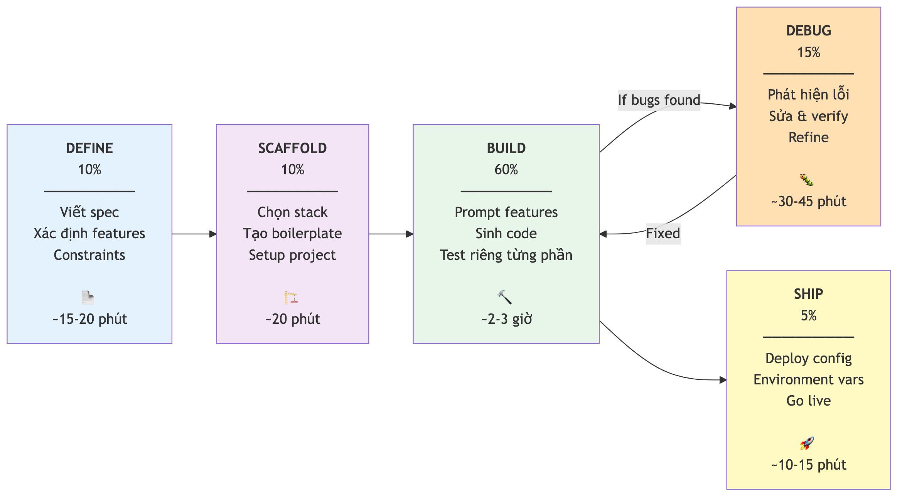
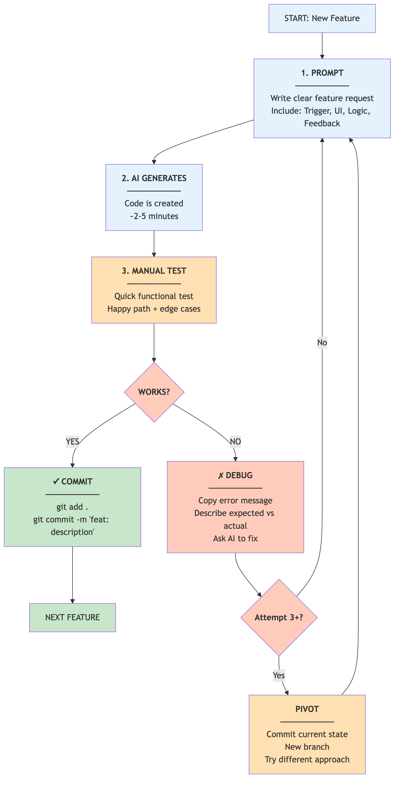
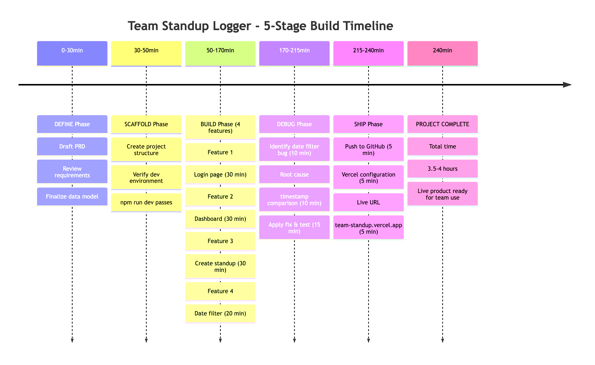

# Chương 3: Quy trình 5 giai đoạn

Hai người trong team bạn cùng được giao thử một công cụ AI dựng app. Cùng một công cụ, cùng một buổi chiều, cùng một yêu cầu: dựng một cái tool nhỏ ghi lại standup hàng ngày cho team. Cuối ngày, người thứ nhất có một app chạy được — đăng nhập được, lưu dữ liệu thật, và họ gửi link cho cả team vào dùng thử. Người thứ hai có một đống màn hình trông rất đẹp, nhưng bấm vào là lỗi, refresh trang là mất sạch dữ liệu, và không ai biết nên sửa từ đâu.

Điều trớ trêu là người thứ hai gõ prompt dài hơn, chi tiết hơn, và bỏ ra nhiều công hơn. Vậy khác biệt nằm ở đâu? Không phải ở công cụ — hai người dùng chung một thứ. Không hẳn ở khả năng viết prompt. Khác biệt nằm ở **quy trình**: người thứ nhất đi theo một trình tự có kỷ luật, còn người thứ hai nhảy thẳng vào việc gõ rồi cầu nguyện.

Nấu một bữa lớn mà không có công thức cũng vậy: mở tủ lạnh, thấy gì nắm nấy, ném hết vào chảo, rồi hy vọng. Ăn thì ăn được, nhưng chẳng ai muốn làm lại lần hai. Vibe coding không có quy trình đúng là như thế. Chương này giới thiệu quy trình năm giai đoạn mà những người làm vibe coding có kinh nghiệm đều đi theo: **Define, Scaffold, Build, Debug, Ship**. Đây không phải lý thuyết — đây là cách làm việc đưa bạn từ "thử chơi với AI" sang "dựng được một sản phẩm thật". Hãy nghĩ về nó như cách bạn chạy một dự án ở công ty: không ai nhảy thẳng vào code khi chưa có spec, không ai release khi chưa test. Vibe coding cũng vậy — công cụ đổi, nhưng quy trình vẫn là quy trình.

## Tổng quan: Define, Scaffold, Build, Debug, Ship

Trước khi đi vào từng bước, hãy nhìn bức tranh toàn cảnh. Quy trình gồm năm giai đoạn, mỗi giai đoạn có một tỷ trọng thời gian khác nhau — và tỷ trọng đó không ngẫu nhiên.

| Giai đoạn | Bạn làm gì | AI làm gì | Thời gian |
|-----------|-----------|-----------|-----------|
| **Define** | Viết spec, xác định feature, ràng buộc | Brainstorm yêu cầu, tìm chỗ thiếu | 10% |
| **Scaffold** | Chọn stack, review cấu trúc | Tạo khung project, thư mục | 10% |
| **Build** | Prompt từng feature, review từng cái | Sinh component, logic, API | 60% |
| **Debug** | Paste lỗi, mô tả hành vi sai | Chẩn đoán, sửa, viết test | 15% |
| **Ship** | Cấu hình triển khai, review cuối | Tạo cấu hình deploy, setup env | 5% |

Điều đầu tiên cần nhận ra: giai đoạn Build chiếm 60% thời gian, nhưng Define và Scaffold — hai giai đoạn "chưa code dòng nào" — mới là nơi quyết định phần lớn chất lượng sản phẩm cuối. Trong quy trình này, hai bước chuẩn bị đó chi phối tới khoảng 80% chất lượng đầu ra. Đây là chỗ phần lớn người mới bỏ qua. Họ nhảy thẳng vào Build vì cảm giác "cho nhanh", rồi mất gấp đôi thời gian ở Debug để dọn những vấn đề lẽ ra không cần tồn tại.

Một cách khác để nhớ: **Define là bản vẽ nhà, Scaffold là móng, Build là xây từng tầng, Debug là nghiệm thu chất lượng, Ship là bàn giao cho khách**. Bản vẽ sai, móng yếu thì xây cao mấy cũng sập. Nếu bạn bỏ qua Define và Scaffold, app của bạn sẽ "trông có vẻ chạy" nhưng không chịu nổi bất kỳ thay đổi nào.

> 📋 **Dành cho PM/BA:** Quy trình này chắc rất quen với bạn. Define chính là giai đoạn thu thập yêu cầu, Scaffold là lúc dựng cấu trúc dự án, Build là sprint thực thi, Debug là UAT, và Ship là release. Kinh nghiệm chạy dự án của bạn là một lợi thế thật sự ở đây — bạn đã biết vì sao không nên bỏ qua khâu đầu, chỉ là giờ đối tượng thực thi đổi từ đội dev sang một con AI.



*HÌNH 3.1: Sơ đồ năm giai đoạn vibe coding, mỗi giai đoạn là một khối nối tiếp nhau kèm tỷ trọng thời gian tương ứng. Mũi tên một chiều từ trái sang phải, có một mũi tên quay ngược từ Debug về Build để thể hiện vòng lặp fix-and-iterate.*

## Define (10%): giai đoạn quan trọng nhất mà ai cũng muốn bỏ qua

Define bắt đầu bằng một câu hỏi tưởng như hiển nhiên: **"Mình đang dựng cái gì, cho ai, và nó cần làm được những gì?"** Nghe đơn giản, nhưng bạn sẽ ngạc nhiên khi biết bao nhiêu người mở công cụ lên, gõ "dựng cho tôi một app quản lý công việc", rồi mong AI hiểu hết. Kết quả là AI tự quyết định mọi thứ — và những quyết định đó thường sai.

Ở giai đoạn này, bạn cần làm ba việc.

**Thứ nhất, viết PRD** (Product Requirements Document — tài liệu mô tả yêu cầu sản phẩm). Không cần dài hay đúng chuẩn trình bày, chỉ cần đủ rõ. Bạn có thể nhờ AI draft một bản PRD, nêu rõ: dựng cái gì, cho ai dùng, ba đến năm feature chính, các màn hình chính, các vai trò người dùng, dữ liệu cần lưu. Sau đó — và đây mới là bước quan trọng — bạn đọc lại và chỉnh. AI sẽ bỏ sót edge case, đưa ra giả định sai, và không có kiến thức nghiệp vụ của bạn. Cách viết và review PRD sẽ được nói kỹ ở Chương 5.

**Thứ hai, phác thảo (wireframe) các màn hình chính.** Không cần đẹp, chỉ cần rõ. Bạn có thể dùng một công cụ vẽ wireframe, hoặc vẽ tay rồi chụp lại. Nhiều công cụ dựng app cho phép upload ảnh phác thảo để AI hiểu layout bạn muốn.

**Thứ ba, xác định cấu trúc dữ liệu.** Đây là bước non-dev hay bỏ qua, và là nguyên nhân số một khiến app "trông có vẻ chạy" nhưng thực ra chỉ là dữ liệu gắn cứng trong giao diện. Bạn cần trả lời: dữ liệu nào cần lưu? Lưu ở đâu? Quan hệ giữa chúng ra sao? Ví dụ, một app to-do cần bảng `users` (ai dùng), bảng `tasks` (việc cần làm), và mỗi task thuộc về một user. Nếu không định nghĩa điều này trước, AI sẽ gắn cứng danh sách task ngay trong giao diện — nhìn thì đẹp, nhưng refresh trang là mất hết. Chương 11 sẽ giúp bạn tư duy về dữ liệu theo kiểu bảng tính quen thuộc.

> 🧪 **Dành cho Tester/QA:** Define chính là lúc bạn phát huy. Acceptance criteria, edge case, kết quả mong đợi so với kết quả thực tế — những thứ bạn viết mỗi ngày trong test case chính là những gì cần có trong PRD. Một PRD tốt dưới góc nhìn QA sẽ giúp AI sinh ra code dễ test hơn rất nhiều, đơn giản vì bạn đã nói trước cho nó biết "đúng" nghĩa là gì.

## Scaffold (10%): móng phải vững trước khi xây

Scaffold (dựng khung project) là giai đoạn bạn yêu cầu AI tạo cấu trúc dự án — nhưng chưa build feature nào. Hãy hình dung việc dựng khung xương của một tòa nhà: chưa nội thất, chưa sơn tường, nhưng mọi cột trụ và tầng đều đúng chỗ.

Một prompt scaffold tốt thường trông như thế này:

```text
Tạo cấu trúc project cho app Team Standup Logger.
Tech stack: Next.js, Tailwind CSS, một dịch vụ backend có database + auth.
Bắt đầu với:
1. Database schema (bảng users, teams, standups)
2. Các route trang (/, /login, /dashboard, /standup/new)
3. Cấu hình kết nối backend qua environment variables
4. Cấu hình auth có sẵn
Chưa build feature nào — chỉ scaffold thôi.
```

Sau khi AI tạo xong, bạn làm đúng một việc: **chạy thử**. Khởi động app ở chế độ dev và kiểm tra vài thứ cơ bản. Project có start được không? Có lỗi đỏ nào không? Backend có kết nối được không? Các trang có hiển thị được không, dù chưa có nội dung?

**Quy tắc vàng: không bước tiếp cho tới khi scaffold chạy sạch.** Nếu scaffold có lỗi, sửa ngay. Nếu bạn tặc lưỡi cho qua rồi xây tiếp, những lỗi đó sẽ bị chôn dưới nhiều lớp code, và lúc đó đào ra chúng khó gấp bội. Khi thấy lỗi, hãy copy chính xác dòng lỗi và đưa cho AI — đừng tóm tắt, paste nguyên văn. Nếu app khởi động báo "sẵn sàng" và bạn thấy một trang trắng trong trình duyệt, xin chúc mừng: scaffold của bạn sạch, bạn đã sẵn sàng xây.

> 💡 **Tip:** Một lỗi phổ biến là scaffold quá nhiều thứ cùng lúc. Đừng bắt AI setup cả xác thực, database, gửi email và thanh toán trong một prompt scaffold. Bắt đầu với database, các route và auth là đủ. Những thứ khác thêm dần khi build từng feature.

## Build (60%): một prompt, một feature, một commit

Đây là giai đoạn dài nhất, và cũng là nơi kỷ luật quan trọng nhất. Nguyên tắc cốt lõi chỉ gồm ba từ: **một prompt, một feature**. Không viết một prompt dài xin AI dựng cả app. Không gộp ba feature vào một yêu cầu. Mỗi prompt làm đúng một việc, bạn test việc đó, rồi lưu lại (commit) trước khi làm việc tiếp.

Vì sao phải nghiêm đến vậy? Vì AI có **context window** (lượng thông tin nó xử lý được cùng lúc) giới hạn. Khi bạn yêu cầu quá nhiều thứ một lúc, AI phải "giữ trong đầu" quá nhiều thông tin, và chất lượng output tụt rõ rệt. Giống như nhờ một người vừa nấu cơm, vừa rửa bát, vừa lau nhà cùng lúc — kết quả chắc chắn kém hơn làm lần lượt. Chương 6 sẽ nói kỹ hơn vì sao context window là gốc rễ của rất nhiều vấn đề khi làm việc với AI.

Quy trình Build cho mỗi feature gồm ba bước.

**Bước 1 — Prompt.** Mô tả feature cần build, kèm đủ context để AI hiểu. Ví dụ:

```text
Thêm form "Create New Standup" ở trang /standup/new.
Form gồm 3 trường:
- "Hôm qua bạn làm gì?" (textarea)
- "Hôm nay bạn sẽ làm gì?" (textarea)
- "Có gì đang cản trở không?" (textarea, không bắt buộc)
Khi submit, lưu vào bảng standups trên backend.
Hiện thông báo thành công rồi chuyển về /dashboard.
```

Prompt này rõ ràng, cụ thể, và chỉ yêu cầu một feature duy nhất.

**Bước 2 — Test.** Sau khi AI sinh code, test ngay. Không cần test phức tạp — chỉ cần thử thủ công: điền form, bấm submit, kiểm tra dữ liệu có xuất hiện trong database không, xem có chuyển trang đúng không. Nếu bạn là Tester/QA, bạn đã biết làm điều này: happy path trước, rồi tới edge case (bỏ trống hết field, nhập ký tự đặc biệt, submit hai lần liên tiếp).

**Bước 3 — Commit.** Nếu feature chạy, lưu lại ngay, đừng đợi. Một commit là một snapshot code bạn có thể quay về bất cứ lúc nào — đây là lưới an toàn cực kỳ quan trọng khi làm việc với AI, và Chương 13 dành trọn cho kỹ năng này. Hãy đặt tên commit mô tả rõ feature vừa thêm; những cái tên kiểu "update" hay "sửa linh tinh" sẽ khiến bạn khốn khổ khi cần tìm lại lịch sử.

Xong commit, bạn quay lại Bước 1 với feature tiếp theo. Vòng này lặp cho tới khi mọi feature trong PRD được dựng xong.

> ⚠️ **Lưu ý:** Tuyệt đối đừng build feature mới khi feature trước chưa chạy. Mỗi feature còn lỗi là một món nợ — càng để lâu càng khó trả. Nếu feature hiện tại có bug, chuyển sang giai đoạn Debug xử lý trước, rồi mới quay lại Build.



*HÌNH 3.2: Vòng lặp Build dạng flowchart — Prompt → AI sinh code → Test thủ công → nếu Đạt thì commit và quay lại Prompt với feature mới; nếu Không đạt thì rẽ nhánh sang Debug.*

## Debug (15%): nghệ thuật nhờ AI sửa lỗi đúng cách

Debug trong vibe coding không giống debug truyền thống — bạn không đọc code để tìm lỗi, mà mô tả lỗi cho AI và nhờ nó sửa. Nhưng cách bạn mô tả sẽ quyết định AI sửa đúng hay làm mọi thứ tệ hơn.

Công thức debug hiệu quả gồm ba phần: **error message + đoạn code liên quan + hành vi mong đợi**. Hãy nghĩ đúng như cách bạn viết một bug report: bước tái hiện, kết quả thực tế, kết quả mong đợi.

```text
Lỗi: Khi submit form Create Standup, trang hiện
"TypeError: Cannot read properties of null (reading 'id')"

Code liên quan: file trang /standup/new, ở dòng gọi lệnh
insert dữ liệu vào bảng standups.

Mong đợi: Form submit thành công, dữ liệu được lưu,
chuyển về /dashboard.

Thực tế: Trang crash với lỗi trên.
```

Prompt như vậy cho AI đủ thông tin để chẩn đoán. Nếu bạn chỉ nói "form bị lỗi", AI sẽ... đoán. Và nó đoán sai khá thường xuyên. Vài nguyên tắc đáng nhớ:

**Copy nguyên văn error message.** Đừng tóm tắt, đừng viết lại bằng lời của bạn. AI cần thấy chính xác từng chữ mới hiểu lỗi gì đang xảy ra.

**Nếu bản sửa đầu tiên không ăn thua, đổi cách tiếp cận.** Mỗi model AI có thế mạnh khác nhau; đưa cùng thông tin cho một model khác đôi khi cho kết quả tốt hơn. Và khi làm vậy, hãy giải thích vì sao bản sửa trước thất bại — "Lần trước đã thử thay chỗ này nhưng vẫn lỗi vì giá trị đó đang là null."

**Vòng debug không quá ba lần.** Nếu bạn đã thử sửa ba lần theo cùng một hướng mà vẫn không xong, dừng lại. Lưu trạng thái hiện tại, rồi thử một hướng hoàn toàn khác — hoặc quay về commit trước và làm lại. Cứ sửa đi sửa lại trên cùng một đường sẽ chỉ đẻ thêm bug mới. Debug là một kỹ năng đủ lớn để có riêng một chương: Chương 14 sẽ đi sâu vào cách đọc lỗi và ra prompt sửa lỗi.

> 🧪 **Dành cho Tester/QA:** Kỹ năng viết bug report của bạn chính là siêu năng lực ở đây. "Kết quả mong đợi so với kết quả thực tế" — câu này bạn đã viết hàng trăm lần. Format của một debug prompt trùng khít format một bug report: bước tái hiện, kết quả thực tế, kết quả mong đợi. Bạn đã làm việc này từ trước khi biết nó tên là "debug prompting".

## Ship (5%): từ code đến một URL thật

Ship là giai đoạn ngắn nhất nhưng đã tay nhất — app của bạn đi từ "chạy trên máy mình" sang "ai cũng truy cập được". Cách ship phụ thuộc vào loại công cụ bạn dùng, nhưng nguyên lý chung thì giống nhau.

Với các công cụ dựng app chạy trong trình duyệt, việc triển khai (deploy) gần như tự động — thường chỉ là một nút bấm. Với các công cụ kiểu AI IDE, quy trình dài hơn một chút nhưng vẫn đơn giản: đẩy code lên một kho lưu trữ (repository), kết nối kho đó với một nền tảng hosting, và từ đó mỗi lần bạn đẩy code mới, nền tảng sẽ tự động build lại và deploy. Trong vài phút, bạn có một URL sống để chia sẻ. Toàn bộ chi tiết về đưa app lên mạng nằm ở Chương 12.

Có một điều phải nhớ ở đây: **các secret** — những chuỗi khóa như URL và key kết nối tới backend — không được nằm trong code. Chúng phải được khai báo ở nơi lưu cấu hình của nền tảng hosting. Nếu bạn vô tình đẩy file chứa secret lên một kho công khai, bất kỳ ai cũng đọc được, và đây là lỗi bảo mật phổ biến nhất của người mới. Chương 12 sẽ nói rõ ranh giới sống còn này.

> 💡 **Tip:** Deploy sớm, deploy thường xuyên. Đừng đợi tới khi "hoàn thiện" mới deploy. Mỗi khi xong một nhóm feature, đẩy một bản xem trước và gửi cho đồng nghiệp thử. Feedback từ người dùng thật quý hơn mọi test case bạn tự nghĩ ra trong đầu.

## Cảnh báo: chất lượng giảm sau 15–20 component

Đây là điều ít người nói ra nhưng ai làm vibe coding lâu cũng biết: **chất lượng code AI sinh ra tụt rõ rệt khi project lớn quá 15–20 component** (những khối giao diện tái sử dụng). Nguyên nhân lại chính là context window. Mỗi công cụ AI chỉ "nhìn thấy" một lượng code nhất định tại một thời điểm. Khi project phình to, AI không thể giữ toàn bộ codebase trong "bộ nhớ làm việc", nên nó sinh ra code mâu thuẫn với code cũ, dùng sai tên biến, hoặc lặp lại logic đã có.

Ba biểu hiện bạn sẽ thấy. Thứ nhất, **AI bắt đầu "quên".** Bạn đã có sẵn một component nút bấm, nhưng AI tạo thêm một cái nút mới với kiểu dáng khác. Bạn đã có một hàm định dạng ngày, AI viết thêm một hàm y hệt ở chỗ khác. Thứ hai, **code bắt đầu mâu thuẫn.** Một trang gọi dữ liệu kiểu này, trang khác kiểu khác; quy ước đặt tên loạn lên, lúc viết hoa lúc viết thường. Thứ ba, **bug xuất hiện ở nơi "chẳng liên quan".** Bạn thêm feature ở trang A, tự dưng trang B hỏng, vì AI sửa một file dùng chung mà không nhận ra nó ảnh hưởng chỗ khác.

Làm gì khi gặp tình trạng này? **Giữ project gọn.** Một app to-do có auth, thao tác dữ liệu cơ bản và lọc là đủ; đừng cố nhồi thêm chat, thông báo, thống kê và trợ lý AI vào cùng một project. Nếu cần nhiều tính năng, tách thành nhiều project nhỏ. **Dùng rules file** — như bạn sẽ học ở Chương 6, một rules file giúp AI nhớ các quy ước của project và giảm hẳn tình trạng "quên". Và **coi output đầu tiên là bản nháp**: dựng nhanh để kiểm chứng ý tưởng, rồi dựng lại bản chỉn chu với cấu trúc tốt hơn. Đúng như một khuyến nghị được nhiều nghiên cứu về vibe coding nhắc lại: *hãy coi sản phẩm vibe-coded là bản nháp đầu tiên, không phải code chạy thật.*

> ⚠️ **Lưu ý:** Con số 15–20 component đáng để bạn nhớ như một ràng buộc thực tế khi lên phạm vi (scope) một project. Nếu ý tưởng của bạn cần hơn 20 màn hình hoặc nhiều feature phức tạp, hãy chia thành nhiều phase: Phase 1 là bản MVP gọn với khoảng 10–12 component, Phase 2 thêm tám đến mười component trên một nền tảng đã ổn định. Đây chính là kỹ năng scoping mà PM/BA vẫn làm mỗi ngày — giờ chỉ áp nó vào một loại "đội thi công" mới.

## Ví dụ: build "Team Standup Logger" qua năm giai đoạn

Lý thuyết đã đủ. Hãy đi nhanh qua một ví dụ thật để thấy năm giai đoạn ăn khớp với nhau ra sao — dựng một app cho team 5–15 người ghi lại standup hàng ngày, xem lịch sử, và lọc theo ngày. Điều đáng chú ý ở đây không phải các thao tác, mà là *quyết định* ở mỗi giai đoạn.

**Define.** Bạn nhờ AI draft một bản PRD, rồi tự chỉnh: thêm edge case "nếu một người submit hai lần trong ngày thì sao?", sửa giả định "chỉ có một team" thành "mỗi người thuộc một team", và thêm acceptance criteria cho từng feature. Bạn chốt cấu trúc dữ liệu — bảng `users` (id, email, tên, team), bảng `teams` (id, tên), bảng `standups` (id, người viết, hôm qua, hôm nay, cản trở, thời điểm tạo). Giai đoạn này tốn khoảng 30 phút, mà phần lớn là đọc và sửa PRD chứ không phải gõ prompt. Đó là dấu hiệu bạn làm đúng.

**Scaffold.** Bạn yêu cầu AI dựng khung theo đúng cấu trúc dữ liệu trong PRD, cùng các route và cấu hình kết nối backend. Chạy thử, sửa một hai lỗi nhỏ, tới khi app khởi động sạch. Lưu lại một commit khởi đầu, rồi mới bước tiếp.

**Build.** Bạn dựng lần lượt bốn feature, mỗi cái một prompt, test rồi commit. Trang đăng nhập trước — thử đăng nhập đúng, thử sai mật khẩu xem có hiện lỗi không. Rồi tới trang dashboard hiển thị standup hôm nay của cả team, nhớ thử cả trạng thái rỗng khi chưa ai viết. Rồi form tạo standup mới. Cuối cùng là bộ lọc theo ngày. Mỗi feature là một vòng prompt–test–commit gọn gàng.

**Debug.** Trong lúc build, bạn gặp một bug điển hình: chọn ngày hôm qua trong bộ lọc nhưng vẫn hiện standup hôm nay. Bạn mô tả cho AI theo đúng công thức lỗi + code + mong đợi. AI nhận ra vấn đề: trường thời điểm tạo là một mốc có cả giờ phút giây, nên so sánh bằng dấu bằng không bao giờ khớp; cần lọc theo *khoảng* thời gian trong ngày. Sửa, test lại, commit.

**Ship.** Bạn đẩy code lên kho lưu trữ, kết nối với nền tảng hosting, khai báo các secret ở nơi lưu cấu hình (không nằm trong code), và vài phút sau có một URL sống để gửi cho đồng nghiệp thử.

Toàn bộ, từ Define đến Ship, tốn khoảng ba đến bốn tiếng với người mới. Nhưng quan trọng hơn thời gian là **kỷ luật**: mỗi bước có mục đích, mỗi feature được test, mỗi thay đổi được lưu lại.

> 🧪 **Dành cho Tester/QA:** Hãy để ý con bug ở giai đoạn Debug ở trên — "chọn ngày hôm qua nhưng vẫn hiện dữ liệu hôm nay". Đây đúng là loại lỗi mà một Tester giỏi đánh hơi được từ trước khi nó xảy ra, chỉ bằng cách hỏi "thế nếu ngày là một mốc có giờ thì so sánh kiểu gì?". Thói quen nghĩ ra trường hợp biên trước khi code chính là thứ khiến bạn debug nhanh hơn hẳn một người chỉ biết đợi app crash rồi mới sửa.



*HÌNH 3.3: Timeline minh họa năm giai đoạn dựng Team Standup Logger. Trục ngang là thời gian, mỗi giai đoạn là một khối màu khác nhau với các mốc chính được đánh dấu: PRD xong, Scaffold sạch, bốn feature xong, sửa bug, đã deploy.*

## Tóm tắt

- Quy trình vibe coding gồm năm giai đoạn — Define (10%), Scaffold (10%), Build (60%), Debug (15%), Ship (5%). Tỷ trọng thời gian phản ánh mức quan trọng của từng bước, không phải con số ngẫu nhiên.
- Define là giai đoạn quyết định: viết PRD, phác thảo màn hình, xác định cấu trúc dữ liệu *trước khi* viết dòng code nào. Bỏ qua nó là nguyên nhân số một của app "trông có vẻ chạy".
- Scaffold phải chạy sạch trước khi bước tiếp. Một lỗi nhỏ ở đây sẽ thành lỗi lớn bị chôn vùi ở giai đoạn Build.
- Build theo nguyên tắc "một prompt, một feature, một commit". Không gộp nhiều feature, không bỏ test, không quên lưu lại.
- Debug hiệu quả bằng công thức error message + code liên quan + hành vi mong đợi — và không sửa quá ba lần cùng một bug theo cùng một hướng.
- Ship sớm và thường xuyên; deploy là cách nhận feedback thật, không phải bước cuối cùng. Secret không bao giờ được nằm trong code.
- Chất lượng AI giảm sau 15–20 component. Giữ project gọn, dùng rules file, và coi output đầu tiên là bản nháp.

## Bài tập

**BT 3.1 — Mô tả quy trình cho một ý tưởng của bạn**

Chọn một ý tưởng app bất kỳ liên quan tới công việc của bạn (ví dụ: một tool theo dõi thời gian xử lý bug cho team QA). Không cần build — chỉ viết ra đầy đủ quy trình bạn sẽ đi theo năm giai đoạn: Define sẽ ghi những gì, Scaffold sẽ dựng khung ra sao, Build sẽ làm những feature nào theo thứ tự nào, Debug sẽ để ý điều gì, Ship sẽ đưa lên mạng bằng nguyên lý nào.

*Đầu ra:* một tài liệu khoảng một đến hai trang mô tả trọn vẹn quy trình, có ghi rõ ba việc cần làm trong giai đoạn Define và ít nhất một edge case bạn dự đoán cho mỗi feature.

**BT 3.2 — Dựng một app to-do có đăng nhập theo năm giai đoạn**

Dựng một app to-do có xác thực, đi theo nghiêm ngặt năm giai đoạn. Define: viết PRD (người dùng, các feature đăng nhập, thêm/sửa/xóa task, lọc theo trạng thái) và xác định cấu trúc dữ liệu. Scaffold: dựng khung project và chạy tới khi sạch. Build: dựng từng feature một, mỗi feature một commit. Debug: ghi lại mọi bug gặp phải và prompt debug đã dùng. Ship: đưa app lên mạng, lấy URL.

*Đầu ra:* một app đã deploy kèm một *nhật ký build* — với mỗi giai đoạn, ghi lại prompt đã dùng, vấn đề gặp phải và cách xử lý. Nhật ký này chính là tài liệu học tập quý nhất bạn thu được từ bài này.

## Tiếp theo

Cả năm giai đoạn đều đứng hay sụp dựa trên cùng một kỹ năng: mô tả thứ bạn muốn cho AI đủ rõ để nó không phải đoán. Chương 4 — *Nghệ thuật prompting* — sẽ mổ xẻ chính kỹ năng đó: prompt là "mã nguồn" thật sự của bạn, năm quy tắc để viết prompt rõ ràng, và những kỹ thuật nâng cao giúp AI làm đúng ngay từ lần đầu. Nếu Chương 2 đã thuyết phục bạn rằng Tester/PM/BA có lợi thế thật trong thế giới này, thì từ đây trở đi là lúc biến lợi thế đó thành kỹ năng cầm tay.
