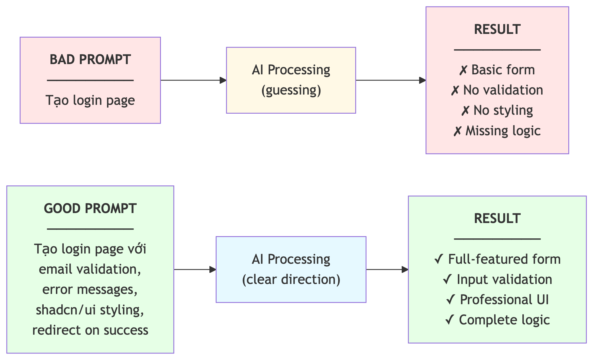
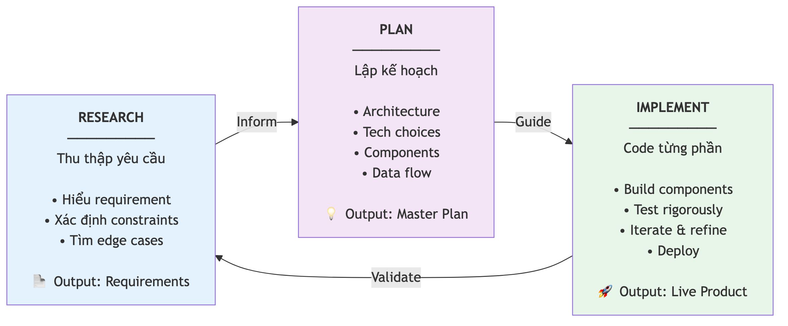

# Chương 4: Nghệ thuật prompting

Bạn gõ cho AI đúng một dòng: "Sửa lỗi đăng nhập." Ba mươi giây sau, nó trả về một đống code, sửa cả những file bạn không hề nhắc tới, và cái lỗi ban đầu vẫn còn nguyên. Bạn thử lại, lần này viết dài hơn — và lần này nó làm đúng ngay từ đầu. Cùng một công cụ, cùng một model, mà kết quả khác nhau một trời một vực.

Sự khác biệt không nằm ở AI. Nó nằm ở cái bạn gõ vào. Nếu bạn từng ngồi họp với một đồng nghiệp mới và nhận ra rằng người đó làm sai không phải vì kém, mà vì bạn mô tả yêu cầu thiếu — thì bạn đã hiểu một nửa chương này rồi. AI thông minh, nhưng nó không đọc được suy nghĩ của bạn. Nó chỉ biết đúng những gì bạn nói ra.

Chương này trình bày năm quy tắc để viết prompt hiệu quả, bốn kỹ thuật nâng cao cho tình huống phức tạp, và một nhúm prompt mẫu bạn dùng được ngay. Đây không phải kỹ năng "biết thì tốt" — với người làm vibe coding, đây là kỹ năng số một.

## Prompt là "source code" của bạn

Trong lập trình truyền thống, người viết code gõ ra từng dòng bằng một ngôn ngữ nào đó, và những dòng đó là nguồn gốc của mọi thứ — từ giao diện tới logic xử lý. Trong vibe coding, **prompt** (câu lệnh bạn gửi cho AI) đóng đúng vai trò đó. Prompt là source code của bạn. Chất lượng của nó quyết định trực tiếp chất lượng của ứng dụng.

Hãy nghĩ về việc đặt món ở nhà hàng. Nếu bạn chỉ nói "cho tôi món gì đó ngon", bếp trưởng phải đoán khẩu vị của bạn — và khả năng cao là bạn sẽ không hài lòng. Nhưng nếu bạn nói "cho tôi một đĩa pasta kem nấm, không hành, vừa tay, phục vụ trong mười lăm phút", xác suất nhận đúng thứ mình muốn tăng lên rất nhiều. Prompt cũng vậy.

Giới làm vibe coding có một câu cửa miệng: *"Garbage in, garbage out. Vibes in, vibes out."* Prompt mơ hồ cho ra code mơ hồ. Prompt rõ ràng, cụ thể cho ra code chất lượng. Đơn giản vậy thôi, nhưng phần lớn thời gian người ta bực bội với AI là vì chưa nhận ra điều này.

Có một hệ quả thực tế đáng để nhớ: prompt của bạn đáng được đối xử như một tài sản, không phải thứ gõ vội rồi vứt. Một prompt tốt bạn có thể sửa lại, dùng lại, đưa cho đồng nghiệp. Một prompt tồi thì bạn phải viết lại từ đầu mỗi lần. Người mới thường coi prompt là câu chat thoáng qua; người có kinh nghiệm coi nó như một dòng lệnh cần được cân nhắc từng chữ.

> 📋 **Dành cho PM/BA:** Nếu bạn từng viết requirement document hay user story, bạn đã có nền tảng tốt cho prompting. Kỹ năng mô tả yêu cầu rõ ràng — "Người dùng cần lọc được danh sách bug theo mức độ nghiêm trọng và người được assign" — chính là thứ AI cần. Bạn không học một kỹ năng mới từ đầu; bạn chuyển một kỹ năng cũ sang một đối tượng mới.



*HÌNH 4.1: Sơ đồ minh họa cùng một yêu cầu "tạo trang đăng nhập" — prompt mơ hồ cho kết quả thiếu tính năng, prompt tốt cho kết quả đầy đủ với xử lý lỗi, chuyển hướng sau đăng nhập và giao diện hoàn chỉnh.*

## Quy tắc 1: Context đầy đủ

**Context** (ngữ cảnh) là thông tin nền mà AI cần để hiểu đúng yêu cầu. Phần lớn thất bại khi làm việc với AI xảy ra vì thiếu context. Bạn biết project của mình đang dùng gì, dữ liệu tổ chức ra sao, giao diện hiện tại thế nào — nhưng AI thì không. Nó chỉ biết những gì bạn cho nó biết trong lượt trò chuyện này.

Hãy so sánh hai prompt. Đầu tiên là kiểu ai cũng từng gõ:

```text
Sửa lỗi đăng nhập.
```

Prompt này hỏng ở đâu? AI không biết bạn dùng framework nào, dịch vụ auth nào, lỗi cụ thể là gì, file nào liên quan. Nó buộc phải đoán — và thường đoán sai. Giờ so với phiên bản có context:

```text
Sửa lỗi người dùng bị mất session sau khi refresh
trang. Các file liên quan là phần xử lý auth và
form đăng nhập. Chúng tôi dùng một dịch vụ auth
có sẵn với JWT tokens. Lỗi xảy ra trên một trình
duyệt nhưng không xảy ra trên trình duyệt khác.
Kết quả mong muốn: session được giữ nguyên sau
khi refresh trang.
```

Prompt thứ hai cung cấp: file cụ thể, mô tả lỗi chi tiết, công nghệ đang dùng, phạm vi trình duyệt bị ảnh hưởng, và kết quả mong muốn. AI có đủ để hành động chính xác thay vì phỏng đoán.

Có một cách kiểm tra context rất nhanh trước khi bấm gửi: tự hỏi *"Nếu một đồng nghiệp mới chưa biết gì về project này đọc prompt của mình, người đó có làm đúng không?"* Nếu câu trả lời là không, bạn còn thiếu context.

> 🧪 **Dành cho Tester/QA:** Bạn đã quen viết bug report có Steps to Reproduce, Expected Result và Actual Result. Đó chính xác là định dạng mà AI cần. Kỹ năng viết bug report chi tiết — thứ nhiều dev còn làm hời hợt — là lợi thế lớn nhất của bạn khi prompting. Một prompt sửa lỗi tốt về bản chất chính là một bug report tốt.

## Quy tắc 2: "Tại sao" và "Cái gì", không chỉ "Làm thế nào"

Một lỗi phổ biến là ra lệnh cho AI quá chi tiết — chỉ cho nó từng bước phải làm. Vấn đề nằm ở hai chỗ: bước của bạn chưa chắc là tối ưu, và AI thường có cách làm tốt hơn nếu nó hiểu được mục tiêu thật sự.

Thay vì chỉ nói "làm thế nào", hãy cho AI biết *tại sao* bạn cần tính năng này và *cái gì* bạn muốn đạt được. So sánh:

```text
// Chỉ có "làm thế nào"
Tạo một function lấy danh sách người dùng từ
database, lọc theo vai trò, sắp xếp theo ngày tạo.

// Có "tại sao" + "cái gì"
Tôi đang xây hệ thống quản lý một phòng khám nhỏ:
khoảng 50-100 bệnh nhân mỗi ngày, năm bác sĩ ở các
chuyên khoa khác nhau. Tôi cần một trang quản trị để
theo dõi bác sĩ — xem danh sách, lọc theo chuyên
khoa, và biết ai đang trong ca. Đây là app nội bộ
cho lễ tân dùng.
```

Prompt thứ hai cho AI biết *lĩnh vực* (phòng khám), *quy mô* (50-100 bệnh nhân, năm bác sĩ), *mục đích* (trang quản trị cho lễ tân). Với những thông tin đó, AI tự đưa ra quyết định thiết kế hợp lý — phân trang nếu danh sách dài, thêm trạng thái "đang nghỉ" cho bác sĩ, tối ưu cho đúng quy mô dữ liệu. Bạn không phải nghĩ hộ nó những chi tiết kỹ thuật đó.

Quy tắc này đặc biệt quan trọng với các tính năng dính tới nghiệp vụ. AI rất giỏi kỹ thuật, nhưng hiểu biết nghiệp vụ thì nó phải lấy từ bạn. Đây chính là chỗ một BA hay PM có giá trị hơn hẳn: bạn biết *vì sao* tính năng tồn tại, không chỉ *nó làm gì*.

## Quy tắc 3: Yêu cầu AI lên kế hoạch trước khi code

Đây là quy tắc nhiều người mới bỏ qua, nhưng nó tạo ra khác biệt lớn nhất. Khi gặp một yêu cầu phức tạp, đừng bắt AI nhảy thẳng vào code. Hãy yêu cầu nó lên kế hoạch trước.

Lý do đơn giản: **lên kế hoạch là phần khó nhất**. Một kế hoạch sai thì dễ sửa — chỉ cần chỉnh vài dòng chữ. Nhưng code sai thì khó gỡ: bạn phải đọc hiểu, sửa, test lại, và thường lại đẻ ra lỗi mới. Cách tiếp cận bài bản là khung **Research–Plan–Implement**: cho AI nghiên cứu yêu cầu, rồi lập kế hoạch, rồi mới viết code.

```text
Tôi cần xây tính năng quản lý đơn hàng cho app quản
lý nhà hàng. Đơn hàng có các trạng thái: mới, đang
làm, sẵn sàng, đã giao, đã hủy. Mỗi đơn gắn với một
bàn và một nhân viên phục vụ.

HÃY LÊN KẾ HOẠCH TRƯỚC, CHƯA VIẾT CODE:
- Cần những bảng dữ liệu nào?
- Những điểm giao tiếp dữ liệu (API) nào là cần thiết?
- Các phần giao diện chính là gì?
- Thứ tự làm nên như thế nào?
```

Sau khi AI trả về kế hoạch, bạn đọc, chỉnh, duyệt — rồi mới bảo nó code theo kế hoạch đã chốt. Cách này giúp bạn giữ tay lái, thay vì để AI tự quyết mọi thứ rồi mới phát hiện nó đi sai hướng khi đã muộn.

> 💡 **Tip:** Nhiều AI IDE hiện có hai chế độ tách biệt: một chế độ "hỏi và lên kế hoạch" chỉ bàn bạc mà không sửa file, và một chế độ "thực thi" mới thật sự viết code. Hãy dùng chế độ lên kế hoạch để chốt hướng đi, rồi mới chuyển sang chế độ thực thi. Đây là sự kết hợp giữa sức mạnh phân tích và sức mạnh thi công.



*HÌNH 4.2: Sơ đồ khung Research–Plan–Implement — ba bước từ trái sang phải: Research (thu thập yêu cầu) → Plan (kế hoạch chi tiết, có điểm dừng để người duyệt) → Implement (code từng phần).*

## Quy tắc 4: Dùng persona để thu hẹp phạm vi

**Persona** là việc bạn nói cho AI biết nó đang đóng vai gì. Nghe đơn giản, nhưng hiệu quả đáng kinh ngạc. Khi bạn nói "Đóng vai một kỹ sư React kỳ cựu ám ảnh về performance và bảo mật", AI sẽ tự động ưu tiên code tối ưu thay vì chỉ "chạy được", thêm những lớp xử lý lỗi mà bình thường nó bỏ qua, và dùng các best practice của lĩnh vực thay vì cách làm cơ bản nhất.

Cơ chế đằng sau là: khi bạn cho AI một vai cụ thể, bạn **thu hẹp phạm vi** câu trả lời. Thay vì trả lời kiểu "ai cũng xài được", nó trả lời kiểu "một chuyên gia trong lĩnh vực này sẽ làm thế nào". So sánh:

```text
// Không có persona
Refactor component này cho tốt hơn.

// Có persona
Bạn là một kỹ sư React kỳ cựu, đặc biệt chú trọng
performance và accessibility. Hãy refactor component
này và giải thích lý do từng thay đổi.
```

Bạn chọn persona theo nhu cầu: "một kiến trúc sư database" khi thiết kế cấu trúc dữ liệu, "một chuyên gia rà soát bảo mật" khi review code nhạy cảm, "một nhà thiết kế trải nghiệm người dùng" khi cần góp ý giao diện. Persona không phải phép thuật — nó không làm AI thông minh hơn — nhưng nó định hướng cho AI biết ưu tiên điều gì trong hàng nghìn cách trả lời khả dĩ. Một câu ngắn ở đầu prompt có thể đổi hẳn chất lượng của cả đoạn code phía sau.

> 📋 **Dành cho PM/BA:** Persona còn dùng được để mô phỏng nhiều góc nhìn. Ví dụ yêu cầu AI "đóng vai một người dùng lớn tuổi, không rành công nghệ" để thử xem giao diện có dễ hiểu không. Về bản chất đây là một dạng user acceptance testing bằng AI — rẻ và nhanh, dù dĩ nhiên không thay được người thật.

## Quy tắc 5: Xây từng bước — một prompt, một tính năng

Sai lầm phổ biến nhất của người mới là nhồi mọi thứ vào một prompt duy nhất: "Tạo cho tôi một app quản lý dự án đầy đủ, có đăng nhập, dashboard, tạo project, giao việc, thông báo, báo cáo và xuất PDF." Kết quả? AI cố làm tất cả cùng lúc và thường không làm tốt cái nào.

Hãy nghĩ về việc xây nhà. Không ai đổ móng, xây tường, lợp mái và trang trí cùng một lúc. Bạn đổ móng trước, kiểm tra chắc chắn, rồi lên tường, kiểm tra lại, rồi mới làm mái. Vibe coding cũng vậy: **một prompt, một tính năng**. Quy trình chuẩn trông như thế này:

```text
// Prompt 1 — dựng khung cơ bản
Tạo cấu trúc project với ba trang: trang chủ,
dashboard, đăng nhập. Chưa cần tính năng gì — chỉ
cần cái khung chạy được, không lỗi.

// Prompt 2 — thêm auth (sau khi prompt 1 chạy OK)
Thêm đăng nhập bằng email và mật khẩu. Sau khi đăng
nhập thành công thì chuyển về dashboard; nếu chưa
đăng nhập mà vào dashboard thì đẩy về trang đăng nhập.

// Prompt 3 — thêm tính năng chính (sau khi auth OK)
Trên dashboard, hiển thị danh sách công việc của
người dùng hiện tại. Mỗi công việc có tiêu đề, mô tả,
trạng thái (chưa làm / đang làm / xong), và ngày tạo.
```

Mỗi prompt tạo ra một phần độc lập. Bạn test phần đó, lưu lại một mốc an toàn (commit), rồi mới sang prompt tiếp theo. Nếu có lỗi, bạn biết chính xác prompt nào gây ra, và quay lui về mốc trước dễ dàng. Chương 13 nói kỹ về chuyện dùng các mốc an toàn này làm lưới đỡ khi làm việc với AI.

> ⚠️ **Lưu ý:** Nhiều người làm vibe coding ghi nhận chất lượng code AI sinh ra giảm rõ sau khi project có khoảng 15-20 thành phần (components). Giữ project gọn và tập trung, đừng cố nhồi quá nhiều tính năng vào một chỗ. Nếu project buộc phải lớn, hãy chia thành các module nhỏ và xây từng module một. Chương 3 mô tả quy trình vibe coding năm giai đoạn để bạn kiểm soát điều này.

## Bốn kỹ thuật nâng cao

Sau khi nắm năm quy tắc trên, bạn có thể nâng cấp bằng bốn kỹ thuật mà những người làm vibe coding có kinh nghiệm dùng hằng ngày. Phần này hơi "nặng đô" một chút, nhưng đáng để hiểu — đây là ranh giới giữa người dùng AI ngẫu hứng và người điều khiển được nó.

### Constraint-first: nêu ràng buộc trước

Thay vì mô tả chung chung, bạn liệt kê các **ràng buộc** (*constraints*) ngay từ đầu. Đây giống hệt lúc một PM viết acceptance criteria: bạn định nghĩa rõ "done" trông như thế nào trước khi bắt đầu.

```text
Tạo một dashboard tài chính với các ràng buộc sau:
- Xử lý được tối đa 100 nghìn giao dịch mỗi tháng
- Xuất được ra PDF, Excel và CSV
- Có nhật ký thay đổi (audit trail) cho mọi chỉnh sửa
- Chạy tốt trên cả máy tính và máy tính bảng
- Thời gian tải dưới ba giây với mười nghìn bản ghi
```

AI dùng những ràng buộc này làm kim chỉ nam khi sinh code, thay vì tự ý quyết định mức độ phức tạp. Ràng buộc càng cụ thể, kết quả càng khớp kỳ vọng.

### Few-shot: cho AI xem ví dụ mẫu

Khi bạn muốn AI viết theo một "phong cách" cụ thể, hãy cho nó xem ví dụ. Giống như khi bạn muốn một designer làm "tương tự kiểu này" thì đưa cho họ mẫu tham khảo.

```text
Đây là cách tôi viết một phần giao diện hiện tại:

// [dán một đoạn code mẫu của bạn ở đây]

Hãy viết phần giao diện mới cho trang hồ sơ cá nhân
theo đúng phong cách và cách tổ chức này.
```

Cho AI từ một đến ba ví dụ là đủ để nó bắt được pattern của bạn. Kỹ thuật này giữ cho toàn bộ project nhất quán một giọng, thay vì mỗi phần một kiểu.

### Error prompt: báo lỗi cho đúng cách

Khi gặp lỗi, đừng chỉ dán mỗi dòng thông báo lỗi. Hãy đưa đủ ba yếu tố: **lỗi gì**, **code gây lỗi**, và **kết quả mong muốn**.

```text
Tôi gặp lỗi máy chủ khi gửi form tạo đơn hàng mới.

Lỗi: "relation 'orders' does not exist"

Code gây lỗi: [dán đoạn code]

Kết quả mong muốn: Form gửi thành công, đơn hàng được
lưu lại, và người dùng được chuyển về trang danh sách
đơn hàng.
```

Định dạng này giúp AI hiểu ngay nguyên nhân và phạm vi vấn đề, thay vì phải đoán mò từ một dòng lỗi cụt lủn. Nó cũng chính là bug report ba phần mà một tester giỏi vẫn viết.

### Security-first: yêu cầu bảo mật tường minh

AI thường sinh code "chạy được" nhưng thiếu các lớp bảo mật. Nếu bạn không nói, nó thường không tự thêm. Vậy nên phải yêu cầu bảo mật một cách rõ ràng ngay trong prompt.

```text
// Thiếu bảo mật
Viết đoạn code cho phép người dùng tải file ảnh lên.

// Có bảo mật
Viết đoạn code cho phép tải file lên một cách an toàn.
Bao gồm: kiểm tra loại file (chỉ cho phép .jpg, .png,
.pdf), giới hạn dung lượng (tối đa 5MB), để thông tin
nhạy cảm trong biến môi trường chứ không viết thẳng
vào code, và dùng truy vấn có tham số cho mọi thao tác
với database.
```

> 🔒 **Bảo mật:** Nghiên cứu (Veracode, Contrast Security/NYU, 2025) ghi nhận 40-62% code do AI sinh ra chứa lỗi bảo mật. Hãy yêu cầu AI cân nhắc bảo mật trong mọi prompt dính tới đăng nhập, dữ liệu người dùng, và tải file lên. Chương 16 phân tích chi tiết mười lỗi bảo mật hay gặp nhất trong code AI và cách phòng.

Bốn kỹ thuật này bổ sung cho nhau, không loại trừ nhau. Bảng dưới tóm tắt khi nào dùng cái nào:

| Kỹ thuật | Dùng khi | Được gì |
|---|---|---|
| Constraint-first | Yêu cầu có giới hạn rõ (hiệu năng, định dạng, quy mô) | AI không tự ý phóng đại hay đơn giản hóa |
| Few-shot | Cần code khớp một phong cách sẵn có | Toàn project nhất quán một giọng |
| Error prompt | Đang gỡ một lỗi cụ thể | AI hiểu đúng nguyên nhân, không đoán |
| Security-first | Có auth, dữ liệu người dùng, upload | Bịt sớm những lỗ hổng AI hay bỏ quên |

## Vài prompt mẫu dùng được ngay

Dưới đây là năm prompt mẫu đã áp dụng các quy tắc và kỹ thuật trên. Bạn dùng ngay hoặc chỉnh cho hợp project của mình. Chúng cố tình viết trung lập, không gắn với một công cụ cụ thể nào.

**Khởi tạo project:**

```text
Tạo khung cho một project web mới với ba trang: trang
chủ, đăng nhập, dashboard. Có một layout chung với
thanh điều hướng trên đầu. Chưa cần tính năng — chỉ
cần cái khung sạch, chạy được, không lỗi.
```

**Thiết kế cấu trúc dữ liệu:**

```text
Tôi cần cấu trúc dữ liệu cho hệ thống quản lý tài sản
IT. Các thực thể: Tài sản (tên, loại, số serial, trạng
thái, ngày mua, người đang dùng) và Người dùng (tên,
email, phòng ban). Một người dùng có nhiều tài sản.
Hãy lên mô hình dữ liệu với quy tắc phân quyền: mỗi
người chỉ thấy tài sản của phòng ban mình, còn quản
trị viên thấy tất cả.
```

**Gỡ lỗi:**

```text
Danh sách công việc hiển thị đúng khi tải trang, nhưng
sau khi thêm một công việc mới thì danh sách không tự
cập nhật — phải refresh trang mới thấy. Console không
báo lỗi gì. Kết quả mong muốn: danh sách tự cập nhật
ngay sau khi thêm. Đây là file xử lý danh sách công việc.
```

**Refactor code:**

```text
Bạn là một kỹ sư kỳ cựu đang review code. File giao
diện dashboard này đang quá dài (hơn 300 dòng). Hãy
tách nó thành các phần nhỏ hơn, mỗi phần một trách
nhiệm rõ ràng. Giữ nguyên chức năng hiện tại và giải
thích cấu trúc mới.
```

**Rà soát bảo mật:**

```text
Bạn là một chuyên gia rà soát bảo mật. Hãy review toàn
bộ phần code xử lý dữ liệu phía máy chủ. Kiểm tra: có
khóa API nào bị lộ ra phía trình duyệt không? Có kiểm
tra dữ liệu đầu vào không? Phân quyền đã bật chưa? Có
nguy cơ SQL injection không? Liệt kê từng vấn đề kèm
mức độ nghiêm trọng và cách khắc phục.
```

Năm prompt này phủ những tình huống bạn gặp nhiều nhất khi build app. Thư viện prompt mẫu đầy đủ hơn — cho việc tạo form phức tạp, tối ưu hiệu năng, viết điểm giao tiếp dữ liệu, thêm đăng nhập, và nhiều tình huống khác — nằm ở Phụ lục A.

> 💡 **Tip:** Lưu lại những prompt hiệu quả của bạn vào một file riêng, chẳng hạn `my-prompts.md`. Theo thời gian bạn sẽ dựng được một "thư viện prompt cá nhân" — giống như developer có bộ snippet, người làm vibe coding có bộ prompt. Prompt tốt là tài sản dùng lại được, đừng để nó trôi mất trong lịch sử chat.

## Tóm tắt

- Prompt là "source code" của người làm vibe coding — chất lượng prompt quyết định chất lượng app. Prompt mơ hồ cho ra code mơ hồ.
- Quy tắc 1 — Context đầy đủ: nêu file liên quan, công nghệ đang dùng, và tình huống cụ thể. Kiểm bằng câu hỏi "đồng nghiệp mới đọc có làm đúng không?".
- Quy tắc 2 — "Tại sao" và "cái gì", không chỉ "làm thế nào": cho AI thấy bức tranh lớn để nó tự ra quyết định thiết kế hợp lý.
- Quy tắc 3 — Bắt AI lên kế hoạch trước khi code: sửa một kế hoạch sai dễ hơn gỡ một mớ code sai rất nhiều.
- Quy tắc 4 — Dùng persona để thu hẹp phạm vi và nâng chất lượng đầu ra.
- Quy tắc 5 — Xây từng bước, một prompt một tính năng: test, lưu mốc an toàn, rồi mới đi tiếp.
- Bốn kỹ thuật nâng cao (constraint-first, few-shot, error prompt, security-first) xử lý các tình huống phức tạp; chất lượng code giảm rõ sau khoảng 15-20 thành phần nên phải chia nhỏ project.

## Bài tập

**BT 4.1 — So sánh prompt mơ hồ và prompt tốt**

Chọn ba tình huống quen thuộc (ví dụ: tạo trang đăng nhập, thêm ô tìm kiếm, tạo form báo lỗi). Với mỗi tình huống, viết một cặp prompt: một bản mơ hồ, thiếu context, và một bản áp dụng các quy tắc trong chương. Chạy cả hai trên cùng một công cụ, rồi viết nhận xét về sự khác biệt.

*Đầu ra:* Một bảng ba dòng, mỗi dòng gồm cặp prompt và ba cột đánh giá — độ đầy đủ của tính năng, chất lượng giao diện, và mức độ xử lý lỗi — kèm một câu kết luận về việc thêm context đã đổi kết quả ra sao.

**BT 4.2 — Áp dụng năm quy tắc lên một tính năng**

Chọn một tính năng cụ thể, chẳng hạn "trang quản lý bug có bộ lọc theo mức độ nghiêm trọng và theo người được assign". Viết năm prompt riêng biệt cho cùng tính năng đó, mỗi prompt nhấn vào một quy tắc: prompt 1 tập trung context, prompt 2 nhấn "tại sao/cái gì", prompt 3 yêu cầu lên kế hoạch trước, prompt 4 dùng persona, prompt 5 chia nhỏ từng bước.

*Đầu ra:* Năm prompt có ghi rõ nhãn quy tắc, kèm một đoạn nhận xét ngắn trả lời câu hỏi: quy tắc nào tạo ra khác biệt rõ rệt nhất trên tính năng bạn chọn, và vì sao.

## Tiếp theo

Prompt là câu nói bạn gửi cho AI trong từng lượt. Nhưng có một loại yêu cầu lớn hơn, dài hơi hơn: khi bạn muốn AI dựng cả một tính năng hay cả một ứng dụng, một prompt rời rạc không đủ. Bạn cần một tài liệu mô tả yêu cầu đủ chặt để AI không hiểu sai — thứ mà dân làm sản phẩm gọi là PRD. Chương 5 chỉ cho bạn cách viết PRD sao cho AI hiểu đúng ngay từ lần đầu, thay vì làm ra một thứ trông giống nhưng không phải cái bạn cần.
