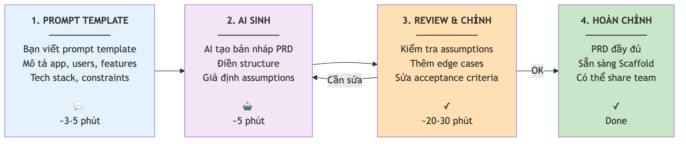
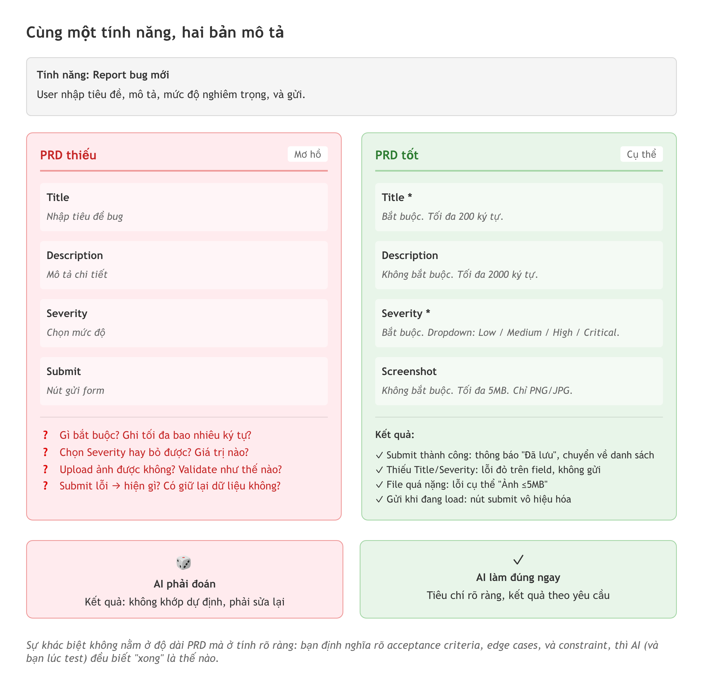

# Chương 5: Viết PRD để AI hiểu đúng

Một BA viết requirement mười trang cho dev. Có sơ đồ luồng, có bảng phân quyền, có cả ảnh chụp màn hình tham khảo. Hai tuần sau dev demo, và nó sai. Không sai ở chỗ khó — sai ở chỗ tưởng đơn giản: khi hai người cùng nhận một task, tài liệu không nói ai được thấy nó trước. BA nghĩ điều đó hiển nhiên nên không viết ra. Dev không nghĩ tới nên tự quyết một kiểu. Cả hai đều đúng theo cách của mình, và sản phẩm thì sai.

Vấn đề không nằm ở dev, cũng không nằm ở độ dài tài liệu. Nó nằm ở khoảng trống giữa "thứ người viết cho là hiển nhiên" và "thứ người đọc thực sự biết". Mười trang không lấp được khoảng trống đó, vì cái thiếu chính là cái người viết không nhận ra mình đang giả định.

Bây giờ đổi người đọc từ dev sang AI, và mọi thứ tệ hơn một bậc. Dev còn nhắn lại "chỗ này em hiểu thế này đúng không anh?". AI thì không. Nó nhận mô tả mơ hồ, lặng lẽ điền vào chỗ trống bằng giả định của riêng nó, rồi sinh ra một app trông có vẻ chạy được nhưng thiếu đúng những thứ chỉ bạn — người hiểu business — mới biết là quan trọng. Đây là lý do chương này tồn tại: học cách viết **PRD (Product Requirements Document)** — tài liệu mô tả yêu cầu sản phẩm — để bịt khoảng trống đó *trước khi* AI viết dòng code đầu tiên.

Ở Chương 3, bạn đã biết quy trình năm giai đoạn: Define, Scaffold, Build, Debug, Ship. Và bạn đã biết Define chỉ chiếm 10% thời gian nhưng quyết định 80% chất lượng. Chương này đi sâu vào đúng giai đoạn Define đó. Nếu bạn là PM hay BA, đây là chương mà kỹ năng của bạn thực sự tỏa sáng.

## PRD là gì và tại sao non-dev nên là người viết

PRD chỉ là câu trả lời cho ba câu hỏi: "Mình đang xây cái gì?", "Cho ai dùng?", và "Nó cần làm được những gì?". Nghe trang trọng, nhưng cốt lõi giản dị vậy thôi.

Hãy nghĩ PRD như thực đơn khi bạn đặt tiệc cho công ty. Bạn không chỉ nói "làm đồ ăn ngon". Bạn nói rõ: 50 người, có người ăn chay, có người dị ứng hải sản, ăn trưa lúc 12h, cần khai vị, món chính, tráng miệng, nước uống. Càng cụ thể, đầu bếp càng dễ làm đúng. PRD cho AI cũng thế — càng rõ, output càng sát nhu cầu thật.

Tại sao non-dev nên là người viết? Vì bạn là người hiểu vấn đề. Bạn biết user là ai, họ cần gì, workflow nào hợp lý, trường hợp nào sẽ gây lỗi. Dev chuyên nghiệp thường viết PRD từ góc kỹ thuật — "cần API endpoint này, schema kia". Nhưng với vibe coding, PRD từ góc business lại hiệu quả hơn, vì AI sẽ lo phần kỹ thuật. Việc của bạn là mô tả **vấn đề** và **giải pháp**, không phải cách làm.

> 📋 **Dành cho PM/BA:** Nếu bạn từng viết BRD, user stories, hay spec cho dev team, bạn đã biết viết PRD rồi. Chỉ khác ở người nhận: thay vì gửi cho dev, bạn gửi cho AI. Format có thể gọn hơn, nhưng cốt lõi vẫn là bốn thứ — mục tiêu, đối tượng, tính năng, và tiêu chí chấp nhận.

Một điều quan trọng: PRD không phải tài liệu "viết xong rồi cất ngăn kéo". Nó là **living document** — tài liệu sống, bạn sẽ quay lại chỉnh khi hiểu rõ hơn trong lúc build. Nhưng có một PRD từ đầu cho bạn cái "la bàn" để không lạc hướng khi AI bắt đầu sinh code.

## Dùng AI để tạo bản nháp PRD

Tin vui: bạn không cần viết PRD từ con số không. AI là trợ thủ tốt ở bước này — miễn là bạn biết cách hỏi. Đây là khung prompt dùng được cho hầu hết dự án:

```text
Draft a simple PRD for [mô tả app].

Target users: [ai dùng, bao nhiêu người, trình độ kỹ thuật].

Key features (3-5):
- [Tính năng 1]
- [Tính năng 2]
- [Tính năng 3]

Include these sections:
1. Mục tiêu sản phẩm (1-2 câu)
2. Đối tượng sử dụng
3. Các màn hình chính (screens)
4. Vai trò người dùng (user roles)
5. Yêu cầu dữ liệu (data requirements)
6. Acceptance criteria cho mỗi tính năng
7. Out of scope (những gì KHÔNG làm)
```

Chú ý phần "Out of scope" — nhiều người quên nhưng nó cực kỳ quan trọng. Nó giúp AI (và chính bạn) biết rõ giới hạn, tránh app phồng to không kiểm soát, thứ mà dân trong nghề gọi là *scope creep*.

Thử với một ví dụ cụ thể — một app theo dõi bug nội bộ cho team QA mười người:

```text
Draft a simple PRD for an Internal Bug Tracker app
for a QA team of 10 people.

Target users: QA engineers and Team Lead,
basic IT skills, no coding experience.

Key features:
- Report new bug (title, description, severity, screenshot)
- View bug list with filter (status, severity, assignee)
- Update bug status (Open -> In Progress -> Fixed -> Verified -> Closed)
- Assign bug to team member
- Dashboard with basic statistics (bugs by status, by severity)

Include: screens, user roles (QA Engineer, Team Lead),
data requirements, acceptance criteria, out of scope.
```

Prompt này cụ thể, rõ ràng, cho AI biết chính xác bạn muốn gì. AI sẽ sinh ra một PRD khá đầy đủ — nhưng đừng vội tin nó 100%. Đó là lý do có bước tiếp theo.



*HÌNH 5.1: Sơ đồ quy trình tạo PRD — Khung prompt → AI sinh PRD → Bạn review và chỉnh sửa → PRD hoàn chỉnh. Mũi tên vòng tròn giữa "Review" và "AI sinh PRD" thể hiện việc lặp lại nếu cần.*

## Review PRD: nơi kỹ năng của bạn thắng AI

Đây là bước phân biệt "người dùng AI để làm việc" với "người để AI làm thay". AI tạo cho bạn một PRD trôi chảy, đọc rất mượt — nhưng bên trong thường ẩn nhiều vấn đề. Nhiệm vụ của bạn là tìm ra chúng. Và đây chính là chỗ một người có tư duy QA hoặc BA vượt xa bất kỳ AI nào, vì AI thiếu đúng thứ bạn có: hiểu biết về bối cảnh thật.

**Vấn đề thứ nhất: assumptions sai.** AI không biết context công ty bạn. Nó có thể giả định "mọi người có email công ty" trong khi thực tế có contractor dùng email cá nhân, hoặc "chỉ có một team" trong khi có ba team QA khác nhau. Đọc từng dòng PRD và tự hỏi: "AI đang giả định gì ở đây? Giả định đó có đúng với chỗ mình không?".

**Vấn đề thứ hai: edge cases bị bỏ sót.** AI thường chỉ nghĩ tới *happy path* — kịch bản lý tưởng khi mọi thứ đều đúng. Nhưng bạn biết rõ phần lớn rắc rối nằm ở những trường hợp "không bình thường". Ví dụ, với Bug Tracker:

- Người dùng report bug nhưng quên điền severity thì sao?
- Hai người cùng lúc assign một bug cho mình thì xử lý thế nào?
- Team Lead muốn xóa bug đã Closed — có cho phép không?
- Bug có screenshot nặng 20MB — giới hạn upload là bao nhiêu?
- User bị xóa khỏi team nhưng vẫn còn bug đang assign — hiển thị thế nào?

Mỗi edge case bạn thêm vào PRD là một bug bạn sẽ *không* gặp sau này. Đây không phải việc thêm — đây là việc dời: bạn đang chuyển một lỗi từ "phát hiện lúc test, sau khi đã code" về "phát hiện lúc viết spec, khi sửa chỉ tốn một dòng chữ".

Để thấy rõ vấn đề assumptions ẩn tệ tới đâu, lấy đúng câu tưởng như vô hại trong PRD: "User có thể assign bug cho thành viên trong team". Nghe đủ rõ, nhưng nó giấu ít nhất bốn quyết định. Ai được assign — mọi QA Engineer, hay chỉ Team Lead? Assign được cho chính mình không? Một bug assign được cho nhiều người cùng lúc không? Assign xong có gửi thông báo cho người nhận không? AI sẽ tự chọn một câu trả lời cho mỗi câu hỏi đó, âm thầm, và bạn chỉ phát hiện khi app đã chạy sai. Người viết PRD giỏi không phải người viết nhiều — mà là người nhìn ra những câu "đủ rõ" như trên và bẻ chúng thành các quyết định tường minh trước khi AI kịp đoán.

> 🧪 **Dành cho Tester/QA:** Đây là lúc super power của bạn phát huy. Kỹ năng viết test case, nghĩ edge case, phân biệt expected và actual — tất cả áp dụng thẳng vào review PRD. Một PRD được người có tư duy QA soi sẽ tốt hơn gấp bội PRD chỉ do AI viết. Hãy làm đúng cái bạn vẫn làm: đọc mô tả rồi hỏi "nếu... thì sao?" cho tới khi hết câu hỏi.

**Vấn đề thứ ba: thiếu acceptance criteria.** Mỗi tính năng cần tiêu chí rõ để biết khi nào là "xong". Ví dụ, "Report new bug" cần acceptance criteria kiểu:

- Bắt buộc: title (tối đa 200 ký tự), severity (dropdown: Low/Medium/High/Critical).
- Không bắt buộc: description, screenshot (tối đa 5MB, chỉ nhận PNG/JPG).
- Submit thành công: hiện thông báo, chuyển về danh sách bug.
- Submit thất bại: hiện lỗi cụ thể, không mất dữ liệu đã điền.

Khi bạn thêm những chi tiết này, AI có "bản vẽ" rõ hơn để dựng. Và bạn có tiêu chí rõ để test sau khi build — acceptance criteria chính là "hợp đồng" giữa bạn và AI về nghĩa của từ "xong".



*HÌNH 5.2: Hai PRD đặt cạnh nhau. Bên trái "PRD thiếu" — chỉ có tên tính năng, không tiêu chí, không edge case, không data; các mũi tên đỏ chỉ ra chỗ AI phải tự đoán. Bên phải "PRD tốt" — mỗi tính năng có acceptance criteria, danh sách edge case, bảng dữ liệu; ghi chú "AI không phải đoán chỗ nào".*

## Xác định cấu trúc dữ liệu trước khi code

Nếu PRD là bản vẽ nhà, thì **data structure** (cấu trúc dữ liệu) là hệ thống ống nước và dây điện — bạn không nhìn thấy, nhưng thiếu nó thì nhà không hoạt động. Non-dev hay bỏ qua bước này vì thấy "quá kỹ thuật", nhưng thực ra nó đơn giản hơn bạn tưởng.

Data structure trả lời ba câu hỏi: cần lưu những dữ liệu gì, mỗi dữ liệu gồm thông tin nào, và chúng liên quan với nhau ra sao. Hãy nghĩ về spreadsheet. Mỗi loại dữ liệu là một sheet. Mỗi cột là một thông tin. Mỗi dòng là một bản ghi. Với Bug Tracker, bạn có ba "sheet" chính:

```text
Bảng users (Người dùng):
- id: số tự động tăng
- email: địa chỉ email
- name: tên hiển thị
- role: QA Engineer hoặc Team Lead
- team_id: thuộc team nào

Bảng bugs (Lỗi):
- id: số tự động tăng
- title: tiêu đề bug
- description: mô tả chi tiết
- severity: Low / Medium / High / Critical
- status: Open / In Progress / Fixed / Verified / Closed
- reporter_id: ai report (liên kết đến users)
- assignee_id: ai được assign (liên kết đến users)
- screenshot_url: link ảnh chụp
- created_at: ngày tạo
- updated_at: ngày cập nhật cuối

Bảng teams (Đội nhóm):
- id: số tự động tăng
- name: tên team
```

Hai dòng `reporter_id` và `assignee_id` trong bảng `bugs` là **foreign key** (khóa ngoại) — chúng "trỏ" về bảng `users`, tạo quan hệ "bug này do ai report" và "bug này assign cho ai". Đây chính là thứ làm database khác spreadsheet thường: dữ liệu được liên kết có cấu trúc chứ không rời rạc. Chương 11 sẽ đi sâu vào database bằng đúng tư duy spreadsheet này; ở đây bạn chỉ cần biết rằng việc phác ba cái bảng như trên, *trước khi* code, là đủ để cứu bạn khỏi một trong những sai lầm tốn kém nhất.

Bạn có thể nhờ AI dựng bản nháp data structure:

```text
Dựa trên PRD này [paste PRD], hãy đề xuất database schema.
Với mỗi bảng, liệt kê: tên cột, kiểu dữ liệu, bắt buộc hay không,
và giải thích quan hệ giữa các bảng.
Format: dạng bảng dễ đọc.
```

Rồi review lại như bạn đã làm với PRD: có thiếu trường nào không? Kiểu dữ liệu đúng chưa? Quan hệ có hợp lý không?

> 💡 **Tip:** Sai lầm phổ biến nhất là không xác định data structure trước khi code. Khi thiếu nó, AI sẽ **hardcode** — viết cứng dữ liệu vào code, ví dụ danh sách bug chỉ là một mảng trong JavaScript chứ không lưu vào database. App nhìn đẹp, chạy ngon trên máy bạn, nhưng refresh trang là mất sạch. Luôn chốt data structure *trước* khi bước sang giai đoạn Scaffold.

## Wireframe: rõ hơn là đẹp

**Wireframe** là bản phác giao diện — không cần đẹp, chỉ cần rõ. Mục đích là cho AI (và cho chính bạn) thấy layout các màn hình trước khi build. Giống như vẽ sơ đồ bố trí nội thất trước khi mua bàn ghế: sofa để đâu, TV treo chỗ nào, lối đi rộng bao nhiêu.

Cách nhanh nhất và cũng đủ dùng nhất là vẽ tay. Lấy giấy bút, phác layout từng màn hình, chú thích các phần — "đây là form", "đây là bảng danh sách", "đây là nút". Chụp ảnh rồi đưa vào prompt; phần lớn công cụ AI dựng app hiện nay đều nhận được hình ảnh trong prompt. Bạn cũng có thể dùng một công cụ vẽ wireframe đơn giản nếu muốn chia sẻ link cho đồng nghiệp góp ý, nhưng đừng để việc chọn công cụ làm bạn quên mất mục tiêu: một bản phác đủ rõ, không phải một thiết kế hoàn chỉnh.

Dù vẽ bằng cách nào, wireframe cần có ba thứ: từng màn hình chính (login, dashboard, form tạo bug, chi tiết bug), các thành phần trên mỗi màn hình (bảng, form, nút, navigation), và luồng di chuyển giữa chúng (từ dashboard click vào một bug thì sang màn hình chi tiết). Khi AI có đủ cả PRD, data structure, và wireframe, bạn đã cho nó "bộ ba" để sinh code chất lượng cao nhất. Thiếu một trong ba, AI phải tự đoán — và bạn đã biết AI đoán ra sao rồi.

> ⚠️ **Lưu ý:** Đừng dành quá nhiều thời gian làm wireframe cho đẹp. Nó là bản nháp, không phải thiết kế cuối. AI sẽ tự chọn màu, font, khoảng cách — bạn chỉ cần mô tả layout và các thành phần. Khoảng 15–30 phút cho wireframe là đủ. Nếu bạn mất hơn một tiếng, bạn đang làm quá kỹ vào thứ chưa cần kỹ.

## Một template dùng được ngay

Bạn không cần dựng cấu trúc PRD từ đầu mỗi lần. Có sẵn một template PRD đầy đủ chín mục — từ mục tiêu, đối tượng, vai trò người dùng, tính năng kèm acceptance criteria, màn hình, yêu cầu dữ liệu, tech stack, out of scope, tới edge cases — trong `templates/prd-template.md` kèm theo sách. Bạn chỉ việc thay nội dung trong ngoặc vuông.

Cách dùng hiệu quả nhất là để AI điền template trước, rồi bạn chỉnh. Paste template cùng mô tả app vào prompt, AI điền từng mục, sau đó bạn đọc lại, sửa chỗ sai, thêm chỗ thiếu. Quy trình này thường mất 30–45 phút — nhanh hơn nhiều so với viết từ đầu, mà vẫn chất lượng vì bạn là người review cuối cùng. Bạn không cần điền hết mọi mục trước khi bắt đầu, nhưng tối thiểu phải có mục tiêu, tính năng, và yêu cầu dữ liệu trước khi chuyển sang Scaffold.

> 📋 **Dành cho PM/BA:** Template này có thể thiếu những phần bạn quen dùng trong doanh nghiệp — NFR (Non-Functional Requirements), timeline, hay dependencies. Cứ tự thêm phần mà team bạn cần. PRD cho vibe coding không cần trang trọng như PRD enterprise; nó chỉ cần đủ rõ để AI hiểu và bạn kiểm soát được scope. Ngược lại, đừng bê nguyên một template 20 trang vào đây — thứ AI cần là sự rõ ràng, không phải sự dày.

## Sai lầm lớn nhất: bỏ qua Define

"Tôi chỉ muốn thử nhanh thôi, cần gì PRD." Đây là câu dẫn tới phần lớn những lần "build lại từ đầu" trong vibe coding. Điểm qua năm sai lầm hay gặp nhất khi bỏ giai đoạn Define.

**Một, AI hardcode mọi thứ.** Không có data structure, AI tạo danh sách bug bằng một mảng trong code. Nhìn đẹp, chạy được trên máy bạn — nhưng refresh là mất. Khi nhận ra cần database, gần như phải viết lại toàn bộ.

**Hai, scope creep không phanh.** Không có PRD, bạn không có ranh giới. Hôm nay thêm feature này, mai thêm feature kia. Sau hai tuần app có mấy chục feature nhưng không cái nào hoàn chỉnh. Và như đã nói ở Chương 3, chất lượng AI giảm rõ rệt sau 15–20 component — càng phình to, càng dễ vỡ.

**Ba, AI tự quyết thay bạn.** Không có PRD, AI phải tự giả định user roles, data flow, validation, error handling. Những giả định này thường sai vì AI không hiểu business context của bạn, và bạn tốn nhiều giờ sửa những "quyết định" mà lẽ ra nó không nên tự làm.

**Bốn, không test được.** Không có acceptance criteria, bạn không biết feature "xong" là thế nào. Nút Submit có cần loading không? Form có validate trước khi gửi không? Error hiện ở đâu? Không định nghĩa, mỗi người — kể cả AI — có một "định nghĩa xong" khác nhau.

**Năm, không ai hiểu app của bạn.** Khi cần nhờ đồng nghiệp test, nhờ team review, hay demo cho sếp, bạn cần một tài liệu mô tả app làm gì. PRD chính là tài liệu đó. Thiếu nó, bạn phải giải thích đi giải thích lại, mỗi lần một kiểu khác.

Hãy so sánh hai con đường:

| | Không có PRD | Có PRD |
|--|-------------|--------|
| Thời gian bắt đầu | 0 phút | 30–45 phút |
| Feature đầu tiên | 10 phút | 40 phút |
| Feature thứ 5 | Bắt đầu có vấn đề | Vẫn ổn |
| Feature thứ 10 | Phải viết lại | Vẫn theo kế hoạch |
| Tổng thời gian | 8–12 giờ (gồm viết lại) | 4–6 giờ |

Con số trên là ước tính từ kinh nghiệm thực tế, không phải đo lường chính xác — nhưng xu hướng thì nhất quán: đầu tư 30–45 phút vào Define tiết kiệm nhiều giờ ở Build và Debug. Như câu trong nghề mộc: "Đo hai lần, cắt một lần." Trong vibe coding: "Định nghĩa rõ, code một lần."

> 🔒 **Bảo mật:** Một rủi ro phổ biến khi bỏ qua Define là thiếu phân quyền. Không có user roles rõ ràng, AI thường dựng app mà ai cũng đọc, sửa, xóa được mọi thứ. Hãy luôn định nghĩa rõ trong PRD: ai được làm gì, ai *không* được làm gì. Quan trọng hơn, sau khi AI sinh code, kiểm tra xem phân quyền đó có thực sự được ép ở tầng cơ sở dữ liệu không, chứ không chỉ ẩn nút ở giao diện — phân quyền chỉ nằm ở giao diện có thể bị vượt qua dễ dàng. Điều này đặc biệt quan trọng khi app có nhiều vai trò như QA Engineer và Team Lead.

## Tóm tắt

- PRD là "bản vẽ nhà" cho app của bạn — không cần dài hay chỉnh chu, chỉ cần đủ rõ để AI hiểu bạn muốn gì và bạn kiểm soát được scope. Nó trả lời ba câu: xây gì, cho ai, làm được gì.
- Non-dev nên là người viết PRD, vì bạn hiểu vấn đề và business context — thứ AI không có. Việc của bạn là mô tả vấn đề và giải pháp, không phải cách làm kỹ thuật.
- Dùng AI để tạo bản nháp PRD, nhưng LUÔN review và chỉnh. AI bỏ sót edge cases, đưa assumptions sai, và thiếu domain knowledge của bạn.
- Review PRD là nơi kỹ năng QA/BA thắng AI: soi assumptions sai, thêm edge cases, viết acceptance criteria cho từng tính năng. Mỗi edge case thêm vào là một bug dời được từ lúc test về lúc viết spec.
- Xác định data structure — bảng nào, cột nào, quan hệ nào — TRƯỚC khi code. Thiếu bước này, AI hardcode dữ liệu và app chỉ là "demo đẹp", refresh là mất.
- Wireframe cần rõ hơn là đẹp; 15–30 phút vẽ tay là đủ để AI hiểu layout. PRD + data structure + wireframe là bộ ba giúp AI khỏi phải đoán.
- Bỏ qua Define không giúp bạn nhanh hơn — nó chỉ dời vấn đề từ "trước khi code" sang "giữa lúc đang code", lúc mọi thứ khó sửa gấp bội.

## Bài tập

**BT 5.1 — Viết và review một PRD**

Chọn một ý tưởng app liên quan tới công việc của bạn. Gợi ý: "Tool tracking thời gian xử lý bug cho team QA" hoặc "Ứng dụng đặt phòng họp". Làm theo bốn bước:

1. Dùng template trong `templates/prd-template.md`, viết prompt yêu cầu AI tạo bản nháp PRD.
2. Đọc PRD của AI, đánh dấu những chỗ bạn thấy sai hoặc thiếu.
3. Chỉnh sửa: thêm ít nhất năm edge cases, sửa ít nhất hai assumptions sai, thêm acceptance criteria cho mỗi tính năng.
4. Xác định data structure: liệt kê các bảng, cột, và quan hệ giữa chúng.

*Đầu ra:* hai bản PRD — bản gốc của AI và bản bạn đã chỉnh, có highlight những thay đổi. Bản highlight đó chính là minh chứng cho giá trị domain knowledge của bạn: mọi chỗ được đánh dấu là một chỗ AI một mình đã làm sai.

**BT 5.2 — Săn assumptions trong một PRD có sẵn**

Nhờ AI sinh một PRD cho một app quen thuộc (ví dụ app quản lý công việc cá nhân). Không sửa gì — thay vào đó, đọc như một Tester đang viết bug report: với mỗi câu trong PRD, hỏi "AI đang giả định điều gì để viết được câu này?" và ghi giả định đó ra.

*Đầu ra:* một danh sách tối thiểu tám assumptions ẩn mà bạn tìm được, mỗi cái kèm một câu hỏi làm rõ mà bạn sẽ hỏi nếu người viết PRD ngồi trước mặt. So sánh danh sách với PRD gốc để thấy AI đã lặng lẽ quyết định thay bạn bao nhiêu lần.

## Tiếp theo

Bạn đã có PRD, data structure và wireframe — một mô tả rõ ràng cho một dự án. Nhưng có một loại hiểu biết mà bạn không muốn lặp lại trong mọi prompt và mọi PRD: "team mình luôn dùng cách đặt tên này", "đừng bao giờ tự thêm thư viện ngoài", "mọi form phải validate kiểu kia". Chương 6 — *Rules file và nghệ thuật quản lý context* — nói về cách ghi những quy ước đó xuống một nơi để AI nhớ suốt dự án, và tại sao AI lại hay "quên" thứ bạn vừa dặn nếu bạn không làm vậy. Nếu Define là cách bạn mô tả *một* dự án cho rõ, thì rules file là cách bạn dạy AI *thói quen làm việc* của mình.
