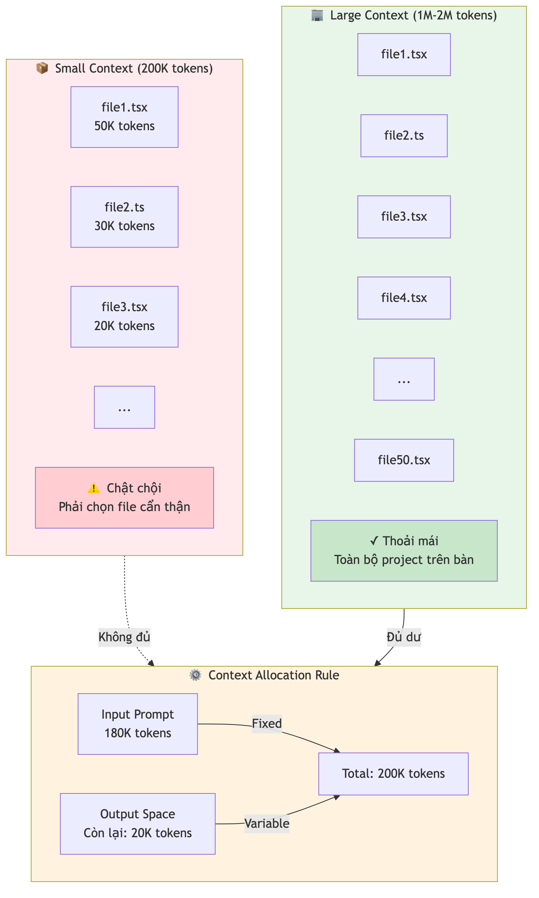
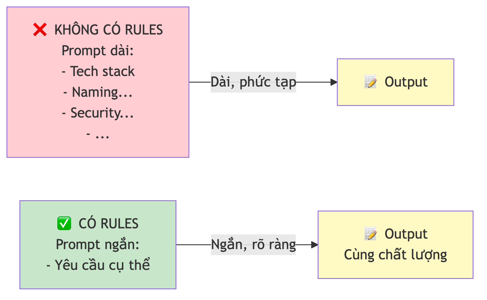

# Chương 6: Rules file và quản lý context

Bạn mở một cuộc trò chuyện mới với AI để nhờ nó thêm một trang nhỏ vào tool nội bộ. Trước khi vào việc, bạn gõ lại đúng những câu đã gõ hôm qua: dùng framework này, dùng thư viện kia, nhớ kiểm tra đăng nhập, nhớ validate input, trả lời bằng tiếng Việt. Xong xuôi, bạn mới viết được yêu cầu thật. Ngày mai, cuộc trò chuyện mới, bạn lại gõ y hệt từng đó câu.

Nếu chuyện này nghe quen, bạn đang gặp đúng hai vấn đề mà chương này giải quyết. Vấn đề thứ nhất: AI **không nhớ** gì giữa các cuộc trò chuyện — mỗi lần mở chat mới, nó bắt đầu từ con số không. Vấn đề thứ hai, tinh vi hơn: ngay trong một cuộc trò chuyện, trí nhớ của AI cũng có giới hạn và có điểm mù, nên nhồi càng nhiều thông tin không phải lúc nào cũng tốt hơn.

Giải pháp cho vấn đề thứ nhất là **rules file** — một tệp quy tắc mà AI đọc trước mỗi lần làm việc. Nhưng để viết rules file cho đúng, trước hết phải hiểu tại sao AI lại "quên", và quên theo kiểu nào. Vậy nên ta bắt đầu từ cái bàn làm việc của AI.

## Context window — cái bàn làm việc của AI

Hãy tưởng tượng AI làm việc trên một cái bàn. Bàn càng rộng, nó trải được càng nhiều tài liệu ra cùng lúc và nhìn thấy càng nhiều thông tin. Cái bàn đó có tên kỹ thuật là **context window** (lượng thông tin AI xử lý được trong một lần tương tác). Mọi thứ bạn gõ vào, mọi file bạn dán, cộng với chính câu trả lời AI đang viết — tất cả phải nằm vừa trên cái bàn này.

Kích thước bàn được đo bằng **token** — đơn vị text nhỏ nhất mà AI xử lý, mỗi token xấp xỉ vài ký tự. Bàn của các model khác nhau rất khác nhau: có loại chỉ vài trăm nghìn token, có loại rộng tới hàng triệu. Với một dự án nhỏ vài file, bàn nhỏ là quá đủ; với một codebase hàng trăm file, bạn mới cần bàn cỡ lớn để AI "nhìn thấy" toàn cảnh.

Có một điều dễ quên nhưng rất quan trọng: **context window bao gồm cả phần bạn gửi vào lẫn phần AI trả lời ra**. Nếu bàn có sức chứa nhất định mà bạn đã trải kín tài liệu, AI không còn chỗ để viết câu trả lời tử tế nữa. Giống như bạn bày kín bàn rồi mới nhận ra không còn khoảng trống nào để đặt tờ giấy mà viết.

Hệ quả trực tiếp: khi prompt của bạn lấp gần hết cái bàn, chất lượng output bắt đầu giảm. AI phải chia sẻ năng lực xử lý cho cả đống thông tin đầu vào, và câu trả lời kém chính xác hơn. Đây là lý do đầu tiên vì sao "gửi thật nhiều context" không phải chiến lược tốt — và vì sao rules file cần **ngắn gọn**, một điều ta sẽ quay lại ở cuối chương.

Có một chi tiết đáng nhớ về token: code "tốn" token nhiều hơn văn bản thông thường, thường gấp khoảng một lần rưỡi tới hai lần. Dấu ngoặc nhọn, dấu chấm phẩy, tên biến dài — mỗi thứ đều ngốn chỗ trên bàn. Nghĩa là khi bạn dán cả một file code dài vào chat, nó chiếm nhiều "mặt bàn" hơn bạn tưởng. Đây là lý do thực tế để bạn chỉ gửi những file liên quan thay vì đổ nguyên project vào: nếu đang sửa lỗi ở form đăng ký, AI không cần thấy code của trang dashboard.

> 📋 **Dành cho PM/BA:** Context window giống như thời lượng của một cuộc họp. Trong cuộc họp 30 phút, nếu bạn dành 25 phút trình bày background, cả team chỉ còn năm phút để bàn giải pháp. Với AI cũng vậy: prompt càng dài dòng, AI càng ít "ngân sách" cho câu trả lời chất lượng. Kỹ năng scope management bạn đã có — gửi đúng thông tin, đủ context, không thừa — chính là kỹ năng quản lý context với AI.



*HÌNH 6.1: Sơ đồ giản lược context window như một cái bàn làm việc. Bên trái: bàn nhỏ chật chội với vài file code chồng lên nhau. Bên phải: bàn lớn thoải mái với toàn bộ project trải ra. Ghi chú: "Phần gửi vào + phần trả lời ra cùng chia một mặt bàn". Đây là sơ đồ minh họa khái niệm, không phải giao diện của một công cụ cụ thể.*

## "Lost in the middle" — AI nhớ đầu và cuối, mờ ở giữa

Đây là một trong những hiệu ứng kỳ lạ nhất mà bạn cần biết để dùng AI tốt. Ngay cả khi thông tin đã nằm trên bàn, AI không đọc mọi vị trí như nhau. Nghiên cứu cho thấy khi xử lý một đoạn text dài, AI nhớ phần **đầu** và phần **cuối** rất tốt, nhưng phần **giữa** mờ hẳn đi — độ chính xác tụt xuống thấy rõ. Hiện tượng này có tên là **"lost in the middle"** (mất ở giữa).

Nghĩ về nó như cách bạn nhớ một bài thuyết trình dài. Bạn nhớ rõ phần mở đầu vì đó là ấn tượng đầu tiên, và nhớ phần kết luận vì đó là điều cuối cùng bạn nghe. Nhưng slide thứ 15 trong bài 30 slide thì thường trôi mất. AI cũng vậy, dù lý do kỹ thuật thì khác.

Hệ quả thực tế rất cụ thể: **đặt thông tin quan trọng nhất ở đầu và cuối prompt, đừng giấu nó ở giữa**. Nếu bạn dán cho AI một file dài và nhờ sửa lỗi, hãy đặt mô tả lỗi ở đầu, dán code ở giữa, rồi nhắc lại yêu cầu cụ thể ở cuối:

```text
[ĐẦU] Bug: form submit không chạy khi user chưa điền email.
Mong đợi: hiện thông báo lỗi. Thực tế: trang bị refresh.

[GIỮA] Code của form:
... (dán code ở đây) ...

[CUỐI] Hãy sửa bug trên. Tập trung phần validation
trước khi submit. Giữ nguyên logic còn lại.
```

Cấu trúc này tận dụng đúng "lost in the middle": hai thông tin quan trọng nhất — mô tả bug và yêu cầu cụ thể — nằm ở hai đầu, nơi AI nhớ tốt nhất. Code ở giữa dù có mờ đi một chút thì bạn vẫn đã kẹp nó giữa hai đầu context rõ ràng. Một mẹo đi kèm: nếu file quá dài, đừng dán 500 dòng một lần — chia thành nhiều đoạn ngắn và gửi lần lượt, để mỗi lần thông tin đều nằm trong "vùng nhớ tốt".

Bạn có thể tự hỏi: tất cả những điều này thì liên quan gì tới rules file? Liên quan trực tiếp. Vì AI không nhớ giữa các cuộc trò chuyện, bạn cần một cách cấp lại context cố định mỗi lần mở chat mới. Và vì context window có giới hạn còn phần giữa lại hay bị mờ, cái context cố định đó phải **ngắn và có cấu trúc**. Rules file chính là câu trả lời cho cả hai ràng buộc.

## Rules file là gì, và tại sao bạn cần nó

Khi bạn vào làm ở một tổ chức, có những quy tắc mà ai cũng biết mà không cần hỏi: code review trước khi merge, đặt tên biến bằng tiếng Anh, mỗi tính năng phải có mô tả. Đây là những quy tắc ngầm mà thành viên mới học dần. Không ai đọc to chúng lên mỗi sáng — chúng là "văn hóa" của nơi làm việc.

**Rules file** (tệp quy tắc) hoạt động y như vậy, nhưng dành cho AI. Nó là một file text nằm trong thư mục dự án, chứa những chỉ dẫn mà AI đọc và áp dụng cho **mọi** cuộc trò chuyện. Bạn không phải nhắc lại "dùng TypeScript nhé" hay "nhớ validate input" nữa — AI đã biết vì nó đọc rules file trước khi bắt tay vào việc.

Nếu prompt là những câu bạn nói với AI trong từng lượt trò chuyện, thì rules file là văn hóa công ty: bạn viết một lần, AI tuân theo mọi lần. Về mặt kỹ thuật, nó hoạt động như một lớp chỉ dẫn "ẩn" mà AI nhận được trước mỗi tin nhắn của bạn. Nếu bạn đã dùng persona trong prompt (Chương 4), thì rules file chính là cách đặt persona cố định cho cả dự án, thay vì viết lại mỗi lần.

Có một nguyên tắc đáng khắc cốt: **"Nếu bạn thấy mình lặp lại điều gì đó khi prompting, hãy đưa nó vào rules file."** Mỗi lần bạn bắt gặp mình đang gõ lại câu "dùng dịch vụ backend có sẵn cho database, nhớ bật kiểm soát truy cập ở tầng dữ liệu", đó chính là lúc dừng lại và cập nhật rules file.

> 🧪 **Dành cho Tester/QA:** Nếu bạn từng viết test plan — loại tài liệu mô tả dùng tool gì để test, quy ước đặt tên test case, phạm vi, mức độ nghiêm trọng — thì bạn đã có sẵn kỹ năng viết rules file. Bạn đã quen với việc "đặt quy tắc trước khi bắt đầu làm" từ lâu. Rules file chỉ là chuyển đúng thói quen đó sang một đối tượng mới là AI.



*HÌNH 6.2: Sơ đồ so sánh hai phiên làm việc. Bên trái, không có rules file: mỗi lần chat người dùng phải gõ một prompt dài lặp lại toàn bộ context. Bên phải, có rules file: một tệp quy tắc nằm cạnh dự án, người dùng chỉ gõ một câu yêu cầu ngắn, AI tự lấy context từ rules file.*

Mỗi công cụ AI coding có cách riêng để lưu và đọc rules file — giống như mỗi công ty có nơi lưu tài liệu nội bộ riêng, chỗ này dùng wiki, chỗ kia dùng thư mục chia sẻ, nhưng mục đích thì như nhau. Có công cụ đọc một file đặt trong thư mục dự án, có công cụ cho bạn nhập quy tắc vào phần cài đặt của dự án. Bạn không cần nhớ chi tiết từng nơi — bạn cần nhớ rằng công cụ tốt cho việc làm lặp lại **đều** có chỗ để lưu rules file, và đó là tiêu chí đáng cân nhắc khi chọn.

> 🧰 **Đề xuất công cụ:** *Tính đến 2026-07.* Cách lưu rules file khác nhau theo công cụ: nhóm AI IDE và agentic CLI (ví dụ Cursor, Claude Code) đọc một tệp đặt trong thư mục dự án — Claude Code đọc file `CLAUDE.md`, Cursor đọc các tệp trong thư mục `.cursor/rules/`; nhóm dựng-app-từ-prompt (ví dụ Lovable, Bolt.new) cho bạn nhập quy tắc vào phần cài đặt hoặc "project instructions" của dự án. Cơ chế cụ thể đổi theo phiên bản — kiểm tra tài liệu chính thức của công cụ trước khi làm theo. Xem thêm trang [Đề xuất công cụ](../de-xuat-cong-cu.md).

## Năm thành phần cốt lõi của một rules file

Dù bạn dùng công cụ nào, một rules file tốt thường có năm phần. Hãy nghĩ nó như năm chương của một "sổ tay nhân viên" dành cho AI.

**Thứ nhất là Persona** — bạn muốn AI đóng vai gì? Một Senior Developer chuyên bảo mật? Một chuyên gia giao diện? Chỉ định persona giúp AI tập trung vào đúng lĩnh vực và cho output phù hợp. Nếu bạn làm dự án quản lý bug cho team QA, persona có thể là: "Bạn là Senior Developer có kinh nghiệm xây tool nội bộ cho đội QA."

**Thứ hai là Tech stack** — liệt kê chính xác các công nghệ bạn dùng, kèm phiên bản nếu quan trọng. AI cần biết chính xác bạn dùng gì để sinh code tương thích; một phiên bản framework khác đi có thể kéo theo cách viết code khác hẳn.

**Thứ ba là Coding standards** — quy tắc về cách viết code: quy ước đặt tên file, đặt tên biến, đặt tên component, cấu trúc thư mục, và những điều "làm" và "không làm" cụ thể. Điểm mấu chốt là **cụ thể**: "mỗi function không quá 20 dòng" hữu ích hơn nhiều so với "viết code sạch".

**Thứ tư là Security rules** — phần bạn không được bỏ qua. Liệt kê tường minh: không hardcode secrets, validate mọi input, dùng biến môi trường, bật kiểm soát truy cập ở tầng dữ liệu. Đưa bảo mật vào rules file đảm bảo AI luôn áp dụng, không phải chờ bạn nhắc.

**Thứ năm là Architecture** — cấu trúc tổng thể của dự án: component đặt ở đâu, page ở đâu, API route ở đâu, tiện ích dùng chung ở đâu. Nhờ vậy AI sinh code đúng nơi, thay vì vứt mỗi file một chỗ.

> 🔒 **Bảo mật:** Phần Security trong rules file không phải "có thì tốt" — nó là bắt buộc. AI mặc định chọn cách nhanh nhất, và cách nhanh nhất thường không an toàn: hardcode API key để test cho lẹ, bỏ qua bước kiểm tra đăng nhập. Rules file là cách bạn ép AI ưu tiên bảo mật một cách tự động, mọi lần, không ngoại lệ.

## Viết rules file đầu tiên

Giờ hãy hình dung một rules file hoàn chỉnh cho một dự án giả định: **Bug Tracker cho team QA**, một tool nội bộ để ghi nhận và theo dõi lỗi. Dưới đây là khung xương rút gọn, đủ cả năm thành phần cốt lõi:

```markdown
# Rules -- Bug Tracker cho Team QA

## Persona
Bạn là Senior Full-Stack Developer có kinh nghiệm xây
internal tools cho đội QA. Trả lời bằng tiếng Việt.
Code có comment. Khi không chắc, hỏi lại trước khi tự quyết.

## Tech Stack
- Framework: Next.js (App Router) + TypeScript strict
- Styling: Tailwind CSS + component library có sẵn
- Database + Auth: một dịch vụ backend có sẵn

## Coding Standards
- File naming: kebab-case; Component naming: PascalCase
- Mỗi component một file; dùng interface cho mọi props
- Không dùng `any`; mỗi function không quá 20 dòng

## Security (BẮT BUỘC)
- API key chỉ trong biến môi trường, KHÔNG hardcode
- Mỗi API route kiểm tra session trước khi xử lý
- Bật kiểm soát truy cập ở tầng dữ liệu cho MỌI bảng
- Validate mọi input trước khi ghi xuống database

## Architecture
- Pages trong src/app/, API routes trong src/app/api/
- Components trong src/components/, tiện ích trong src/lib/
```

Ngắn vậy thôi nhưng bao quát đủ. Khi bạn gửi prompt "Tạo trang danh sách bug có filter theo mức độ nghiêm trọng", AI sẽ tự động dùng TypeScript, đặt component đúng thư mục, kiểm tra session trong API route — tất cả mà không cần bạn nhắc, chỉ nhờ rules file.

Bạn không cần viết khung này từ đầu. Trong thư mục `templates/` đã có sẵn mẫu `rules-file-template.md` đầy đủ để bạn sao chép rồi sửa theo dự án của mình. Đó là file dùng được ngay, không phải hình chụp để đọc.

> 💡 **Tip:** Cách nhanh nhất để có rules file đầu tiên là nhờ chính AI viết. Gõ: "Tạo rules file cho dự án web dùng framework X, database Y, dành cho team QA xây tool nội bộ. Bao gồm persona, tech stack, coding standards, security rules và architecture." AI sẽ sinh một bản nháp tốt, bạn chỉ cần review và chỉnh cho khớp dự án cụ thể. Nhưng đừng dán nguyên xi — đọc kỹ phần Security, vì đó là phần AI dễ viết chung chung nhất.

## Tiến hóa rules file theo thời gian

Rules file không phải tài liệu viết một lần rồi để đó. Nó là **living document** (tài liệu sống) — tiến hóa cùng dự án. Có ba thời điểm bạn nên cập nhật nó.

**Thời điểm thứ nhất: khi bạn thấy mình lặp lại.** Nếu ba lần liên tiếp bạn phải nhắc AI "dùng component Dialog có sẵn thay vì tự tạo modal", hãy đưa nó vào rules. Đây chính là nguyên tắc vàng đã nói ở trên, áp dụng lần nữa: **lặp lại điều gì → đưa điều đó vào rules file**.

**Thời điểm thứ hai: khi AI làm sai theo cùng một kiểu.** Nếu AI cứ sinh code không có xử lý lỗi, thêm quy tắc: "Mọi async function phải có try/catch. Hiển thị lỗi cho người dùng bằng thông báo rõ ràng."

**Thời điểm thứ ba: khi dự án chuyển giai đoạn.** Từ prototype sang production thì thêm quy tắc về testing, hiệu năng, accessibility. Từ làm một mình sang làm nhóm thì thêm quy ước Git và code review (Git là chủ đề Chương 13).

Một mẹo hữu ích là thêm hẳn một mục **"Sai lầm thường gặp"** vào rules file — danh sách những điều AI hay làm sai trong dự án của bạn:

```markdown
## Sai lầm thường gặp -- TRÁNH
- KHÔNG tạo custom CSS khi thư viện styling đã có class tương đương
- KHÔNG bỏ qua loading state và error state khi gọi API
- KHÔNG hardcode dữ liệu -- luôn lấy từ database
- KHÔNG tạo file ở thư mục gốc -- đặt đúng folder theo Architecture
```

Danh sách này giống như "bài học kinh nghiệm" của dự án. Mỗi lần AI mắc lỗi, bạn thêm một dòng để nó không lặp lại. Theo thời gian, rules file trở thành một tài sản thật sự — nó chứa toàn bộ "trí tuệ" mà bạn và AI đã tích lũy khi làm dự án.

## Sai lầm lớn nhất: rules file dài quá hóa phản tác dụng

Đến đây thì hai nửa của chương gặp nhau. Ở đầu chương, bạn học rằng context window có giới hạn và AI hay bỏ quên thông tin nằm ở giữa. Bây giờ áp dụng đúng bài học đó vào chính rules file.

Sai lầm phổ biến nhất khi mới viết rules file là làm nó **quá dài và quá chung chung**. Người mới có xu hướng nhồi vào đủ thứ: hàng chục quy tắc mơ hồ kiểu "viết code sạch, dễ bảo trì, tối ưu, chuyên nghiệp". AI không biết "sạch" nghĩa là gì, nên những dòng đó chỉ tốn chỗ. Tệ hơn, một rules file phình to sẽ chiếm phần lớn cái bàn làm việc của AI, và những quy tắc quan trọng nhất có thể rơi đúng vào vùng "lost in the middle" mà AI đọc lướt.

> ⚠️ **Lưu ý:** Rules file dài không đồng nghĩa với rules file tốt — thường ngược lại. Ba lý do: một, nó ăn hết token trên context window, để lại ít chỗ cho code và câu trả lời; hai, "lost in the middle" khiến các quy tắc nằm giữa file dễ bị AI bỏ qua; ba, quy tắc chung chung ("code sạch") vô nghĩa với AI. Hãy giữ rules file ngắn, cụ thể, và đặt quy tắc quan trọng nhất — thường là bảo mật — ở **đầu file**. Cụ thể bao nhiêu, hiệu quả bấy nhiêu: "mỗi function không quá 20 dòng" thắng "viết code gọn gàng" mọi lúc.

Để thấy rõ giá trị của một rules file gọn, hãy so sánh hai phiên làm việc. Không có rules file, bạn phải viết prompt dài lê thê: khai báo framework, ngôn ngữ, thư viện giao diện, dịch vụ database, nhắc kiểm tra đăng nhập, chỉ định file đặt ở đâu, đặt tên ra sao. Có rules file, bạn chỉ cần viết một dòng: "Tạo trang danh sách bug có filter theo mức độ nghiêm trọng." Tất cả phần còn lại AI đã biết từ rules file. Nhân điều đó với khoảng bảy lần bạn prompt mỗi ngày, và bạn hiểu vì sao rules file là một trong những "vũ khí bí mật" của người làm vibe coding có kinh nghiệm.

> 📋 **Dành cho PM/BA:** Rules file chính là dạng "coding standards document" mà team dev vẫn dùng, chỉ khác là AI đọc được và áp dụng tự động. Khi làm PM, bạn có thể yêu cầu team tạo rules file cho dự án như một phần của setup ban đầu — giống như bạn yêu cầu có README hay tài liệu quy ước. Điều này đảm bảo code mà AI sinh ra cho mọi thành viên đều nhất quán, thay vì mỗi người một kiểu tùy theo cách họ prompt.

## Tóm tắt

- Context window là "cái bàn làm việc" của AI — đo bằng token, bao gồm cả phần bạn gửi vào lẫn phần AI trả lời ra; nhồi gần đầy thì chất lượng output bắt đầu giảm.
- "Lost in the middle": nghiên cứu cho thấy AI nhớ phần đầu và cuối tốt hơn hẳn phần giữa — hãy đặt thông tin quan trọng nhất ở đầu và cuối prompt.
- AI không nhớ gì giữa các cuộc trò chuyện, nên cần một cách cấp lại context cố định mỗi lần: đó là rules file.
- Rules file là "văn hóa công ty" cho AI — viết một lần, AI áp dụng cho mọi tương tác trong dự án.
- Một rules file tốt có năm thành phần: Persona, Tech stack, Coding standards, Security (bắt buộc), và Architecture.
- Nguyên tắc vàng: lặp lại điều gì → đưa điều đó vào rules file; cập nhật nó như một tài liệu sống.
- Rules file dài quá hóa phản tác dụng — nó ăn token, rơi vào vùng "lost in the middle", và chứa quy tắc chung chung vô nghĩa. Giữ ngắn, cụ thể, quan trọng nhất đặt ở đầu.

## Bài tập

**Bài 6.1 — Viết rules file cho dự án của bạn**

Chọn một trong ba dự án: (a) IT Asset Tracker cho team IT, (b) Test Case Manager cho team QA, hoặc (c) Project Status Dashboard cho PM. Bắt đầu từ mẫu trong `templates/rules-file-template.md`, viết một rules file hoàn chỉnh đủ năm thành phần. Đặc biệt chú ý phần Security — liệt kê ít nhất năm quy tắc bảo mật **cụ thể** (không viết "phải an toàn" mà viết rõ từng điều). Sau đó tự soi lại: có dòng nào chung chung tới mức AI không hiểu nổi không? Cắt hoặc viết lại cho cụ thể.

*Đầu ra:* Một file rules dài không quá 40 dòng, đủ năm thành phần, không còn dòng nào chung chung kiểu "viết code sạch".

**Bài 6.2 — Thí nghiệm trước và sau rules file**

Chọn một tính năng đơn giản, ví dụ "tạo form thêm bug mới". Trước tiên, prompt AI **không** dùng rules file — viết toàn bộ context vào prompt. Sau đó, thêm rules file ở Bài 6.1 và prompt lại chỉ với một câu ngắn. So sánh hai output ở bốn điểm: cấu trúc file, quy ước đặt tên, xử lý lỗi, và bảo mật.

*Đầu ra:* Một bảng so sánh ngắn hai lần chạy, kết luận rules file có giúp output nhất quán và an toàn hơn không, và một dòng ghi lại điều bạn muốn thêm vào rules file sau thí nghiệm này.

## Tiếp theo

Bạn đã có tư duy và quy trình: hiểu vibe coding, biết đọc quy trình 5 giai đoạn, viết được prompt, viết được PRD (Chương 5), và giờ là rules file cùng cách quản lý context. Đó là toàn bộ phần "tư duy và chỉ đạo". Từ chương sau, sách chuyển sang phần nền tảng kỹ thuật vừa đủ — không phải để bạn tự viết code, mà để bạn **đọc hiểu** được thứ AI sinh ra và biết khi nào nó đang làm sai. Chương 7 bắt đầu bằng câu hỏi mà ai làm việc với AI cũng gặp: khi AI báo "lỗi 401 từ API", đó là lỗi của bạn, của AI, hay của một dịch vụ bên thứ ba? Đọc xong Chương 7, bạn phân biệt được.

Còn nếu bạn muốn hiểu sâu hơn về context window, cách token được tính, và vì sao mỗi model lại có "cái bàn" to nhỏ khác nhau, những chủ đề đó nằm trọn trong Chương 17.
