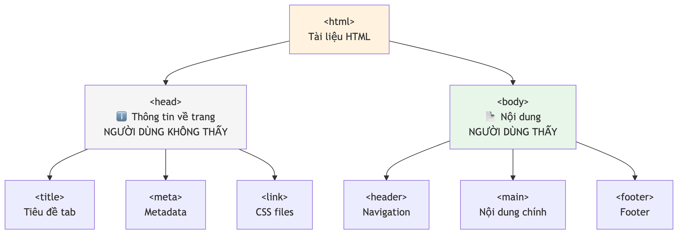
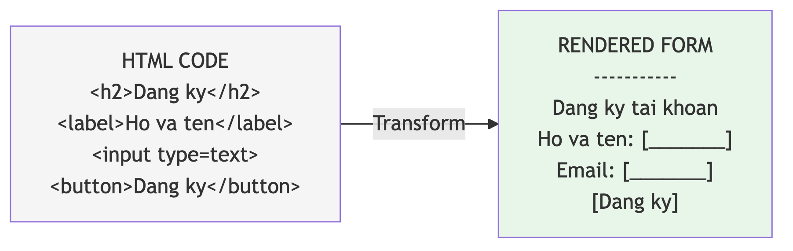
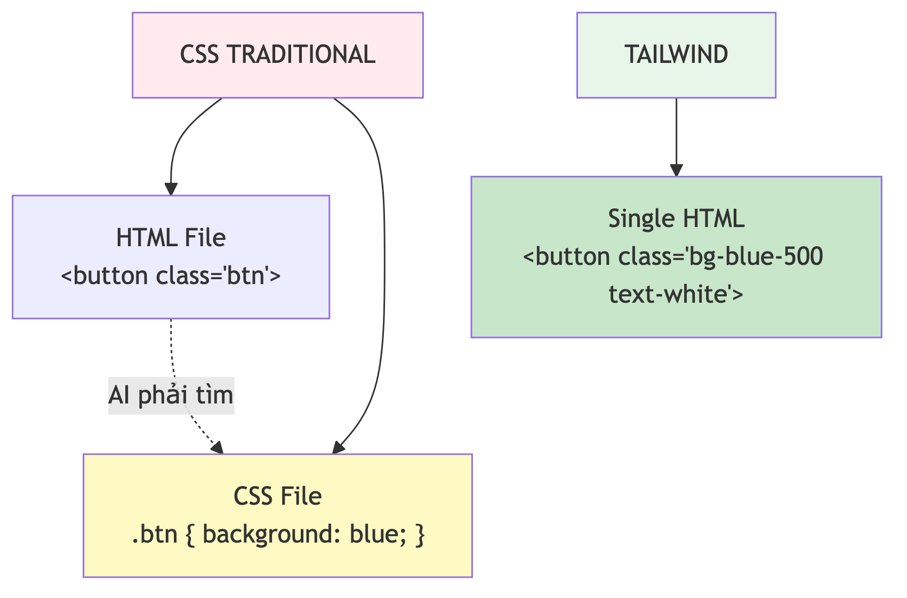
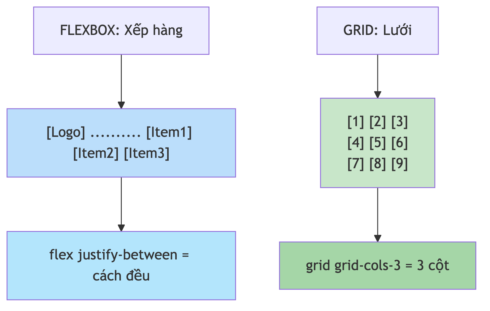

# Chương 8: Đọc hiểu giao diện — HTML và CSS/Tailwind

Bạn prompt "tạo form đăng ký cho ứng dụng quản lý task", và AI trả về một trang đầy `<div class="max-w-md mx-auto p-6...">` chồng lên nhau. Trông như mật mã. Bạn muốn kiểm tra xem nó có đủ trường không, nút Submit có đúng chỗ không, thiếu ô số điện thoại như trong spec không — nhưng chưa đọc nổi.

Tin vui: bạn không cần *viết* được thứ này. Bạn chỉ cần *đọc* được nó. Và đọc thì dễ hơn viết rất nhiều — giống như bạn đọc hiểu một hợp đồng mà không cần là luật sư.

Ở Chương 7, chúng ta đã thấy web hoạt động thế nào: trình duyệt gửi request, server trả response. HTML chính là nội dung của response đó — thứ trình duyệt nhận về và biến thành trang bạn nhìn thấy. Chương này mở response ra và đọc thử: HTML là bộ khung, còn CSS/Tailwind là lớp sơn. Mục tiêu không phải là biết trang trí, mà là nhìn vào một đống class rồi hình dung được element đó trông thế nào — và biết chỉ đúng chỗ cần AI sửa.

## HTML là khung xương, không phải máy chạy được

Hãy tưởng tượng bạn xây nhà. HTML là **khung xương** — tường, sàn, trần, cửa sổ, cửa ra vào. Nó xác định *có gì* và *ở đâu*, nhưng không quyết định màu sơn (đó là CSS) hay cửa tự đóng mở (đó là JavaScript). Một trang web chỉ có HTML thì như ngôi nhà thô: đủ cấu trúc, chưa sơn, chưa lắp điện.

HTML viết tắt của **HyperText Markup Language** — ngôn ngữ đánh dấu siêu văn bản. "Đánh dấu" nghĩa là bạn dùng các **tag** (thẻ) để nói cho trình duyệt: "đây là tiêu đề", "đây là đoạn văn", "đây là hình ảnh". Mỗi tag thường đi theo cặp mở–đóng: `<p>` mở một đoạn văn, `</p>` kết thúc nó.

HTML **không phải ngôn ngữ lập trình**. Nó không có logic, không vòng lặp, không điều kiện. Bạn không "chạy" HTML — trình duyệt *đọc* nó rồi hiển thị. Nghĩa là bạn không cần tư duy như lập trình viên để hiểu nó. Chỉ cần đọc và nhận biết, như đọc một bản thiết kế nhà.

Bạn sẽ đọc HTML ở ba tình huống. Một, xem code AI sinh ra — để biết nó đã tạo đủ trường chưa, nút ở đâu, có thiếu gì so với spec không (thường AI viết HTML nằm bên trong JavaScript, gọi là JSX — Chương 9 sẽ chạm tới). Hai, Inspect element trên trình duyệt để soi giao diện thật. Ba, đọc tài liệu và câu trả lời kỹ thuật để đưa vào prompt cho chính xác. Cả ba đều là *đọc*, không phải *viết*.

## Bộ khung mọi trang: html, head, body

Mỗi trang HTML đều có một bộ khung giống nhau, như mỗi lá thư đều có địa chỉ người gửi, người nhận, và nội dung. Đây là cấu trúc tối giản nhất:

```html
<!DOCTYPE html>
<html>
  <head>
    <title>Trang của tôi</title>
  </head>
  <body>
    <h1>Xin chào!</h1>
    <p>Đây là trang web đầu tiên.</p>
  </body>
</html>
```

Ngắn nhưng đủ ba phần. `<head>` chứa thông tin *về* trang — tiêu đề hiển thị trên tab trình duyệt, các link đến file CSS, thiết lập kỹ thuật; người dùng không nhìn thấy nội dung trong `<head>` trên trang. `<body>` chứa *mọi thứ người dùng nhìn thấy* — tiêu đề, đoạn văn, hình ảnh, nút bấm, form. Còn `<!DOCTYPE html>` ở dòng đầu chỉ nói với trình duyệt: "đây là tài liệu HTML hiện đại".

Khi đọc code AI sinh ra, phần lớn thời gian bạn làm việc với nội dung bên trong `<body>`. Phần `<head>` thường được framework như Next.js xử lý tự động, nên bạn không cần lo nhiều về nó.



*HÌNH 8.1: Sơ đồ cấu trúc HTML cơ bản — html bao ngoài, bên trong có head (chứa title, meta) và body (chứa nội dung hiển thị), đánh dấu rõ phần nào người dùng thấy, phần nào không.*

## Khoảng hai mươi element bạn cần nhận ra

Tồn tại hơn 100 HTML element, nhưng khi đọc code AI, bạn gặp đi gặp lại khoảng **20 element** phổ biến. Chia thành năm nhóm cho dễ nhớ.

| Nhóm | Element | Vai trò |
|---|---|---|
| **Container** — hộp đựng đồ | `<div>`, `<section>`, `<main>`, `<header>`, `<footer>`, `<nav>` | Nhóm các element lại; `<div>` là hộp trung tính, các thẻ còn lại là hộp *có tên* (semantic) |
| **Text** — hiển thị chữ | `<h1>`–`<h6>`, `<p>`, `<span>` | `<h1>` là tiêu đề lớn nhất (mỗi trang thường một cái), `<p>` là đoạn văn, `<span>` là mẩu chữ nhỏ để style riêng |
| **Tương tác** — người dùng làm gì đó | `<button>`, `<input>`, `<form>`, `<select>`, `<textarea>` | Nơi người dùng thực sự thao tác |
| **Navigation** | `<a>`, `<nav>` | `<a>` là liên kết, đưa người dùng sang trang khác |
| **Media** | ``, `<video>`, `<ul>`/`<ol>`/`<li>` | Hình ảnh, video, danh sách |

Nhóm **Tương tác** là quan trọng nhất với Tester và BA, vì đó là nơi người dùng chạm vào ứng dụng. `<button>` tạo nút bấm. `<input>` tạo ô nhập liệu — element đa năng nhất: tùy attribute `type`, nó thành ô text, password, email, checkbox hay radio. `<form>` gom các input và button thành một biểu mẫu; khi người dùng nhấn Submit, trình duyệt gửi dữ liệu đi.

Vậy **attribute** là gì? Nếu element là các thùng carton, attribute là *nhãn dán* trên thùng — ghi tên, màu, hướng dẫn. Chúng nằm bên trong tag mở:

```html
<input type="email" placeholder="Nhập email"
       class="p-2 border rounded" id="user-email" />
```

Một `<input>` với bốn attribute: `type="email"` báo đây là ô email (trình duyệt tự kiểm tra định dạng); `placeholder` là text mờ hiển thị khi ô còn trống; `class` chứa các class style (thường là Tailwind — ta sẽ đọc ở nửa sau chương); `id="user-email"` là tên định danh duy nhất. Vài attribute gặp thường xuyên: `class` (danh sách class style — quan trọng nhất), `id` (tên duy nhất trong trang), `href` (URL đích của thẻ `<a>`), `src` (đường dẫn ảnh/video), `type` (loại input), `placeholder`, và `disabled` (vô hiệu hóa element).

> 💡 **Tip:** Đừng học thuộc mọi attribute. Khi đọc code AI và gặp một attribute lạ như `aria-label`, hãy hỏi thẳng AI: "attribute `aria-label` trong dòng này có tác dụng gì?" Nó giải thích ngay. Học khi cần, trong ngữ cảnh cụ thể — đó là cách nhớ lâu nhất.

## Đọc một form như đọc tài liệu

Lý thuyết đủ rồi. Đây là một form đăng ký AI có thể sinh ra khi bạn prompt "tạo form đăng ký cho ứng dụng quản lý task":

```html
<form class="max-w-md mx-auto p-6 bg-white rounded-lg shadow">
  <h2 class="text-2xl font-bold mb-4">Đăng ký tài khoản</h2>

  <label for="name">Họ và tên</label>
  <input type="text" id="name" placeholder="Nguyễn Văn A"
         class="w-full p-2 border rounded mb-3" />

  <label for="email">Email</label>
  <input type="email" id="email" placeholder="email@example.com"
         class="w-full p-2 border rounded mb-3" />

  <label for="password">Mật khẩu</label>
  <input type="password" id="password" placeholder="Ít nhất 8 ký tự"
         class="w-full p-2 border rounded mb-3" />

  <button type="submit"
          class="w-full bg-blue-500 text-white p-2 rounded">
    Đăng ký
  </button>
</form>
```

Đọc từ trên xuống như đọc một tài liệu. Toàn bộ nằm trong `<form>` — đây là biểu mẫu. Bên trong có tiêu đề `<h2>` "Đăng ký tài khoản". Rồi ba cặp `<label>` + `<input>` — mỗi cặp là một trường nhập với nhãn phía trên: trường đầu `type="text"` cho họ tên, trường hai `type="email"` (trình duyệt tự kiểm định dạng), trường ba `type="password"` (ký tự bị che thành dấu chấm). Cuối cùng `<button type="submit">` — nhấn vào thì form gửi dữ liệu đi.

Bạn vừa đọc xong một form HTML hoàn chỉnh. Không viết một dòng nào — chỉ đọc và hiểu. Đó chính là kỹ năng cần có. Và với Tester, nó gần như tự động biến thành danh sách test case: nhập họ tên trống, nhập email sai định dạng, nhập mật khẩu dưới 8 ký tự, nhập đủ đúng rồi Submit. Đếm số `<input>` là ra số trường cần kiểm; mỗi `<button type="submit">` là một hành động cần verify kết quả.

> 🧪 **Dành cho Tester/QA:** Cùng một form này còn cho bạn thứ khác: **selector cho test automation**. Script tự động không click bằng tay — nó chỉ cho công cụ biết "tìm element này", và cách chỉ phổ biến nhất là qua `id` với `class`. Một `id="user-email"` là địa chỉ duy nhất trong trang nên là locator ổn định nhất; một `class` có thể trùng ở nhiều nơi nên kém tin cậy hơn, dễ gãy khi giao diện đổi. Vì vậy khi đọc HTML AI sinh ra, để ý các trường quan trọng có `id` rõ ràng chưa. Nếu chưa, một prompt "thêm `id` riêng cho từng input trong form" sẽ giúp bộ test của bạn bớt gãy về sau.



*HÌNH 8.2: Form đăng ký render trên trình duyệt (bên trái) đặt cạnh mã HTML tương ứng (bên phải), có đường kẻ nối từ từng element sang phần giao diện tương ứng.*

## Semantic HTML — vì sao cái tên lại quan trọng

Nhớ nhóm Container ở trên chứ? `<div>` là hộp trung tính, còn `<section>`, `<header>`, `<footer>`, `<main>`, `<nav>` là hộp *có tên* — gọi là **semantic HTML** (HTML có ngữ nghĩa). Hình dung hai bản thiết kế văn phòng: bản một ghi "Phòng 1, 2, 3, 4"; bản hai ghi "Sảnh lễ tân, Phòng họp, Kho, Bếp". Cùng một văn phòng, nhưng bản hai cho bạn hiểu ngay công năng mà không cần bước vào. Semantic HTML làm đúng vậy: nó giúp trình duyệt hỗ trợ người khuyết tật (screen reader gặp `<nav>` sẽ báo "đây là thanh điều hướng" — đây là phần cốt lõi của **accessibility**), giúp công cụ tìm kiếm hiểu nội dung, và giúp bạn đọc code dễ hơn. Khi AI sinh code toàn `<div>` lồng nhau, bạn hoàn toàn có thể yêu cầu: "dùng semantic HTML — thay `<div>` ngoài cùng bằng `<main>`, phần đầu bằng `<header>`, thanh menu bằng `<nav>`". Giờ thì bạn đã biết tại sao đó là một prompt tốt.

## Bốn mẹo đọc HTML nhanh

**Mẹo 1 — Đọc từ ngoài vào trong.** HTML lồng nhau: element ngoài bao element trong, như hộp lớn chứa hộp nhỏ. Gặp đoạn code dài, bắt đầu từ element ngoài cùng để nắm bức tranh lớn, rồi mới đi sâu.

**Mẹo 2 — Tìm element tương tác trước.** Quét `<button>`, `<input>`, `<a>` trước — đó là chỗ người dùng thao tác. Các `<div>` chỉ là hộp đựng đồ, bỏ qua được ở lần đọc đầu.

**Mẹo 3 — Nhìn attribute `class` để đoán giao diện.** Thấy `class="bg-red-500 text-white p-4 rounded"` là đoán được: nền đỏ, chữ trắng, có padding, bo góc. Nửa sau chương này dạy bạn đọc chúng.

**Mẹo 4 — Dùng Inspect để học.** Mở bất kỳ trang web nào bạn thích, right-click một element rồi chọn Inspect (hoặc nhấn F12), trình duyệt hiện HTML của nó. Thấy giao diện rồi thấy code tạo ra giao diện — cách học thực tế nhất. Đây cũng là kỹ năng debug bạn sẽ dùng thường xuyên; Chương 14 nói kỹ hơn.

## Từ khung xương sang lớp sơn: CSS

Nếu HTML nói "đây là một nút", **CSS** nói "nút này nền xanh dương, chữ trắng, bo góc, rê chuột vào thì đổi sang xanh đậm hơn". CSS (viết tắt *Cascading Style Sheets* — bảng định kiểu xếp tầng) là ngôn ngữ trang trí giao diện web. Giống hệt lúc bạn format một báo cáo Word: chọn font, cỡ chữ, màu tiêu đề, khoảng cách, căn lề — CSS làm đúng những việc đó nhưng cho web. Nó kiểm soát ba nhóm: màu sắc và hình thức, khoảng cách và kích thước, và cách sắp xếp (layout).

Trong lập trình truyền thống, CSS nằm ở một file riêng (ví dụ `styles.css`), tách khỏi HTML. Bạn không cần biết viết nó. Chỉ cần biết nó tồn tại, và nó là thứ quyết định giao diện trông thế nào. Trong vibe coding, điều bạn thực sự gặp không phải CSS thuần, mà là **Tailwind CSS** — và đó là câu chuyện tiếp theo.

## Vì sao gần như mọi AI đều dùng Tailwind

Nếu đã có CSS, tại sao cần thêm Tailwind CSS? Câu trả lời nằm ở cách AI "nhìn" code. Với CSS truyền thống, styling ở một file riêng, còn HTML chỉ ghi tên class. Khi AI đọc file HTML, nó thấy `<button class="button">` nhưng không biết nút trông ra sao — phải tìm sang file CSS khác để xem `.button` được style thế nào. Đây là vấn đề lớn, vì AI làm việc tốt nhất khi mọi thông tin nằm cùng một chỗ.

**Tailwind CSS** giải quyết bằng cách đặt styling trực tiếp lên element qua các **utility class** (class tiện ích — mỗi class làm đúng một việc nhỏ):

```html
<!-- Nút bấm: nền xanh, chữ trắng, padding, bo góc -->
<button class="bg-blue-500 text-white px-4 py-2 rounded-lg">
  Đăng nhập
</button>
```

Mỗi class làm một việc: `bg-blue-500` đặt nền xanh dương (cường độ 500), `text-white` chữ trắng, `px-4` padding ngang, `py-2` padding dọc, `rounded-lg` bo góc lớn. AI nhìn vào là thấy *mọi thứ* — không phải tìm ở file nào khác. Như một phân tích từ cộng đồng developer đã chỉ ra: *"Với Tailwind, toàn bộ thông tin styling nằm ngay trên mỗi element. AI có thể thấy chính xác nó đang làm việc với gì, ở một nơi, không có gì bị ẩn."* Đó là lý do Tailwind trở thành mặc định trong vibe coding. Theo khảo sát State of CSS 2025, 51% CSS developer sử dụng Tailwind, với 75 triệu lượt tải npm mỗi tháng.



*HÌNH 8.3: So sánh CSS truyền thống (file HTML + file CSS riêng, mũi tên AI phải đọc hai nơi) với Tailwind CSS (mọi styling nằm trên HTML element, AI chỉ đọc một nơi).*

> 📋 **Dành cho PM/BA:** Biết đọc Tailwind giúp bạn viết acceptance criteria chính xác hơn nhiều. Thay vì "nút màu xanh nhạt", bạn viết "nền `bg-blue-400`"; thay vì "form phải chạy tốt trên điện thoại", bạn viết "một cột trên mobile (`grid-cols-1`), hai cột trên desktop (`md:grid-cols-2`)". Developer hoặc AI đọc vào là hiểu đúng shade, đúng bố cục — bớt hẳn những vòng qua lại "ý anh là xanh nào".

## Đọc class Tailwind: sáu nhóm là đủ

Tailwind có hàng trăm utility class, nhưng bạn chỉ cần nhận ra khoảng **sáu nhóm**. Như học đọc biển báo giao thông — không cần thuộc hết luật, chỉ cần nhận ra biển cấm, biển chỉ dẫn, đèn tín hiệu.

**Nhóm 1 — Màu sắc.** Tailwind dùng thang màu từ 50 (rất nhạt) đến 950 (rất đậm). Quy tắc đọc: phần đầu cho biết áp dụng vào đâu (`bg` = nền, `text` = chữ, `border` = viền), rồi tên màu (`blue`, `gray`, `red`, `green`...), rồi số cường độ. Số 100 rất nhạt (gần trắng), 500 trung bình, 900 rất đậm (gần đen). Vậy `bg-blue-100` là nền xanh pastel nhẹ, `bg-blue-900` là xanh navy đậm.

**Nhóm 2 — Khoảng cách.** Nhóm gặp nhiều nhất. **Padding** là khoảng đệm *bên trong* element (giữa nội dung và viền); **margin** là khoảng cách *bên ngoài* (giữa element này với element khác). Cách đọc: `p` = padding, `m` = margin; thêm `x` = ngang, `y` = dọc, `t`/`b`/`l`/`r` = trên/dưới/trái/phải. Số phía sau là đơn vị Tailwind (mỗi đơn vị = 4px, nên `p-4` = 16px padding). Class `gap-4` tạo khoảng cách đều giữa các phần tử con.

**Nhóm 3 — Kích thước.** `w` (width) và `h` (height). Hay gặp: `w-full` (rộng 100% phần tử cha), `h-screen` (cao bằng phần màn hình người dùng thấy), `max-w-md`/`max-w-lg` (giới hạn chiều rộng tối đa — hay dùng cho card hay form ở giữa trang). Thấy `max-w-4xl mx-auto` nghĩa là "rộng tối đa cỡ 4xl, căn giữa ngang" — một pattern layout cực phổ biến.

**Nhóm 4 — Layout.** Hai từ khóa quan trọng nhất: `flex` và `grid`. **Flexbox** (`flex`) như xếp sách trên kệ — bạn quyết định nằm ngang hay dọc, sát trái hay cách đều, căn giữa hay trên cùng. Combo `flex justify-center items-center` là cách căn giữa hoàn hảo (ngang + dọc) mà AI dùng rất nhiều; `justify-between` đẩy phần tử con ra hai đầu; `flex-col` chuyển từ xếp ngang sang dọc. **Grid** (`grid grid-cols-3 gap-4`) tạo lưới ba cột cách đều — hay dùng cho danh sách card, gallery ảnh, dashboard.



*HÌNH 8.4: Minh họa trực quan khác biệt giữa flex (xếp hàng) và grid (ô lưới), với ví dụ thanh navigation dùng flex và danh sách card dùng grid.*

**Nhóm 5 — Bo góc và shadow.** Hai nhóm nhỏ tạo vẻ "chuyên nghiệp": `rounded` (bo nhẹ), `rounded-md`, `rounded-lg`, `rounded-full` (tròn hoàn toàn — hay dùng cho avatar); shadow tương tự từ `shadow-sm` đến `shadow-xl`. Pattern `rounded-lg shadow-md bg-white p-6` là "công thức" card chuẩn AI sinh ra rất thường xuyên.

**Nhóm 6 — Typography.** Kích thước chữ theo thang: `text-xs`, `text-sm`, `text-base` (bình thường), `text-lg`, `text-xl`, `text-2xl`... Độ đậm: `font-normal`, `font-medium`, `font-semibold`, `font-bold`. Còn hay gặp `text-center`, `uppercase`, và `truncate` (cắt chữ dài thêm dấu "...").

## Đọc một card thực tế

Ghép cả sáu nhóm vào một ví dụ — card thông tin người dùng AI có thể sinh ra:

```html
<div class="max-w-sm mx-auto bg-white rounded-xl shadow-md p-6">
  <div class="flex items-center gap-4">
    
    <div>
      <h3 class="text-lg font-semibold">Nguyễn Văn A</h3>
      <p class="text-sm text-gray-500">Tester Lead</p>
    </div>
  </div>
  <p class="mt-4 text-gray-700">
    5 năm kinh nghiệm QA, đang học vibe coding.
  </p>
</div>
```

Đọc từng phần: container ngoài có `max-w-sm` (rộng giới hạn cỡ nhỏ), `mx-auto` (căn giữa ngang), `bg-white` (nền trắng), `rounded-xl` (bo góc rất tròn), `shadow-md` (bóng vừa), `p-6` (padding 24px đều). Bên trong, `flex items-center gap-4` xếp avatar và tên cạnh nhau, căn giữa dọc, cách nhau bốn đơn vị. Avatar `w-12 h-12` (48x48px) và `rounded-full` (tròn). Tên hiển thị `text-lg font-semibold`, chức danh `text-sm text-gray-500` (nhỏ, xám). Đoạn mô tả có `mt-4` (margin-top 16px) để tách khỏi phần trên. Mỗi class là một mảnh ghép nhỏ — đọc lần lượt, bạn hình dung được element mà chẳng cần chạy code.

## Một giao diện, mọi màn hình

Bạn từng mở một trang trên điện thoại và thấy layout vỡ, chữ tràn, nút bé xíu không chạm được chứ? Đó là khi trang thiếu **responsive design** (thiết kế đáp ứng — giao diện tự điều chỉnh theo kích thước màn hình). Tailwind xử lý việc này bằng **prefix** đặt trước class, cho biết class chỉ áp dụng từ một kích thước trở lên: `sm:` (640px — điện thoại lớn), `md:` (768px — tablet), `lg:` (1024px — laptop), `xl:` (1280px — màn hình lớn).

```html
<!-- 1 cột mobile, 2 cột tablet, 3 cột desktop -->
<div class="grid grid-cols-1 md:grid-cols-2 lg:grid-cols-3 gap-4">
  <div>Card 1</div>
  <div>Card 2</div>
  <div>Card 3</div>
</div>
```

Đọc: mặc định (mobile) một cột; từ cỡ medium trở lên hai cột; từ cỡ large trở lên ba cột. Tailwind theo nguyên tắc **mobile-first** — viết style cho mobile trước, rồi thêm prefix cho màn hình lớn hơn. Một prefix nữa cùng cơ chế là `dark:` cho **dark mode**: `bg-white dark:bg-gray-900` nghĩa là nền trắng ở chế độ sáng, nền tối khi hệ điều hành chuyển sang tối.

> 🧪 **Dành cho Tester/QA:** Responsive là vùng dễ sinh bug nhất. Khi test, để ý các prefix `sm:`, `md:`, `lg:` trong code. Thấy một element có `hidden md:block` nghĩa là nó *cố ý* ẩn trên mobile, hiện từ tablet trở lên — đó là behavior đúng, không phải bug. Ngược lại, nếu element không có prefix responsive nào mà layout vẫn vỡ khi thu nhỏ màn hình, đó mới là vấn đề cần report.

> 💡 **Tip:** Khi có cả responsive và dark mode, chuỗi class trông rất dài: `bg-white dark:bg-gray-900 md:p-8 lg:p-12`. Đừng hoảng. Đọc từng cụm: `bg-white` (nền trắng), `dark:bg-gray-900` (dark mode nền tối), `md:p-8` (tablet padding 8), `lg:p-12` (desktop padding 12). Tách nhỏ ra, cụm nào cũng dễ.

## Khi nào cần biết thêm — và khi nào dừng lại

Phần lớn thời gian bạn sẽ không bao giờ viết Tailwind từ đầu. AI sinh ra, việc của bạn là đọc hiểu để biết cần sửa gì. Nhưng có một tình huống bạn nên can thiệp trực tiếp: khi AI cho ra giao diện "gần đúng nhưng chưa hoàn hảo" — spacing hơi chật, hoặc màu lệch brand một chút. Lúc đó, thay vì viết một prompt dài giải thích, đổi thẳng `p-4` thành `p-6` hoặc `bg-blue-500` thành `bg-blue-600` nhanh hơn nhiều.

Mục tiêu không phải trở thành người viết CSS. Mục tiêu là **đọc được, hiểu được, và chỉ đúng chỗ cần sửa**. Khi đạt được ba điều đó, bạn đã có đủ. Cấu trúc project và cách các file này ghép lại thành một ứng dụng hoàn chỉnh là chuyện của Chương 10.

## Tóm tắt

- HTML là ngôn ngữ đánh dấu cấu trúc nội dung web, không phải ngôn ngữ lập trình — bạn đọc nó, không cần viết từ đầu.
- Mỗi trang có ba phần: `<html>` bao ngoài, `<head>` chứa meta info, `<body>` chứa nội dung hiển thị.
- Khoảng 20 element phổ biến chia năm nhóm: Container, Text, Tương tác, Navigation, Media; attribute (`class`, `id`, `type`, `href`, `src`) là thông tin bổ sung cho element.
- Kỹ năng cốt lõi: đọc một form HTML và nhận ra các trường, nút, loại input — với Tester, `id` còn là locator để viết selector cho test automation.
- Semantic HTML (`<header>`, `<main>`, `<nav>`) giúp code dễ đọc và hỗ trợ accessibility — bạn có thể yêu cầu AI dùng nó.
- Tailwind CSS đặt styling trực tiếp lên element bằng utility class; theo khảo sát State of CSS 2025, 51% CSS developer dùng Tailwind với 75 triệu lượt tải npm mỗi tháng.
- Sáu nhóm class cần nhận ra: màu sắc, khoảng cách, kích thước, layout (`flex`/`grid`), bo góc/shadow, typography; responsive dùng prefix `sm:`/`md:`/`lg:`, dark mode dùng `dark:`.

## Bài tập

**BT 8a — Đọc hiểu HTML và liệt kê test case**

Cho form đăng ký ở phần "Đọc một form như đọc tài liệu" trong chương này (họ tên, email, mật khẩu, nút Submit). Hãy trả lời: có bao nhiêu `<input>`, mỗi input thuộc loại gì, loại nào sẽ tự động kiểm tra định dạng, và `id` nào bạn sẽ dùng làm selector cho script test automation. Sau đó viết ít nhất bốn test case từ chính đoạn HTML đó.

*Gợi ý:* Đếm các tag mở (trừ tag tự đóng). Nhớ `type="email"` tự validate định dạng. Mỗi `id` duy nhất là một locator ổn định; mỗi ràng buộc ngầm (mật khẩu "ít nhất 8 ký tự") là một test case biên.

*Đầu ra:* Một bảng liệt kê từng input kèm `type` và `id`, cộng danh sách ≥ 4 test case (gồm ít nhất một ca nhập rỗng và một ca sai định dạng).

**BT 8b — Giải mã một chuỗi class Tailwind**

Cho đoạn code:

```html
<div class="bg-blue-500 p-4 rounded-lg text-white flex justify-between">
  <span class="font-bold text-lg">Dashboard</span>
  <button class="bg-white text-blue-500 px-3 py-1 rounded-md text-sm">
    Cài đặt
  </button>
</div>
```

Lập bảng liệt kê từng class và giải thích nó làm gì. Rồi trả lời: element ngoài trông thế nào? Nút "Cài đặt" khác gì về màu so với container? Nếu muốn thêm khoảng cách giữa hai phần tử con, bạn thêm class nào?

*Gợi ý:* Chia theo sáu nhóm đã học. Để thêm khoảng cách giữa các phần tử con trong flexbox, nhớ lại class `gap-`.

*Đầu ra:* Một bảng class → ý nghĩa, kèm ba câu trả lời và class `gap-` bạn chọn.

## Tiếp theo

HTML là khung, CSS/Tailwind là lớp sơn — nhưng cái khiến ngôi nhà thực sự "sống" (nút phản hồi khi nhấn, form gửi được data, trang tự cập nhật) là **JavaScript**. Chương 9 dạy bạn đọc hiểu logic đó, cùng tư duy component — cách các mảnh giao diện được đóng gói lại để tái dùng.
