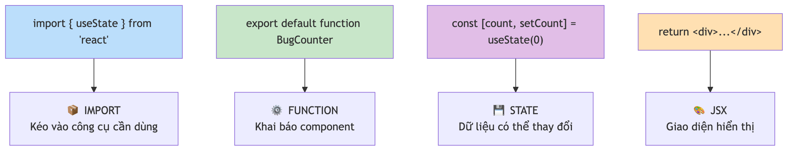
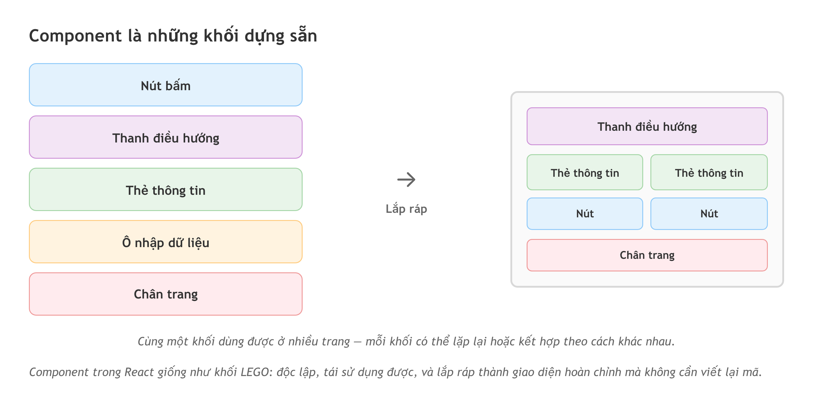
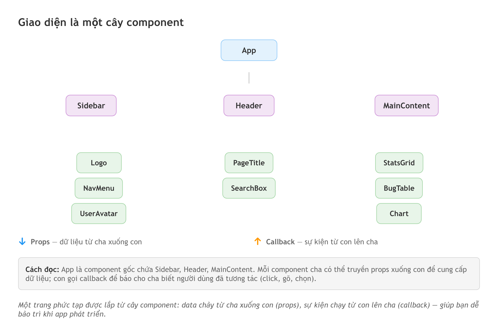

# Chương 9: Đọc hiểu logic — JavaScript và component

AI vừa dựng cho bạn một trang dashboard quản lý bug. Nhìn thì đẹp: có sidebar, có bảng danh sách, có nút bấm. Nhưng bạn click "Thêm bug" và chẳng có gì xảy ra. Không báo lỗi, không phản hồi, nút cứ trơ ra. Bạn mở file `.tsx` mà AI tạo, và đập vào mắt là một bức tường chữ: `const`, `useState`, `async`, `=>`, ngoặc nhọn lồng ngoặc tròn. Bạn không viết được dòng nào trong đó, nhưng ngay lúc này bạn cần biết một điều rất cụ thể: *cái nút này lẽ ra phải gọi hàm nào, và nó có gọi không?*

Đây là khoảnh khắc mà kỹ năng đọc hiểu code trở nên đáng giá. Không phải để bạn tự sửa — mà để bạn chỉ đúng chỗ cho AI sửa, hoặc để bạn viết một bug report mà developer đọc xong gật đầu thay vì hỏi lại. Ở chương trước bạn đã đọc được HTML và Tailwind — phần "khung nhà" và "lớp sơn". Chương này là phần làm ngôi nhà *sống*: khi bạn click một nút và có chuyện gì đó xảy ra, đó là JavaScript đang chạy.

Mục tiêu vẫn như cả Phần 3: **đọc hiểu, không phải tự viết**. Bạn sẽ nhận diện được các thành phần cơ bản trong code AI sinh ra, hiểu logic đang chạy, và — quan trọng nhất về sau — biết một giao diện phức tạp thật ra được lắp từ những khối nhỏ nào.

## JavaScript và TypeScript — người điều khiển và cái nhãn mác

**JavaScript** là ngôn ngữ lập trình duy nhất chạy thẳng trên mọi trình duyệt mà không cần cài thêm gì — Chrome, Safari, Firefox đều hiểu nó. Mọi thứ động trên web đều là nó: click nút, gửi form, trang tự cập nhật mà không tải lại. Trong bối cảnh vibe coding, hầu hết công cụ AI đều sinh ra code JavaScript, hoặc phổ biến hơn là TypeScript.

**TypeScript** là JavaScript có dán nhãn. Hãy nghĩ thế này: JavaScript như một cái hộp bỏ gì vào cũng được — số, chữ, danh sách. TypeScript là những cái hộp có nhãn: "hộp này chỉ chứa số", "hộp này chỉ chứa tên người dùng". Nhãn đó gọi là **type** (kiểu dữ liệu). Khi mọi thứ có nhãn, lỗi bị bắt sớm hơn — bỏ nhầm cái tên vào hộp chỉ chứa số thì báo lỗi ngay, thay vì để chương trình chạy sai rồi mới phát hiện. Đây là lý do phần lớn công cụ AI mặc định sinh code TypeScript.

Khi đọc code, khác biệt chính bạn thấy là những dòng khai báo kiểu:

```typescript
const userName = "Minh"           // JavaScript thuần
const userName: string = "Minh"   // TypeScript — có thêm nhãn kiểu
const userAge: number = 28
```

Phần sau dấu hai chấm (`: string`, `: number`) là TypeScript nói: "biến này chỉ chứa chuỗi ký tự" hoặc "chỉ chứa số". Đừng lo về chi tiết — chỉ cần biết chúng là nhãn giúp code an toàn hơn. File TypeScript có đuôi `.ts` hoặc `.tsx` (khi chứa cả giao diện); file JavaScript thuần là `.js` hoặc `.jsx`. Trong project AI tạo, bạn sẽ thấy `.tsx` là chủ yếu.

> 📋 **Dành cho PM/BA:** Nếu bạn từng viết user story hoặc acceptance criteria, bạn đã có tư duy để đọc JavaScript. Logic "nếu người dùng chưa đăng nhập thì chuyển về trang login" trong code chính là "Given user is not authenticated, When they access dashboard, Then redirect to login page" mà bạn vẫn viết trong BDD.

## Đọc được bốn thứ này là đủ

Bạn không cần học hết JavaScript. Đọc hiểu được bốn nhóm dưới đây là đủ để nắm 90% code AI sinh ra.

**Biến — nơi chứa dữ liệu.** Biến là cái hộp có tên. Bạn gặp hai từ khóa: `const` (hằng, không đổi được) và `let` (đổi được sau này).

```typescript
const maxBugs = 50        // hằng — đã đặt 50 là mãi 50
let currentCount = 12     // biến — hôm nay 12, mai có thể 15
```

AI thường dùng `const` cho gần như mọi thứ, chỉ dùng `let` khi giá trị thật sự cần thay đổi. Thấy `const` nhiều hơn `let` là dấu hiệu code viết đúng chuẩn. Dữ liệu phức tạp hơn thì có **object** (thẻ thông tin nhiều trường) và **array** (danh sách có thứ tự):

```typescript
const bug = {
  title: "Nút Submit không hoạt động",
  severity: "high",
  assignedTo: "Minh",
  isResolved: false
}
const teamMembers = ["Minh", "Lan", "Tuấn", "Hoa"]
```

**Function — hành động có tên.** Function là một khối code làm một việc cụ thể, như công thức nấu ăn: đặt tên, liệt kê bước, mỗi lần cần chỉ gọi tên. Bạn gặp hai cách viết cùng làm một việc:

```typescript
function calculateBugCount(open, closed) { return open + closed }   // truyền thống
const calculateBugCount = (open, closed) => { return open + closed } // arrow function
```

**Arrow function** (có dấu `=>`) là cách AI ưa dùng vì ngắn gọn. Từ khóa `return` nghĩa là "trả về kết quả" — giá trị sau `return` là câu trả lời cuối cùng của function.

**If/else — rẽ nhánh logic.** Đây là phần quen thuộc nhất, vì nó giống hệt test case và business rule:

```typescript
if (userRole === "admin") {
  showAdminPanel()
} else if (userRole === "tester") {
  showTestDashboard()
} else {
  showDefaultPage()
}
```

`if` kiểm tra một điều kiện; đúng thì chạy code trong ngoặc nhọn, sai thì nhảy xuống `else if` hoặc `else`. Dấu `===` là "bằng chính xác" (khác `=` là gán giá trị).

**Loops — lặp lại hành động.** Có một danh sách và cần làm gì đó với từng phần tử thì dùng vòng lặp. Trong code AI, bạn gặp `.map()` nhiều nhất:

```tsx
const bugs = ["Login lỗi", "UI bể layout", "API timeout"]
const bugCards = bugs.map((bug, i) => <div key={i}>{bug}</div>)
```

Đoạn này duyệt qua từng bug và tạo một thẻ `<div>` cho mỗi bug — ba bug thì ra ba thẻ. Bạn sẽ thấy pattern này khắp nơi khi AI tạo danh sách. Để ý cái `key={i}`: khi tạo một danh sách phần tử, mỗi phần tử cần một `key` riêng để framework theo dõi được phần tử nào là phần tử nào — thiếu nó, giao diện vẫn hiện nhưng bạn sẽ thấy một cảnh báo trong console. Ngoài `.map()` còn có `.filter()` (lọc theo điều kiện) và `.forEach()`, nhưng `.map()` là cái gặp thường xuyên nhất.

> 📋 **Dành cho PM/BA:** Logic if/else chính là business rules trong spec của bạn. Khi đọc code AI sinh ra, hãy kiểm xem các nhánh có phủ hết các trường hợp trong acceptance criteria không. Nếu bạn viết "user role guest không được vào settings" mà code không có nhánh xử lý guest — đó là gap cần report.

## Async/await — chỗ đẻ ra nhiều lỗi nhất

Đây là phần hơi khó nhưng xuất hiện nhiều nhất trong code thật, và cũng là nguồn gốc của rất nhiều bug. Khi app gọi API để lấy dữ liệu từ server (ví dụ: lấy danh sách bug từ database), nó không nhận kết quả tức thì — phải chờ. **Async/await** là cách JavaScript xử lý việc chờ này.

```typescript
const fetchBugs = async () => {
  const response = await fetch("/api/bugs")
  const data = await response.json()
  return data
}
```

Từ khóa `async` đánh dấu function này có thao tác cần chờ. Từ khóa `await` nghĩa là "chờ ở đây tới khi có kết quả rồi mới chạy tiếp" — giống như bạn gửi email hỏi thông tin và đợi reply trước khi viết báo cáo. Bạn không cần hiểu cơ chế bên dưới; chỉ cần nhận ra: thấy `async`/`await` và `fetch()` là code đang gọi API hoặc truy cập dữ liệu bên ngoài. Chương 7 đã giải thích HTTP và API kỹ hơn.

> ⚠️ **Lưu ý — async là ổ lỗi:** Một lỗi AI hay mắc là quên `await` khi gọi API. Thấy `fetch()` mà không có `await` phía trước thì đó là bug: kết quả sẽ là một object lạ thay vì dữ liệu thật, và giao diện hiển thị trống hoặc `undefined`. Một biến thể khác: code cố `.map()` trên dữ liệu *trước khi* nó về tới nơi, làm cả trang trắng xóa. Đây đúng là loại bug "chạy trên máy tôi, hỏng trên máy bạn" vì nó phụ thuộc mạng nhanh hay chậm. Biết nhận diện pattern này giúp bạn đoán được nguyên nhân trước cả khi mở công cụ debug.

## Đọc hiểu một React component

Trong thực tế, code AI sinh ra hiếm khi là JavaScript thuần — thường là **React component**, khối giao diện tái sử dụng được. Đây là cấu trúc bạn gặp nhiều nhất:

```tsx
"use client"
import { useState } from "react"

export default function BugCounter() {
  const [count, setCount] = useState(0)
  const handleClick = () => { setCount(count + 1) }

  return (
    <div className="p-4">
      <p>Số bug đã fix: {count}</p>
      <button onClick={handleClick} className="bg-blue-500 text-white px-4 py-2 rounded">
        +1 Bug Fixed
      </button>
    </div>
  )
}
```

Đọc từ trên xuống: `"use client"` báo cho framework rằng component này chạy trên trình duyệt của người dùng (không phải trên server). `import` lấy công cụ từ thư viện — ở đây là `useState`. `export default function BugCounter()` khai báo một component tên `BugCounter`. `useState(0)` tạo một biến `count` bắt đầu từ 0, và `setCount` là cách duy nhất để đổi giá trị của nó — đây là **state** (trạng thái của component). `handleClick` là function chạy khi người dùng click. Phần `return (...)` là giao diện: HTML pha trộn JavaScript, gọi là **JSX**.

Trong JSX, ngoặc nhọn `{}` là chỗ JavaScript "xen vào" giữa HTML. `{count}` hiển thị giá trị hiện tại của `count`; `onClick={handleClick}` nghĩa là "khi click nút này, chạy `handleClick`".



*HÌNH 9.1: Sơ đồ mổ xẻ một React component thành các phần có chú thích và tô màu khác nhau — phần import, phần khai báo state (useState), phần xử lý sự kiện (handleClick), và phần return JSX. Mỗi phần có một dòng giải thích ngắn về vai trò.*

> 💡 **Tip:** Khi đọc một component AI sinh ra, hãy bắt đầu từ phần `return` — đó là giao diện người dùng sẽ thấy. Từ đó truy ngược lên để hiểu các biến và function được dùng thế nào. Đọc từ "kết quả" ngược về "nguyên nhân" thường dễ hơn đọc từ trên xuống.

## Component là khối LEGO

Bạn vừa đọc *một* component. Bây giờ là câu hỏi lớn hơn: cả một trang phức tạp được lắp từ những component nào? Đây là lúc cần tư duy component — và ẩn dụ tốt nhất là LEGO.

Khi mua một bộ LEGO, nhà sản xuất không giao cho bạn một khối nhựa khổng lồ hình con tàu. Họ giao nhiều khối nhỏ, mỗi khối có hình dáng riêng, và bạn xếp lại. Cùng một khối 2x4 màu đỏ dùng được ở thân tàu lẫn ở cửa sổ — nó tái sử dụng được.

Component trong React y hệt vậy. Một **component** là một khối giao diện độc lập, tái sử dụng được. Một nút bấm là một component. Một thanh tìm kiếm là một component. Một thẻ hiển thị thông tin bug cũng là một component. Về bản chất, mỗi component là một function trả về JSX:

```tsx
function BugCard({ title, severity }) {
  return (
    <div className="rounded-lg border p-4">
      <h3 className="font-bold">{title}</h3>
      <span className="text-sm">{severity}</span>
    </div>
  )
}
```

Điểm mấu chốt: bạn dùng `<BugCard />` ở bất kỳ đâu — trang danh sách, trang dashboard, trang báo cáo — mà không cần viết lại code hiển thị.



*HÌNH 9.2: So sánh trực quan giữa bộ LEGO và giao diện web. Bên trái là các khối LEGO rời (nút, thanh ngang, khối vuông); bên phải là các component UI tương ứng (Button, Navbar, Card); ở giữa là mũi tên cho thấy chúng được xếp lại thành một trang web hoàn chỉnh.*

> 🧪 **Dành cho Tester/QA:** Tư duy component rất giống tư duy test module. Khi viết test case, bạn chia ứng dụng thành module: đăng nhập, tìm kiếm, báo cáo — mỗi module test độc lập. Component cũng vậy: mỗi component chạy và kiểm tra được độc lập. Nếu bạn đã biết chia ứng dụng thành test module, bạn đã có sẵn nền tảng tư duy component.

## Props và state — hai khái niệm phải phân biệt được

Nếu chỉ nhớ hai từ từ chương này, hãy nhớ props và state. Phân biệt được hai thứ này là bạn hiểu được cách dữ liệu chảy trong một app React.

**Props** (viết tắt của *properties*) là thông số truyền vào component. Tưởng tượng bạn vào quán phở và gọi: "Một phở bò, không hành, thêm tương ớt." Đó chính là props — bạn truyền thông tin vào "component phở" để nó biết làm gì. Cùng một quán, cùng công thức, nhưng mỗi bát ra khác nhau tùy yêu cầu. Trong code, props là dữ liệu component cha truyền xuống component con:

```tsx
function BugList() {
  return (
    <div>
      <BugCard title="Nút Submit lỗi" severity="high" />
      <BugCard title="Font bị nhỏ" severity="low" />
      <BugCard title="Trang 404 xấu" severity="medium" />
    </div>
  )
}
```

`BugList` là cha, truyền props `title` và `severity` xuống từng `BugCard`. Mỗi `BugCard` nhận props khác nhau nên hiển thị khác nhau. Một quy tắc quan trọng: props chỉ chạy một chiều, từ cha xuống con — con không tự đổi props của mình. Gọi "phở không hành" thì bếp không tự thêm hành. Quy tắc này giữ cho dữ liệu luôn rõ ràng, dễ truy vết.

**State** là dữ liệu thay đổi *bên trong* component theo tương tác người dùng. Nếu props là màu sơn của một cái cửa (không đổi), thì state là trạng thái "đang mở" hay "đã đóng" — nó thay đổi khi người dùng chạm vào. State quản lý những thứ như: dialog đang mở hay đóng? Tab nào đang chọn? Người dùng gõ gì vào ô tìm kiếm?

```tsx
function SearchBox() {
  const [query, setQuery] = useState("")
  const [isOpen, setIsOpen] = useState(false)
  return (
    <div>
      <button onClick={() => setIsOpen(!isOpen)}>Tìm kiếm</button>
      {isOpen && (
        <input value={query} onChange={(e) => setQuery(e.target.value)} />
      )}
    </div>
  )
}
```

Component này có hai state: `query` (nội dung tìm) và `isOpen` (hộp mở hay đóng). Click nút thì `isOpen` lật giữa `false` và `true`; gõ phím thì `query` cập nhật theo từng ký tự. Mỗi lần state đổi, React tự vẽ lại giao diện.

> 💡 **Tip — cách phân biệt trong một câu:** Nếu dữ liệu được truyền từ component khác vào, đó là props. Nếu dữ liệu thay đổi khi người dùng tương tác (click, gõ phím, chọn menu), đó là state.

## Component tree — cách các khối lồng vào nhau

Xếp LEGO không chỉ trên một mặt phẳng — bạn xếp lên nhau, lồng vào nhau. Component cũng thế: chúng tạo thành một cây phân cấp gọi là **component tree**. Một trang dashboard đơn giản có thể trông như thế này:

```
Dashboard
├── Sidebar
│   ├── Logo, NavMenu, UserAvatar
└── MainContent
    ├── Header (PageTitle, SearchBox)
    └── StatsGrid
        ├── StatCard (Tổng bug)
        ├── StatCard (Đã xử lý)
        └── StatCard (Đang chờ)
```

Mỗi component chỉ cần biết về con trực tiếp của nó. `Dashboard` biết về `Sidebar` và `MainContent`, nhưng không cần biết bên trong `MainContent` có gì — nguyên tắc *encapsulation* (đóng gói), giống mỗi phòng ban trong công ty chỉ cần lo việc của mình.

Dữ liệu di chuyển trong cây theo hai luồng. Luồng thứ nhất là **props flow** — dữ liệu chảy từ cha xuống con, như nước từ đỉnh núi xuống: `Dashboard` lấy số liệu từ API rồi truyền xuống `StatsGrid`, rồi xuống từng `StatCard`. Luồng thứ hai là **callback flow** — sự kiện chạy từ con lên cha. Khi con cần "báo" cho cha biết chuyện gì đó xảy ra, nó gọi một function mà cha đã truyền xuống qua props. Ví dụ, khi người dùng gõ vào `SearchBox` rồi nhấn Enter, `SearchBox` gọi function `onSearch` mà `Header` đã truyền cho nó. Kỹ thuật đưa state lên component cha để chia sẻ này gọi là **lifting state up** (nâng state lên) — hơi tricky nhưng là cách chính để các component nói chuyện với nhau.



*HÌNH 9.3: Sơ đồ component tree của một trang dashboard. Mỗi node là một component có tên và icon nhỏ; đường nối thể hiện quan hệ cha-con. Mũi tên màu xanh chỉ props chạy từ trên xuống, mũi tên màu cam chỉ sự kiện (callback) chạy từ dưới lên.*

## Khi nào nên tách component

Một câu hỏi hay gặp: "Khi nào nên tách một đoạn giao diện thành component riêng?" Ba dấu hiệu rõ nhất.

Thứ nhất, khi một đoạn giao diện **xuất hiện nhiều lần**. Thấy cùng một kiểu thẻ thông tin ở trang dashboard, trang báo cáo, và trang chi tiết — đó là lúc tách. Giống như khi bạn thấy mình copy-paste cùng một đoạn trong Excel nhiều lần, bạn biết mình cần một template.

Thứ hai, khi một đoạn giao diện **phức tạp độc lập**: một form có validation, một bảng dữ liệu có sắp xếp và lọc, một biểu đồ — mỗi thứ đủ phức tạp để sống riêng. Tách ra giúp code dễ đọc và dễ bảo trì.

Thứ ba, khi cần **chia công việc**: người này làm `Sidebar`, người kia làm `StatsGrid`, không dẫm chân nhau — như mỗi đội làm một module riêng.

> 📋 **Dành cho PM/BA:** Nguyên tắc tách component rất giống nguyên tắc chia user story. Một user story tốt là độc lập (Independent), có giá trị riêng (Valuable), đủ nhỏ để xong trong một sprint (Small). Component tốt cũng vậy: độc lập, chức năng rõ ràng, đủ nhỏ để quản lý. Nếu bạn quen với tiêu chí INVEST, bạn sẽ tự nhiên hiểu khi nào nên tách component.

## Thực hành: từ giao diện đến component tree

Đây là bài tập tư duy đáng làm nhất chương. Hãy phân tách một trang dashboard quản lý bug — một trang có sidebar (logo, menu, avatar), header (tiêu đề, ô tìm kiếm), và phần chính (bốn thẻ thống kê, một bảng danh sách bug, một biểu đồ phân bố theo severity).

Bước 1 — **nhìn tổng thể**: trang có ba vùng lớn. Đó là ba component đầu tiên: `Sidebar`, `Header`, `MainContent`.

Bước 2 — **zoom vào từng vùng**: `Sidebar` chứa `Logo`, `NavMenu` (gồm nhiều `NavItem`), `UserAvatar`. `Header` chứa `PageTitle` và `SearchBox`. `MainContent` chứa `StatsGrid` (bốn `StatCard`), `BugTable` (nhiều `BugRow`), và `SeverityChart`.

Bước 3 — **xác định props và state**: `StatCard` cần props `label`, `value`, `icon`. `BugRow` cần props `title`, `severity`, `assignee`, `status`. `SearchBox` cần state `query` và props `onSearch`. `NavMenu` cần state `activeItem` để biết menu nào đang chọn.

Từ một giao diện phức tạp, bạn đã có một kế hoạch rõ ràng về những khối cần dựng. Đó chính là component tree.

Còn khi nhiều component ở xa nhau trong cây cần dùng chung một dữ liệu — ví dụ thông tin người đang đăng nhập, mà cả `Sidebar` lẫn `Header` đều cần — thì truyền props qua từng tầng trở nên mệt mỏi (người ta gọi là **prop drilling**). Giải pháp thông dụng là `useContext`: một "kho dữ liệu chung" mà bất kỳ component nào bên trong cũng lấy được trực tiếp. Cho một MVP, chỉ cần `useState` cho state cục bộ và `useContext` cho state dùng chung là đủ — chưa cần vội lo tới các thư viện quản lý state phức tạp hơn, chúng dành cho giai đoạn app lớn lên.

## Trước và sau: từ một file khổng lồ đến các khối rõ ràng

Để thấy giá trị của tư duy component, hãy so sánh hai cách viết cùng một trang. Cách "trước" nhồi mọi thứ vào một file 200+ dòng — toàn bộ state, toàn bộ giao diện dồn cục, muốn tìm bảng dữ liệu phải cuộn qua sidebar và header. Cách "sau" tách rõ ràng:

```tsx
export default function DashboardPage() {
  return (
    <div className="flex">
      <Sidebar />
      <main>
        <Header />
        <StatsGrid />
        <BugTable />
        <SeverityChart />
      </main>
    </div>
  )
}
```

Nhìn vào là biết ngay trang có gì. Mỗi component tự quản state và logic của nó; có lỗi ở bảng dữ liệu thì mở đúng `BugTable`, không phải lục một file khổng lồ.

> 🧪 **Dành cho Tester/QA:** Kiến trúc component-based làm việc test dễ hơn nhiều. Thay vì test cả trang một lúc, bạn test từng component độc lập: `BugTable` hiển thị đúng dữ liệu không? `SearchBox` lọc chính xác không? `StatCard` hiện đúng số không? Đây chính là unit testing tự nhiên — và là người làm QA, bạn đã quen tư duy chia nhỏ để test rồi.

## Đọc error message — mảnh ghép cuối

Khi code AI sinh ra có lỗi, trình duyệt hoặc terminal hiện một error message. Biết đọc nó giúp bạn chỉ đúng chỗ cho AI sửa thay vì mô tả mơ hồ. Ba loại hay gặp nhất:

- **TypeError** — dùng sai kiểu dữ liệu, ví dụ `Cannot read properties of undefined (reading 'map')`: bạn đang cố `.map()` trên thứ chưa có dữ liệu (`undefined`) — thường vì API chưa trả kết quả mà code đã cố xử lý.
- **ReferenceError** — dùng biến chưa khai báo, ví dụ `userName is not defined`: có thể do lỗi chính tả (`userName` với `username`) hoặc quên import.
- **SyntaxError** — viết sai cú pháp, ví dụ `Unexpected token '}'`: thừa hoặc thiếu một dấu ngoặc, thường do code bị cắt ngang.

Đây mới là bản rút gọn cho đủ nhận diện; cách đọc lỗi bài bản và quy trình nhờ AI sửa đúng nằm ở Chương 14.

> 🧪 **Dành cho Tester/QA:** Đọc error message giống hệt đọc stack trace khi báo bug. Cách tốt nhất khi làm việc với AI lúc gặp lỗi: copy *toàn bộ* error message, dán vào AI, kèm đoạn code gây lỗi và mô tả "kết quả mong muốn là gì". Đây chính là format "expected vs. actual" mà bạn đã quen.

## Mẹo đọc code AI sinh ra

Sau khi đã biết các thành phần, đây là vài mẹo thực tế. **Đọc từ giao diện ngược về logic**: mở phần `return` để thấy giao diện trước; thấy một nút thì tìm `onClick` của nó, thấy một danh sách thì tìm `.map()`. **Chú ý tên biến và function** — AI đặt tên khá tốt: `fetchBugs`, `handleSubmit`, `isLoading` đều tự nói lên chức năng. **Không cần hiểu 100%**: những dòng cấu hình kỹ thuật lạ mắt không ảnh hưởng tới việc bạn nắm logic chính. Và cuối cùng, **dùng chính AI để giải thích code**: dán một đoạn bạn không hiểu vào một trợ lý AI dạng chat với prompt "Giải thích đoạn code này cho người không biết lập trình, mỗi dòng làm gì?" — bạn sẽ nhận lại giải thích bằng ngôn ngữ bình thường.

## Tóm tắt

- JavaScript là ngôn ngữ thêm "hành vi" cho web — xử lý click, gửi form, gọi API, cập nhật giao diện động. TypeScript là JavaScript có thêm nhãn kiểu dữ liệu để bắt lỗi sớm; công cụ AI mặc định sinh code TypeScript.
- Đọc hiểu bốn nhóm là đủ: `const`/`let` (biến), function/arrow function (hàm), `if`/`else` (rẽ nhánh), `.map()` (lặp).
- `async`/`await` xử lý việc chờ dữ liệu từ server, và là nguồn của rất nhiều lỗi — quên `await` trước `fetch()` là bug kinh điển cho ra dữ liệu rỗng.
- Component là khối giao diện tái sử dụng — như khối LEGO xếp được ở nhiều nơi. Về bản chất là một function trả về JSX.
- Props là dữ liệu cha truyền xuống con (một chiều, con không đổi được); state là dữ liệu đổi bên trong component theo tương tác — phân biệt được hai thứ này là hiểu được cách dữ liệu chảy.
- Component tree là cấu trúc phân cấp cha-con: props chảy xuống, sự kiện (callback) chạy lên. Tách component khi giao diện lặp lại, khi một phần đủ phức tạp, hoặc khi cần chia việc.
- Mục tiêu là đọc hiểu, không phải tự viết — không hiểu chỗ nào thì copy code và nhờ AI giải thích.

## Bài tập

**BT 9.1 — Lần theo logic một đoạn code**

Cho đoạn code sau:

```typescript
const checkBugSeverity = (bug) => {
  if (bug.severity === "critical") {
    console.log("ALERT: Bug nghiêm trọng!")
    return true
  } else if (bug.severity === "high") {
    console.log("Cảnh báo: Bug mức cao")
    return true
  } else {
    console.log("Bug mức bình thường")
    return false
  }
}
const myBug = { title: "Mất dữ liệu", severity: "critical", assignedTo: "Lan" }
const result = checkBugSeverity(myBug)
```

Trả lời: function `checkBugSeverity` nhận vào gì và trả về gì? Với `myBug` đã cho, nhánh `if` nào chạy? Giá trị của `result` là gì? Nếu đổi `severity` thành `"low"`, output thay đổi thế nào?

*Gợi ý:* Đọc từ dòng cuối — `myBug` là dữ liệu vào, `checkBugSeverity(myBug)` là lời gọi. Sau đó đọc function từ trên xuống, thay `bug` bằng `myBug` để lần theo logic. Dấu `===` là so sánh chính xác, `console.log()` là in ra màn hình.

*Đầu ra:* Một đoạn 4–6 câu trả lời đủ bốn câu hỏi trên, chỉ rõ nhánh nào chạy và vì sao — chứng minh bạn lần được luồng logic mà không cần chạy code.

**BT 9.2 — Phân tách giao diện thành component tree**

Mở một ứng dụng web bạn dùng hàng ngày — Trello, Jira, Notion, hay bất kỳ dashboard nào. Chọn một trang phức tạp và làm ba bước: (1) xác định các vùng lớn (sidebar, header, main content); (2) zoom vào từng vùng, liệt kê và đặt tên các component con; (3) với mỗi component, xác định props nào cần truyền vào và state nào cần quản lý. Vẽ component tree ra giấy hoặc bằng một công cụ vẽ sơ đồ, đánh dấu props bằng mũi tên và state bằng hình tròn.

*Gợi ý:* Bắt đầu từ những thứ lặp lại — cùng một kiểu "card" xuất hiện nhiều lần chắc chắn là một component có props. Những thứ thay đổi khi click (menu mở/đóng, tab được chọn) là state. Ba đến bốn tầng là vừa, không cần quá chi tiết.

*Đầu ra:* Một component tree ba đến bốn tầng cho trang đã chọn, mỗi node có tên, và ít nhất năm component được ghi rõ props/state — đủ để trở thành một bản mô tả kỹ thuật giao cho AI hoặc developer.

## Tiếp theo

Bạn đã đọc được logic (JavaScript) và cấu trúc giao diện (component). Nhưng AI không sinh ra vài file rồi thôi — nó tạo cả một project với hàng chục file và thư mục, và bạn cần biết file nào quan trọng, sửa file nào thì hỏng cái gì. Chương 10 là tấm bản đồ đó: cấu trúc một project web điển hình và vai trò của framework đứng sau nó.
