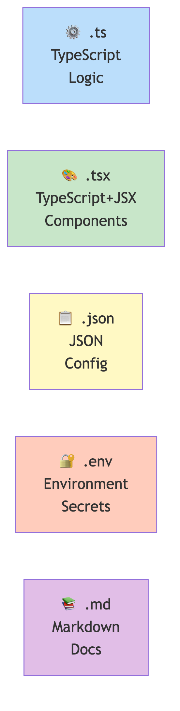
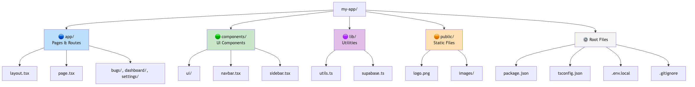
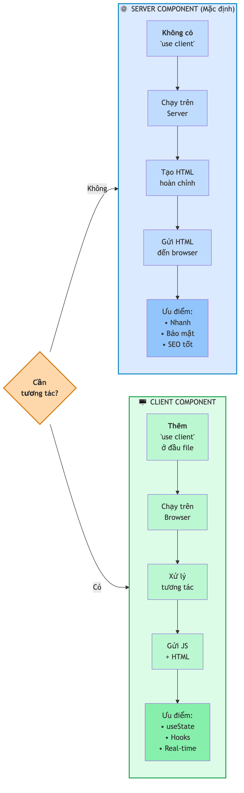

# Chương 10: Cấu trúc project và framework

Bạn nhờ AI dựng một ứng dụng nhỏ. Vài phút sau, nó sinh ra bốn mươi file nằm trong hơn chục thư mục. Bạn nhìn cây thư mục đó và không biết bắt đầu từ đâu: file nào là trang web thật, file nào chỉ là cấu hình, sửa file nào thì hỏng cái gì. Cảm giác giống như được đưa chìa khóa một tòa nhà lạ mà không có biển chỉ dẫn — phòng nào ra phòng nào, cầu thang ở đâu, đường dây điện chạy sau bức tường nào.

Chương này là tấm bản đồ đó. Đọc xong, bạn sẽ nhìn một project bất kỳ mà AI sinh ra và biết ngay: đây là các trang, đây là linh kiện dùng lại, đây là phần kết nối dữ liệu, còn đống file ở gốc chỉ là luật lệ mà bạn hiếm khi cần chạm tới. Bạn không cần nhớ từng file — bạn chỉ cần đọc được cấu trúc, đủ để không bao giờ bị lạc nữa.

Tin vui là cấu trúc này rất logic. Gần như mọi ứng dụng web mà AI dựng cho bạn hôm nay đều theo cùng một khuôn, vì AI gần như luôn chọn cùng một **framework** (bộ khung ứng dụng dựng sẵn). Hiểu cái khuôn đó một lần là hiểu được hầu hết mọi project bạn sẽ gặp.

## File và đường dẫn — hệ thống địa chỉ

Trước khi mở tòa nhà, cần nắm khái niệm nền nhất: máy tính tổ chức dữ liệu thành **folder** (thư mục) và **file** (tập tin), y hệt cách bạn xếp tài liệu trong tủ hồ sơ. Folder là ngăn kéo, file là tài liệu bên trong, và ngăn kéo có thể chứa ngăn nhỏ hơn.

Mỗi file có một **path** (đường dẫn) — địa chỉ chính xác để tìm ra nó. Đọc `app/dashboard/settings/page.tsx` từ trái sang phải, mỗi dấu `/` là một cấp thư mục sâu hơn: vào `app`, vào `dashboard`, vào `settings`, tới file `page.tsx`. Chỉ vậy thôi.

Phần đuôi tên file — **extension** — cho biết file chứa loại nội dung gì, giống đuôi `.docx` báo đây là tài liệu Word. Năm đuôi bạn sẽ gặp nhiều nhất:

| Đuôi | Nghĩa là gì | Khi nào bạn để ý |
|---|---|---|
| `.tsx` | Code **có giao diện** (trang, nút, form) | File bạn gặp nhiều nhất |
| `.ts` | Code **logic thuần**, không giao diện | Hàm xử lý, kết nối dữ liệu |
| `.json` | Dữ liệu có cấu trúc | File cấu hình |
| `.env` (`.env.local`) | **Secrets**: khóa API, mật khẩu database | Nhìn thấy là phải cảnh giác |
| `.md` | Tài liệu (Markdown) | `README.md` giải thích project |

> 🧪 **Dành cho Tester/QA:** Đường dẫn file gắn thẳng với URL của trang. Khi bạn test và thấy bug ở trang `/dashboard/settings`, bạn biết ngay file cần chỉ tới là `app/dashboard/settings/page.tsx`. Report "file `app/dashboard/settings/page.tsx` có vấn đề" thay vì "trang Settings bị lỗi" — developer sẽ khoanh vùng nhanh hơn nhiều.

## Cấu trúc project — bản đồ tòa nhà

Đây là phần quan trọng nhất chương. Khi AI dựng một project mới, cây thư mục thường trông như thế này:

```
my-app/
├── app/                    # Các trang của ứng dụng
│   ├── layout.tsx          # Khung chung (navbar, footer)
│   ├── page.tsx            # Trang chủ (/)
│   ├── dashboard/
│   │   └── page.tsx        # Trang /dashboard
│   └── settings/
│       └── page.tsx        # Trang /settings
├── components/             # Linh kiện giao diện dùng lại
│   ├── ui/                 # Component cơ bản từ thư viện
│   └── navbar.tsx
├── lib/                    # Hàm tiện ích, kết nối database
│   ├── utils.ts
│   └── db.ts
├── public/                 # File tĩnh (ảnh, icon)
├── package.json            # Danh sách thư viện + lệnh chạy
├── .env.local              # Biến môi trường (secrets)
└── .gitignore              # File Git bỏ qua
```

Đừng hoảng vì số lượng. Cả tòa nhà này bạn chỉ cần hiểu sâu bốn "tầng" chính. Phần còn lại là file cấu hình mà bạn gần như không bao giờ mở.



*HÌNH 10.1: Sơ đồ tổng thể cấu trúc project với màu phân biệt: app/ (trang), components/ (linh kiện), lib/ (kỹ thuật), public/ (tài nguyên), và nhóm file cấu hình ở gốc. Mỗi phần kèm một câu mô tả ngắn.*

**Thư mục `app/` — trung tâm điều hành.** Đây là nơi quan trọng nhất. Bên trong `app/`, mỗi file `page.tsx` là một trang web. Đây chính là nguyên tắc cốt lõi mà ta sẽ mổ kỹ ở mục sau: cấu trúc thư mục quyết định địa chỉ trang. File `layout.tsx` là "khung chung" bao quanh mọi trang — navbar trên cùng, footer dưới cùng giữ nguyên, chỉ phần giữa đổi theo trang. Khi bạn thấy navbar hiện ở mọi trang mà không hiểu vì sao, câu trả lời nằm ở `layout.tsx`.

**Thư mục `components/` — kho linh kiện.** Một nút bấm, một thẻ thông tin, một form nhập liệu xuất hiện ở nhiều nơi đều nằm đây. Hãy nghĩ về nó như một kho các khối dựng sẵn: thay vì xây lại từ đầu cho mỗi trang, bạn làm sẵn vài khối rồi lắp vào bất cứ đâu cần. Folder con `ui/` thường chứa các component cơ bản nhất, lấy từ một thư viện dùng chung (nói kỹ ở cuối chương).

**Thư mục `lib/` — phòng kỹ thuật sau tường.** Nếu `components/` là kho linh kiện nhìn thấy được, thì `lib/` là nơi xảy ra việc kết nối database và xử lý dữ liệu — những logic không dính tới giao diện. Bạn ít khi phải đọc, nhưng AI tạo và dùng nó thường xuyên.

**Thư mục `public/` — kho tài nguyên tĩnh.** Ảnh, icon, logo bỏ vào đây. Đơn giản nhất trong bốn thư mục: hình ảnh thì để `public/`.

Bốn thư mục này trả lời gần hết mọi câu hỏi "file này để làm gì". Khi mở một project lạ, hãy đọc theo đúng thứ tự đó: nhìn `app/` để biết ứng dụng có những trang nào, liếc `components/` để thấy các mảnh giao diện dùng lại, ghé `lib/` khi cần tìm chỗ nối database, và bỏ qua `public/` vì nó chỉ chứa ảnh. Bốn bước, và bạn đã có bản đồ.

> 📋 **Dành cho PM/BA:** Cây thư mục `app/` chính là sitemap của ứng dụng, đọc được mà không cần hỏi developer. Khi review một tính năng, bạn kiểm được ngay: trang này nằm ở đâu trong cấu trúc, URL sẽ là gì, layout nào áp dụng. Khi viết PRD, bạn cũng có thể mô tả cấu trúc trang cho rõ: "trang danh sách bug ở `/bugs`, chi tiết từng bug ở `/bugs/[id]`" — một câu như vậy tiết kiệm cả buổi trao đổi qua lại.

## File cấu hình — luật lệ của project

Ở gốc project có một loạt file cấu hình. Tin vui: bạn hiếm khi cần sửa, AI lo phần đó. Nhưng biết chúng làm gì thì đỡ bối rối.

| File | Vai trò | Bạn có cần sửa? |
|---|---|---|
| `package.json` | "Sổ tay" liệt kê thư viện project dùng + các lệnh chạy | Hiếm; AI thêm thư viện qua nó |
| `.env.local` | Chứa secrets: khóa API, URL database | Có — khi thêm dịch vụ mới |
| `.gitignore` | Báo Git file nào không theo dõi | Gần như không |
| Các file `config` khác | Cấu hình framework, TypeScript, styling | Gần như không |

File đáng chú ý nhất là `package.json`, vì nó là nơi duy nhất trong nhóm này bạn thực sự đọc được thông tin hữu ích: project dùng những thư viện gì, và gõ lệnh nào thì chạy được project. Còn `.env.local` thì đáng chú ý vì lý do ngược lại — nó nguy hiểm.

> ⚠️ **Cảnh báo:** Nếu mở `.env.local` và thấy những dòng như `DATABASE_URL=...` hay `API_KEY=...`, hãy hiểu đó là chìa khóa vào toàn bộ hệ thống của bạn. Tuyệt đối không copy-paste nội dung file này vào khung chat AI, email, hay ảnh chụp màn hình. Cách quản lý secrets đúng cách nằm ở Chương 12, còn lý do `.gitignore` phải loại `.env.local` ra khỏi Git nằm ở Chương 13.

## Định tuyến theo thư mục — từ folder đến URL

Đây là đặc điểm mạnh nhất của framework mặc định, và là thứ bạn gặp ở mọi project, nên đáng dành thêm vài phút.

Nguyên tắc gọn trong một câu: **mỗi folder trong `app/` là một đoạn của địa chỉ URL, và file `page.tsx` bên trong folder đó là nội dung trang.** Không có `page.tsx` thì không có trang — folder chỉ là cái hộp tổ chức.

```
app/
├── page.tsx              → /
├── about/
│   └── page.tsx          → /about
├── bugs/
│   ├── page.tsx          → /bugs
│   ├── new/
│   │   └── page.tsx      → /bugs/new
│   └── [id]/
│       └── page.tsx      → /bugs/123, /bugs/456
└── api/
    └── bugs/
        └── route.ts      → /api/bugs (điểm cuối dữ liệu)
```

Không cần cấu hình gì. Bạn tạo folder và file đúng tên, hệ thống tự tạo địa chỉ tương ứng — giống đặt biển "Phòng 301" thì khách tự biết lên tầng ba, phòng số một. Nhìn cây thư mục `app/` là nhìn thấy toàn bộ sơ đồ trang của ứng dụng.

Cũng vì cách này mà AI ít khi làm sai chỗ nào ra trang: khi bạn xin "thêm trang giới thiệu", nó biết chính xác phải tạo `app/about/page.tsx`, không phải đoán, không phải sửa một file cấu hình routing nào ở nơi khác. Đây là một lý do lớn khiến các công cụ vibe coding gần như đồng loạt chọn cùng bộ khung này — cấu trúc càng đoán trước được thì AI càng ít cơ hội tạo lỗi.

Có hai ký hiệu đặc biệt đáng nhận mặt. **Folder tên `[id]`** đặt trong ngoặc vuông là **dynamic route** (đường dẫn động): thay vì tạo folder riêng cho từng bug, bạn chỉ cần một `[id]` và mọi địa chỉ `/bugs/123`, `/bugs/456` đều dùng chung file `page.tsx` bên trong, chỉ khác giá trị được truyền vào. **File tên `route.ts`** (không phải `page.tsx`) là một điểm cuối dữ liệu ở phía sau — ta quay lại nó ở mục API bên dưới.



*HÌNH 10.2: Sơ đồ đối chiếu hai cột — bên trái là cây thư mục app/ với các folder và page.tsx, bên phải là các URL tương ứng, đường kẻ nối từ file sang URL. Highlight folder `[id]` với ví dụ /bugs/123. Sơ đồ giản lược có nhãn.*

> 🧪 **Dành cho Tester/QA:** Dynamic route `[id]` là nơi bug hay ẩn nấp — hãy hỏi ngay: chuyện gì xảy ra khi id không tồn tại? Khi id là chữ thay vì số? Khi id chứa ký tự lạ? Và khi AI tạo trang mới, kiểm tra file có nằm đúng folder không: một `page.tsx` đặt sai chỗ sẽ tạo ra URL sai — loại bug khó thấy nếu chỉ nhìn giao diện.

## Server Components và Client Components

Phần này hơi rối một chút, nhưng đáng hiểu vì nó giải thích một dòng chữ lạ mà bạn sẽ thấy ở đầu nhiều file, và là một ổ lỗi thường gặp khi làm việc với AI.

Trong framework này, một component có thể chạy ở hai nơi. **Server Component** dựng sẵn nội dung ở phía máy chủ rồi gửi trang hoàn chỉnh xuống trình duyệt — như một tấm áp phích in sẵn, đẹp và nhanh, nhưng dán lên tường rồi thì không bấm vào đâu được. **Client Component** chạy ngay trong trình duyệt và tương tác được với người dùng — như một màn hình cảm ứng, bạn chạm vào là nó phản hồi.

Mặc định, mọi component đều là Server Component. Nó nhanh hơn, an toàn hơn (code không lộ xuống trình duyệt), và tốt cho việc máy tìm kiếm đọc nội dung. Chỉ khi cần tương tác — bấm nút, gõ vào form, ẩn/hiện menu — component mới cần thành Client Component, và cách báo điều đó là thêm dòng `"use client"` ở ngay đầu file:

```tsx
"use client" // Dòng này biến file thành Client Component

import { useState } from "react"

export default function ThanhTimKiem() {
  const [tuKhoa, setTuKhoa] = useState("")
  return (
    <input
      value={tuKhoa}
      onChange={(e) => setTuKhoa(e.target.value)}
      placeholder="Tìm kiếm..."
    />
  )
}
```

Dòng `"use client"` ở đầu file nói: "File này cần chạy trên trình duyệt vì nó có tương tác." Bên trong, `useState` theo dõi những gì người dùng gõ — đúng khái niệm state bạn đã gặp ở Chương 9. Quy tắc dễ nhớ: **cần tương tác thì `"use client"`; chỉ hiển thị dữ liệu tĩnh thì để mặc định.**

Trong thực tế, phần lớn một ứng dụng là Server Component — theo quan sát thực hành, đại đa số code thuộc loại mặc định này, chỉ những mảnh cần bấm hay nhập mới là Client Component. Con số đó cũng là một cái thước để bạn soi: nếu mở một project mà thấy `"use client"` xuất hiện ở gần như mọi file, khả năng cao ai đó (hoặc AI) đã lạm dụng nó, và ứng dụng đang trả giá bằng tốc độ.

> ⚠️ **Cảnh báo:** Một lỗi rất phổ biến — của người mới lẫn của AI — là rắc `"use client"` lên mọi file "cho chắc". Đừng. Làm vậy là vứt hết lợi thế của Server Component: tốc độ, bảo mật, khả năng được máy tìm kiếm đọc. Chỉ dùng khi thật sự cần tương tác. Khi đọc code AI sinh ra mà thấy `"use client"` ở một trang chỉ hiển thị danh sách tĩnh, đó là dấu hiệu để bạn hỏi lại. Cách lần theo loại lỗi này khi trang chạy sai nằm ở Chương 14.



*HÌNH 10.3: Bảng so sánh hai cột — Server Component (biểu tượng máy chủ; "Mặc định"; "Hiển thị dữ liệu"; "Nhanh, bảo mật, dễ tìm kiếm") và Client Component (biểu tượng trình duyệt; "Cần 'use client'"; "Tương tác người dùng"; "Nút bấm, form, hiệu ứng").*

## Layout — khung chung cho nhiều trang

Navbar trên cùng, footer dưới cùng, đôi khi một sidebar bên trái xuất hiện ở mọi trang. Nếu phải chép chúng vào từng file thì vừa lặp vừa khó sửa. File `layout.tsx` giải quyết việc này: nó là cái khung tranh, giữ cố định phần viền còn bức tranh bên trong đổi theo trang. Nội dung trang hiện tại được "nhét" vào giữa khung qua một chỗ trống đặt tên `children`.

Bạn cũng có thể có layout lồng nhau: khu `/dashboard` có layout riêng thêm sidebar, nằm bên trong layout gốc. Khi vào `/dashboard/settings`, cả hai khung cùng áp dụng — khung ngoài cho navbar/footer, khung trong cho sidebar. Đây là cách các ứng dụng lớn tổ chức giao diện mà không lặp code.

Điều đáng nhớ cho việc đọc code là: khi một trang trông "thiếu" navbar hay sidebar dù bạn không đụng gì tới nó, đừng đi tìm trong file `page.tsx` của trang đó — thủ phạm gần như luôn nằm ở một file `layout.tsx` nào đó bao bên ngoài. Ngược lại, muốn đổi một thứ xuất hiện ở mọi trang (ví dụ thêm một dòng thông báo trên cùng), bạn sửa `layout.tsx` một lần thay vì sửa từng trang.

## API Routes — phần xử lý phía sau

Từ đầu chương tới giờ ta nói về "mặt tiền" — thứ người dùng nhìn thấy. Nhưng mọi ứng dụng đều cần một "phía sau": nơi nhận dữ liệu từ form, truy vấn database, kiểm tra quyền. File `route.ts` trong thư mục `app/api/` chính là chỗ đó. Mỗi file như vậy là một điểm cuối dữ liệu, và điểm mạnh là nó nằm ngay trong cùng project với giao diện — bạn không phải dựng và triển khai một máy chủ riêng.

Bốn thao tác mà một điểm cuối xử lý — lấy, tạo, sửa, xóa — chính là bốn thao tác CRUD bạn đã gặp ở Chương 7 khi học về API. Còn việc điểm cuối này nói chuyện với database ra sao là nội dung trọn vẹn của Chương 11.

Với bạn, điều cần nắm không phải là viết được một điểm cuối, mà là nhận ra nó khi thấy. Khi AI báo "đã tạo endpoint cho bugs", bạn biết đi tìm file `app/api/bugs/route.ts`; khi một form gửi dữ liệu đi mà không lưu được, bạn biết chỗ để soi là file `route.ts` tương ứng chứ không phải trang hiển thị. Biết dữ liệu chảy vào đâu là đã đủ để đặt câu hỏi đúng.

> 🧪 **Dành cho Tester/QA:** Điểm cuối dữ liệu là nơi tuyệt vời để khoanh vùng lỗi. Khi dữ liệu hiển thị sai, hãy kiểm điểm cuối trước: nếu nó trả về đúng mà giao diện hiện sai, lỗi ở mặt tiền; nếu nó trả về sai, lỗi ở phía sau (file `route.ts`). Phân biệt được hai phía giúp bạn report chính xác và tiết kiệm thời gian cho cả team.

## Phần còn lại của bộ khung

Ngoài framework chính, AI thường kéo theo vài mảnh nữa. Bạn không cần thành thạo, chỉ cần biết chúng để làm gì khi thấy tên trong project.

**Công cụ styling.** Giao diện AI dựng thường được trang trí bằng một công cụ styling viết trực tiếp trong class — bạn đã học cách đọc nó ở Chương 8. Nó có một file config riêng ở gốc project, nhưng bạn gần như chỉ cần mở khi muốn đổi bảng màu hay font chung của cả app; còn lại cứ để nguyên.

**Thư viện component.** Đây là một bộ các linh kiện giao diện làm sẵn — nút, hộp thoại, bảng, lịch — mà AI rất thích dùng vì chúng đẹp, nhất quán, và có thể chỉnh. Chúng thường nằm trong `components/ui/`. Biết vậy là đủ: khi thấy folder `ui/` đầy file bạn không viết, đừng lo, đó là linh kiện dựng sẵn.

**Năm lệnh terminal bạn sẽ gặp.** Terminal chỉ là ô gõ lệnh bằng chữ thay cho bấm chuột. Bạn không cần thuộc lòng, chỉ cần nhận ra năm lệnh này khi AI hoặc hướng dẫn bảo bạn gõ:

| Lệnh | Làm gì |
|---|---|
| `cd <tên-folder>` | Đi vào một thư mục |
| `npm install` | Tải về các thư viện project cần |
| `npm run dev` | Chạy thử app trên máy bạn để xem |
| `npm run build` | Đóng gói app thành bản hoàn chỉnh |
| `Ctrl + C` | Dừng app đang chạy trong terminal |

> 🧰 **Đề xuất công cụ:** *Tính đến 2026-07.* Framework mặc định trong hầu hết công cụ vibe coding là **Next.js**, xây trên thư viện **React**. Đi kèm thường là **Tailwind CSS** (styling trong class), **shadcn/ui** (thư viện component), và một dịch vụ backend như **Supabase**. Vì sao AI hay chọn đúng bộ này thì đơn giản: nó là bộ có nhiều code mẫu công khai nhất, nên AI "quen tay" nhất. Phiên bản và tính năng đổi liên tục — kiểm tra trang chủ trước khi dựa vào một chi tiết cụ thể. Xem thêm trang [Đề xuất công cụ](../de-xuat-cong-cu.md).

## Khi AI tạo file mới — checklist ba bước

Tình huống bạn gặp gần như mỗi ngày: bạn xin một tính năng, AI sinh ra một loạt file. Thay vì hoảng, kiểm ba điều.

**Một, file đặt đúng chỗ chưa?** Component mới phải ở `components/`, trang mới ở `app/` đúng vị trí folder, hàm tiện ích ở `lib/`. Nếu AI đặt một file form thẳng vào `app/`, đó thường là dấu hiệu sai chỗ — nó nên nằm trong `components/` rồi được gọi vào trang.

**Hai, đúng đuôi file chưa?** Trang và component có giao diện là `.tsx`; logic thuần là `.ts`.

**Ba, địa chỉ URL có hợp lý không?** Nếu AI tạo trang "hồ sơ người dùng" ở `app/user/profile/page.tsx`, URL sẽ là `/user/profile` — bạn có muốn vậy, hay thực ra chỉ cần `/profile`?

> 💡 **Mẹo:** Tập thói quen liếc cây thư mục mỗi lần AI tạo file mới. Chỉ mất năm giây, nhưng chặn được rất nhiều lỗi "đặt sai chỗ" mà về sau rất khó tìm. Đây cũng đúng tinh thần quy trình năm giai đoạn ở Chương 3: kiểm ngay tại mỗi bước, đừng để dồn.

## Tóm tắt

- AI gần như luôn dựng app trên cùng một framework, nên hiểu một cấu trúc là hiểu hầu hết mọi project.
- `app/` chứa các trang; `components/` chứa linh kiện dùng lại; `lib/` chứa logic và kết nối; `public/` chứa file tĩnh. Chỉ cần hiểu sâu bốn thư mục này.
- Định tuyến theo thư mục: mỗi folder trong `app/` là một đoạn URL, `page.tsx` là nội dung trang. Folder `[id]` là đường dẫn động; file `route.ts` là điểm cuối dữ liệu phía sau.
- Server Component (mặc định) nhanh và an toàn; Client Component cần `"use client"`, chỉ dùng khi cần tương tác. Rắc `"use client"` khắp nơi là lỗi thường gặp.
- `layout.tsx` là khung chung cho nhiều trang; API Routes cho phép phần xử lý phía sau sống chung project với giao diện.
- `.env.local` chứa secrets — không đẩy lên Git, không dán vào chat (Chương 12, 13).
- Khi AI tạo file mới, kiểm ba điều: đúng chỗ, đúng đuôi, đúng URL.

## Bài tập

**BT 10.1 — Đọc bản đồ một project có sẵn**

Cho cây thư mục của một app quản lý bug:

```
bug-tracker/
├── app/
│   ├── layout.tsx
│   ├── page.tsx
│   ├── bugs/
│   │   ├── page.tsx
│   │   ├── new/
│   │   │   └── page.tsx
│   │   └── [id]/
│   │       └── page.tsx
│   ├── dashboard/
│   │   └── page.tsx
│   └── api/
│       └── bugs/
│           └── route.ts
├── components/
│   ├── ui/
│   ├── bug-card.tsx
│   └── bug-form.tsx
├── lib/
│   └── db.ts
├── public/
│   └── logo.png
├── package.json
└── .env.local
```

Trả lời, không cần chạy code: (1) Trang chủ nằm ở file nào, URL gì? (2) Muốn xem chi tiết bug số 42, URL là gì và file nào xử lý? (3) Vì sao `bug-card.tsx` nằm trong `components/` chứ không phải `app/`? (4) File nào chứa thông tin nhạy cảm nhất, và vì sao nó không được đẩy lên Git? (5) Muốn thêm trang `/bugs/42/comments`, bạn cần tạo folder và file nào?

*Đầu ra:* năm câu trả lời ngắn, mỗi câu kèm một dòng giải thích áp dụng đúng nguyên tắc "folder là đoạn URL, `page.tsx` là nội dung trang".

**BT 10.2 — Soi Server và Client trong code AI sinh ra**

Nhờ một công cụ vibe coding dựng một trang có phần tĩnh (danh sách hiển thị) và phần tương tác (ô tìm kiếm hoặc bộ lọc). Sau khi có code, mở các file trong `app/` và `components/` ra: file nào có dòng `"use client"` ở đầu, file nào không? Với mỗi file, tự hỏi lựa chọn đó có hợp lý không — phần chỉ hiển thị mà lại là Client Component thì đánh dấu lại.

*Đầu ra:* một bảng ngắn liệt kê các file, cột "có `use client` không" và cột "hợp lý chưa — vì sao". Nếu tìm được một chỗ đáng lẽ là Server Component, hãy viết một câu prompt để nhờ AI sửa lại.

## Tiếp theo

Bạn vừa đọc được bản đồ của một project và biết phần xử lý phía sau sống ở đâu — trong các file `route.ts`. Nhưng những file đó nói chuyện với **database** ra sao, và làm thế nào để dữ liệu không bị sai hay bị lộ? Chương 11 — *Database bằng tư duy spreadsheet* — trả lời chính câu đó: database thật ra chỉ là bảng tính có kỷ luật, và cái kỷ luật đó là thứ giữ cho dữ liệu của bạn vừa đúng vừa an toàn.
