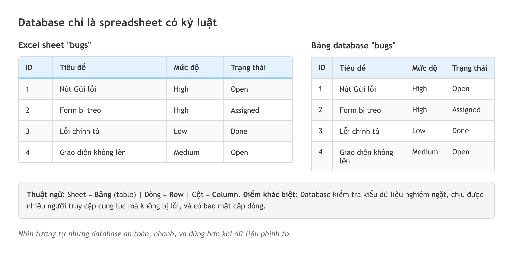
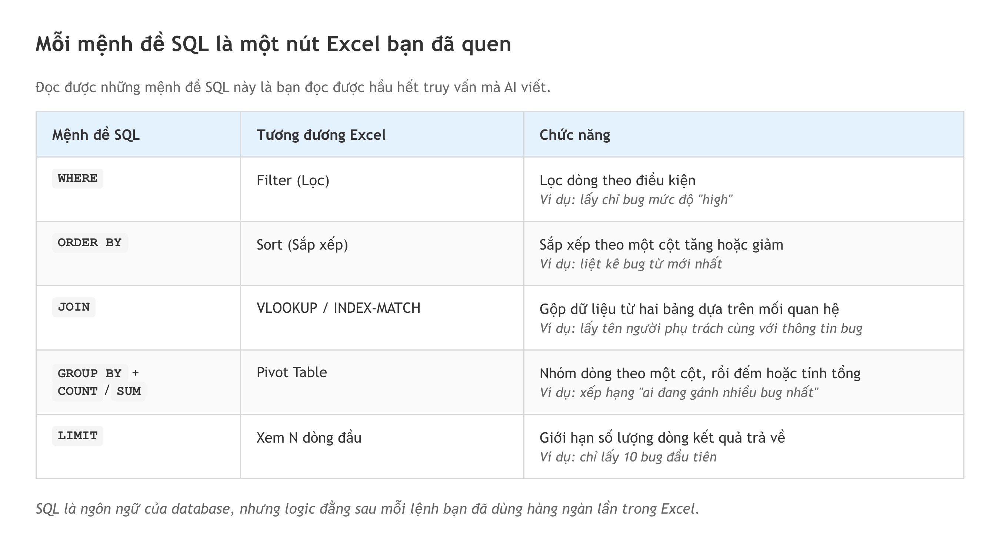
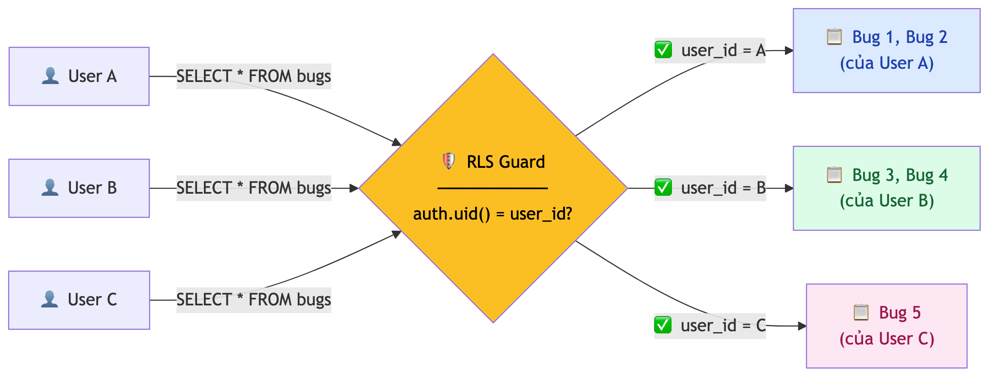

# Chương 11: Database bằng tư duy spreadsheet

Bạn đã sống bằng Excel nhiều năm. Một file theo dõi bug, một file danh sách task, một file quản lý khách hàng — mỗi sheet là một bảng, mỗi dòng là một bản ghi, mỗi cột là một trường thông tin. Bạn lọc, sắp xếp, tìm kiếm mà không cần nghĩ. Vậy nên tin vui là: **database** (cơ sở dữ liệu) hoạt động gần như y hệt. Nó chỉ là một cái Excel có kỷ luật — và chính cái kỷ luật đó là thứ giữ cho dữ liệu của bạn không bị sai, không bị mất, và không bị người ngoài đọc trộm.

Chương này đi từ khái niệm quen nhất (bảng, dòng, cột) tới vài thứ hay hơn (bảng liên kết với nhau, tăng tốc tìm kiếm), rồi khép lại bằng phần quan trọng nhất về mặt an toàn: cách một database chỉ cho đúng người xem đúng dữ liệu. Mục tiêu không phải biến bạn thành người viết database, mà là để bạn **đọc hiểu** cấu trúc dữ liệu AI dựng ra, đặt đúng câu hỏi khi review, và nhận ra ngay một lỗi có thể khiến toàn bộ dữ liệu khách hàng phơi ra ngoài.

## Database là spreadsheet nâng cao

Bắt đầu từ điều đơn giản nhất: database là một bộ sưu tập spreadsheet, nhưng mạnh hơn. Mỗi **bảng** (table) tương đương một sheet Excel. Mỗi **dòng** (row) là một bản ghi — một bug, một người dùng, một đơn hàng. Mỗi **cột** (column) là một trường — tên, email, trạng thái, ngày tạo.

Giả sử bạn quản lý bug bằng Excel với sheet "bugs" gồm các cột ID, Tiêu đề, Mức độ, Trạng thái, Người phụ trách, Ngày tạo. Mỗi dòng là một bug cụ thể. Đó chính xác là cách một bảng trong database hoạt động — chỉ khác một điều: database chứa hàng triệu dòng vẫn nhẹ tênh, trong khi Excel bắt đầu ì ạch ở vài chục ngàn dòng.



*HÌNH 11.1: So sánh trực quan Excel và bảng database. Bên trái là một sheet Excel "bugs" với các cột ID, Tiêu đề, Mức độ, Trạng thái. Bên phải là cùng dữ liệu hiển thị trong trình xem bảng của một dịch vụ database. Chú thích: Bảng = Sheet, Dòng = Row, Cột = Column.*

Khác biệt thật sự nằm ở "kỷ luật". Thứ nhất, database có **kiểu dữ liệu nghiêm ngặt**. Trong Excel, bạn gõ "abc" vào cột "Tuổi" thì Excel vẫn nhận. Trong database, nếu cột tuổi được định nghĩa là kiểu số, nó từ chối mọi giá trị không phải số. Nghe phiền, nhưng đây chính là điều tốt — nó chặn dữ liệu rác ngay từ cửa, đúng kiểu validation mà Tester vẫn làm khi kiểm một form.

Thứ hai, database xử lý được **nhiều người truy cập cùng lúc** mà dữ liệu vẫn nhất quán. Ai từng chia sẻ một file Excel cho cả team rồi va vào cảnh hai người sửa cùng một ô đều hiểu nỗi đau đó. Database được thiết kế từ gốc để hàng ngàn người đọc và ghi đồng thời mà không loạn.

> 🧪 **Dành cho Tester/QA:** Mỗi lần test một tính năng, bạn đang thử cho dữ liệu đi qua hệ thống: "nhập tên rỗng thì sao?", "nhập số âm thì sao?". Database làm đúng việc đó ở tầng dưới cùng — nếu cột `email` được đặt là bắt buộc, database từ chối mọi dòng thiếu email. Hiểu điều này giúp bạn viết test case sắc hơn: luôn có hai tầng kiểm tra dữ liệu — tầng giao diện và tầng database — và tầng database là tầng không thể lách qua.

## Primary Key và Foreign Key — thẻ căn cước và mối nối

Mỗi bản ghi cần một "căn cước" — một giá trị duy nhất phân biệt nó với mọi bản ghi khác. Giá trị đó gọi là **primary key** (khóa chính), thường là một cột `id` tự tăng (1, 2, 3…) hoặc một chuỗi ký tự duy nhất. Vì sao cần? Tưởng tượng bảng người dùng có hai người cùng tên "Nguyễn Văn A". Không có id, làm sao phân biệt dòng nào là ai? Khóa chính giải quyết đúng chuyện đó — mỗi người một id, không bao giờ trùng.

Thú vị hơn là khi các bảng liên kết nhau. Trong Excel, ở sheet "bugs" bạn gõ thẳng tên người vào cột "Người phụ trách". Nhưng người đó đổi tên thì sao? Bạn phải sửa tay từng dòng. Trong database, thay vì gõ tên, bạn lưu **id** của người đó. Cột chứa id trỏ sang bảng khác gọi là **foreign key** (khóa ngoại).

```sql
-- Bảng users: mỗi người một id duy nhất
CREATE TABLE users (
  id UUID PRIMARY KEY DEFAULT gen_random_uuid(),
  name TEXT NOT NULL,
  email TEXT UNIQUE NOT NULL
);

-- Bảng bugs: cột assigned_to là foreign key trỏ về users
CREATE TABLE bugs (
  id UUID PRIMARY KEY DEFAULT gen_random_uuid(),
  title TEXT NOT NULL,
  severity TEXT DEFAULT 'medium',
  status TEXT DEFAULT 'open',
  assigned_to UUID REFERENCES users(id),
  created_at TIMESTAMPTZ DEFAULT now()
);
```

Hai cột `status` và `created_at` có `DEFAULT` nên khi thêm dòng mới database tự điền, còn `id` tự sinh nhờ `gen_random_uuid()` — vì thế các câu lệnh bên dưới không cần truyền chúng vào. (Giá trị id kiểu `'abc-123'` trong các ví dụ sau là viết tắt cho dễ đọc; id thật là một chuỗi UUID dài.)

Đoạn trên tạo hai bảng. Cột `assigned_to` của `bugs` trỏ về `users(id)`, nghĩa là mỗi bug gán cho một người, và database bảo đảm giá trị trong `assigned_to` phải là một id có thật trong bảng `users`. Cố gán cho một người không tồn tại, database báo lỗi ngay — điều Excel không bao giờ làm được.

> 📋 **Dành cho PM/BA:** Khi bạn viết PRD (Chương 5), phần "cấu trúc dữ liệu" chính là lúc bạn suy nghĩ về khóa chính và khóa ngoại. Câu "mỗi dự án có nhiều task" dịch thẳng thành: bảng `tasks` cần một khóa ngoại `project_id` trỏ về bảng `projects`. Nghĩ theo cách này giúp bạn nói chuyện với AI hoặc developer bằng ngôn ngữ chính xác, thay vì mô tả mơ hồ "các dữ liệu liên kết với nhau".

## Các bảng liên kết với nhau ra sao

Dữ liệu thật không bao giờ đứng một mình. Người dùng tạo bug, bug thuộc một dự án, dự án có nhiều thành viên. Những mối nối đó gọi là **quan hệ**, và có hai dạng hay gặp nhất.

**Một–nhiều (one-to-many)** là dạng phổ biến nhất: một người tạo nhiều bug, nhưng mỗi bug chỉ thuộc một người; một dự án có nhiều task, mỗi task chỉ thuộc một dự án. "Một cái này, nhiều cái kia." Trong database, bạn tạo quan hệ này bằng cách đặt khóa ngoại ở phía "nhiều" — bảng `bugs` chứa cột trỏ về `users`, vì có nhiều bug nhưng mỗi bug một người phụ trách.

**Nhiều–nhiều (many-to-many)** phức tạp hơn chút: một người thuộc nhiều nhóm, một nhóm có nhiều người. Không thể đặt khóa ngoại ở cả hai phía, nên giải pháp là tạo một **bảng trung gian** chỉ chứa hai khóa ngoại, mỗi cái trỏ về một bảng chính. Một dòng `(user_id: abc, team_id: xyz)` nghĩa là "người abc thuộc nhóm xyz". Khi đọc code AI sinh ra, bạn sẽ thường thấy khuôn này: hai bảng chính cộng một bảng trung gian tên kiểu `team_members`. Nhận ra khuôn đó là hiểu ngay cấu trúc dữ liệu mà không cần đọc từng dòng.

Vì sao phải nhọc công tách bảng thay vì nhét mọi thứ vào một chỗ như một sheet Excel khổng lồ? Vì tách bảng là cách database giữ dữ liệu không mâu thuẫn. Khi tên một người đổi, bạn sửa đúng một dòng trong bảng `users`, và mọi bug gán cho người đó tự động "thấy" tên mới, vì chúng chỉ lưu id chứ không lưu tên. Trong Excel, cùng cái tên bị chép ở hàng trăm dòng, sửa sót một chỗ là dữ liệu lệch nhau ngay. Đây chính là "kỷ luật" mà đầu chương nhắc tới: cấu trúc buộc dữ liệu phải nhất quán, thay vì trông chờ vào việc con người nhớ sửa hết.

## CRUD — bốn thao tác cơ bản

Mọi ứng dụng trên đời đều xoay quanh bốn thao tác gọi tắt là **CRUD**: **C**reate (tạo), **R**ead (đọc), **U**pdate (sửa), **D**elete (xóa). Bạn đã gặp bốn thao tác này ở Chương 7 khi học API — giờ xem SQL làm điều tương tự.

**Tạo** dùng `INSERT` — thêm một dòng mới, tương đương gõ vào dòng trống cuối trong Excel:

```sql
INSERT INTO bugs (title, severity, assigned_to)
VALUES ('Nút Gửi không hoạt động', 'high', 'abc-123');
```

**Đọc** dùng `SELECT` — thao tác bạn dùng nhiều nhất, tương đương Filter trong Excel:

```sql
SELECT title, severity FROM bugs
WHERE severity = 'high'
ORDER BY created_at DESC;
```

Câu này nói: "lấy cột title và severity từ bảng bugs, chỉ những dòng mức độ 'high', sắp theo ngày tạo mới nhất trước." Đúng như bạn chọn cột, lọc theo mức độ, rồi sort trong Excel.

**Sửa** dùng `UPDATE` và **xóa** dùng `DELETE`. Ở hai lệnh này có một điều sống còn:

```sql
UPDATE bugs SET status = 'done' WHERE id = 'abc-123';
DELETE FROM bugs WHERE id = 'abc-123';
```

> ⚠️ **Cảnh báo:** Luôn có mệnh đề `WHERE` khi `UPDATE` và `DELETE`. Quên `WHERE`, câu `UPDATE bugs SET status = 'done'` sẽ đổi trạng thái **toàn bộ** bug trong bảng, và `DELETE FROM bugs` sẽ xóa sạch cả bảng — không có Ctrl+Z trong database. Ngoài ra, nhiều ứng dụng thực tế không xóa thật mà chỉ đánh dấu "đã xóa" bằng một cột thời gian, để còn phục hồi và truy vết được. Khi review code AI sinh ra, hãy kiểm nó đang xóa thật hay chỉ đánh dấu.

## Các mệnh đề SQL — công cụ lọc và gộp

Ngoài `WHERE` và `ORDER BY`, có vài mệnh đề đáng nhận mặt. Hãy nghĩ chúng như các nút trên thanh Filter của Excel — đây là phần giá trị nhất chương, vì nó cho bạn đọc được gần như mọi truy vấn AI viết.

| SQL | Tương đương trong Excel | Làm gì |
|---|---|---|
| `WHERE` | Filter | Lọc theo điều kiện |
| `ORDER BY` | Sort | Sắp xếp |
| `JOIN` | VLOOKUP / INDEX-MATCH | Gộp dữ liệu từ nhiều bảng |
| `GROUP BY` + `COUNT`/`SUM` | Pivot Table | Đếm, tính tổng theo nhóm |
| `LIMIT` | Chỉ xem N dòng đầu | Giới hạn số dòng trả về |

Đáng chú ý nhất là **`JOIN`** — thứ Excel làm rất tệ: lấy dữ liệu từ nhiều sheet cùng lúc. Trong SQL, `JOIN` gộp dữ liệu từ nhiều bảng dựa trên mối quan hệ giữa chúng:

```sql
SELECT bugs.title, users.name
FROM bugs
JOIN users ON bugs.assigned_to = users.id
WHERE bugs.severity = 'high';
```

Câu này nói: "lấy tiêu đề bug và tên người phụ trách, nối hai bảng ở chỗ `assigned_to = id`." Kết quả là một bảng ảo chứa thông tin từ cả hai — đúng thứ mà trong Excel bạn phải vật lộn với VLOOKUP. Còn **`GROUP BY`** là Pivot Table của SQL: nhóm các bug theo mức độ rồi đếm, ra kết quả kiểu "high: 15, medium: 23, low: 8".



*HÌNH 11.2: Bảng đối chiếu các mệnh đề SQL và tương đương Excel — SQL (WHERE, JOIN, GROUP BY, ORDER BY, LIMIT) ở cột trái, Excel (Filter, VLOOKUP, Pivot Table, Sort, xem N dòng đầu) ở cột phải, mỗi cặp một dòng mô tả ngắn.*

## Index — mục lục cho database

Tưởng tượng một cuốn sách 500 trang và bạn cần tìm một từ. Không có mục lục, bạn lật từng trang; có mục lục, bạn tra thẳng tới số trang. **Index** trong database làm đúng vậy: tạo index trên một cột thì database dựng sẵn một "mục lục" giúp tìm trên cột đó nhanh hơn hẳn, thay vì quét từng dòng.

Một lưu ý đủ để bạn dùng: index tăng tốc đọc nhưng làm chậm ghi, vì mỗi lần thêm hay sửa dữ liệu database phải cập nhật cả mục lục. Nên đừng tạo index cho mọi cột — chỉ cho những cột bạn thường lọc hoặc nối theo (những cột hay xuất hiện trong `WHERE` và `JOIN`). Như một cuốn sách không cần mục lục cho mọi từ, chỉ cho những từ đáng tra.

Với bạn, đây không phải việc phải tự làm mà là việc cần biết để đặt câu hỏi: khi một trang tải danh sách chậm dần lúc dữ liệu phình to, một trong những câu đầu tiên đáng hỏi AI là "cột đang lọc theo đã có index chưa?". Thường chỉ cần thêm một index đúng cột là trang nhanh trở lại — một sửa đổi nhỏ nhưng hiệu quả rõ rệt.

## Backend dùng sẵn — thuê cả đội mà không phỏng vấn ai

Cho tới giờ ta nói về bản thân database. Nhưng một ứng dụng thật cần nhiều hơn: nơi lưu trữ, xử lý đăng nhập, lưu file, cập nhật tức thì. Trước đây bạn phải tự dựng và tự viết code cho từng thứ, mất hàng tuần. Ngày nay có một loại dịch vụ gộp sẵn tất cả vào một nền tảng, gọi là **backend dùng sẵn** (Backend-as-a-Service, viết tắt BaaS) — bạn có ngay cả một "đội backend" mà không cần tuyển ai, chỉ tập trung vào ứng dụng của mình.

Điều bạn cần nắm là loại dịch vụ này thường gộp: một database quan hệ (dùng SQL — thứ bạn vừa học, tồn tại hơn 50 năm nên không lỗi thời), phần xử lý đăng nhập, kho lưu file, và khả năng cập nhật dữ liệu tức thì giữa nhiều người dùng. Một điểm mạnh nữa cho vibe coder: vì loại dịch vụ này phổ biến, AI "quen tay" với nó — bạn bảo "kết nối app với backend" là nó hiểu cần làm gì.

> 🧰 **Đề xuất công cụ:** *Tính đến 2026-07.* Dịch vụ backend dùng sẵn phổ biến nhất trong hệ sinh thái vibe coding là **Supabase** (chạy trên database **PostgreSQL**), và một lựa chọn khác là **Firebase** của Google. Khác biệt cốt lõi để chọn: Supabase dùng database quan hệ (bảng/cột/dòng như Excel) và mã nguồn mở nên dữ liệu luôn thuộc về bạn; Firebase dùng database dạng tài liệu, mạnh hơn cho app mobile cần chạy offline. Nếu bạn xây web app, dashboard, SaaS thì database quan hệ hợp hơn. Về sau khi project phức tạp, bạn có thể gặp thêm các **ORM** như **Prisma** hay **Drizzle** — công cụ giúp viết truy vấn bằng TypeScript thay cho SQL. Tính năng và giá đổi liên tục — kiểm tra trang chủ trước khi chọn. Xem thêm trang [Đề xuất công cụ](../de-xuat-cong-cu.md).

Một tiện lợi lớn của loại dịch vụ này: khi bạn tạo một bảng, nó **tự sinh sẵn API** cho bảng đó — tự động có các thao tác đọc/tạo/sửa/xóa mà bạn không phải viết một dòng code phía sau nào. Ở Chương 10 bạn thấy các file `route.ts` là nơi xử lý phía sau; với backend dùng sẵn, bạn không cần tự viết chúng cho các thao tác CRUD thông thường nữa — chỉ gọi thẳng tới bảng. Việc kết nối vào project cũng chỉ là dán hai giá trị (địa chỉ backend và một khóa truy cập) vào file cấu hình — nhưng khóa đó là secret, và cách cất giữ nó đúng cách nằm ở Chương 12.

## Row Level Security — người gác cổng ở tầng dữ liệu

Đây là phần đáng đầu tư thời gian nhất chương, vì bỏ qua nó là nguyên nhân số một khiến các app vibe-coded lộ dữ liệu người dùng ra ngoài. Nghe có vẻ nặng, nhưng ý tưởng thì đơn giản.

Mặc định, khi một backend tự sinh API cho bảng của bạn, bất kỳ ai có khóa truy cập (khóa này nằm ngay trong trình duyệt, không phải bí mật) đều có thể hỏi "cho tôi xem toàn bộ bảng users" — và nếu bạn không làm gì, nó sẽ đưa. Đó là lý do rất nhiều ứng dụng non-dev dựng vội bị rò cả bảng email, thậm chí mật khẩu, chỉ vì chưa ai bật lớp bảo vệ.

Lớp bảo vệ đó là **Row Level Security** (RLS — bảo mật cấp dòng). Hãy nghĩ về nó như người bảo vệ ở cổng chung cư: không phải ai cũng vào được, chỉ cư dân có thẻ mới vào được khu nhà của chính mình. RLS kiểm tra mọi truy vấn và chỉ trả về những dòng mà người hỏi được phép thấy — bất kể họ hỏi từ giao diện app, từ API, hay từ bất cứ đâu.

Cách hoạt động gồm hai nhịp. Khi bạn **bật RLS** cho một bảng, mặc định bảng bị khóa cứng — không ai đọc hay ghi được gì. Sau đó bạn tạo các **policy** (chính sách) để mở đúng những quyền cần thiết:

```sql
-- Bật khóa: từ đây bảng tasks từ chối mọi truy cập
ALTER TABLE tasks ENABLE ROW LEVEL SECURITY;

-- Mở đúng một quyền: người dùng chỉ đọc được task của chính mình
CREATE POLICY "Đọc task của mình"
ON tasks FOR SELECT
USING (user_id = auth.uid());
```

Đoạn đầu bật khóa. Đoạn sau nói: "với thao tác đọc, chỉ cho phép khi `user_id` của dòng bằng id của người đang đăng nhập." Hàm `auth.uid()` tự trả về id người dùng hiện tại. Kết quả: người A hỏi "cho tôi tất cả task", họ chỉ nhận được task của A — backend tự động lén thêm điều kiện lọc theo danh tính vào mọi truy vấn, đúng như người bảo vệ tự kiểm thẻ trước khi mở cửa.

> 🔒 **Bảo mật:** RLS là tuyến phòng thủ cuối cùng của dữ liệu, và khác hẳn việc kiểm tra quyền ở giao diện — thứ có thể bị lách qua bằng công cụ trong trình duyệt. RLS chạy ở tầng database nên không có đường vòng nào từ phía người dùng. Ba điều phải nhớ: luôn dựa vào danh tính do hệ thống xác thực trả về (`auth.uid()`), không bao giờ tin id do phía trình duyệt gửi lên; một bảng bật RLS mà chưa có policy nào sẽ khóa sạch — đó là chủ ý "mặc định an toàn"; và đừng bao giờ kết luận RLS đã đúng chỉ vì thử trong công cụ quản trị của database, vì công cụ đó chạy với quyền admin và bỏ qua toàn bộ RLS — hãy thử từ chính ứng dụng. Đây mới là lỗi RLS thường gặp; còn toàn cảnh mười lỗi bảo mật của app AI viết và cách phòng, xem Chương 16.



*HÌNH 11.3: Minh họa RLS như người bảo vệ chung cư. Bên trái là nhiều người dùng A, B, C cùng gửi truy vấn tới database. Ở giữa là RLS (biểu tượng người bảo vệ) soi từng truy vấn. Bên phải, mỗi người chỉ nhận về dữ liệu của chính mình: A thấy dữ liệu A, B thấy dữ liệu B.*

> 💡 **Mẹo:** Quy trình thực tế của một vibe coder với database thường là: mở bảng quản trị của dịch vụ backend, nhờ AI viết câu SQL cần thiết, dán vào chạy, rồi đọc kết quả để hiểu. Nhưng có đúng một việc bạn không nên khoán trắng cho AI: kiểm lại RLS đã bật và có policy cho mọi bảng chứa dữ liệu người dùng chưa. AI thường tạo bảng mà quên bật khóa — và đó đúng là chỗ dữ liệu rò ra.

## ORM — khi TypeScript nói chuyện với database

Một khái niệm cuối bạn sẽ nghe: developer thường không viết SQL thẳng trong code ứng dụng, mà dùng một lớp trung gian gọi là **ORM** — công cụ cho phép viết truy vấn bằng TypeScript rồi tự động dịch sang SQL phía sau. Bạn chưa cần tới nó lúc này: bảng quản trị của dịch vụ backend cộng với SQL do AI viết là quá đủ cho giai đoạn đầu. Chỉ cần biết, khi nghe developer nhắc tên một ORM, rằng đó là công cụ giúp họ viết TypeScript thay cho SQL — còn thứ bạn cần quan tâm vẫn là cấu trúc dữ liệu có khớp yêu cầu nghiệp vụ không, và đó là phạm vi của PM/BA.

## Tóm tắt

- Database là bộ sưu tập spreadsheet có kỷ luật: bảng là sheet, dòng là row, cột là column — nhưng chặt về kiểu dữ liệu và chịu được nhiều người truy cập cùng lúc.
- Khóa chính là "căn cước" của mỗi dòng, không trùng; khóa ngoại là mối nối trỏ sang bảng khác. Quan hệ hay gặp: một–nhiều và nhiều–nhiều (qua bảng trung gian).
- CRUD là bốn thao tác: `INSERT`, `SELECT`, `UPDATE`, `DELETE`. Luôn có `WHERE` khi sửa và xóa.
- Các mệnh đề SQL (`JOIN`, `GROUP BY`, `ORDER BY`, `LIMIT`) tương ứng VLOOKUP, Pivot Table, Sort, Filter trong Excel — đọc được chúng là đọc được hầu hết truy vấn.
- Backend dùng sẵn (BaaS) gộp database, đăng nhập, lưu file và cập nhật tức thì; nó còn tự sinh API cho mỗi bảng nên bạn không phải viết code phía sau cho CRUD cơ bản.
- Row Level Security là người gác cổng ở tầng database — bật RLS rồi tạo policy cho mọi bảng chứa dữ liệu người dùng. Quên bật là nguyên nhân số một khiến app AI viết bị lộ dữ liệu.

## Bài tập

**BT 11.1 — Thiết kế cấu trúc dữ liệu từ một yêu cầu**

Cho yêu cầu: "App quản lý bug cho team QA — mỗi bug có tiêu đề, mô tả, mức độ, trạng thái, người báo cáo, người phụ trách, và thuộc về một dự án." Thiết kế cấu trúc: cần những bảng nào, mỗi bảng có cột gì, khóa ngoại nối ở đâu, cột nào nên có index.

*Gợi ý:* Bạn sẽ cần ít nhất ba bảng (users, projects, bugs). Cột nào lưu id của bảng khác thì đó là khóa ngoại. Cột thường bị lọc theo (mức độ, trạng thái, người phụ trách) là ứng viên cho index. Hãy tự thiết kế trước, rồi nhờ AI viết SQL tạo bảng và so sánh với thiết kế của bạn — chỗ nào khác, hỏi vì sao.

**BT 11.2 — Đọc hiểu một truy vấn và soát RLS**

Phần A: đọc và giải thích bằng lời của bạn truy vấn sau trả về dữ liệu gì, từ bảng nào, gộp và sắp xếp ra sao:

```sql
SELECT u.name, COUNT(b.id) AS so_bug
FROM users u
JOIN bugs b ON u.id = b.assigned_to
GROUP BY u.name
ORDER BY so_bug DESC;
```

Phần B: giả sử app trên có một bảng `bugs` chứa dữ liệu nội bộ của nhiều team. Viết một câu hỏi bằng tiếng Việt bạn sẽ đặt cho AI để kiểm xem bảng này đã bật RLS và có policy chưa — và mô tả bạn sẽ thử cách nào từ phía ứng dụng (không phải từ công cụ quản trị) để chắc rằng người của team này không đọc được bug của team khác.

*Gợi ý:* Với phần A, bắt đầu từ `FROM` và `JOIN` để biết dữ liệu đến từ đâu, rồi tới `SELECT`, cuối cùng là `GROUP BY`/`ORDER BY`. Kết quả là bảng xếp hạng "ai đang gánh nhiều bug nhất". Với phần B, nhớ rằng công cụ quản trị chạy với quyền admin nên luôn bỏ qua RLS.

## Tiếp theo

Bạn đã có nơi lưu dữ liệu và biết cách khóa nó lại đúng người. Nhưng "đúng người" nghĩa là app phải biết ai đang đăng nhập — và trước khi đưa app lên mạng cho người thật dùng, bạn cần xử lý ba việc đi liền nhau: đăng nhập, cất giữ các khóa bí mật, và triển khai. Chương 12 — *Auth, secrets và đưa app lên mạng* — lo trọn ba việc đó, bắt đầu từ một quy tắc vàng của bảo mật web: đừng bao giờ tự viết phần đăng nhập từ đầu.
