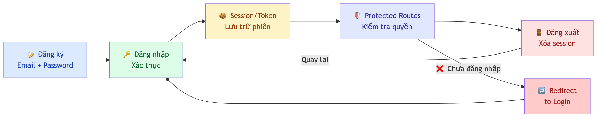
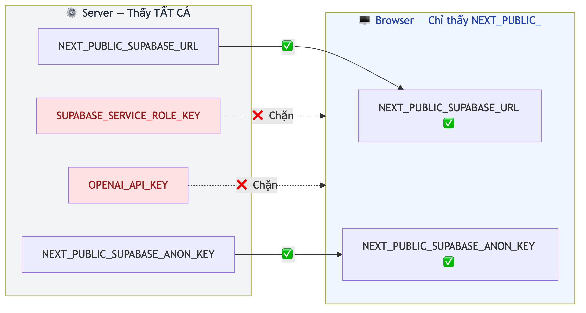
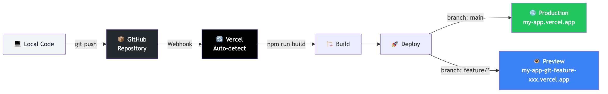

# Chương 12: Auth, secrets và đưa app lên mạng

Một buổi sáng thứ Ba, bạn mở email và thấy hóa đơn từ một dịch vụ AI: ba trăm bốn mươi bảy đô. Bạn chưa từng dùng đến mức đó. App bạn mới dựng chỉ có năm người trong team dùng thử.

Phải mất một lúc bạn mới hiểu chuyện gì đã xảy ra: API key nằm ngay trong code, code nằm trên một repo công khai, và một con bot nào đó đã tìm thấy nó trong vòng vài phút sau khi bạn push. Suốt tuần qua, có người đã chạy hàng nghìn request bằng tiền của bạn.

Câu chuyện này không phải giả tưởng và không phải chuyện hiếm. Nó xảy ra đặc biệt nhiều với người mới vibe coding — vì công cụ AI làm phần khó (dựng app) trở nên dễ đến mức người ta quên rằng phần dễ (giữ chìa khóa) mới là phần chết người.

Chương này gộp ba việc bạn buộc phải làm cùng lúc khi app rời khỏi máy tính cá nhân: **ai được vào** (authentication), **bí mật giữ ở đâu** (secrets), và **đưa app lên mạng thế nào** (deploy). Chúng thường được dạy riêng, nhưng chúng thất bại cùng nhau — cái hóa đơn ở trên là ví dụ của cả ba hỏng một lúc.

Bạn sẽ không tìm thấy hướng dẫn bấm nút ở đây, mà là những thứ không đổi khi nền tảng đổi giao diện: nguyên lý, ranh giới, và danh sách những chỗ hay sai.

## Authentication và authorization — hai người gác cổng khác nhau

Bạn từng vào một tòa nhà văn phòng. Ở sảnh, bảo vệ hỏi hai câu. Câu đầu: "Bạn là ai?" — bạn quét thẻ, hệ thống xác nhận bạn là nhân viên phòng Kiểm thử. Đó là **authentication** (xác thực danh tính). Câu thứ hai: "Bạn lên tầng mấy?" — hệ thống kiểm tra bạn có được vào phòng server không. Đó là **authorization** (phân quyền).

Nghe gần giống nhau, nhưng trong ứng dụng web chúng do hai cơ chế khác nhau xử lý. Authentication thường được giao cho một **auth provider** — dịch vụ chuyên lo đăng ký, đăng nhập, cấp token. Authorization nằm ở tầng ứng dụng hoặc tầng database; với Row Level Security mà bạn đã gặp ở Chương 11, chính RLS là nơi authorization được thực thi.

Cách dễ nhớ: authentication là *xuất trình chứng minh thư*, authorization là *kiểm tra tên bạn có trong danh sách khách mời*. Một app có đăng nhập tử tế nhưng không phân quyền thì mọi người dùng đã đăng nhập đều xem được dữ liệu của nhau — lỗi này phổ biến đến mức đáng lo trong app vibe-coded, vì AI thường làm xong phần đăng nhập rồi coi như hết việc.

> 📋 **Dành cho PM/BA:** Khi viết requirement cho tính năng đăng nhập, hãy tách rõ hai phần. Một, authentication: người dùng đăng nhập bằng gì — email và mật khẩu, tài khoản Google, hay link gửi qua email? Hai, authorization: ai xem được trang nào, có mấy loại vai trò, admin làm được gì khác người dùng thường? Viết cụ thể từng ý sẽ giúp AI sinh code chính xác hơn nhiều. Đây cũng là chỗ PRD ở Chương 5 phát huy tác dụng rõ nhất.

## Auth flow — năm bước bạn phải nhận ra

Trước khi nói tới code, hãy nhìn toàn cảnh. Một luồng xác thực hoàn chỉnh có năm bước, và mỗi bước có một vai trò riêng.

**Đăng ký.** Người dùng tạo tài khoản mới bằng email và mật khẩu, hoặc qua một tài khoản có sẵn như Google.

**Đăng nhập.** Hệ thống kiểm tra thông tin, nếu đúng thì cấp một **session** (phiên làm việc) hoặc **token** (chuỗi ký tự xác thực).

**Session hoặc token.** Hãy nghĩ token như thẻ ra vào tạm thời: lưu trong trình duyệt, thường trong cookie, tự động gửi kèm mọi request tới server. Nhờ nó, server biết "người này đã đăng nhập rồi".

**Protected routes.** Những trang chỉ dành cho người đã đăng nhập. Ai chưa đăng nhập mà truy cập thì bị chuyển hướng về trang đăng nhập.

**Đăng xuất.** Token bị xóa, phiên kết thúc.

Năm bước này tạo thành một vòng kín. Khi bạn yêu cầu AI "thêm tính năng đăng nhập cho app", đây chính là những gì nó cần triển khai — và nhớ đủ năm bước là cách bạn kiểm tra nó đã làm đủ hay chưa. Đó là toàn bộ giá trị của phần này: không phải để tự viết, mà để phát hiện thiếu sót.



*HÌNH 12.1: Sơ đồ luồng xác thực năm bước — Đăng ký → Đăng nhập → Session/Token → Protected Routes → Đăng xuất, với mũi tên từ Đăng xuất quay lại Đăng nhập, và một nhánh phụ từ Protected Routes chỉ về "chuyển hướng tới trang đăng nhập" khi chưa xác thực.*

## Không bao giờ tự build authentication

Đây là nguyên tắc quan trọng nhất của chương, và nó không có ngoại lệ: **đừng bao giờ tự xây hệ thống authentication từ đầu.**

Nghe cực đoan, nhưng lý do rất cụ thể. Authentication không phải bài toán tính năng — nó là bài toán bảo mật. Khi bạn dựng một form đăng nhập, bạn không chỉ "lưu email và mật khẩu vào database". Bạn đang đối mặt với một danh sách dài những vấn đề mà giới bảo mật đã nghiên cứu hàng chục năm:

**Lưu mật khẩu.** Phải hash bằng thuật toán chuyên dụng như Argon2, bcrypt hay PBKDF2. Lưu dạng văn bản thường là lỗi nghiêm trọng nhất có thể mắc. Và không, "mã hóa" bằng MD5 hay SHA-256 cũng không đủ — chúng nhanh, mà nhanh chính là điều bạn không muốn ở hàm hash mật khẩu.

**Quản lý session.** Token phải sinh bằng phương pháp mật mã học, hết hạn đúng lúc, bị vô hiệu hóa khi đăng xuất, và được làm mới định kỳ.

**Chống CSRF và chống brute force.** Phải chặn kiểu tấn công lừa trình duyệt gửi request như thể chính bạn vừa thao tác; phải giới hạn số lần đăng nhập sai và phát hiện những lần thử bất thường.

**Triển khai OAuth.** Muốn hỗ trợ "đăng nhập bằng Google", bạn phải xử lý đúng việc kiểm tra token, tham số state, và PKCE. Mỗi thứ đều có thể làm sai và bị khai thác.

Theo **OWASP Top 10 phiên bản 2025** — danh sách mười loại lỗ hổng ứng dụng web phổ biến nhất — nhóm Authentication Failures nằm ở vị trí thứ bảy.

Các dịch vụ auth có sẵn được chuyên gia bảo mật kiểm định và liên tục vá lỗ hổng mới. Bạn có thể viết code tốt và hiểu các khái niệm bảo mật. Nhưng bạn không thể cạnh tranh với một đội làm việc toàn thời gian chỉ để giữ hệ thống auth an toàn.

> 🔒 **Bảo mật:** Nguyên tắc này không chỉ dành cho vibe coder — developer nhiều năm kinh nghiệm cũng được khuyến nghị y như vậy. Giới bảo mật có một câu quen thuộc: "Đừng bao giờ tự triển khai mật mã học, hãy dùng thư viện đã được kiểm chứng." Nguyên tắc đó mở rộng ra cả hệ thống authentication. Nếu bạn thấy AI sinh ra code **tự hash mật khẩu, tự quản lý session, hay tự tạo token** — đó là dấu hiệu đỏ. Dừng lại và yêu cầu nó dùng một dịch vụ auth có sẵn.

> 🧰 **Đề xuất công cụ:** *Tính đến 2026-07.* Có hai hướng chọn. Một, dùng auth tích hợp sẵn trong dịch vụ backend bạn đã dùng — nếu database của bạn đã ở đâu thì dùng auth ở đó, mọi thứ nối liền và phân quyền dùng chung cơ chế. Hai, dùng một dịch vụ auth chuyên biệt, thường đi kèm sẵn giao diện đăng nhập dựng sẵn nên setup rất nhanh, đổi lại là thêm một nhà cung cấp vào hệ thống. Ở thời điểm viết, nhóm thứ nhất có Supabase Auth và Firebase Auth; nhóm thứ hai có Clerk và Auth.js. Hạn mức miễn phí và tính năng của các dịch vụ này đổi liên tục — kiểm tra trang chủ trước khi chọn, đừng tin con số trong bất kỳ cuốn sách nào.

## Protected routes và nguyên tắc phòng thủ nhiều tầng

Sau khi người dùng đăng nhập, bạn cần bảo vệ những trang chỉ họ mới được xem. Cách tiêu chuẩn trong Next.js là dùng một file **middleware** — file đặc biệt chạy trước mọi request, kiểm tra đã đăng nhập chưa, chưa thì chuyển hướng.

Hãy nghĩ middleware như bảo vệ ở sảnh tòa nhà. Ai muốn lên tầng cũng phải qua đó. Có thẻ hợp lệ thì được qua, không có thì mời quay lại lễ tân.

Nghe đủ rồi. Nhưng middleware **không phải** tuyến phòng thủ duy nhất, và đây là chỗ nhiều app vibe-coded sập.

> 🔒 **Bảo mật:** Tháng 3 năm 2025, một lỗ hổng nghiêm trọng trong Next.js được công bố — **CVE-2025-29927**: kẻ tấn công có thể **vượt qua middleware** bằng cách thao túng một HTTP header nội bộ. Nghĩa là nếu bạn chỉ kiểm tra auth ở middleware, kẻ xấu có thể đi thẳng vào trang protected mà không cần đăng nhập. Lỗ hổng cụ thể này đã được vá, nhưng bài học thì còn nguyên giá trị: **luôn xác thực ở cả hai nơi — middleware và tầng truy cập dữ liệu.** Đây là nguyên tắc **defense in depth** (phòng thủ nhiều tầng) mà Chương 16 sẽ nói kỹ hơn. Đừng bao giờ đặt toàn bộ niềm tin vào một điểm kiểm tra duy nhất.

Trong thực tế, điều đó nghĩa là ngoài middleware, mỗi chỗ đọc dữ liệu nhạy cảm cũng phải tự kiểm tra lại. Đoạn dưới đây minh họa lớp thứ hai đó — kiểm tra người dùng *trước khi* truy vấn database, không phải sau:

```typescript
// Trang dashboard — kiểm tra auth lần nữa ở tầng dữ liệu,
// không chỉ dựa vào middleware
export default async function DashboardPage() {
  const { data: { user } } = await getUser()

  // Tuyến phòng thủ thứ hai
  if (!user) redirect("/login")

  // Chỉ truy vấn khi đã chắc chắn có người dùng hợp lệ
  const { data: projects } = await db
    .from("projects")
    .select("*")

  return <div>{/* hiển thị projects */}</div>
}
```

Với cách này, kể cả khi middleware bị vượt qua, tầng dữ liệu vẫn từ chối. Hai lớp thay vì một — giống tòa nhà có cả bảo vệ ở sảnh và khóa thẻ từ ở từng tầng.

Khi review code AI sinh ra, đây là câu hỏi bạn nên hỏi mỗi lần: *nếu ai đó gọi thẳng vào đây mà không qua middleware, chuyện gì xảy ra?*

## Test auth — nơi kinh nghiệm QA của bạn thắng đậm

Authentication là tính năng có nhiều trường hợp biên nhất trong hầu hết mọi ứng dụng. Luồng đăng nhập trông đơn giản, nhưng khi bắt đầu liệt kê các kịch bản có thể xảy ra, danh sách dài đến mức bất ngờ.

Với **đăng ký**: email đã tồn tại báo lỗi gì, hay im lặng tạo trùng? Mật khẩu quá ngắn có bị chặn? Email thiếu ký tự @ xử lý thế nào?

Với **đăng nhập**: sai mật khẩu hiện lỗi gì — và lỗi đó có vô tình tiết lộ rằng email này *có tồn tại* trong hệ thống không?

Với **session**: đóng trình duyệt rồi mở lại, còn đăng nhập không? Để im tới khi session hết hạn thì sao? Đăng nhập cùng lúc trên hai trình duyệt có xung đột?

Với **protected routes và đăng xuất**: gõ thẳng địa chỉ trang nội bộ khi chưa đăng nhập có bị chặn? Sau khi đăng xuất, bấm nút Back có quay lại được trang cũ? Gọi API sau khi đăng xuất có bị từ chối? Đăng xuất ở một tab, tab khác có tự cập nhật?

> 🧪 **Dành cho Tester/QA:** Danh sách trên là một mini test suite cho authentication, và nó là thứ bạn viết được ngay hôm nay mà không cần biết dòng code nào. Hãy thử copy nguyên danh sách này vào công cụ AI của bạn kèm câu: "Kiểm tra app của tôi theo các test case này và chỉ ra trường hợp nào chưa được xử lý." Số lỗi tìm ra thường gây bất ngờ — không phải vì AI viết code tệ, mà vì nó chỉ làm đúng những gì được yêu cầu, và không ai yêu cầu nó nghĩ tới nút Back. Chương 15 sẽ mở rộng tư duy này thành một quy trình đầy đủ.

## Secrets — chiếc hộp khóa của ứng dụng

Chuyển sang phần thứ hai, phần đã tạo ra cái hóa đơn ở đầu chương.

Mọi ứng dụng đều cần kết nối tới dịch vụ bên ngoài: database cần URL và key, dịch vụ auth cần secret key, tính năng AI cần API key. Nếu bạn viết thẳng vào code — `const apiKey = "sk-abc123xyz"` — thì khi push lên repo, ai cũng đọc được. Kể cả repo private, bạn vẫn đang tạo rủi ro: một thành viên mới vào team, một người review code, hay đơn giản là một hôm bạn vô tình chuyển repo sang công khai.

**Environment variable** (biến môi trường) là giải pháp. Hãy tưởng tượng ứng dụng là một căn nhà. Code là bản thiết kế — ai xem cũng không sao. Environment variable là chiếc hộp khóa gắn ngoài cửa, chỉ người có mã mới mở được. Bản thiết kế chỉ ghi "mở hộp khóa để lấy chìa", chứ không ghi chìa nằm ở đâu.

Trong thực tế, code chỉ viết `process.env.TEN_BIEN` — "hãy lấy giá trị từ môi trường" — và không bao giờ chứa giá trị thật. Trên máy bạn, các giá trị đó nằm trong một file riêng ở thư mục gốc project, tên bắt đầu bằng `.env`:

```bash
# File .env.local — nằm ở thư mục gốc project, KHÔNG BAO GIỜ push lên repo

NEXT_PUBLIC_DATABASE_URL=https://abcxyz.example.co
NEXT_PUBLIC_DATABASE_ANON_KEY=eyJhbGciOiJIUzI1NiIs...
DATABASE_SERVICE_ROLE_KEY=eyJhbGciOiJIUzI1NiIs...
AI_API_KEY=sk-proj-abc123...
```

Tên biến viết hoa, dùng gạch dưới phân cách, không có dấu cách quanh dấu bằng. Dòng bắt đầu bằng `#` là ghi chú.

> 🔒 **Bảo mật:** Quy tắc vàng: **không bao giờ viết secret trực tiếp vào code.** Không phải "hạn chế", không phải "nên tránh" — mà là không bao giờ. Hardcoded secret là một trong những lỗi bảo mật phổ biến nhất trên web, và Chương 16 sẽ cho bạn thấy nó xếp ở đâu trong danh sách mười lỗi hay gặp nhất của code do AI sinh ra. Một API key lộ ra ngoài có thể bị khai thác trong vòng vài phút — như cái hóa đơn ở đầu chương.

## Ranh giới sống còn: biến nào được xuống trình duyệt

Đây là phần mà nếu chỉ đọc một mục trong cả chương, hãy đọc mục này.

Bạn để ý trong ví dụ trên, một số biến bắt đầu bằng `NEXT_PUBLIC_` và một số thì không? Đó không phải quy ước đặt tên cho đẹp. Đó là một ranh giới bảo mật, và đặt sai bên là lỗi hay gặp nhất với environment variable.

Quay lại phép ẩn dụ nhà hàng ở Chương 7. Server giống như bếp — khách không thấy bên trong. Trình duyệt giống khu vực bàn ăn — mọi thứ ở đây đều lộ thiên.

Biến **không có** tiền tố `NEXT_PUBLIC_` chỉ tồn tại ở phía bếp. Chúng không bao giờ được gửi tới trình duyệt. Đây là nơi đặt những secret thật: service role key của database (loại key vượt qua mọi RLS policy — lộ là toàn bộ dữ liệu bị đọc và xóa được), secret key của dịch vụ auth, API key của dịch vụ AI, key của cổng thanh toán.

Biến **có** tiền tố `NEXT_PUBLIC_` được nhúng thẳng vào JavaScript gửi xuống trình duyệt. Bất kỳ ai mở DevTools đều đọc được. Vì vậy tiền tố này chỉ dành cho những giá trị an toàn khi công khai: URL của project, hoặc anonymous key — loại key được thiết kế để công khai và được bảo vệ bởi RLS policy mà bạn đã thiết lập ở Chương 11.

| Loại biến | Có `NEXT_PUBLIC_`? | Vì sao |
|---|---|---|
| URL của project database | Có | Trình duyệt cần biết gọi đi đâu; không phải secret |
| Anonymous key của database | Có | Được thiết kế để công khai, RLS là lớp bảo vệ thật |
| Service role key | **Không** | Vượt qua mọi RLS; lộ là mất toàn bộ database |
| Secret key của dịch vụ auth | **Không** | Chỉ dùng phía server |
| API key dịch vụ AI | **Không** | Lộ là người khác gọi API bằng tiền của bạn |
| Key cổng thanh toán | **Không** | Lộ là người khác tạo giao dịch bằng tài khoản bạn |

> ⚠️ **Lưu ý:** Đặt sai tiền tố là lỗi số một trong nhóm này. Nếu bạn viết `NEXT_PUBLIC_` trước tên một service role key, key đó sẽ nằm trong JavaScript gửi cho mọi người truy cập. Ai biết mở DevTools đều lấy được, và key ấy vượt qua mọi RLS policy. Hậu quả: toàn bộ database bị đọc, sửa, xóa tùy ý. Quy tắc đơn giản đến mức không cần nhớ gì thêm: **nếu bạn không muốn cả thế giới nhìn thấy, đừng dùng `NEXT_PUBLIC_`.**

Có một cách tự kiểm tra rất nhanh, và nó dùng đúng kỹ năng DevTools ở Chương 14. Mở app đã build, vào tab chứa mã nguồn JavaScript, tìm kiếm tên biến hoặc vài ký tự đầu của key trong các file script. Nếu thấy giá trị thật hiện ra trong kết quả — đó là lỗi cần sửa ngay, và cần đổi key luôn vì nó đã lộ.

Một lưu ý kỹ thuật hay gây nhầm: gõ `process.env` trong tab Console sẽ không cho bạn thấy gì hữu ích, vì các biến này được thay bằng giá trị thật ngay lúc build, không phải lúc chạy. Phải tìm trong file script đã build mới đúng.



*HÌNH 12.2: Sơ đồ luồng dữ liệu của biến môi trường. Bên trái là Server, chứa cả hai loại biến. Bên phải là Trình duyệt, chỉ chứa biến có tiền tố NEXT_PUBLIC_. Mũi tên từ Server sang Trình duyệt cho biến công khai, dấu X đỏ chặn đường cho biến secret.*

## Hàng rào đầu tiên: đừng để file secret vào lịch sử Git

File `.env.local` chỉ an toàn nếu Git không theo dõi nó. Ở Chương 13 bạn sẽ học kỹ về `.gitignore`; ở đây chỉ cần nhớ một điều: file `.gitignore` của project **phải** có các dòng loại trừ mọi file `.env`. Bản mẫu dùng được ngay nằm trong `templates/gitignore-template.txt` kèm theo sách.

Có một chi tiết mà nhiều người hiểu sai và trả giá đắt: `.gitignore` chỉ ngăn Git theo dõi file **mới**. Nếu bạn đã commit file `.env.local` rồi mới thêm vào `.gitignore`, file đó **vẫn nằm trong lịch sử Git** và vẫn đọc được. Trong trường hợp đó, xóa file ở commit mới là không đủ. Bạn phải xử lý lịch sử Git, và quan trọng hơn — **đổi toàn bộ key ngay lập tức**, vì chúng đã bị lộ.

Nguyên tắc chung về key bị lộ, hoặc *nghi* bị lộ: đổi ngay, đừng chờ xem có ai dùng không. Đến lúc bạn phát hiện có người dùng thì thiệt hại đã xảy ra rồi. Mọi dịch vụ nghiêm túc đều cho phép tạo key mới và hủy key cũ trong vài giây.

## Secrets ở production và chuyện tách môi trường

Khi app được deploy, file `.env.local` không đi cùng — vì nó bị `.gitignore` loại ra, và đó là điều đúng đắn. Vậy production lấy secret từ đâu? Bạn khai báo chúng trong phần quản lý biến môi trường của nền tảng hosting.

Phần lớn nền tảng hosting phân biệt ba môi trường cho cùng một tên biến, và hiểu ba môi trường này quan trọng hơn hiểu cách bấm nút:

**Production** là địa chỉ chính, nơi người dùng thật truy cập. Biến ở đây phải là key production — database thật, cổng thanh toán chế độ thật.

**Preview** là môi trường sinh ra cho mỗi branch chưa merge. Ở đây dùng key test, database test — để thử nghiệm không chạm dữ liệu thật.

**Development** là môi trường cho máy cá nhân. Nhiều nền tảng cho phép kéo bộ biến này về máy bằng một lệnh — cách tốt nhất để onboard người mới, thay vì gửi secret qua chat hay email, vốn là kênh không an toàn và không thu hồi được.

Từ đó dẫn tới một nguyên tắc mà bỏ qua sẽ rất đau: **mỗi môi trường cần bộ key riêng.** Hãy hình dung bạn đang test tính năng xóa tài khoản. Nếu development và production dùng chung database, thao tác test của bạn xóa tài khoản của người dùng thật. Hoặc bạn test tính năng gửi email — và vài trăm người dùng thật nhận được thư "Xin chào, đây là test".

Cụ thể: hai project database riêng cho dữ liệu test và dữ liệu thật; dịch vụ auth dùng key chế độ test khi phát triển; cổng thanh toán ở chế độ test cho tới khi thực sự sẵn sàng nhận tiền; và với dịch vụ AI, hai API key riêng để một vòng lặp lỗi lúc phát triển không đốt ngân sách production.

> 📋 **Dành cho PM/BA:** Cách này giải quyết một vấn đề rất thực của quản lý dự án: onboarding. Thay vì lập tài liệu "danh sách key" — bản thân nó là rủi ro bảo mật — bạn chỉ cần cho thành viên mới quyền truy cập project. Cần đổi key thì cập nhật một chỗ. Và khi ai đó rời team, bạn thu hồi quyền truy cập chứ không phải đi đổi mọi key mà họ từng thấy.

## Spending limit — tấm lưới an toàn tài chính

Phần này không liên quan tới code, nhưng liên quan trực tiếp tới ví của bạn.

Trong vibe coding, AI có thể sinh ra code gọi API hàng trăm lần mỗi phút. Một vòng lặp lỗi — thứ bạn không cố ý viết và có thể không nhận ra ngay — biến hóa đơn từ con số không thành con số làm bạn mất ngủ chỉ trong một đêm. Spending limit là cầu dao tự động: nó ngắt trước khi cháy.

Cơ chế này có ở hầu hết dịch vụ tính tiền theo mức dùng, thường dưới hai dạng: **ngưỡng cảnh báo** gửi email khi mức chi đạt một mốc, và **ngưỡng cứng** dừng hẳn dịch vụ. Một số dịch vụ backend còn có tùy chọn "dừng thay vì tính thêm tiền" khi vượt hạn mức miễn phí — với giai đoạn học và thử nghiệm, đây gần như luôn là lựa chọn đúng.

> ⚠️ **Lưu ý:** Trước khi đưa app lên production, hãy đặt spending limit trên **tất cả** dịch vụ bạn dùng. Bắt đầu ở mức thấp nhất mà bạn vẫn làm việc được, rồi nâng dần. So hai kịch bản: đặt quá thấp thì tệ nhất là app tạm ngừng và bạn vào nâng lên; không đặt thì tệ nhất là hóa đơn ba con số cho một vòng lặp bạn viết sai lúc nửa đêm. Chọn cái nào thì đã rõ.

Với người quản lý ngân sách dự án, hãy coi đây là một mục trong checklist khởi tạo project, ngang với việc tạo repo. Một hóa đơn bất ngờ không chỉ tốn tiền — nó làm mất niềm tin của stakeholder vào cách team làm việc.

## Đưa app lên mạng: nguyên lý, không phải các bước bấm nút

Phần cuối cùng, và là phần dễ nhất trong ba phần.

Suốt những chương trước, app của bạn chạy trên máy cá nhân. Chạy tốt, nhìn đẹp, nhưng chỉ mình bạn thấy. **Deploy** là đưa nó lên internet — giai đoạn Ship trong quy trình năm bước ở Chương 3.

Điều đáng học ở đây không phải các bước bấm nút, mà là *hình dạng của quy trình*: bạn push code lên repo, nền tảng hosting phát hiện có code mới, tự tải về, tự build, tự đưa lên mạng. Toàn bộ mất từ vài chục giây tới vài phút. Kết quả là một địa chỉ thật, ai trên thế giới cũng vào được.

Điểm hay nằm ở chỗ tiếp theo. Push lên nhánh chính thì tạo ra bản production. Push lên nhánh khác thì tạo ra một **preview** với địa chỉ riêng — nghĩa là mỗi tính năng đang làm dở đều có đường link riêng để gửi cho người khác xem thử, không ảnh hưởng bản chính. Giống nấu thử một món rồi mời vài người nếm trước khi đưa vào thực đơn.

> 📋 **Dành cho PM/BA:** Preview deployment là công cụ mạnh nhất chương này cho bạn, và nó không đòi bạn viết dòng code nào. Thay vì chờ tới buổi review cuối sprint, bạn nhận được đường link ngay khi tính năng vừa xong — click vào, thử, góp ý. Phát hiện lệch hướng ở ngày thứ hai rẻ hơn phát hiện ở ngày thứ mười rất nhiều. Gửi được cho stakeholder mà không cần họ cài gì. Và vì preview dùng bộ biến môi trường riêng, mọi người thử thoải mái trên dữ liệu test.



*HÌNH 12.3: Sơ đồ quy trình deploy tự động — Code trên máy → push lên repo → nền tảng hosting tự phát hiện → build → đưa lên mạng. Hai nhánh: nhánh chính trỏ tới địa chỉ Production, nhánh tính năng trỏ tới địa chỉ Preview riêng.*

## Checklist trước khi bấm deploy

Năm bước dưới đây nên chạy khi setup project mới, và một lần nữa trước mỗi lần đưa lên production. Chúng bắt được phần lớn tai nạn trong chương này.

**Một, `.gitignore`** có các dòng loại trừ `.env` chưa? Không có thì thêm ngay.

**Hai, lịch sử Git** có file `.env` nào từng bị commit không? Có thì xử lý lịch sử và đổi toàn bộ key.

**Ba, tiền tố.** Soi từng dòng trong `.env.local`: biến nào có `NEXT_PUBLIC_` thì tự hỏi "giá trị này công khai có sao không?". Chỉ một dòng sai là đủ.

**Bốn, biến trên nền tảng hosting** đã khai báo đủ và đúng môi trường chưa? Thiếu một biến thì app build xong vẫn lỗi lúc chạy, và loại lỗi đó thường khó hiểu.

**Năm, spending limit** đã có ngưỡng chặn trên từng dịch vụ chưa?

> 🧪 **Dành cho Tester/QA:** Năm bước trên là một test suite cho bảo mật cấu hình, và nó thuộc Definition of Done của mọi story có tích hợp dịch vụ bên ngoài. Phụ lục B có bản checklist đầy đủ hơn, dùng được ngay trước mỗi lần deploy.

## Tóm tắt

- **Authentication** trả lời "bạn là ai", **authorization** trả lời "bạn được làm gì" — app vibe-coded hay làm xong cái đầu rồi quên cái sau.
- **Auth flow** có năm bước: đăng ký, đăng nhập, session/token, protected routes, đăng xuất. Nhớ đủ năm bước là cách kiểm tra AI đã làm đủ chưa.
- **Không bao giờ tự build authentication.** Nhóm lỗi Authentication Failures đứng thứ bảy trong OWASP Top 10 phiên bản 2025; hãy dùng dịch vụ đã được kiểm định.
- **Xác thực ở cả hai tầng** — middleware và tầng dữ liệu. CVE-2025-29927 công bố tháng 3/2025 cho thấy middleware có thể bị vượt qua; lỗ hổng đó đã được vá nhưng bài học phòng thủ nhiều tầng vẫn nguyên giá trị.
- **Secret nằm trong biến môi trường, không nằm trong code** — không ngoại lệ. Và **`.gitignore` chỉ ngăn file mới**: file secret đã vào lịch sử Git thì phải đổi key, không phải chỉ xóa file.
- **Tiền tố `NEXT_PUBLIC_` là ranh giới sống còn:** biến có tiền tố này đi xuống trình duyệt và ai cũng đọc được. Đặt sai một dòng là mất cả database.
- **Mỗi môi trường một bộ key riêng**, và **spending limit đặt trước khi deploy**, không phải sau khi nhận hóa đơn.

## Bài tập

**EX 12.1 — Audit secrets cho một project thật**

Chọn một project bạn đã dựng, hoặc một repo mà bạn có quyền xem. Làm bốn việc.

Đầu tiên, liệt kê mọi biến môi trường project đang dùng: tìm trong code tất cả chỗ xuất hiện `process.env`. Mỗi kết quả là một biến cần được khai báo.

Tiếp theo, với từng biến, trả lời một câu: *nếu giá trị này hiện lên trong trình duyệt của một người lạ, chuyện gì xảy ra?* Ghi câu trả lời ra. Biến nào có câu trả lời đáng lo mà lại đang có tiền tố `NEXT_PUBLIC_` — đó là lỗi.

Sau đó, kiểm tra `.gitignore` và lịch sử Git theo bước một và hai của checklist.

Cuối cùng, lập một bảng bốn cột: tên biến, có trong file `.env.local`, có trong `.gitignore`, có trên nền tảng hosting. Tick từng ô. Ô nào trống là một việc cần làm.

*Đầu ra:* bảng audit hoàn chỉnh, kèm danh sách những gì bạn đã sửa.

**EX 12.2 — Test suite cho auth**

Biến danh sách ở mục "Test auth" thành test suite thật cho một app có đăng nhập — app của bạn hoặc một app nội bộ bạn đang dùng. Viết ít nhất mười case, mỗi case ghi rõ: đầu vào, kết quả mong đợi, kết quả thực tế, đạt hay không đạt.

Thử với tinh thần tấn công: gõ thẳng địa chỉ trang nội bộ khi chưa đăng nhập; đăng xuất rồi bấm Back; sửa cookie trong DevTools rồi tải lại trang.

*Đầu ra:* bảng test case đã chạy với cột kết quả thực tế được điền, kèm ghi chú những chỗ app xử lý chưa tốt.

## Tiếp theo

Chương này đã đóng ba cánh cửa: ai được vào, bí mật giữ ở đâu, và làm sao đưa app ra thế giới. Nhưng còn một cánh cửa nữa bạn cần trước khi làm bất cứ điều gì với AI trên project thật — cánh cửa cho phép bạn **quay lại**.

Chương 13 nói về Git, không theo kiểu danh sách lệnh, mà trả lời một câu rất cụ thể: khi AI vừa "sửa" một thứ và làm hỏng ba thứ khác, bạn làm gì?

Muốn xem lại phân quyền ở tầng database thì Chương 11 có mục về Row Level Security. Muốn hiểu sâu hơn về bảo mật code do AI sinh ra thì Chương 16 dành riêng cho việc đó.
