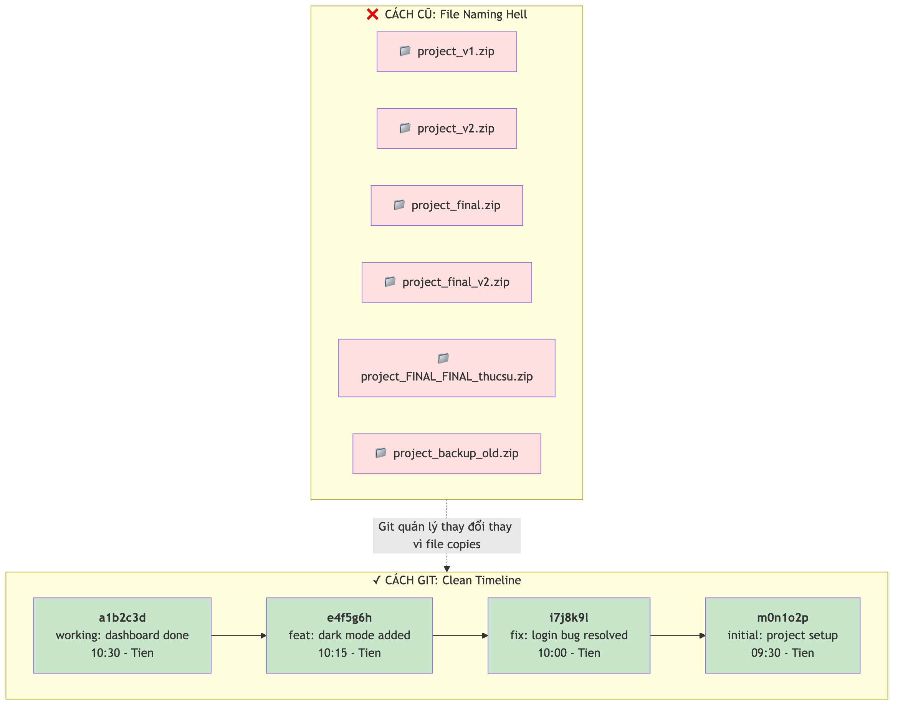
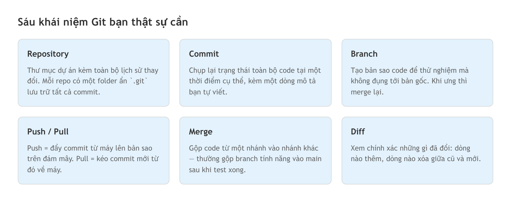

# Chương 13: Git — lưới an toàn khi làm việc với AI

Buổi sáng, dashboard của bạn chạy ngon lành: nút bấm mượt, dữ liệu hiển thị đúng, biểu đồ lên màu. Bạn nhờ AI thêm một tính năng nhỏ — chế độ nền tối. Nghe vô hại. AI gật đầu, sửa năm file cùng lúc, báo "đã xong". Bạn mở lại trang. Màn hình trắng xóa. Không phải trắng vì nền sáng — trắng vì app không load được nữa.

Bạn bấm Ctrl+Z. Nó chỉ hoàn tác được file đang mở, không phải bốn file kia. Bạn không biết AI đã đụng vào những gì, sửa ở đâu, xóa mất dòng nào. Thứ chạy tốt cách đây mười phút giờ vỡ vụn, và cách duy nhất để cứu nó là ngồi nhớ lại xem code trước đó trông ra sao — dòng nào, file nào. Với một app vài file thì còn gắng gượng được. Với hai chục file thì gần như vô vọng.

Đây là lúc bạn ước mình đã biết Git. Git cho bạn một điểm quay về — một trạng thái "chạy được" mà bạn có thể trở lại chỉ trong vài giây, thay vì mất cả buổi chiều mò từng file. Chương này không biến bạn thành chuyên gia DevOps. Nó chỉ dạy đủ Git để bảo vệ công sức của bạn khỏi chính con AI mà bạn đang nhờ vả.

## Git là gì: quay lại bất kỳ thời điểm nào

Trước khi có Git, người ta quản lý phiên bản bằng cách... đổi tên file. Một thư mục điển hình trông thế này: `project_final.zip`, `project_final_v2.zip`, `project_FINAL_FINAL_thucsu.zip`. Nghe quen không? Rất nhiều người làm IT vẫn quản lý tài liệu kiểu đó, và ai cũng biết nó dẫn tới thảm họa: không ai nhớ nổi bản nào là bản mới nhất.

Git giải quyết chuyện này bằng cách ghi lại *lịch sử thay đổi* của toàn bộ project. Mỗi lần bạn "lưu" — trong Git gọi là **commit** (chụp lại trạng thái code tại một thời điểm) — Git ghi lại trạng thái của tất cả file. Bạn có thể xem lại bất kỳ "bức ảnh" nào trong quá khứ, so sánh hai bức với nhau, hoặc quay ngược về một thời điểm cụ thể. Nó giống hệt tính năng save trong game, nhưng thay vì ba ô lưu, Git cho bạn hàng nghìn ô, mỗi ô kèm một dòng ghi chú bạn đã làm gì lúc đó.

Git do Linus Torvalds — cha đẻ của Linux — tạo ra năm 2005, và nhanh chóng trở thành chuẩn mực của ngành phần mềm. Theo các khảo sát ngành nhiều năm, đại đa số lập trình viên toàn cầu dùng Git. Dù công cụ AI coding bạn dùng là loại nào, tất cả đều tích hợp hoặc kết nối với Git theo cách này hay cách khác. Nói cách khác, Git không phải thứ "tùy chọn" — nó là hạ tầng nền.



*HÌNH 13.1: So sánh hai cách quản lý phiên bản. Bên trái là một thư mục lộn xộn chứa nhiều file zip tên gần giống nhau (project_final, project_final_v2, project_FINAL_FINAL). Bên phải là một dòng thời gian Git gọn gàng: các điểm commit xếp thành hàng, mỗi điểm có một dòng ghi chú ngắn.*

## Tại sao Git bắt buộc cho vibe coding

Có người sẽ nghĩ: "Tôi chỉ dựng app nhỏ, cần gì Git cho rối." Câu trả lời ngắn: vì AI có thể phá hỏng app của bạn bất cứ lúc nào, và bạn cần một đường lùi.

Điểm mấu chốt nằm ở cách AI làm việc. Khi bạn nhờ AI thêm một tính năng, nó không chỉ thêm code mới — nó có thể sửa code hiện có ở nhiều file cùng lúc. Trong lập trình truyền thống, người viết gõ từng dòng nên biết chính xác mình đổi cái gì. Trong vibe coding, AI có thể thay đổi 15 file trong một lần, và bạn không nắm hết. Đôi khi những thay đổi đó xung đột với nhau; đôi khi AI vô tình xóa mất một đoạn logic đang chạy tốt. Đây là lý do Git chuyển từ "nên có" thành "bắt buộc phải có".

Hãy nghĩ về Git như bảo hiểm. Bạn mua bảo hiểm xe không phải vì mong tai nạn, mà vì tai nạn *có thể* xảy ra. Tương tự, bạn dùng Git không phải vì AI luôn sai, mà vì khi AI sai, bạn cần phục hồi nhanh. Không có Git, lựa chọn duy nhất khi app hỏng là làm lại từ đầu, hoặc ngồi mò từng file xem AI đã sửa gì — cả hai đều tốn thời gian gấp nhiều lần một lệnh quay lui.

> ⚠️ **Lưu ý:** Trong vibe coding, AI thường thay đổi nhiều file cùng lúc mà không báo trước. Nếu không có Git, bạn không có cách nào biết chính xác nó đã sửa gì và ở đâu. Đây là nguyên nhân số một khiến người mới mất hàng giờ — thậm chí hàng ngày — công sức. Quy tắc cứng: **commit trước mỗi lần nhờ AI làm việc lớn.** Mục 13.5 sẽ nói kỹ, nhưng nếu chỉ nhớ một dòng trong cả chương này, hãy nhớ dòng đó.

Có ba tình huống cụ thể mà Git sẽ cứu bạn. Thứ nhất, khi AI thêm tính năng mới nhưng làm hỏng tính năng cũ — bạn quay về commit trước đó. Thứ hai, khi bạn muốn thử hai hướng khác nhau — bạn tách hai nhánh và so sánh kết quả. Thứ ba, khi bạn cần chia sẻ code hoặc đưa app lên mạng — bạn đẩy code lên một bản sao trên đám mây và mọi thứ kết nối tự động.

> 🧪 **Dành cho Tester/QA:** Nếu bạn quen quản lý phiên bản của test case, Git hoạt động theo đúng nguyên tắc đó nhưng cho code. Mỗi commit giống một baseline của bộ test — bạn luôn biết trạng thái "xanh" gần nhất nằm ở đâu để quay lại khi cần. Nhiều nhóm QA đã dùng Git để quản lý phiên bản cho test script và test data từ lâu.

## Sáu khái niệm cốt lõi

Git có kha khá thuật ngữ, nhưng bạn chỉ cần nắm sáu khái niệm dưới đây là đủ dùng cho 90% công việc vibe coding hàng ngày.

**Repository** (viết tắt **repo**) là một thư mục project có kèm lịch sử thay đổi. Khi bạn khởi tạo Git cho một thư mục, Git tạo một folder ẩn tên `.git` bên trong để lưu toàn bộ lịch sử. Bạn sẽ gặp hai loại: **local repo** nằm trên máy bạn, và một bản sao trên đám mây đóng vai backup.

**Commit** là hành động chụp lại trạng thái toàn bộ project tại một thời điểm. Mỗi commit có một mã định danh riêng (một chuỗi ký tự như `a3f7b2c`), một dòng mô tả bạn tự viết (gọi là *commit message*), và thời điểm tạo. Nếu repo là cuốn album ảnh, mỗi commit là một tấm ảnh kèm ghi chú ở mặt sau. Bạn lật lại tấm nào cũng được.

**Branch** (nhánh phát triển song song) cho phép bạn tạo một bản sao của code để thử nghiệm mà không đụng tới bản gốc. Nhánh mặc định thường tên `main` (chuẩn mới từ năm 2020) hoặc `master` (với repo tạo trước tháng 10/2020). Nếu thấy `master`, đừng lo — nó hoạt động y hệt `main`. Hãy tưởng tượng bạn viết báo cáo: thay vì sửa thẳng bản chính, bạn photocopy một bản để thử. Ưng thì thay bản chính, không ưng thì vứt bản copy. Branch đúng như vậy, nhưng nhanh hơn nhiều vì Git không thật sự copy file — nó chỉ ghi nhận "từ điểm này, lịch sử rẽ nhánh".

**Push / pull** là "upload" và "download". Push đẩy các commit từ máy bạn lên bản sao trên đám mây; pull kéo các commit mới từ đó về máy. Nếu bạn quen dùng dịch vụ lưu trữ đám mây, push/pull giống việc sync lên và sync xuống — chỉ khác là bạn chủ động chọn thời điểm sync, thay vì để nó tự động.

**Merge** (gộp nhánh) là hành động kết hợp code từ một nhánh vào nhánh khác — thường là gộp nhánh tính năng vào `main` sau khi đã test xong. Đôi khi hai nhánh cùng sửa một file và Git không biết giữ bản nào, đó gọi là *merge conflict*. Khi làm một mình, tình huống này hiếm khi xảy ra.

**Diff** (bản thay đổi giữa cũ và mới) cho bạn thấy chính xác những gì đã đổi giữa hai thời điểm: dòng nào được thêm, dòng nào bị xóa. Trong vibe coding, diff là công cụ quan trọng nhất để kiểm tra AI đã làm gì — mục *Review diff trước khi commit* dành riêng cho nó.



*HÌNH 13.2: Sơ đồ sáu khái niệm Git cốt lõi. Ở giữa là repository chứa một dòng thời gian commit. Từ nhánh main rẽ ra một branch rồi merge trở lại. Một mũi tên push đi lên bản sao trên đám mây, một mũi tên pull đi xuống local. Một khung nhỏ bên cạnh minh họa diff với dòng thêm và dòng xóa.*

> 📋 **Dành cho PM/BA:** Hãy nghĩ về Git như một changelog tự động cho code. Thay vì hỏi "hôm qua sửa gì?", bạn nhìn vào lịch sử commit là biết chính xác. Branch giống các workstream song song trong kế hoạch dự án — mỗi tính năng phát triển riêng rồi tích hợp lại. Hiểu Git giúp bạn đọc được "nhịp tim" của dự án mà không cần chờ ai báo cáo.

## Sáu lệnh thật sự dùng

Git có hàng trăm lệnh, nhưng trong công việc vibe coding hàng ngày bạn chỉ đụng tới một nhúm. Đừng cố học thuộc — hiểu *luồng* mới quan trọng: khởi tạo, xem thay đổi, lưu, quay lui.

```bash
# Khởi tạo Git cho thư mục hiện tại (chỉ làm một lần cho mỗi project)
git init

# Xem file nào đã đổi, file nào chưa được commit
git status

# Xem chi tiết từng dòng đã thay đổi
git diff

# Lưu thay đổi: đưa file vào "sân chờ" rồi chụp ảnh chính thức
git add .
git commit -m "Thêm dashboard với biểu đồ doanh thu"

# Quay lui về trạng thái sạch gần nhất khi AI làm hỏng
git restore .
```

Vài điểm cần hiểu. `git status` là "kiểm tra sức khỏe" nhanh — chạy nó thường xuyên, chỉ mất nửa giây mà cho biết bạn đang ở đâu. Việc lưu gồm hai bước có chủ đích: `git add` chọn file để lưu, `git commit` mới thật sự chụp ảnh — tách ra vì đôi khi bạn sửa nhiều file nhưng chỉ muốn lưu vài file trước. Dấu chấm sau `git add` nghĩa là "lấy tất cả file đã đổi". Còn `git restore .` là nút cứu hộ: nó vứt bỏ mọi thay đổi chưa commit và trả code về trạng thái của lần commit gần nhất.

Khi cần làm việc với nhánh, bạn thêm ba lệnh nữa: tạo nhánh mới và chuyển sang nó, chuyển về `main`, và gộp nhánh vào `main`.

```bash
# Tạo nhánh mới cho một tính năng và chuyển sang đó
git switch -c feature/dark-mode

# Quay về nhánh main
git switch main

# Gộp nhánh tính năng vào main
git merge feature/dark-mode
```

Còn `git push` và `git pull` để đồng bộ với bản sao trên đám mây, nhưng nếu chưa quen gõ lệnh, bạn hoàn toàn có thể làm mọi thao tác trên bằng một ứng dụng có giao diện.

> 🧰 **Đề xuất công cụ:** *Tính đến 2026-07.* Nếu ngại terminal, có một ứng dụng máy tính miễn phí tên GitHub Desktop cho phép làm toàn bộ thao tác Git bằng cách bấm chuột — chọn file, đọc diff, viết commit message, quay lui — mà không cần gõ lệnh nào. Nó thường đi kèm dịch vụ lưu trữ repo GitHub. Giao diện và tính năng đổi theo thời gian, hãy kiểm tra trang chủ trước khi cài. Xem thêm trang Đề xuất công cụ của sách.

## Quy tắc vàng: commit trước mỗi thao tác AI lớn

Đây là phần quan trọng nhất của chương. Nếu chỉ giữ lại một thói quen duy nhất từ cuốn sách này, hãy giữ thói quen này: **luôn commit trước khi nhờ AI thay đổi lớn, và commit lại sau khi đã kiểm tra kết quả chạy tốt.**

Logic rất đơn giản. Khi bạn commit, bạn tạo một điểm an toàn — một bản lưu bạn có thể quay về bất cứ lúc nào. Sau đó bạn nhờ AI làm việc, và chỉ có hai khả năng. Tốt: AI làm đúng, bạn commit tiếp và đi tiếp. Xấu: AI phá hỏng gì đó, bạn chạy `git restore .` để trở về trạng thái trước, mất đúng vài giây. Cả hai đều được xử lý gọn.

Nếu bạn *không* commit trước, khả năng xấu biến thành thảm họa. Không có điểm quay về, code cũ đã bị ghi đè, và lựa chọn duy nhất là mở từng file cố nhớ "trước đó nó trông thế nào". Với project vài file còn khả thi; với project hai ba chục file mà AI vừa sửa bảy cái cùng lúc thì gần như bất khả.

Đây không phải chuyện làm một lần cho có. "Commit thường xuyên" nghĩa là commit ở những **điểm mốc có ý nghĩa**: trước khi nhờ AI làm gì đó, sau khi kiểm tra xong, và trước khi chuyển sang tính năng tiếp theo. Làm đúng, một ngày làm việc của bạn sẽ có khoảng năm đến 15 commit — và đó là hoàn toàn bình thường trong vibe coding. Lịch sử Git của bạn sẽ đọc như một mạch truyện:

```
commit: "pre-ai: trang login đang chạy tốt, trước khi refactor"
   ↓ (nhờ AI refactor)
commit: "AI refactor login - đã test OK"
   ↓ (nhờ AI thêm quên mật khẩu)
commit: "AI thêm forgot password - đã test OK"
```

Mỗi cặp commit tạo thành một lưới an toàn: bạn biết chính xác trạng thái trước và sau mỗi lần AI can thiệp.

Chuyện commit message không phải hình thức. Nó là nhãn dán trên mỗi bản lưu. Nhiều người viết "update", "fix", "changes" rồi ba ngày sau chẳng nhớ "update" là update cái gì. Một commit message tốt cho vibe coding trả lời hai câu: **AI đã làm gì?** và **kết quả có chạy không?** Bạn không cần theo format cứng nhắc, chỉ cần **nhất quán**. Một cách viết gọn và dễ lọc: hành động rồi mô tả — ví dụ `feat: AI thêm trang profile - test OK`, `fix: AI sửa vòng lặp redirect login - test OK`, `pre-ai: trạng thái sạch trước khi thêm thanh toán`, `revert: đã lùi code thanh toán - làm hỏng checkout`. Hai tiền tố đáng nhớ là `pre-ai:` (đánh dấu bản lưu "trước khi AI vào") và `revert:` (ghi lại lần bạn phải quay lui).

> 💡 **Mẹo:** Mỗi khi bạn định gõ prompt cho AI, hãy tự hỏi một câu: "Mình đã commit chưa?" Nếu chưa, commit ngay. Commit chỉ mất khoảng 10 giây, còn khôi phục code bị AI phá hỏng có thể mất hàng giờ. Đây chính là khác biệt lớn nhất giữa người mới và người có kinh nghiệm: người mới mất cả buổi khắc phục sự cố, người có kinh nghiệm mất 30 giây quay lui — vì họ luôn có sẵn một bản lưu.

## Review diff trước khi commit

Đây là phần nhiều người bỏ qua, và cũng là phần đắt giá nhất với người làm QA. **Diff** là bản so sánh giữa trạng thái hiện tại và lần commit trước, cho bạn thấy chính xác AI đã đổi những gì.

Vì sao nó quan trọng đến vậy? Vì AI có một thói quen ít ai để ý: khi bạn nhờ nó sửa một file, nó thường "tiện tay" sửa thêm file khác. Ví dụ, bạn yêu cầu "thêm nền tối cho trang login". AI có thể sửa file trang login (đúng, bạn yêu cầu), sửa file CSS chung (có thể hợp lý), sửa cả file layout (ơ, tại sao?), và thêm một thư viện mới vào cấu hình project (bạn có yêu cầu đâu?). Nếu bạn không đọc diff mà commit thẳng, những thay đổi "ẩn" đó trở thành một phần code của bạn — và có thể gây lỗi ở những chỗ bạn không ngờ tới.

Quy trình đọc diff nên theo hai lớp. Đầu tiên, xem **danh sách file đã đổi**: có file nào bạn không nhờ AI đụng vào không? Tiếp theo, với từng file, lướt qua các dòng được thêm và bị xóa. Bạn không cần hiểu từng dòng code, chỉ cần chú ý những dấu hiệu bất thường: file cấu hình bị sửa, một hàm cũ biến mất, hoặc một thư viện mới xuất hiện.

> 🧪 **Dành cho Tester/QA:** Đây chính là kỹ năng bạn đã có sẵn. Đọc diff không khác gì soi kết quả test — bạn đang tìm những thứ "không nên ở đây". Một Tester giỏi nhìn diff là lập tức khựng lại: "Tại sao file này bị sửa khi mình chỉ yêu cầu đổi file kia?" Đó đúng là tư duy edge case bạn rèn luyện mỗi ngày, chỉ áp vào một đối tượng mới là code AI sinh ra. Trong cả cuốn sách này, đây có lẽ là chỗ kinh nghiệm QA của bạn phát huy trực tiếp nhất.

Khi phát hiện thay đổi không mong muốn, bạn có hai đường. Một là **bỏ** (discard) riêng những thay đổi đó trước khi commit — nếu dùng ứng dụng giao diện, bạn có thể bỏ từng file lẻ. Hai là commit toàn bộ rồi quay lui sau, nhưng cách này rắc rối hơn. Trong đa số trường hợp, cứ bỏ ngay cái thừa rồi mới commit là gọn nhất.

## Mỗi tính năng một nhánh

Quay lại ẩn dụ báo cáo Excel: thay vì sửa thẳng vào file chính, bạn tạo một bản copy, thử ở đó, chỉ thay bản chính khi hài lòng. Branch trong Git đúng như vậy nhưng thông minh hơn, vì Git tự theo dõi mọi thay đổi và cho gộp lại bất cứ lúc nào.

Trong vibe coding, mỗi tính năng bạn nhờ AI dựng đều mang rủi ro. Nếu làm tất cả trên `main`, một tính năng lỗi có thể kéo sập cả app. Nhưng nếu mỗi tính năng nằm trên một nhánh riêng, `main` luôn giữ trạng thái "đang chạy tốt". Một quy ước đặt tên đơn giản: `feature/tên-tính-năng` cho tính năng mới, `fix/mô-tả-lỗi` cho sửa lỗi, và `experiment/thử-nghiệm` cho những thứ bạn chưa chắc có giữ lại. Với nhánh `experiment/`, bạn tha hồ để AI thử ý tưởng táo bạo mà không sợ động vào code đang chạy — tốt thì gộp vào `main`, không thì xóa nhánh và coi như chưa có gì xảy ra.

## Rollback khi AI phá hỏng

Đây là tình huống *sẽ* xảy ra — không phải "nếu" mà là "khi nào". Bạn nhờ AI thêm một tính năng, nó sinh ra 200 dòng code, bạn test và phát hiện app không chạy nữa. Hoặc tệ hơn: app vẫn chạy nhưng một tính năng cũ đã âm thầm hỏng mà bạn chưa nhận ra. Đây là lý do tồn tại của cả chương này.

Tin vui là nếu bạn đã commit thường xuyên như quy tắc vàng ở trên, việc quay lui chỉ mất vài giây. Có hai cách phổ biến. Cách an toàn là dùng `git revert` trên commit lỗi — nó tạo một commit mới để "hoàn tác" thay đổi, và giữ nguyên lịch sử, nên bạn vẫn thấy rõ "đã thử, đã thất bại, đã quay lại". Cách mạnh hơn là `git reset --hard` về một commit cũ — nó xóa hẳn các commit sau thời điểm đó.

> ⚠️ **Lưu ý:** `git reset --hard` xóa vĩnh viễn mọi thay đổi chưa commit, nên hãy chắc chắn bạn đã lưu những gì quan trọng trước khi dùng. Đặc biệt, **không dùng `git reset --hard` cho commit đã đẩy lên bản sao trên đám mây** — vì bạn sẽ phải ép ghi đè, có thể gây xung đột cho người khác. Chưa tự tin thì cứ dùng `git revert`, nó an toàn hơn vì không xóa lịch sử.

Có một tình huống rất hay gặp: bạn nhờ AI sửa một bug, nó sửa được nhưng đẻ ra bug mới. Bạn nhờ sửa tiếp, nó dập bug mới nhưng bug cũ quay lại. Sau ba vòng như vậy, code còn rối hơn lúc đầu. Đây là lúc nên dừng lại, quay về trạng thái ban đầu, và thử một hướng khác — viết prompt cụ thể hơn, hoặc đổi cách tiếp cận. Kỹ thuật debug cùng AI sẽ được nói kỹ ở Chương 14.

Một câu về secrets: đừng bao giờ để Git theo dõi các file chứa khóa API và mật khẩu. Cách chặn — dùng file `.gitignore` — đã được trình bày ở Chương 12; hãy chắc chắn bạn đã dựng nó *trước* commit đầu tiên, vì một khi secrets đã lên đám mây thì coi như đã lộ.

## Ghép lại thành một vòng lặp

Nghe qua thì nhiều mảnh, nhưng khi làm thật, tất cả rút gọn thành một vòng lặp bạn lặp đi lặp lại mỗi ngày. Bắt đầu một tính năng mới: tạo nhánh riêng, commit trạng thái sạch hiện tại làm điểm cứu hộ. Rồi vào vòng lõi: nhờ AI làm → đọc diff xem nó đụng những gì → test cả tính năng mới lẫn tính năng cũ → commit kết quả. Lặp vòng lõi này cho từng prompt. Khi tính năng hoàn thành và đã test, gộp nhánh vào `main` và đẩy lên đám mây.

```
Vòng lặp "commit trước AI":

  [Trạng thái đang chạy OK]
          │
          ▼
   commit điểm an toàn ("pre-ai: ...")
          │
          ▼
   nhờ AI làm việc → đọc diff → test
          │
    ┌─────┴─────┐
   OK          KHÔNG OK
    │              │
 commit tiếp   git restore .
    │          (quay về điểm an toàn)
    └─────┬────────┘
          ▼
   (lặp lại cho prompt tiếp theo)
```

Phần lớn thời gian nằm ở vòng lõi — và đó chính là công việc vibe coding của bạn. Các bước còn lại mỗi bước chỉ vài giây, và nhanh chóng thành phản xạ. Điểm cốt lõi không bao giờ đổi: mỗi lần AI làm đúng, bạn tiến một bước an toàn; mỗi lần AI làm sai, bạn chỉ mất đúng một bước thay vì cả tiến trình.

## Thực hành nhanh: từ zero đến commit đầu tiên

Để các khái niệm trên không nằm chết trên giấy, hãy đi qua một ví dụ. Giả sử bạn vừa dựng xong một project bằng công cụ AI coding và muốn bắt đầu dùng Git. Nếu dùng ứng dụng giao diện, bạn chỉ cần trỏ nó tới thư mục project và bấm khởi tạo. Nếu dùng terminal, bốn lệnh là đủ cho commit đầu tiên:

```bash
# Di chuyển vào thư mục project
cd ~/my-project

# Khởi tạo Git
git init

# Thêm tất cả file vào sân chờ
git add .

# Commit lần đầu
git commit -m "initial: khởi tạo project"
```

Sau đó, mỗi khi hoàn thành một bước nhỏ, bạn lặp lại `git add .` và `git commit -m "mô tả"`. Đơn giản vậy thôi. Điều duy nhất phải làm *trước* cả commit đầu tiên là dựng `.gitignore` để secrets không bị theo dõi — xem lại Chương 12 nếu cần.

## Tóm tắt

- Git là hệ thống "save game" cho code: bạn quay lại được bất kỳ thời điểm nào trong lịch sử project. Git do Linus Torvalds tạo ra năm 2005; theo Stack Overflow Developer Survey, hơn 93% lập trình viên toàn cầu dùng nó.
- Trong vibe coding, Git là bắt buộc vì AI có thể thay đổi tới 15 file trong một lần và làm hỏng app mà bạn không lường trước.
- Sáu khái niệm cốt lõi: repository, commit, branch, push/pull, merge, diff — nắm chừng đó là đủ cho 90% công việc hàng ngày.
- Quy tắc vàng: commit trước và sau mỗi thao tác AI lớn. Một ngày làm việc có khoảng năm đến 15 commit là bình thường. Commit mất khoảng 10 giây; khôi phục code AI phá hỏng có thể mất hàng giờ.
- Luôn đọc diff trước khi commit — AI hay "tiện tay" sửa thêm file bạn không yêu cầu, và đây là chỗ kỹ năng review của Tester phát huy trực tiếp nhất.
- Mỗi tính năng một nhánh để `main` luôn giữ trạng thái chạy được; khi AI phá hỏng, quay lui bằng `git revert` (an toàn, giữ lịch sử) hoặc `git reset --hard` (mạnh, xóa lịch sử — không dùng cho commit đã đẩy lên đám mây).
- Chống lộ secrets bằng `.gitignore` dựng trước commit đầu tiên (Chương 12).

## Bài tập

**Bài 13.1 — Diễn tập cứu hộ bằng Git**

Lấy một project bất kỳ (hoặc dựng nhanh một cái). Commit trạng thái đang chạy tốt với message có tiền tố `pre-ai:`. Sau đó, cố tình nhờ AI thêm một tính năng phức tạp để nó sửa nhiều file cùng lúc. Kiểm tra và phát hiện app hỏng. Nhiệm vụ của bạn: xem lịch sử commit, đọc diff để biết AI đã đổi gì, rồi quay lui về trạng thái sạch bằng `git revert` hoặc `git restore .`.

*Đầu ra:* một ghi chép ngắn liệt kê các lệnh Git bạn đã dùng, kèm một câu giải thích vì sao bạn chọn cách quay lui đó thay vì cách kia. So sánh trạng thái app trước và sau khi quay lui.

**Bài 13.2 — Đọc diff như một Tester**

Nhờ AI thực hiện một yêu cầu hẹp, ví dụ "đổi màu nút bấm trên trang chủ". Trước khi commit, mở diff và lập một danh sách hai cột: (1) những file bạn *mong* AI sửa, (2) những file AI *đã thật sự* sửa. Đánh dấu mọi file nằm ở cột 2 nhưng không có ở cột 1.

*Đầu ra:* bảng hai cột nói trên, cộng với quyết định cho từng file "thừa": giữ lại (kèm lý do tại sao thay đổi đó hợp lý) hay bỏ đi. Đây chính là một buổi tập tư duy edge case áp lên code AI.

## Tiếp theo

Git cho bạn tấm lưới an toàn để thử và sai không hậu quả. Nhưng khi app thật sự hỏng, bạn vẫn phải biết *vì sao* nó hỏng trước khi quay lui hay nhờ AI sửa. Chương 14 bàn về debug: đọc thông báo lỗi, khoanh vùng nguyên nhân, và viết prompt đủ rõ để AI sửa đúng chỗ thay vì đẻ thêm bug mới — đúng cái vòng lặp ba lần thất bại mà chương này vừa nhắc tới.
