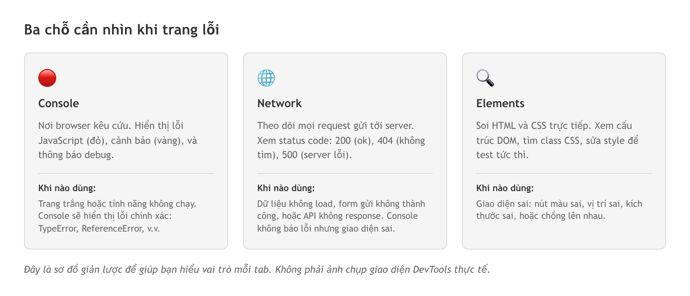
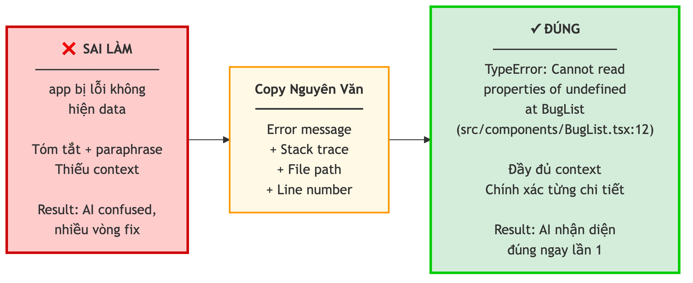
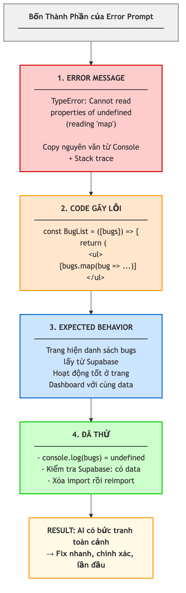

# Chương 14: Debug — từ đọc lỗi đến nhờ AI sửa đúng

App đang chạy ngon lành. Bạn nhờ AI thêm một tính năng nhỏ — một nút lọc danh sách. Mười phút sau, màn hình trắng xóa. Thứ vừa hoạt động buổi sáng giờ không mở được nữa, và bạn không rõ nó đã đổi những gì. Bạn copy dòng lỗi, dán cho AI, nhận lại một đoạn fix dài ngoằng. Apply xong, lỗi cũ mất nhưng lỗi mới hiện ra. Lần thứ hai, AI gợi ý cách khác — vẫn hỏng. Lần thứ ba, bạn bắt đầu tự hỏi: "Mình đang sửa lỗi hay đang tạo thêm lỗi?"

Chuyện này không chỉ xảy ra với bạn. Nó là một trong những trải nghiệm phổ biến nhất của vibe coding. Và phản xạ đầu tiên của hầu hết người mới — copy cả trang code dán cho AI rồi hỏi "sao không chạy" — là cách nhanh nhất để nhận về câu trả lời "tôi không thấy lỗi gì". Bởi vì AI không nhìn thấy những gì đang diễn ra trên trình duyệt của bạn. Nó chỉ thấy đúng những chữ bạn đưa cho nó.

Debug hiệu quả với AI cần hai kỹ năng tách bạch. Thứ nhất: *đọc* được browser đang "kêu cứu" cái gì — mở đúng chỗ, lấy đúng dòng. Thứ hai: *mô tả* lỗi đó cho AI một cách chính xác, để nó sửa đúng thay vì đoán mò. Cả hai đều không đòi hỏi bạn viết được code. Và nếu bạn là Tester hay QA, bạn sẽ nhận ra kỹ năng thứ hai chính là việc bạn làm mỗi ngày: viết bug report.

## Bật đèn trong phòng tối: mở DevTools

Hãy tưởng tượng bạn đang trong một căn phòng tối và có gì đó không ổn — tiếng động lạ, đồ vật sai chỗ. Việc đầu tiên bạn làm là bật đèn. **DevTools** (công cụ nhà phát triển tích hợp sẵn trong trình duyệt) chính là công tắc đèn cho ứng dụng web. Trên mọi trình duyệt hiện đại, nhấn phím **F12** hoặc click chuột phải vào trang và chọn Inspect — một panel hiện ra, và thế giới hậu trường của trang web mở ra trước mắt bạn.

Panel đó có nhiều tab, nhưng với vibe coding, bạn chỉ cần thuộc ba chỗ.

## Ba chỗ cần xem

Ba tab quan trọng nhất — mỗi tab là một "ống kính" khác nhau nhìn vào ứng dụng. Biết mở đúng tab cho đúng triệu chứng là nửa công việc debug.

**Console — nơi browser kêu cứu.** Mỗi khi có gì sai trong JavaScript (một biến chưa khai báo, một hàm không tồn tại, một API trả lỗi), browser ghi nhận vào đây. Console hiện ba loại thông báo: **Errors** màu đỏ — lỗi nghiêm trọng khiến một phần hoặc cả ứng dụng ngừng chạy; **Warnings** màu vàng — vấn đề chưa gây hỏng nhưng có thể rắc rối về sau; và **console.log output** — những dòng developer cố tình in ra để kiểm tra, giống note "đã đến bước này" khi bạn test thủ công. Đây là tab đầu tiên cần mở khi trang trắng hoặc crash.

Một dòng lỗi điển hình trong Console trông như thế này:

```text
TypeError: Cannot read properties of undefined (reading 'map')
    at ProductList (ProductList.tsx:12:15)
```

Dòng này cho bạn ba điều: loại lỗi là **TypeError** (lỗi về kiểu dữ liệu), vấn đề cụ thể là "đang cố đọc thuộc tính 'map' của một giá trị undefined" (biến dữ liệu đang rỗng), và nó xảy ra ở file `ProductList.tsx` dòng 12. Đây chính là "địa chỉ" chính xác để bạn hoặc AI tìm và sửa.

> 🧪 **Dành cho Tester/QA:** Console tab là bạn thân của bạn. Khi test một tính năng và thấy kết quả "lạ" trên giao diện, hãy mở Console *trước khi* báo bug. Một bug report kèm dòng error nguyên văn từ Console giúp developer hoặc AI fix nhanh gấp bội — họ không phải mất thời gian tái hiện và mò tìm lỗi nữa.

**Network — theo dõi mọi cuộc gọi API.** Mỗi khi trang gửi request lên server (lấy dữ liệu, gửi form đăng nhập, tải hình), tất cả được ghi lại ở đây. Con số quan trọng nhất mỗi dòng là **status code** (mã trạng thái) — nhắc lại từ Chương 7: **200** là thành công, **404** là không tìm thấy, **401/403** là không có quyền, **500** là server gặp lỗi. Đây là tab cần mở khi dữ liệu không load nhưng Console không báo lỗi gì — vì code JavaScript vẫn chạy đúng, vấn đề nằm ở cuộc trao đổi với server. Ví dụ: trang danh sách bug cứ loading mãi; mở Network, bạn thấy request đến `/api/bugs` trả về **401 Unauthorized** — API yêu cầu đăng nhập nhưng user chưa đăng nhập hoặc token đã hết hạn. Đó là thông tin Console không hề cho bạn biết.

> 📋 **Dành cho PM/BA:** Network tab giúp bạn "nhìn thấy" phần chìm của tảng băng khi test. Thay vì báo "trang không load dữ liệu", bạn báo được "API `/api/bugs` trả về 401 — có vẻ là vấn đề authentication". Kiểu thông tin đó giúp team fix nhanh hơn nhiều, và cho thấy bạn hiểu sản phẩm của mình tới mức nào.

**Elements — soi HTML và CSS trực tiếp.** Tab này cho bạn nhìn thấy cấu trúc HTML và style CSS của bất kỳ phần tử nào trên trang. Hữu ích khi giao diện sai: bạn yêu cầu AI làm nút màu xanh nhưng ra màu xám — inspect nút đó, thấy nó mang class `bg-gray-500` thay vì `bg-blue-500`, và gửi prompt chính xác thay vì mô tả mơ hồ "đổi màu nút giúp tôi". Bạn còn có thể sửa CSS trực tiếp trên browser để xem kết quả tức thì (thay đổi này chỉ tạm thời, reload là mất) — một cách thử nghiệm nhanh trước khi nhờ AI chỉnh code thật.



*HÌNH 14.1: Sơ đồ giản lược (không phải ảnh chụp sản phẩm) — cửa sổ DevTools chia ba nhãn: Console "lỗi JavaScript, màu đỏ/vàng", Network "request + status code", Elements "HTML + CSS". Mũi tên từ mỗi triệu chứng (trang trắng → Console, không load data → Network, UI sai → Elements) trỏ tới tab tương ứng.*

## Năm lỗi bạn sẽ gặp nhiều nhất

Sau khi có "đôi mắt" DevTools, đây là năm lỗi xuất hiện thường xuyên nhất khi vibe coding với Next.js — kèm cách phát hiện và cách fix.

**1. Hydration mismatch.** Hydration là quá trình Next.js kết nối HTML server tạo sẵn với JavaScript trên browser. Khi hai bên không khớp, browser báo lỗi. Tưởng tượng bạn đặt bánh qua mạng: ảnh trên web là bánh dâu, nhận về lại là bánh socola — "không khớp" chính là hydration mismatch. Console hiện "Hydration failed because the server rendered HTML didn't match the client." Nguyên nhân phổ biến: dùng API chỉ có trên browser (như `window`, `localStorage`) trong Server Component. Fix: dùng `useEffect` cho code cần truy cập browser, và thêm directive `"use client"` khi file dùng React hooks.

**2. CORS errors.** CORS (Cross-Origin Resource Sharing — chia sẻ tài nguyên khác nguồn gốc) là cơ chế bảo mật của browser. Khi ứng dụng ở domain A gọi API ở domain B, browser chặn nếu server B không cho phép — như bảo vệ chung cư B nói "tôi không biết bạn là ai". Console hiện "has been blocked by CORS policy", hay gặp khi chuyển từ localhost sang domain thật. Fix: cấu hình CORS headers trên server, hoặc dùng API route của chính app làm proxy.

**3. Thiếu `"use client"`.** Mặc định mọi component trong Next.js là Server Component, không hỗ trợ các hook tương tác. Yêu cầu AI tạo component có click hay gõ phím, nếu thiếu dòng `"use client"` ở đầu file, Console báo "useState only works in Client Components." Fix: thêm `"use client"` ở dòng đầu — và ghi vào rules file (Chương 6) quy tắc này để AI luôn tự thêm.

**4. Environment variable undefined.** Code tham chiếu một biến môi trường nhưng giá trị là `undefined`. Bạn đã gặp environment variables ở Chương 12. Hai nguyên nhân phổ biến: thiếu tiền tố bắt buộc cho biến cần dùng ở browser, hoặc chưa khởi động lại dev server sau khi thêm biến mới. Fix: kiểm tra tên biến và restart dev server.

**5. Module not found.** Code import một file hoặc thư viện không tồn tại: "Module not found: Can't resolve './components/BugList'". Hai nguyên nhân: sai đường dẫn (chú ý chữ hoa/thường — `BugList` khác `Buglist`, rất quan trọng trên server dù trên máy Mac có thể không báo), hoặc chưa cài package. Fix: kiểm tra đường dẫn hoặc cài lại thư viện.

> 🧪 **Dành cho Tester/QA:** Năm lỗi này là "top 5 bug report" bạn sẽ viết nhiều nhất khi test app vibe coding. Hãy dựng một checklist nhanh: mở Console soi errors, mở Network soi API calls, inspect Elements nếu UI sai. Với mỗi bug, ghi lại: (1) tab nào phát hiện, (2) error message nguyên văn, (3) các bước tái hiện. Đó là bug report "hạng A" mà bất kỳ developer hay AI nào cũng thích.

## Copy nguyên văn error — đừng tóm tắt

Đây là sai lầm số một của người mới, nên phải nói thẳng: **copy nguyên văn error message. Không tóm tắt. Không diễn đạt lại. Không dịch sang tiếng Việt.**

Hãy nghĩ tới lúc đi khám bệnh. Bạn nói "tôi đau bụng" — bác sĩ phải hỏi thêm chục câu. Nhưng nếu bạn nói "đau vùng thượng vị bên phải, nặng hơn sau khi ăn, bắt đầu từ sáng hôm qua, kèm buồn nôn" — chẩn đoán nhanh gấp bội. Error message chính là triệu chứng: càng nguyên văn, AI càng dễ "chẩn đoán".

Khi bạn viết "lỗi không hiện dữ liệu" thay vì copy nguyên văn `TypeError: Cannot read properties of undefined (reading 'map')`, bạn đã vứt đi thông tin quan trọng nhất. Dòng nguyên văn nói cho AI biết: đây là TypeError, một biến nào đó đang là `undefined`, và code đang cố gọi `.map()` trên biến đó. Từ đó AI suy ra nguyên nhân gốc trong vài giây. Và đừng chỉ copy đúng dòng lỗi chính — hãy lấy cả **stack trace** (những dòng bắt đầu bằng "at...", cho biết lỗi đi qua những file nào). Thiếu stack trace, AI có thể fix đúng triệu chứng nhưng sai nguyên nhân gốc. Thà thừa còn hơn thiếu.



*HÌNH 14.2: So sánh hai cách mô tả lỗi cho AI. Bên trái (❌) một ô chat chỉ ghi "app bị lỗi không hiện data". Bên phải (✅) một ô chat chứa error message nguyên văn kèm stack trace đầy đủ. Mũi tên dưới mỗi bên: trái → "AI đoán mò", phải → "AI chẩn đoán chính xác".*

## Format error prompt: lỗi + code + kỳ vọng + đã thử

Copy nguyên văn mới là bước đầu. Chỉ dán mỗi dòng lỗi cũng giống đưa bác sĩ mỗi tờ kết quả xét nghiệm mà không nói gì thêm. Prompt debug tốt nhất gồm bốn phần:

1. **Error message nguyên văn** — như vừa nói ở trên.
2. **Code gây lỗi** — không phải cả project, chỉ file và những dòng liên quan trực tiếp.
3. **Expected behavior** — bạn muốn nó làm gì, kết quả đúng ra sao.
4. **Đã thử gì** — phần hay bị bỏ nhất, để AI không gợi ý lại cách bạn đã thử và thất bại.

Thay vì viết "Trang bugs bị lỗi, không hiện gì cả. Sửa giúp.", bạn viết:

```text
## Error
TypeError: Cannot read properties of undefined (reading 'map')
  at BugList (src/components/BugList.tsx:12:25)

## Code gây lỗi (BugList.tsx)
const BugList = ({ bugs }) => {
  return (
    <ul>
      {bugs.map(bug => (
        <li key={bug.id}>{bug.title}</li>
      ))}
    </ul>
  );
};

## Expected behavior
Trang hiện danh sách bugs. Đang chạy tốt ở trang Dashboard với cùng data.

## Đã thử
- Kiểm tra database: data có thật
- console.log(bugs) trước .map() → kết quả là undefined
```

Prompt thứ hai cho AI bức tranh toàn cảnh: lỗi gì, ở đâu, bạn muốn gì, đã thử gì. AI nhận ra ngay: biến `bugs` đang `undefined` vì component nhận props nhưng chưa được truyền data từ component cha, hoặc data chưa fetch xong khi component render.

> 🧪 **Dành cho Tester/QA:** Format này quen không? Nó gần như trùng khớp bug report bạn viết hàng ngày: **Steps to Reproduce** (code gây lỗi), **Expected Result** (expected behavior), **Actual Result** (error message), **Additional Info** (đã thử). Bạn đã có kỹ năng này rồi — chỉ là áp vào một bối cảnh mới: giao tiếp với AI thay vì với developer. Nhiều Tester chuyển sang vibe coding thấy viết debug prompt còn dễ hơn, vì họ đã quen tư duy có cấu trúc.

Muốn nâng cấp, bạn có thể bọc từng phần bằng thẻ dạng XML — `<error>`, `<code>`, `<expected>`, `<tried>` — để AI khỏi nhầm phần nào là lỗi, phần nào là code, phần nào là mô tả của bạn. Cách này đặc biệt hữu ích khi error dài hoặc code nhiều dòng. Nếu bạn đã đọc về prompting ở Chương 4, đây chính là kỹ thuật ràng buộc rõ ràng áp dụng vào debug.



*HÌNH 14.3: Sơ đồ bốn thành phần của error prompt xếp dọc từ trên xuống — Error message, Code gây lỗi, Expected behavior, Đã thử — mỗi ô một màu, ghép lại thành một prompt hoàn chỉnh.*

## Khi fix đầu tiên thất bại

Có một sự thật ít người mới biết: **không phải AI nào cũng giỏi mọi loại lỗi**. Giống như hỏi bác sĩ da liễu về tim mạch — họ cho được lời khuyên chung, nhưng không bằng đúng chuyên khoa. Mỗi mô hình AI có thế mạnh riêng: có loại giỏi phân tích nguyên nhân gốc và các vấn đề kiến trúc, có loại nhanh với lỗi cú pháp, có loại xử lý được nhiều file cùng lúc.

Chiến lược thực tế: khi gửi error prompt cho một AI và fix đầu tiên không chạy, đừng vội gửi lại đúng prompt đó cho đúng model đó. Hãy **chuyển sang một AI khác** — nhưng kèm một bước quan trọng: **giải thích tại sao fix trước không work**. Ví dụ, model đầu gợi ý thay `bugs` bằng `bugs || []`; bạn thử, hết lỗi nhưng danh sách luôn trống. Khi chuyển sang model khác, bạn viết thêm: "Đã thử thay `bugs.map()` bằng `(bugs || []).map()`. Kết quả: hết lỗi nhưng danh sách luôn trống, dù data có thật. Vấn đề có vẻ không ở component này mà ở cách data được fetch và truyền xuống." Nhờ vậy model thứ hai không đi lại con đường cũ, mà tập trung vào hướng khác.

> 📋 **Dành cho PM/BA:** Chiến lược này giống hệt escalate một issue trong dự án. Khi một thành viên không giải quyết được, bạn không chỉ chuyển ticket sang người khác — bạn kèm context: "Đã thử cách A, không được vì lý do X. Cần người xem lại từ góc độ Y." Cùng một nguyên tắc khi "escalate" từ AI này sang AI khác.

## Quy tắc ba vòng: debug quá ba lần thì dừng

Đây có lẽ là khái niệm quan trọng nhất của chương, và của cả cuốn sách. Hãy tưởng tượng bạn lạc trong rừng. Rẽ trái, sai. Rẽ phải, sai. Quay lại thử đường khác, vẫn không thấy lối ra. Người khôn ngoan lúc này không đi bừa tiếp — họ dừng lại, nhìn bản đồ, hoặc quay về điểm xuất phát đã biết và thử một hướng hoàn toàn khác.

**Quy tắc ba vòng** là phiên bản coding của sự khôn ngoan đó: nếu đã thử fix một lỗi ba lần mà vẫn không được, **dừng lại ngay**. Đừng thử lần thứ tư. Mỗi lần fix thất bại, AI lại tạo thêm thay đổi làm code phức tạp hơn, khó hiểu hơn, xa hơn trạng thái từng chạy được. Đó là **debug spiral** — vòng xoáy debug — kẻ thù số một của vibe coder. Khi chạm vòng thứ ba, làm ba việc:

**Một — commit trạng thái hiện tại.** Dù code đang hỏng, commit lại với message rõ ràng như `debug: 3 attempts at BugList error - not resolved`. Bạn có một điểm tham chiếu để quay về.

**Hai — nghĩ lại vấn đề.** Thay vì hỏi "sửa lỗi này", hãy hỏi: "Giải thích cho tôi tại sao lỗi này xảy ra. Không cần sửa, chỉ giải thích." Hiểu nguyên nhân gốc thường mở ra một hướng giải quyết khác hẳn.

**Ba — thử approach khác.** Thay vì cố sửa component hiện tại, dựng lại nó từ đầu, đổi cách fetch data, hoặc đơn giản hóa logic. Mục tiêu là thoát vòng xoáy bằng cách đổi góc nhìn.

> ⚠️ **Lưu ý:** Vòng xoáy debug là nguyên nhân số một khiến vibe coder mất hàng giờ mà không tiến được bước nào. AI rất giỏi tạo ra những fix "trông có vẻ đúng" — hợp lý trên lý thuyết nhưng không chạy trong context cụ thể của project bạn. Mỗi fix thất bại lại chồng thêm code phức tạp, khiến lần fix sau càng khó. Nhận ra và dừng lại sớm là kỹ năng quan trọng nhất của chương này.

Một kịch bản thật: bạn xây tính năng lọc bug theo status, filter không chạy. Vòng 1 — AI nói do state không update, sửa state, vẫn hỏng. Vòng 2 — AI nói do component không re-render, thêm `key` prop, vẫn hỏng. Vòng 3 — AI nói do query không lọc đúng, sửa query, vẫn hỏng. Ba vòng rồi. Bạn dừng, commit, và hỏi: "Giải thích data flow từ database đến component FilteredBugList, từng bước, không cần sửa." AI giải thích và bạn phát hiện: data được fetch ở component cha nhưng truyền xuống qua một middleware đang cache data cũ. Vấn đề không ở BugList, không ở state, không ở query — mà ở một chỗ bạn chưa từng nghĩ tới.

## Rollback khi debug làm mọi thứ tệ hơn

Đôi khi sau ba vòng, không chỉ nút cũ vẫn hỏng mà cả trang còn vỡ layout và API sinh lỗi mới. Lúc này lựa chọn tốt nhất là **rollback** — quay về trạng thái trước khi bắt đầu debug. Nhưng bạn chỉ rollback được nếu đã làm một việc **trước khi** debug: commit. Đây là quy tắc vàng — trước khi dán bất kỳ error nào cho AI, hãy commit toàn bộ thay đổi hiện tại với message như `pre-debug: bug list page stable`. Commit đó là điểm an toàn: dù AI làm hỏng gì, bạn luôn quay về được. Chương 13 đã trình bày mô hình Git và các lệnh cốt lõi; đây chỉ là ba tình huống áp dụng:

```bash
# Trước khi debug — tạo điểm an toàn
git add .
git commit -m "pre-debug: bug list page stable"

# Sau khi debug thất bại — rollback
git checkout -- .          # Hủy mọi thay đổi chưa commit
git revert HEAD            # Hoặc: tạo commit undo nếu đã lỡ commit code debug
git stash                  # Hoặc: cất tạm thay đổi để xem lại sau (git stash pop lấy lại)
```

> 💡 **Tip:** Tạo một thói quen: mỗi khi DevTools hiện lỗi mới và bạn định hỏi AI, dừng năm giây và commit trước. Sau một thời gian, việc này tự động như save file trước khi tắt máy — và nó sẽ cứu bạn nhiều lần hơn bạn tưởng.

## Kỹ năng Tester/QA là siêu năng lực debug

Nếu bạn là Tester hoặc QA, đây là tin tốt không phải nói cho vui: kỹ năng của bạn là siêu năng lực trong debug với AI. Cụ thể ba điểm.

**Expected vs. Actual** là cốt lõi mọi bug report bạn từng viết. Trong debug với AI, đó đúng là hai phần "Expected behavior" và "Error message" của error prompt. Bạn đã nghĩ theo cách này hàng ngày — giờ chỉ đổi người nhận từ developer sang AI.

**Reproduce steps** là thứ developer yêu Tester vì nó. Viết cho AI "Lỗi xảy ra khi click nút Filter, chọn status 'Open', danh sách không update. Refresh trang thì lại đúng" — bạn cho AI một đường tái hiện chính xác, tốt hơn gấp bội "filter không chạy".

**Test after fix** là điều nhiều người bỏ qua nhưng Tester không bao giờ quên. Sau khi AI sửa xong, đừng vội sang tính năng tiếp theo. Kiểm tra: lỗi cũ hết chưa, có lỗi mới không, tính năng khác có bị ảnh hưởng không. Đó chính là regression testing — quan trọng gấp đôi trong vibe coding, vì AI có thể sửa một chỗ mà làm hỏng chỗ khác.

> 🧪 **Dành cho Tester/QA:** Bạn có một lợi thế developer không có: bạn nghĩ như người dùng, không như người viết code. Khi AI sửa lỗi, developer thường kiểm tra "code có chạy không". Bạn kiểm tra "người dùng có thao tác được không". Hai góc nhìn khác nhau, và góc nhìn của bạn thường bắt được những lỗi mà góc nhìn kỹ thuật bỏ sót. Hãy tự hào về điều đó.

## Khi lỗi cần "nhìn" mới hiểu

Có những lỗi mà text không mô tả tốt được: hai nút chồng lên nhau, layout vỡ trên mobile, modal hiện sai vị trí. Với những trường hợp này, gửi kèm ảnh chụp màn hình hiệu quả hơn nhiều — nhiều công cụ vibe coding năm 2026 cho phép dán ảnh trực tiếp vào chat. Một mẹo nhỏ mà rất hiệu quả: khoanh vùng lỗi bằng màu đỏ trước khi gửi (dùng bất kỳ công cụ chỉnh ảnh có sẵn nào), để AI tập trung đúng chỗ thay vì phân tích cả màn hình. Kết hợp ảnh với text mô tả bối cảnh và kỳ vọng — "chỉ bị trên mobile, mong nút Save luôn hiện đầy đủ, cách footer ít nhất 16px" — cho kết quả tốt hơn hẳn chỉ dùng một trong hai.

Ở đây cũng cần nói ngắn về hướng đi mới: đã có công nghệ cho phép AI tự đọc thẳng browser của bạn — console, network, DOM — thay vì bạn copy-paste thủ công. Nhưng bạn vẫn phải hiểu DevTools để kiểm tra xem AI có đọc đúng không; đọc hiểu DevTools vẫn là kỹ năng nền, không bị thay thế. Ta sẽ gặp lại kiến trúc kết nối này ở Chương 18, khi bàn về agentic workflows và MCP.

## Quy trình debug hoàn chỉnh

Ghép tất cả lại thành một quy trình bạn có thể theo mỗi khi gặp lỗi:

- **Bước 0 — Commit trước.** Lưu trạng thái hiện tại làm điểm an toàn.
- **Bước 1 — Tìm lỗi bằng DevTools.** Mở Console, Network, hoặc Elements để xác định chính xác lỗi gì.
- **Bước 2 — Copy nguyên văn.** Lấy toàn bộ message và stack trace.
- **Bước 3 — Viết error prompt theo format.** Bốn phần: error + code + expected + đã thử.
- **Bước 4 — Gửi cho AI và apply fix.** Kiểm tra: lỗi hết chưa, có lỗi mới không.
- **Bước 5 — Nếu fail, đổi AI khác.** Giải thích tại sao fix trước không work.
- **Bước 6 — Nếu fail lần ba, dừng lại.** Commit, đổi approach, hoặc rollback về bước 0.

> 📋 **Dành cho PM/BA:** Quy trình này rất giống một escalation process trong quản lý dự án. Bước 0 là lưu baseline. Bước 1–4 là hỗ trợ cấp một. Bước 5 là escalate lên cấp hai. Bước 6 là quyết định rollback — điều PM gọi là "cut losses and regroup". Nếu bạn từng quản lý incident response, quy trình này sẽ quen thuộc ngay.

> 🧰 **Đề xuất công cụ:** *Tính đến 2026-07.* Các AI IDE và nền tảng dựng app từ prompt hiện có Cursor, Windsurf, Lovable, Bolt.new; nhóm cho phép AI đọc thẳng browser để debug đang phát triển quanh chuẩn MCP. Tính năng dán ảnh vào chat và khả năng đọc browser thay đổi nhanh giữa các công cụ — kiểm tra tài liệu chính thức của công cụ bạn dùng trước khi trông cậy vào nó. Xem thêm trang [Đề xuất công cụ](../de-xuat-cong-cu.md).

## Tóm tắt

- **DevTools** (mở bằng F12) là "công tắc đèn" để nhìn thấy điều đang xảy ra trong app. Ba chỗ cần thuộc: Console (lỗi JavaScript, đỏ/vàng), Network (API request + status code), Elements (HTML + CSS).
- Mở đúng tab theo triệu chứng: trang trắng → Console; dữ liệu không load → Network; giao diện sai → Elements.
- **Copy nguyên văn** error message kèm stack trace — không tóm tắt, không dịch. Đây là sai lầm số một của người mới và là thông tin quan trọng nhất AI cần.
- Format error prompt bốn phần: **error + code gây lỗi + expected behavior + đã thử**. Nó gần như trùng với bug report của Tester.
- Khi fix đầu fail, **đổi sang AI khác** kèm lời giải thích tại sao fix trước không chạy, để nó không đi lại đường cũ.
- **Quy tắc ba vòng:** debug quá ba lần thì dừng, commit, đổi approach. Không bao giờ fix lần thứ tư trên cùng hướng cũ.
- **Commit trước khi debug** là quy tắc vàng để luôn rollback được (Chương 13). Kỹ năng Tester/QA — expected vs. actual, reproduce steps, test after fix — là siêu năng lực debug.

## Bài tập

**Bài 14.1 — Săn ba con bug bằng DevTools**

Mở một project bạn đã dựng ở các phần trước (hoặc cố tình tạo lỗi: xóa một import, sửa sai tên biến, xóa một class CSS). Chỉ dùng DevTools, không dùng AI, tìm và mô tả ba loại bug: một lỗi JavaScript (Console), một lỗi API (Network), một lỗi giao diện (Elements). Mở từng tab một cách có hệ thống — Console trước, Network tiếp, Elements sau.

*Đầu ra:* một bảng ba dòng, mỗi dòng ghi: tab nào phát hiện, error message nguyên văn (hoặc mô tả chính xác điều thấy được), và bạn đoán nguyên nhân là gì.

**Bài 14.2 — Đọ sức prompt tốt và prompt tồi**

Chọn một bug từ Bài 14.1. Viết hai phiên bản prompt cho cùng bug đó: phiên bản A chỉ ghi "nút này bị lỗi", phiên bản B đầy đủ bốn phần (error + code + expected + đã thử). Gửi lần lượt cho AI, mỗi lần đo số vòng phải iterate tới khi lỗi hết. Nếu chạm ba vòng mà chưa xong, dừng theo quy tắc ba vòng và ghi lại.

*Đầu ra:* một bảng so sánh hai phiên bản với các cột — Prompt, Số vòng fix, Kết quả, Nhận xét — kèm một câu kết luận: thông tin cụ thể đã rút ngắn quá trình debug bao nhiêu.

## Tiếp theo

Chương này dạy bạn cách sửa lỗi *sau khi* nó xuất hiện. Nhưng Tester giỏi biết rằng đắt nhất luôn là con bug lọt tới tay người dùng thật. Chương 15 chuyển từ chữa sang phòng: tư duy test case cho vibe coding — cách test chủ động theo happy path, edge cases và error states để bắt lỗi trước khi chúng thành vấn đề. Nếu chương này dạy bạn sửa lỗi, chương sau dạy bạn ngăn lỗi xảy ra.
