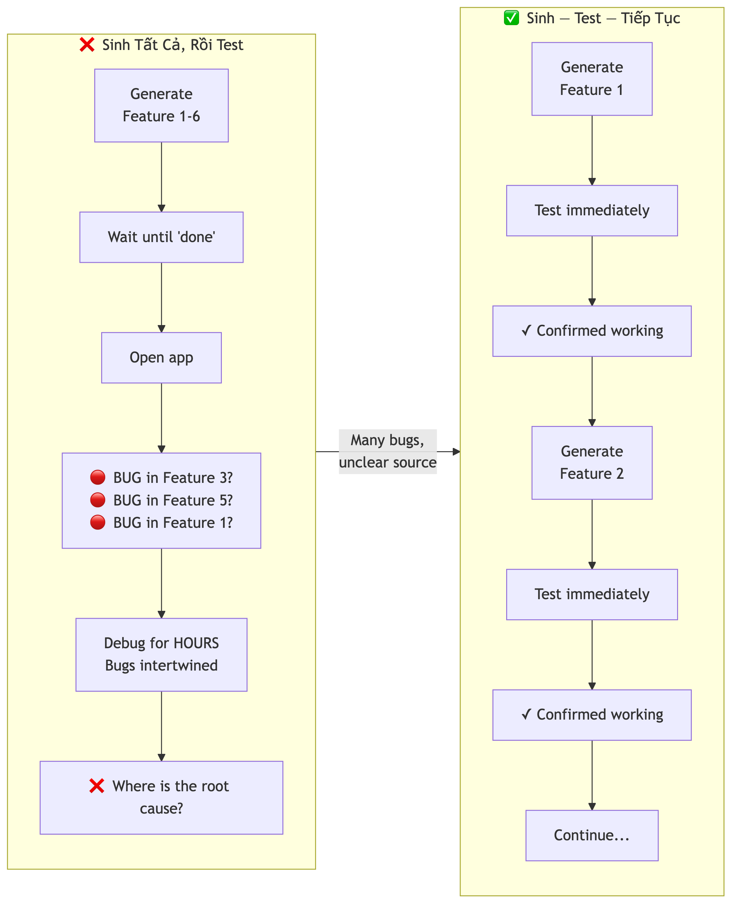
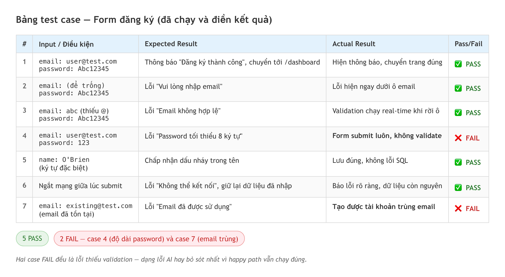

# Chương 15: Tư duy test case cho vibe coding

App của bạn chạy hoàn hảo trong buổi demo. Bạn nhập email quen thuộc, mật khẩu quen thuộc, bấm nút, mọi thứ mượt như lụa. Sếp gật đầu, đồng nghiệp vỗ tay.

Rồi người đầu tiên dùng thật ngồi xuống. Họ để trống ô email và bấm luôn. Họ dán một cái tên dài nửa màn hình. Họ bấm "Gửi" ba lần vì thấy chậm. Và app gãy — ngay trước mặt mọi người.

Nó không gãy vì bạn code kém. Nó gãy vì bạn chỉ test đúng **cái đường mà bạn đã hình dung sẵn** — con đường của người biết trước app hoạt động thế nào. Người dùng thật thì không biết, và họ đi những lối bạn chưa bao giờ nghĩ tới.

Đây là chương về cách bịt những lối đó lại trước khi ai khác tìm thấy chúng. Và nếu bạn là Tester hay QA, đây là chương bạn sẽ thấy như về nhà. Mọi kỹ năng bạn đã tích lũy — nghĩ ra edge case, phân loại lỗi, viết test case — AI không thay được. Ngược lại, đó là lợi thế cạnh tranh lớn nhất của bạn trong vibe coding.

## Nếm trước khi bưng ra bàn

Bạn đã bao giờ nấu xong một món rồi bưng thẳng ra bàn mà không nếm chưa? Chắc là không — bạn luôn nếm một muỗng, chỉnh gia vị, rồi mới phục vụ. Vậy mà trong vibe coding, rất nhiều người làm ngược lại: họ nhờ AI sinh một loạt tính năng, rồi chỉ khi đưa lên mạng cho người khác dùng mới phát hiện mọi thứ không chạy như mong đợi.

Nguyên tắc đầu tiên, và cũng là nguyên tắc bị lãng quên nhiều nhất, là **test sau mỗi bước AI sinh code** (*test after every generation step*).

Hãy tưởng tượng bạn xây một tòa nhà bằng gạch LEGO. Mỗi khi gắn xong một tầng, bạn lắc thử xem nó có vững không rồi mới xây tầng tiếp. Nếu bạn xây liền bảy tầng rồi mới lắc và cả tòa đổ, bạn sẽ không biết tầng nào gây ra vấn đề.

Vibe coding cũng vậy. Mỗi lần AI sinh một đoạn code mới — một nút, một form, một lời gọi API — bạn cần thử ngay trước khi yêu cầu AI làm tiếp. Quy tắc đơn giản đến mức gần như thô: **build nút thì bấm nó, build form thì gửi nó, build API call thì kiểm tra kết quả trả về.** Không có ngoại lệ.

Lý do rất thực tế. Khi AI sinh 50 dòng code và có lỗi, bạn biết lỗi nằm trong 50 dòng đó. Nhưng nếu bạn để AI sinh 500 dòng rồi mới test, lỗi có thể nằm bất cứ đâu — và tệ hơn, các lỗi chồng chất lên nhau, làm việc gỡ trở nên cực khó. Như đã thấy ở Chương 14, gỡ một lỗi đơn lẻ dễ hơn nhiều so với gỡ một đám lỗi đan xen.

> 💡 **Tip:** Tạo thói quen "sinh — test — tiếp tục". Mỗi lần nhờ AI tạo một tính năng, dừng lại, mở app, thử tính năng đó. Chỉ khi nó chạy đúng bạn mới prompt tiếp. Nghe thì chậm, nhưng thực tế nhanh hơn nhiều so với việc quay lại sửa sau.

Đây là một quy trình vibe coding có kỷ luật, không phụ thuộc bạn dùng công cụ nào:

```
Bước 1: Prompt "Tạo form đăng ký với email và password"
  → Test: mở preview, điền thử email và password, nhấn Submit
  → Kiểm tra: form có gửi được không? Có hiện thông báo gì không?

Bước 2: Prompt "Thêm validation: email phải hợp lệ, password tối thiểu 8 ký tự"
  → Test: thử email sai (vd "abc"), password ngắn (vd "123")
  → Kiểm tra: có hiện thông báo lỗi không? Thông báo có đúng không?

Bước 3: Prompt "Kết nối form với dịch vụ auth có sẵn"
  → Test: đăng ký một tài khoản thật, kiểm tra trong database
  → Kiểm tra: user có xuất hiện trong database không?
```

Mỗi bước nhỏ được test riêng. Nếu bước 2 có vấn đề, bạn biết chính xác lỗi nằm ở validation — không phải ở form, không phải ở tầng auth.



*HÌNH 15.1: So sánh hai quy trình — "Sinh tất cả rồi test" dẫn tới một chồng lỗi đan xen, và "Sinh — test — tiếp tục" trong đó mỗi bước được xác nhận trước khi đi tiếp.*

## Ba tầng test: happy path, edge case, error state

Khi test một tính năng, nhiều người chỉ thử đúng một cách — cách "bình thường nhất". Họ điền đúng email, đúng password, bấm gửi, thấy thành công, rồi kết luận "xong". Nhưng người dùng thật không bao giờ làm đúng mọi thứ. Họ để trống ô email, dán một đoạn văn 500 ký tự vào ô tên, bấm gửi hai lần liên tiếp.

Để test có hệ thống, bạn cần nghĩ theo ba tầng.

**Happy path** (con đường hạnh phúc) là kịch bản lý tưởng — người dùng làm đúng mọi thứ. Đây là bài test cơ bản nhất; nếu happy path đã không chạy thì bạn có vấn đề nghiêm trọng. Ví dụ với form đăng ký: email hợp lệ, password đủ dài, bấm gửi, nhận thông báo thành công.

**Edge cases** (trường hợp biên) là những tình huống ngoại lệ mà người dùng thật sẽ gặp — cố tình hoặc vô tình. Đây là nơi bug ẩn nấp nhiều nhất: email để trống, email không có ký tự @, password chỉ một ký tự, tên chứa emoji hoặc dấu nháy như O'Brien, số điện thoại lại có chữ cái.

**Error states** (trạng thái lỗi) là những tình huống hệ thống gặp sự cố — không phải lỗi của người dùng: mất mạng giữa lúc đang gửi, server trả về lỗi 500, phiên đăng nhập hết hạn khi người dùng đang điền form, API bị vượt giới hạn số lần gọi.

> 🧪 **Dành cho Tester/QA:** Ba tầng này bạn đã quen từ trước — equivalence partitioning, boundary value analysis, error guessing. Trong vibe coding, những kỹ năng đó là siêu năng lực. Trong khi phần đông vibe coder chỉ biết test happy path, bạn có thể nghĩ ra 20 edge case trong năm phút. Đó chính là giá trị bạn mang lại — và AI không thay thế được sự nhạy bén của một QA kinh nghiệm khi nghĩ ra các kịch bản "phá" ứng dụng.

Một mẹo hay là nghĩ theo "công thức phá hoại": nếu bạn là một người dùng cố tình làm sai mọi thứ, bạn sẽ làm gì? Để trống ô? Bấm nút 100 lần? Mở hai tab cùng lúc? Nhập số âm vào ô số lượng? Dán một ảnh vào ô lẽ ra chỉ nhận chữ? Suy nghĩ như vậy giúp bạn tìm ra những bug mà happy path không bao giờ lộ ra.

Có một loại edge case đặc biệt dễ bị bỏ sót vì nó không đến từ một lần thao tác sai, mà từ *thứ tự* thao tác. Người dùng bấm "Lưu", chưa kịp thấy phản hồi thì bấm "Quay lại", rồi bấm "Lưu" lần nữa. Hoặc họ mở form ở tab này, để đó nửa tiếng, quay lại điền tiếp trong khi phiên đăng nhập đã hết hạn từ lâu. AI gần như không bao giờ tự nghĩ tới những chuỗi thao tác kiểu này, vì nó sinh code cho từng hành động riêng lẻ. Chính khoảng trống đó là nơi kinh nghiệm QA ghi điểm rõ nhất: bạn không test từng nút, bạn test *cái luồng* mà người thật đi qua.

> 📋 **Dành cho PM/BA:** Ba tầng test này tương ứng trực tiếp với **acceptance criteria** trong user story. Khi viết AC, hãy bao gồm cả ba: "Given valid input… (happy path)", "Given empty email… (edge case)", "Given server error… (error state)". Acceptance criteria tốt là AC đã tính đến chuyện gì xảy ra khi mọi thứ không diễn ra như kế hoạch. Đây cũng chính là loại tư duy bạn đã rèn ở Chương 5 khi viết PRD — mô tả rõ hệ thống phải làm gì trong các tình huống bất thường.

## Viết test case dạng bảng

Nghĩ ra test case trong đầu là một chuyện; ghi chúng lại có hệ thống là chuyện khác. **Test case table** (bảng test case) là cách đơn giản nhất để tổ chức — và tin tốt là bạn không cần công cụ đặc biệt nào. Một spreadsheet hay một bảng Markdown là đủ.

Cấu trúc cơ bản gồm năm cột: số thứ tự, input/điều kiện, hành động, kết quả mong đợi, kết quả thực tế, và Pass/Fail.

| # | Input / Điều kiện | Action | Expected Result | Actual | Pass/Fail |
|---|-------------------|--------|-----------------|--------|-----------|
| 1 | Email: user@test.com, Password: Abc12345 | Nhấn "Đăng ký" | Thông báo "thành công", chuyển tới dashboard | | |
| 2 | Email: để trống | Nhấn "Đăng ký" | Thông báo "Vui lòng nhập email" | | |
| 3 | Email: abc (không có @) | Nhấn "Đăng ký" | Thông báo "Email không hợp lệ" | | |
| 4 | Password: 123 (quá ngắn) | Nhấn "Đăng ký" | Thông báo "Password tối thiểu 8 ký tự" | | |
| 5 | Email đã tồn tại | Nhấn "Đăng ký" | Thông báo "Email đã được sử dụng" | | |
| 6 | Mất kết nối mạng | Nhấn "Đăng ký" | Thông báo "Không thể kết nối, thử lại" | | |
| 7 | Password: 12345678 (không có chữ cái) | Nhấn "Đăng ký" | Tùy yêu cầu: pass hoặc cảnh báo | | |

Chú ý cách bảng này tự phân loại: dòng 1 là happy path, dòng 2–5 là edge case, dòng 6 là error state, dòng 7 là trường hợp "mù mờ" cần làm rõ yêu cầu. Khi test, bạn điền cột "Actual" và đánh dấu Pass/Fail. Bất kỳ dòng nào Fail đều trở thành một bug report — hoặc một prompt để nhờ AI sửa.

Đây là sức mạnh của test case table: nó biến việc test từ "bấm lung tung rồi thấy lỗi" thành một quy trình có hệ thống, lặp lại được, và chia sẻ được với team.

Một dòng Fail còn có giá trị hơn thế: nó gần như là một prompt sửa lỗi viết sẵn. Cột "Expected Result" cho AI biết bạn *muốn* gì, cột "Actual Result" cho AI biết nó *đang* làm sai ở đâu. Thay vì gõ "app bị lỗi, sửa giúp", bạn có thể dán thẳng dòng test đó: *"Khi email để trống và người dùng bấm Đăng ký, tôi cần hiện thông báo 'Vui lòng nhập email', nhưng hiện tại form vẫn gửi đi và không báo gì. Sửa lại phần validation."* Một mô tả có expected và actual rõ ràng chính là điều làm nên chu kỳ debug hiệu quả ở Chương 14 — bảng test case của bạn nuôi trực tiếp vào đó.

> 💡 **Tip:** Bạn có thể nhờ AI dựng bảng test case. Thử prompt: *"Cho form đăng ký có email, password và tên. Tạo bảng test case 10 dòng gồm happy path, edge case (input rỗng, quá dài, ký tự đặc biệt) và error state (mất mạng, email trùng). Format bảng Markdown."* AI sẽ sinh ra một bảng khá ổn — nhưng bạn phải review và thêm những trường hợp AI bỏ sót. AI giỏi happy path, nhưng thường thiếu đúng những edge case nhạy bén mà một QA kinh nghiệm mới nghĩ ra.



*HÌNH 15.2: Bảng test case hoàn chỉnh cho form đăng ký, với cột Actual Result và Pass/Fail đã được điền — bản dựng lại bằng HTML để in rõ.*

## "Vibe testing": để AI sinh test tự động

**Vibe testing** đang trở thành một hướng nóng trong giới QA năm 2026. Ý tưởng cốt lõi: thay vì viết code test bằng tay, bạn mô tả kịch bản test bằng ngôn ngữ tự nhiên, và AI tự sinh ra code test automation, chạy nó, thậm chí tự sửa khi test bị fail.

Đây không phải một trend nhất thời. Thị trường kiểm thử có AI hỗ trợ đang tăng nhanh và được dự báo còn tăng mạnh trong nhiều năm tới — dấu hiệu của một sự chuyển đổi cơ cấu trong ngành testing, không phải một cơn sốt ngắn hạn. Lý do sâu xa: khi AI hạ thấp rào cản viết test tự động, kỹ năng khan hiếm không còn là "biết cú pháp của công cụ test" mà là "biết cần test cái gì" — và đó đúng là thứ một Tester giỏi đã có sẵn trong đầu.

Một số công cụ test automation thế hệ mới hiện có ba tầng làm việc nối tiếp nhau. Tầng thứ nhất tự "đi dạo" qua app của bạn — nhận diện các form, nút, luồng chính — rồi sinh ra một kế hoạch test. Tầng thứ hai biến kế hoạch đó thành các file test thật, chạy được, mà bạn không phải viết một dòng nào. Tầng thứ ba chạy bộ test và khi có test gãy vì giao diện thay đổi, nó tự sửa lại code test cho khớp. Cái tầng "tự chữa lành" này giải quyết đúng nỗi đau lớn nhất của test automation: việc bảo trì test cũ mỗi khi UI đổi.

Điểm quan trọng với người không viết code là: bạn không cần tự viết code test. Đoạn dưới đây là một test được sinh tự động — bạn đọc để *hiểu nó đang test cái gì*, chứ không phải để tự gõ ra:

```typescript
// Đoạn test này do công cụ tự sinh — bạn không viết dòng nào
test('đăng ký thành công', async ({ page }) => {
  await page.goto('/register');          // mở trang đăng ký
  await page.fill('[name="email"]', 'test@example.com');
  await page.fill('[name="password"]', 'MyPassword123');
  await page.click('button[type="submit"]');   // bấm nút đăng ký
  await expect(page).toHaveURL('/dashboard');   // kỳ vọng chuyển tới dashboard
});
```

Nhìn có vẻ kỹ thuật, nhưng bạn chỉ cần đọc phần chú thích để biết test này kiểm tra điều gì: mở trang, điền email và password, bấm nút, và kỳ vọng app chuyển sang trang dashboard.

> ⚠️ **Lưu ý:** Vibe testing rất hứa hẹn, nhưng cần thực tế. Tính đến đầu 2026, các công cụ này chạy tốt nhất với những luồng đơn giản và phổ biến (đăng ký, đăng nhập, thêm-sửa-xóa cơ bản). Với luồng phức tạp hoặc đặc thù ngành, bạn vẫn cần con người viết và review test. Hãy xem vibe testing như "trợ lý AI cho QA" — nó tăng tốc, nhưng không thay thế tư duy.

> 🧰 **Đề xuất công cụ:** *Tính đến 2026-07.* Nhóm test automation cho web hiện có công cụ mã nguồn mở miễn phí như **Playwright** (kèm chế độ ghi thao tác thành code và các test agent tự sinh/tự sửa), và các nền tảng thương mại như **testRigor** (viết test bằng tiếng Anh tự nhiên) hay **Mabl** (low-code, tích hợp AI). Cho unit test trong dự án Next.js, **Vitest** là lựa chọn miễn phí phổ biến. Tính năng và mô hình giá đổi nhanh — kiểm tra trang chủ trước khi chọn. Xem thêm trang [Đề xuất công cụ](../de-xuat-cong-cu.md).

## Test thủ công hay test tự động?

Một câu hỏi thường gặp: "Tôi nên test bằng tay hay viết test tự động?" Câu trả lời là: **cả hai, nhưng ở những thời điểm khác nhau.**

**Test thủ công** là nơi bạn nên bắt đầu. Bạn mở app, bấm qua các tính năng, nhập dữ liệu, quan sát kết quả. Không cần cài gì thêm, không cần viết code, không cần hiểu framework test. Với vibe coder, đây là cách test tự nhiên nhất và nên làm **mỗi lần AI sinh code mới**. Nó đặc biệt mạnh ở những việc automation khó làm: giao diện có đẹp không, trải nghiệm có mượt không, và những tình huống "cảm tính" khó diễn đạt thành code. Khi bạn nhìn màn hình và thấy "cái này sai sai" — nút lệch một chút, chữ tràn ra ngoài khung, màu nền không đúng ý — đó là lúc test thủ công phát huy sức mạnh, và cũng là loại tín hiệu mà không một dòng code test nào bắt được thay bạn.

**Test tự động** kiểm tra từng phần nhỏ của ứng dụng và chạy đi chạy lại rất nhanh. Bạn có thể nhờ AI viết cho mình, ví dụ một bộ unit test kiểm tra một hàm validate email:

```typescript
// Unit test cho hàm kiểm tra email
describe('validateEmail', () => {
  it('chấp nhận email hợp lệ', () => {
    expect(validateEmail('user@test.com')).toBe(true);
  });
  it('từ chối email không có @', () => {
    expect(validateEmail('usertest.com')).toBe(false);
  });
  it('từ chối email rỗng', () => {
    expect(validateEmail('')).toBe(false);
  });
});
```

Đoạn này đọc khá dễ ngay cả khi bạn không biết TypeScript: `expect(validateEmail('user@test.com')).toBe(true)` nghĩa là "kỳ vọng khi gọi validateEmail với 'user@test.com', kết quả là true". Mỗi dòng `it(...)` là một test case.

Vậy khi nào dùng cái nào? Dùng **test thủ công** khi bạn đang ở giai đoạn đầu, app thay đổi liên tục, bạn cần kiểm tra giao diện và trải nghiệm, hoặc tính năng còn quá mới. Thêm **test tự động** khi app đã ổn định và bạn muốn chắc rằng những gì đang chạy sẽ không bị gãy khi thêm tính năng mới — đây gọi là **regression testing** (test hồi quy), và nó là lý do chính để viết test tự động. Khi app đã có 10–15 tính năng chạy tốt, bạn không muốn mỗi lần thêm tính năng thứ 16 lại phải test tay lại cả 15 cái trước.

| Tiêu chí | Test thủ công | Test tự động (AI viết) |
|----------|---------------|------------------------|
| Khi nào bắt đầu | Ngay từ bước đầu | Khi app ổn định |
| Cần viết code | Không | AI viết, bạn review |
| Tốc độ chạy | Chậm (bấm tay) | Nhanh (chạy tự động) |
| Tìm bug mới | Tốt (khám phá tự do) | Kém (chỉ test cái đã viết) |
| Chống regression | Kém (dễ quên) | Xuất sắc (chạy mỗi lần) |
| Kiểm tra UX/giao diện | Tốt | Kém |

> 🧪 **Dành cho Tester/QA:** Đây là lúc kỹ năng của bạn tỏa sáng nhất. Nhiều developer viết test nhưng không biết test **cái gì có giá trị** — họ test những thứ hiển nhiên và bỏ qua edge case quan trọng. Bạn, với kinh nghiệm QA, biết chính xác đâu là những điểm yếu cần test. Trong vibe coding, vai trò của bạn chuyển từ "người bấm" sang "người thiết kế test strategy": bạn quyết định test cái gì, AI viết code test. Đó là sự kết hợp hoàn hảo.

## Khép vòng: Build → Test → Fix → Test lại

Chương 14 dạy bạn cách đọc lỗi và nhờ AI sửa đúng. Chương này thêm mảnh còn thiếu — làm sao **phát hiện lỗi trước khi nó tự lộ ra** trước mặt người dùng. Ghép lại, bạn có một vòng tròn hoàn chỉnh:

**Build** (AI sinh code) → **Test** (bạn kiểm tra) → **tìm bug** → **Fix** (nhờ AI sửa — Chương 14) → **Test lại** (xác nhận fix chạy) → **build tiếp**.

Vòng này lặp cho mỗi tính năng. Nó không phải dấu hiệu "làm sai" — nó là quy trình chuẩn của mọi dự án phần mềm. Khác biệt duy nhất trong vibe coding là AI giúp bạn build và fix nhanh hơn; nhưng bạn vẫn là người quyết định **test cái gì** và **chấp nhận khi nào**. Vai trò của test trong vòng lặp không phải là bước cuối cùng cho có — nó là cái van an toàn quyết định code có được đi tiếp hay phải quay lại sửa.

Ở đây kinh nghiệm QA đảo ngược quan hệ thường thấy. Trong đội phát triển truyền thống, tester thường là người đến sau cùng, nhận sản phẩm đã đóng gói và tìm chỗ hỏng. Trong vibe coding, người có tư duy test case lại là người dẫn dắt: bạn định nghĩa "đúng" nghĩa là gì trước khi AI sinh ra bất cứ thứ gì, rồi dùng chính định nghĩa đó làm thước đo cho từng bước. Kỹ năng nghĩ ra cách một hệ thống có thể hỏng — thứ mất nhiều năm để rèn — trở thành thứ khan hiếm và giá trị nhất trong một quy trình mà code thì sinh ra rẻ và nhanh.

## Tóm tắt

- Test ngay sau mỗi lần AI sinh code, đừng đợi "xong hết" mới test. Quy tắc: build nút thì bấm nó, build form thì gửi nó.
- Mỗi tính năng cần test theo ba tầng: happy path (đúng), edge cases (ngoại lệ), error states (lỗi hệ thống).
- Test case table — bảng gồm Input, Action, Expected Result, Actual Result, Pass/Fail — là công cụ đơn giản nhưng cực hiệu quả; một spreadsheet hay bảng Markdown là đủ.
- Vibe testing là xu hướng QA 2026: mô tả test bằng ngôn ngữ tự nhiên, AI sinh và chạy test automation. Đây là mảng đang tăng nhanh và được dự báo còn tăng mạnh — một chuyển đổi cơ cấu, không phải trend ngắn hạn.
- Bắt đầu với test thủ công, thêm test tự động khi app ổn định và cần chống regression.
- QA/Tester có lợi thế lớn trong vibe coding: kỹ năng thiết kế test case, nghĩ ra edge case và xây test strategy chuyển thẳng sang thế giới AI-assisted development.
- Chu kỳ Build → Test → Fix → Test lại là quy trình chuẩn, không phải dấu hiệu làm sai; test là cái van an toàn quyết định code được đi tiếp hay phải quay lại.

## Bài tập

**Bài 15.1 — Viết test case cho form đăng ký.** Cho một form đăng ký gồm ba trường: Email, Password, Họ tên, kết nối với một dịch vụ auth có sẵn.

1. Viết một bảng test case ít nhất 12 dòng: hai-ba happy path, năm-sáu edge case (email rỗng, password quá ngắn, tên chứa ký tự đặc biệt, email trùng…), và hai-ba error state (mất mạng, server lỗi).
2. Nếu bạn đã dựng một form đăng ký ở các chương trước, chạy thử các test case đó trên app của bạn. Điền cột Actual Result và đánh dấu Pass/Fail.
3. Với mỗi dòng Fail, viết một prompt để nhờ AI sửa lỗi tương ứng.

*Đầu ra:* một bảng test case đầy đủ (Markdown hoặc spreadsheet) với ≥ 12 dòng, cột Pass/Fail đã điền nếu có app để chạy, và danh sách prompt sửa lỗi cho các dòng Fail.

**Bài 15.2 — So găng với AI về edge case.** Chọn một tính năng bất kỳ (ví dụ ô tìm kiếm, form đặt lịch). Trước tiên tự bạn liệt kê tất cả edge case nghĩ ra được trong năm phút. Sau đó nhờ AI liệt kê edge case cho cùng tính năng đó. So sánh hai danh sách.

*Đầu ra:* hai danh sách đặt cạnh nhau, kèm một đoạn ngắn ghi lại những edge case bạn nghĩ ra mà AI bỏ sót — và ngược lại. Đây là bằng chứng cụ thể cho giá trị mà một QA mang lại bên cạnh AI.

## Tiếp theo

Bạn đã biết cách test để bắt lỗi *chức năng* — app có làm đúng việc được yêu cầu không. Nhưng có một loại lỗi không bao giờ hiện ra trong test case chức năng: app làm đúng mọi thứ được yêu cầu, rồi làm thêm một việc không ai yêu cầu — như để lộ dữ liệu người khác. Đó là lỗ hổng bảo mật, và AI sinh ra chúng nhiều hơn bạn nghĩ. Chương 16 sẽ đi qua mười lỗi bảo mật phổ biến nhất trong code AI sinh ra, cùng một khung sáu lớp để bạn không phải nhớ chúng rời rạc.
