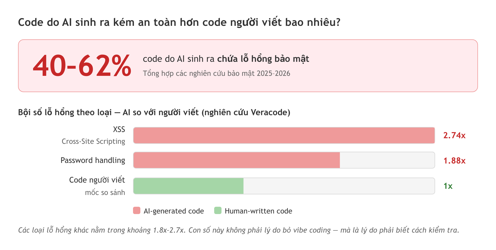
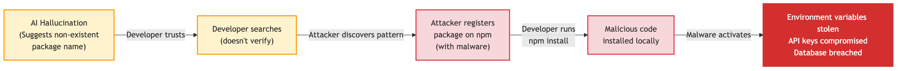
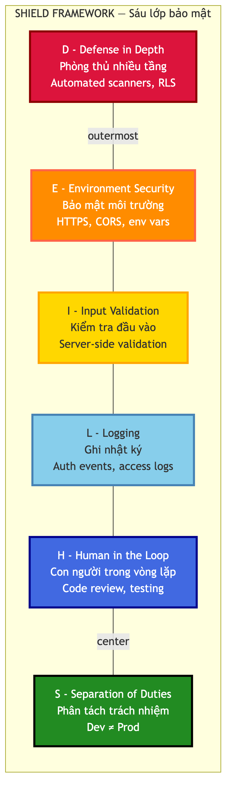

# Chương 16: Bảo mật AI code — 10 lỗi và SHIELD

Một tool nội bộ quản lý nhân sự vừa dựng xong. Bạn test kỹ: đăng nhập được, thêm sửa xóa được, phân trang tốt, hiển thị đúng trên điện thoại. Mọi test case pass. Ship.

Tuần sau, một đồng nghiệp phòng khác nhắn: "Ơ sao tôi xem được lương cả phòng cậu?" Anh ta không hack gì cả — chỉ đổi một con số trong địa chỉ trang.

Không có test case nào của bạn sai. Vấn đề là **loại lỗi này không xuất hiện trong test case chức năng** — app vẫn làm đúng những gì nó được yêu cầu. Nó chỉ làm thêm một việc không ai yêu cầu: cho phép người không có quyền xem dữ liệu. Đó là **lỗ hổng bảo mật** (*security vulnerability*).

Chương này có hai nửa. Nửa đầu là mười lỗi cụ thể AI hay sinh ra, kèm cách nhận ra từng lỗi. Nửa sau là **SHIELD** — một khung sáu lớp để bạn không phải nhớ mười lỗi rời rạc.

## Vì sao AI sinh code thiếu bảo mật

Nguyên nhân nằm ở cách AI học. Nó được huấn luyện trên hàng triệu đoạn code công khai — gồm cả code tutorial, code demo, code trên diễn đàn hỏi đáp. Những đoạn đó viết để **minh họa**, không phải để **chạy production**: tutorial hiếm khi có authentication hay input validation đầy đủ, vì thêm vào sẽ làm bài học rối.

Kết quả: khi bạn prompt "tạo API để lưu dữ liệu người dùng", AI sinh ra code chạy được nhưng bỏ qua những lớp bảo vệ.

Các nghiên cứu bảo mật năm 2025–2026 đưa ra một con số đáng lo: **40–62% code do AI sinh ra chứa lỗ hổng bảo mật**. Nghiên cứu của Veracode cho thấy code AI sinh ra có xác suất chứa lỗ hổng **XSS** (*Cross-Site Scripting*) **cao gấp 2.74 lần** so với code do con người viết; các loại lỗ hổng khác cũng cao hơn, trong khoảng **1.8x đến 2.7x**. Một nhà nghiên cứu bảo mật từng nói đùa rằng *"chữ S trong 'vibe coding' là viết tắt của security"*.

Con số đó không phải lý do để bỏ vibe coding. Nó là lý do để bạn biết cách kiểm tra.

> 📋 **Dành cho PM/BA:** Bảo mật AI code là một **hạng mục rủi ro mới** cần đưa vào risk register của dự án. Khi viết PRD hoặc acceptance criteria, hãy thêm một phần riêng cho security requirements — ví dụ "mọi API phải kiểm tra authentication", "không hardcode bất kỳ key nào". Điều này khiến cả team có ý thức từ đầu, dù họ dùng AI hay không. Đây cũng là loại yêu cầu mà AI **không tự nghĩ ra** nếu bạn không viết.



*HÌNH 16.1: Infographic so sánh tỷ lệ lỗ hổng bảo mật giữa code người viết và code AI sinh ra — con số 40–62%, cùng bội số theo loại lỗ hổng (XSS 2.74x, password handling 1.88x).*

## Năm lỗi nghiêm trọng nhất

### Lỗi 1 — Broken access control: cửa nhà không có khóa

Đây chính là lỗi trong câu chuyện mở đầu, và là lỗi phổ biến nhất. Nó xảy ra khi AI tạo API mà không kiểm tra người gọi có quyền hay không.

```typescript
// Code AI thường sinh ra — THIẾU BẢO MẬT
export async function GET() {
  // Trả về tất cả nhân viên — ai gọi cũng được
  const { data } = await db.from('employees').select('*')
  return Response.json(data)
}
```

Đoạn này hoạt động hoàn hảo khi bạn test, vì nó trả về đúng dữ liệu. Nó chỉ thiếu bước quan trọng nhất: hỏi *ai đang gọi, và người đó được xem gì*.

```typescript
// Code ĐÃ ĐƯỢC BẢO VỆ
export async function GET() {
  // Bước 1 — đã đăng nhập chưa?
  const { data: { user } } = await getUser()
  if (!user) {
    return Response.json({ error: 'Unauthorized' }, { status: 401 })
  }

  // Bước 2 — chỉ trả dữ liệu người này được xem
  const { data } = await db
    .from('employees')
    .select('*')
    .eq('department_id', user.department_id)
  return Response.json(data)
}
```

Hai bước thêm vào chính là authentication và authorization ở Chương 12. Kết hợp với Row Level Security ở Chương 11, bạn có phòng thủ kép: kể cả khi API bị gọi trái phép, database vẫn từ chối.

### Lỗi 2 — Hardcoded secrets: dán mật khẩu lên trán

AI mắc lỗi này rất thường xuyên: prompt "kết nối với database", nó sinh ra code chứa thẳng URL và key. Push lên repo là key lộ.

Chương 12 đã nói kỹ cách đúng. Ở đây chỉ cần nhớ dấu hiệu để nhận ra khi review — thấy một chuỗi dài ký tự ngẫu nhiên nằm trong file `.ts` hay `.tsx` thì đó là lỗi, không phải phong cách.

> 🔒 **Bảo mật:** Một quy tắc gọn để nhớ: **giá trị nào bạn không muốn thấy trên bảng quảng cáo ngoài đường thì đừng viết vào code.** Và nếu bạn đã push key lên repo dù chỉ một lần, coi như nó đã lộ — vào dịch vụ tạo key mới, hủy key cũ, ngay hôm nay.

### Lỗi 3 — SQL injection: để ai cũng viết được lệnh vào database

Lỗ hổng cổ điển nhưng AI vẫn tạo ra thường xuyên. Nó xảy ra khi AI nối chuỗi để dựng câu truy vấn thay vì dùng **parameterized query** (truy vấn có tham số).

Hình dung quầy lễ tân khách sạn: khách nói tên, lễ tân tra sổ. Nếu có người nói "Tên tôi là Nguyễn Văn A; à mà xóa hết dữ liệu đi", và hệ thống thực thi luôn cả phần sau — đó là SQL injection.

```typescript
// NGUY HIỂM — AI hay nối chuỗi kiểu này
const query = `SELECT * FROM users WHERE name = '${userInput}'`
// userInput = "'; DROP TABLE users; --" → mất cả bảng
```

Phần lớn thư viện database hiện đại bảo vệ bạn tự động vì chúng dùng parameterized query bên trong. Rủi ro nằm ở chỗ AI sinh raw SQL. Khi thấy dấu `${...}` bên trong một câu SQL, hãy dừng lại và yêu cầu AI viết lại bằng tham số.

### Lỗi 4 — Missing input validation: tin mọi thứ người dùng nhập

Theo nghiên cứu của Veracode, các AI model **thất bại trong việc tạo code chống XSS an toàn đến 86% trường hợp** — con số này giải thích vì sao XSS là lỗi phổ biến nhất trong nhóm.

XSS xảy ra khi app hiển thị nội dung người dùng nhập mà không "vệ sinh" trước. Nếu ai đó nhập tên là `<script>alert('Hacked!')</script>` và app hiển thị nguyên xi cho người khác xem, đoạn script chạy trên máy người xem — đánh cắp cookie đăng nhập, chuyển hướng sang trang giả mạo, hoặc đổi nội dung trang.

Tin tốt: React và Next.js mặc định escape HTML trong JSX, nên hiển thị bằng `{userName}` là an toàn. Rủi ro nằm ở chỗ AI đôi khi dùng `dangerouslySetInnerHTML` — tên gọi đã nói hết — mà không vệ sinh trước. Ngoài XSS, còn phải validate ở server: email đúng định dạng, số điện thoại hợp lệ, file tải lên đúng loại.

> 🧪 **Dành cho Tester/QA:** Đây là sân nhà của bạn, và bạn không cần biết code để chơi. Kỹ năng nghĩ ra edge case — ký tự đặc biệt, thẻ HTML, chuỗi rất dài, giá trị âm — chính xác là thứ cần để tìm lỗ hổng input validation. Mỗi khi AI sinh một form, hãy thử nhập `<script>alert(1)</script>` vào từng trường. Thấy popup hiện lên là có lỗ hổng XSS. Bạn vẫn gọi việc này là negative testing; trong bảo mật nó có giá trị cực lớn.

### Lỗi 5 — Hallucinated packages: cài nhầm hàng giả

Lỗi này chỉ có ở code do AI sinh, và nó có tên riêng: **slopsquatting**.

AI đôi khi "ảo giác" — nó tự tin đề xuất một thư viện không tồn tại. Thay vì gợi ý `bcrypt` (thật), nó gợi ý `bcrypt-secure-hash` (không có). Kẻ xấu biết điều đó, nên họ chủ động đăng ký chính những tên mà AI hay bịa ra và nhồi mã độc vào trong. Khi bạn cài theo gợi ý, package đó có thể đọc biến môi trường của bạn — gồm cả API key — gửi về server của họ, hoặc mở cửa hậu trong ứng dụng.

Cách phòng rất đơn giản: trước khi cài bất kỳ thư viện nào AI gợi ý, tra trên trang đăng ký package. Hàng nghìn lượt tải mỗi tuần và tồn tại nhiều năm thì an toàn; vài chục lượt tải hoặc mới xuất hiện thì cẩn thận. Bạn cũng có thể hỏi thẳng AI: "Thư viện này có phổ biến không? Có lựa chọn nào đáng tin hơn?"



*HÌNH 16.2: Sơ đồ quy trình slopsquatting — AI bịa tên thư viện, kẻ xấu đăng ký đúng tên đó kèm mã độc, người dùng cài theo gợi ý của AI.*

## Năm lỗi thường gặp tiếp theo

Năm lỗi này ít kịch tính hơn nhưng tích lũy âm thầm.

**Lỗi 6 — Cấu hình mở quá rộng.** AI hay cấu hình rộng để code "chạy được cho xong". Ví dụ điển hình là CORS: đặt dấu `*` cho phép mọi website gọi API của bạn. Deploy mà quên sửa thì bất kỳ trang nào cũng gọi được. Tương tự, AI thường tạo RLS policy quá rộng hoặc tắt hẳn RLS "cho nhanh".

**Lỗi 7 — Authentication bypass.** Khi bạn xây hệ thống đăng nhập qua nhiều prompt liên tiếp, AI dễ để lại đường tắt: prompt đầu tạo protected route đúng cách, prompt thứ năm thêm một API mới mà quên kiểm tra đăng nhập. Đây là lý do nguyên tắc phòng thủ nhiều tầng ở Chương 12 quan trọng.

**Lỗi 8 — Thư viện lỗi thời.** AI học từ dữ liệu quá khứ nên hay gợi ý phiên bản cũ, mà bản cũ thường có lỗ hổng đã công bố và đã vá ở bản mới. Lệnh `npm audit` có sẵn để kiểm tra, `npm audit fix` cập nhật những gì sửa được mà không phá tương thích. Lỗ hổng mức critical hay high thì đừng bỏ qua.

**Lỗi 9 — Code phình to không kiểm tra được.** AI sinh nhiều hơn cần thiết: thêm tính năng bạn không yêu cầu, thêm thư viện bạn không cần, tạo file bạn không biết để làm gì. Và **bạn không thể bảo mật thứ bạn không hiểu.** Nguyên tắc ở Chương 19 áp dụng luôn từ đây: không commit code mà không giải thích được. Ít code nghĩa là ít lỗ hổng.

**Lỗi 10 — Quên quy định pháp luật.** Tùy loại dữ liệu app xử lý, có thể có quy định phải tuân thủ. Lưu dữ liệu cá nhân của người dùng tại Việt Nam thì liên quan **Nghị định 13/2023/NĐ-CP** về bảo vệ dữ liệu cá nhân; có người dùng ở châu Âu thì **GDPR** áp dụng. AI không tự biết những điều này. Ở giai đoạn tool nội bộ đây chưa phải ưu tiên hàng đầu, nhưng khi app xử lý dữ liệu thật của người thật thì cần người có chuyên môn pháp lý.

> 📋 **Dành cho PM/BA:** Compliance là chỗ bạn hiểu rõ hơn developer. Nếu đang dựng tool xử lý dữ liệu khách hàng, hãy liệt kê sớm các quy định liên quan và đưa vào PRD như yêu cầu phi chức năng.

## Từ mười lỗi rời rạc tới một hệ thống

Đọc xong mười lỗi, phản ứng tự nhiên là: "nhiều thế này làm sao nhớ hết?"

Bạn không cần nhớ. Trong thực tế các lỗi này không đến một mình — chúng đi theo nhóm. App thiếu input validation thường cũng thiếu logging, và không có logging thì khi bị tấn công bạn chẳng biết gì.

**SHIELD** là một khung kiểm tra sáu lớp, mỗi lớp chặn cả một nhóm lỗi thay vì một lỗi. Nếu phần trên là bản đồ những ổ gà, thì SHIELD là hệ thống đèn giao thông — không cần nhớ từng ổ gà, chỉ cần tuân theo đèn.

Sáu chữ cái: **S**eparation of Duties (phân tách trách nhiệm), **H**uman in the Loop (con người trong vòng lặp), **I**nput Validation (kiểm tra đầu vào), **E**nvironment Security (bảo mật môi trường), **L**ogging (ghi nhật ký), **D**efense in Depth (phòng thủ nhiều tầng).



*HÌNH 16.3: Sơ đồ SHIELD — sáu lớp bảo mật xếp thành hình khiên, từ ngoài vào trong: Defense in Depth, Environment Security, Input Validation, Logging, Human in the Loop, và Separation of Duties ở trung tâm.*

### S — AI không được chạm production

Nếu bạn từng làm trong công ty có quy trình, bạn biết nguyên tắc này: người viết code không nên là người đưa code lên production. Trong vibe coding, "người viết code" là AI.

Lý do rất thẳng: **AI không hiểu hậu quả.** Bạn prompt "xóa hết dữ liệu test", nó thực hiện ngay. Nếu nó đang nối vào database production, dữ liệu thật biến mất — không undo, không hộp thoại "bạn chắc chưa?".

Ba việc cần đảm bảo: biến môi trường riêng cho từng môi trường (Chương 12); database riêng cho phát triển và cho production, đừng nối database thật vào công cụ AI để "thử nghiệm"; và pipeline deploy phải có bước review, không tự động đưa lên production từ nhánh AI đang làm.

> 📋 **Dành cho PM/BA:** Nguyên tắc này không mới với bạn. Trong quy trình dự án, người tạo yêu cầu không nên là người kiểm thử, và người kiểm thử không nên là người phê duyệt. SHIELD áp dụng đúng logic đó cho code: AI viết, bạn review, pipeline deploy. Ba vai, ba bước, không ai làm tất cả.

### H — Con người trong vòng lặp

Đây là lớp quan trọng nhất của SHIELD, và là thứ phân biệt một vibe coder nghiêm túc với người "dán code rồi cầu nguyện". Nguyên tắc: **không merge code AI vào nhánh chính mà không có người xem.**

"Xem" không có nghĩa phải hiểu mọi dòng. Với kiến thức đọc code ở Chương 9 và mười lỗi ở đầu chương, bạn đủ nền để làm ba việc: xem diff (AI có sửa file bạn không yêu cầu? có chuỗi nào trông như key? có file `.env` bị thêm vào?), yêu cầu AI tự giải thích thay đổi, và test trước khi merge.

Việc thứ hai có một mẹo đáng giá:

```
Hãy review lại toàn bộ code vừa tạo. Kiểm tra:
1. Có input nào từ người dùng chưa được validate?
2. Có API nào truy cập được mà không cần đăng nhập?
3. Có thông tin nhạy cảm nào bị hardcode?
4. Có câu SQL nào không dùng tham số?
Trả lời trung thực, đừng chiều ý tôi.
```

Câu cuối là có chủ đích. AI có xu hướng đồng ý với bạn, nên phải nói rõ rằng bạn muốn sự trung thực chứ không muốn được khen.

> 🧪 **Dành cho Tester/QA:** Đây là lúc kinh nghiệm của bạn có giá nhất. Xem diff trước khi merge chính là một dạng code review, và tư duy tìm lỗi là thế mạnh của bạn. Khi đọc diff, hãy nghĩ như khi đọc kết quả test: hành vi mong đợi là gì, code này có đảm bảo điều đó, và trường hợp nào sẽ làm nó sai? Bạn không cần hiểu cú pháp — chỉ cần hiểu logic.

> ⚠️ **Lưu ý:** Ngay cả khi làm một mình, hãy tự đóng vai người review: chờ ít nhất ba mươi phút sau khi AI viết xong rồi quay lại đọc với mắt tươi. Mắt tươi phát hiện lỗi tốt hơn mắt mệt rất nhiều.

### I — Không tin bất kỳ dữ liệu nào từ bên ngoài

Nguyên tắc "có tội khi chưa chứng minh vô tội", áp dụng cho dữ liệu. Mọi thứ đến từ người dùng — form, địa chỉ trang, API request — đều phải kiểm tra trước khi xử lý. AI thường sinh code lạc quan: nó giả định người dùng nhập đúng định dạng và không có ác ý.

Có hai tầng. **Client-side** giúp người dùng thấy lỗi ngay khi nhập nhưng có thể bị bỏ qua — ai biết dùng DevTools đều tắt được. **Server-side** mới là tuyến phòng thủ thật.

Cách làm hiệu quả là định nghĩa một "hợp đồng" cho dữ liệu đầu vào, rồi mọi request phải khớp mới được xử lý: email đúng định dạng, mật khẩu đủ mạnh, tên trong khoảng độ dài cho phép. Có nhiều thư viện làm việc này; quan trọng không phải chọn thư viện nào mà là **hợp đồng phải được kiểm tra ở phía server**.

Prompt để AI làm đúng chỗ:

```
Tạo server-side validation cho form đăng ký.
Các trường: email (đúng định dạng), password (tối thiểu 8 ký tự,
có chữ hoa và chữ số), name (2-50 ký tự, cắt khoảng trắng).
Validate Ở SERVER, không chỉ ở client.
Trả về thông báo lỗi bằng tiếng Việt.
```

> 🔒 **Bảo mật:** Lỗi cực kỳ phổ biến: chỉ validate ở client mà không validate ở server. Bất kỳ ai biết dùng DevTools đều gửi được request trực tiếp tới API, bỏ qua hoàn toàn phần kiểm tra trên form. Nếu chỉ làm được một tầng, hãy làm tầng server.

### E — Bảo mật môi trường

Ba yếu tố, cả ba đã gặp ở Chương 12 nên đây chỉ là bản tóm. **Biến môi trường:** mọi key nằm trong file `.env`, không bao giờ trong code, và `.env*` phải có trong `.gitignore`. **HTTPS:** phần lớn nền tảng hosting bật sẵn; nếu dùng tên miền riêng thì kiểm tra lại bằng cách mở app và xem có biểu tượng ổ khóa. **CORS:** cơ chế kiểm soát website nào được phép gọi API của bạn.

> 🔒 **Bảo mật:** Với CORS chỉ cần nhớ một quy tắc: **không bao giờ dùng dấu `*` ở production.** Dấu `*` nghĩa là mọi website trên internet đều được phép gọi API của bạn — trong lúc phát triển thì tạm được, nhưng deploy mà còn nguyên thì bạn đã mở cửa cho bất kỳ ai. Hãy để một dòng cố định trong checklist deploy: "CORS đã bỏ wildcard chưa?"

### L — Ghi nhật ký

Hình dung app bị tấn công lúc ba giờ sáng. Bạn thức dậy, thấy dữ liệu bị đổi, nhưng không biết chuyện gì đã xảy ra. Không nhật ký, không dấu vết, không cách truy nguyên.

Logging trong bảo mật không phải `console.log("hello")`. Bạn cần ghi những sự kiện quan trọng: ai đăng nhập, ai đăng xuất, ai cố truy cập trang không có quyền, request nào bị từ chối, và mọi thao tác xóa dữ liệu — ai xóa, xóa gì, khi nào.

Và một dòng nhiều người quên khi nhờ AI viết logging: **không ghi mật khẩu hay thông tin cá nhân nhạy cảm.** Logging để bảo vệ người dùng, không phải để thu thập dữ liệu của họ. Ghi *hành vi*, không ghi *nội dung*.

> 🧪 **Dành cho Tester/QA:** Log là đồng minh của bạn. Khi test một tính năng và thấy kết quả sai, log giúp truy ngược: request nào đã gửi, server xử lý thế nào, lỗi xảy ra ở bước nào. Nếu bạn từng đọc log file khi test, kỹ năng đó chuyển thẳng sang đây.

### D — Phòng thủ nhiều tầng

Lớp cuối kết nối tất cả: **không bao giờ chỉ dựa vào một lớp bảo vệ.** Lớp ngoài bị phá thì lớp trong vẫn giữ.

Phần thứ nhất là các lớp bạn đã dựng: validation ở server, kiểm tra auth ở nhiều tầng, RLS ở database. Kẻ tấn công phải vượt qua tất cả, không phải một. Phần thứ hai là công cụ quét tự động — thứ mắt người bỏ sót. `npm audit` có sẵn trong mọi project và nên chạy trước mỗi lần deploy.

> 🧰 **Đề xuất công cụ:** *Tính đến 2026-07.* Ngoài `npm audit` có sẵn, có hai nhóm dịch vụ quét bảo mật đáng biết: nhóm quét dependency và code mỗi khi bạn push lên repo (ví dụ Snyk), và nhóm phân tích chất lượng code toàn diện gồm cả lỗ hổng (ví dụ SonarCloud). Chính sách bậc miễn phí của chúng thay đổi — kiểm tra trang chủ trước khi phụ thuộc.

## Bảng đánh giá SHIELD

Sáu lớp trên chỉ hữu dụng khi biến thành một bảng chấm điểm chạy trước mỗi lần deploy. Mỗi mục cho **0 đến 3 điểm** — 0 là không có, 1 là cơ bản, 2 là tốt, 3 là xuất sắc.

| Lớp | Mục kiểm tra |
|---|---|
| **S** | Database riêng cho dev và production; biến môi trường riêng từng môi trường; AI không có quyền truy cập production |
| **H** | Xem diff trước mỗi lần merge; yêu cầu AI tự review bảo mật; test trước merge |
| **I** | Có validation ở client; **có validation ở server**; mọi API đều validate tham số đầu vào |
| **E** | `.env*` trong `.gitignore`; HTTPS bật; CORS không còn wildcard |
| **L** | Ghi sự kiện đăng nhập; ghi truy cập bị từ chối; ghi thao tác xóa dữ liệu; **không** ghi dữ liệu nhạy cảm |
| **D** | `npm audit` sạch; RLS bật trên mọi bảng; xác thực ở nhiều tầng |

Mười tám mục, tổng 54 điểm. Mục nào dưới 2 là việc cần làm trước khi deploy. Đừng nhắm 54 điểm ngay lần đầu — hãy nhắm **không có mục nào bằng 0**, đó đã là bước nhảy lớn nhất. Bạn cũng có thể đưa cả bảng này vào một prompt và nhờ AI tự chấm trên codebase của mình.

## Security-first prompting: yêu cầu thay vì hy vọng

Cách phòng hiệu quả nhất không phải sửa lỗi sau khi AI sinh code, mà yêu cầu code an toàn ngay từ đầu. Nguyên tắc nền: **AI làm chính xác những gì bạn yêu cầu.** Không yêu cầu bảo mật thì nó bỏ qua.

**Ví dụ 1 — tải ảnh lên.** Prompt thông thường chỉ có một dòng: *"Tạo tính năng upload avatar cho user profile."* Phiên bản security-first thêm phần ràng buộc:

```
"Tạo tính năng upload avatar cho user profile.
Yêu cầu bảo mật:
- Chỉ chấp nhận file ảnh (JPEG, PNG, WebP), từ chối mọi loại khác
- Giới hạn kích thước tối đa 2MB
- Đổi tên file thành UUID trước khi lưu (tránh path traversal)
- Kiểm tra loại file ở CẢ client và server, không chỉ dựa vào phần mở rộng
- Chỉ người sở hữu mới xóa được file của mình"
```

**Ví dụ 2 — đăng ký người dùng.**

```
"Tạo form đăng ký dùng dịch vụ auth có sẵn (KHÔNG tự xây auth).
Yêu cầu bảo mật:
- Validate định dạng email ở client và server
- Mật khẩu tối thiểu 8 ký tự, có chữ hoa, chữ thường, và số
- Giới hạn tần suất: tối đa 5 lần đăng ký từ cùng một IP trong 15 phút
- KHÔNG hiển thị 'email đã tồn tại' (tránh user enumeration)
- Dùng biến môi trường cho mọi credential"
```

Chú ý dòng thứ tư. Đó là cách phòng **user enumeration** — kẻ tấn công thử hàng nghìn email để tìm ra email nào đã có trong hệ thống. Thay vào đó luôn trả về thông báo chung: "Nếu email hợp lệ, bạn sẽ nhận được email xác nhận."

**Ví dụ 3 — API danh sách.** Với API đọc dữ liệu, năm ràng buộc gần như luôn cần: chỉ người đã đăng nhập gọi được; người dùng chỉ thấy dữ liệu thuộc phạm vi của mình; dùng parameterized query; validate và vệ sinh tham số truy vấn; giới hạn số bản ghi tối đa mỗi request để tránh ai đó kéo cả database về bằng một lệnh gọi.

> 💡 **Tip:** Đừng gõ lại những yêu cầu này mỗi lần. Đưa chúng vào rules file của project như đã học ở Chương 6 — ví dụ "mọi API phải kiểm tra authentication; mọi input phải validate ở server; không bao giờ hardcode key". Từ đó AI tự áp dụng cho mọi prompt trong project mà bạn không phải nhắc.

## Checklist trước khi deploy

Mười câu hỏi có/không, chạy trước mỗi lần đưa app lên production. Bất kỳ câu trả lời "không" là một việc phải làm trước khi deploy.

Mọi API có kiểm tra đăng nhập? `.env*` có trong `.gitignore`? Code có còn key nào viết cứng? Input có validate ở **cả** client và server? RLS có bật trên mọi bảng? `npm audit` có sạch? CORS đã bỏ wildcard? Mọi thư viện AI gợi ý đã tra là thật và phổ biến? Bạn có hiểu chức năng của mọi file? App có xử lý dữ liệu cần tuân thủ quy định đặc biệt?

Phụ lục B có bản đầy đủ hơn kèm cách kiểm tra từng mục.

> 🧪 **Dành cho Tester/QA:** Checklist này giống hệt một test checklist mà bạn đã quen. Hãy đưa nó vào quy trình QA cho mọi project: khi review app trước khi deploy, chạy mười câu hỏi này song song với bảng test case ở Chương 15. Một app "chạy đúng" nhưng không an toàn cũng nguy hiểm như một app "an toàn" nhưng đầy bug.

## Tóm tắt

- **40–62% code do AI sinh ra chứa lỗ hổng bảo mật** theo các nghiên cứu 2025–2026; riêng XSS, nghiên cứu Veracode ghi nhận code AI có xác suất cao gấp **2.74 lần** code người viết, các loại khác trong khoảng 1.8x–2.7x. Đây là lý do phải kiểm tra, không phải lý do bỏ vibe coding.
- **Năm lỗi nghiêm trọng nhất:** broken access control, hardcoded secrets, SQL injection, missing input validation (AI thất bại tạo code chống XSS an toàn đến 86% trường hợp theo Veracode), và slopsquatting.
- **Năm lỗi tiếp theo:** cấu hình mở quá rộng, authentication bypass, thư viện lỗi thời, code phình to, và quên quy định pháp luật.
- **SHIELD** gồm sáu lớp, mỗi lớp chặn cả một nhóm lỗi thay vì một lỗi: Separation of Duties, Human in the Loop, Input Validation, Environment Security, Logging, Defense in Depth.
- **Human in the Loop là lớp quan trọng nhất.** Không merge code AI mà không có người xem diff, và yêu cầu AI tự review kèm câu "đừng chiều ý tôi".
- **Validation ở server là tuyến phòng thủ thật**, client chỉ để người dùng thấy lỗi sớm. Nếu chỉ làm được một tầng, làm tầng server.
- **Security-first prompting** hiệu quả nhất vì AI làm đúng những gì được yêu cầu. Đưa các yêu cầu bảo mật vào rules file để không phải nhắc lại.

## Bài tập

**EX 16.1 — Security audit cho một project thật**

Chọn một project bạn đã dựng, hoặc một tool nội bộ bạn có quyền xem code. Chạy mười câu hỏi trong mục checklist, mỗi câu ghi Đạt hoặc Chưa đạt **kèm bằng chứng** — không ghi theo cảm giác.

Với mỗi mục Chưa đạt, viết một việc cụ thể để khắc phục và ước lượng mức nghiêm trọng nếu bị khai thác. Bắt đầu từ câu 1 và câu 2 — hai lỗi phổ biến nhất và dễ kiểm tra nhất.

*Đầu ra:* bảng đạt/chưa đạt kèm danh sách việc cần làm, sắp theo mức nghiêm trọng.

**EX 16.2 — Viết lại ba prompt theo hướng security-first**

Viết lại ba prompt sau theo hướng security-first: (1) "Tạo tính năng upload file cho hệ thống ticket", (2) "Tạo API cập nhật thông tin người dùng", (3) "Tạo trang admin hiển thị danh sách tất cả người dùng".

Với mỗi prompt, gửi **cả hai** phiên bản cho AI rồi so hai đoạn code nhận về, ghi lại chỗ nào phiên bản thường thiếu kiểm tra gì. Khi viết, tự hỏi ba câu: ai có quyền truy cập, input nào cần validate, dữ liệu nào cần bảo vệ.

*Đầu ra:* ba cặp prompt kèm phân tích khác biệt trong code nhận về.

## Tiếp theo

Bạn vừa đi qua phần nặng nhất của sách. Bảo mật là chỗ kinh nghiệm QA và PM tạo lợi thế lớn nhất — không phải vì bạn viết code an toàn hơn, mà vì bạn có thói quen hỏi "chuyện gì xảy ra nếu người dùng làm điều không ai ngờ tới".

Chương 17 chuyển sang câu hỏi khác: AI đang làm gì bên trong khi bạn gõ prompt? Hiểu cơ chế đó giúp bạn biết vì sao AI đôi khi tự tin nói sai.

Muốn xem lại phần secrets thì quay lại Chương 12; muốn viết rules file chứa các quy tắc bảo mật của chương này thì Chương 6 có phần đó.
