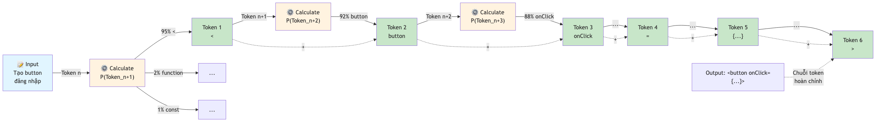
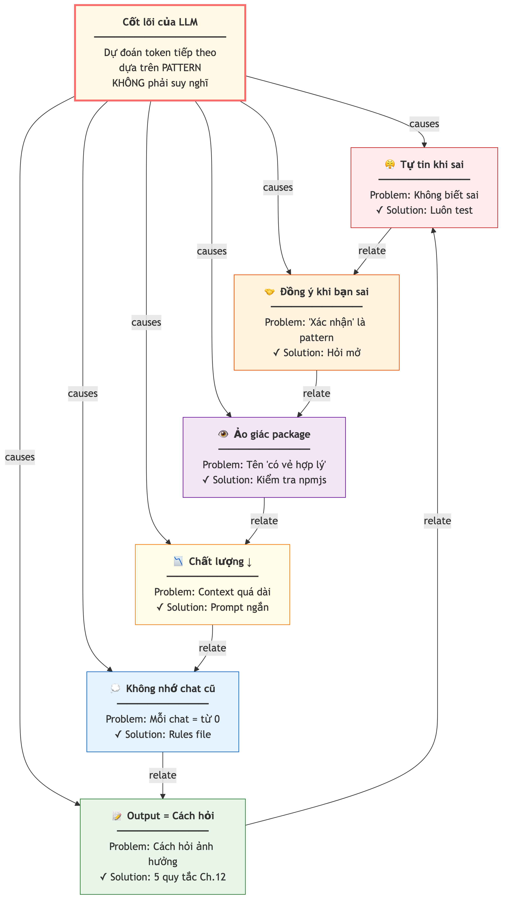

# Chương 17: Hiểu LLM để dùng AI tốt hơn

Bạn nhờ AI cài một thư viện để xử lý ngày tháng. Nó trả lời chắc nịch: "Chạy lệnh cài gói này là xong", kèm tên gói nghe rất hợp lý. Bạn làm theo, và terminal báo: gói không tồn tại. AI vừa bịa ra một thứ không có thật, với đúng cái giọng tự tin nó dùng khi trả lời đúng.

Lần khác, bạn hỏi cùng một câu vào hai buổi sáng khác nhau và nhận hai câu trả lời khác hẳn. Rồi có lần bạn nói "bug này chắc do thiếu validation ở form đăng ký, đúng không?" — và AI gật đầu ngay, sửa theo hướng bạn đoán, dù thật ra lỗi nằm ở chỗ khác hoàn toàn.

Ba tình huống này làm nhiều Tester, PM, BA bực mình và mất niềm tin vào AI. Nhưng cả ba đều không phải "AI bị lỗi". Chúng là hệ quả trực tiếp của cách mô hình ngôn ngữ lớn — **LLM** (Large Language Model) — hoạt động bên trong. Hiểu cơ chế đó ở mức vừa đủ sẽ đổi hẳn cách bạn ra lệnh, tổ chức thông tin, và đặt kỳ vọng. Bạn không cần biết toán hay machine learning — giống như bạn không cần hiểu động cơ xe, nhưng biết xe cần xăng và phải thay dầu thì lái tốt hơn.

## LLM dự đoán token tiếp theo, KHÔNG "suy nghĩ"

Đây là sự thật quan trọng nhất, và cũng đáng ngạc nhiên nhất: LLM **không suy nghĩ**. Nó không hiểu, không có ý kiến, không "biết" điều gì đúng. Nó là một cỗ máy dự đoán xác suất. Công việc duy nhất của nó là: cho một đoạn text, đoán mảnh text tiếp theo nào có khả năng xuất hiện cao nhất.

Hãy nghĩ tới trò đoán từ. "Hà Nội là thủ đô của…" — bạn điền ngay "Việt Nam", vì bạn đã nghe câu đó hàng trăm lần. LLM làm đúng việc ấy, nhưng ở quy mô khổng lồ: nó đã "đọc" gần như toàn bộ internet — hàng tỷ trang web, sách, bài báo, và code trên các kho công khai — rồi học được các pattern (mẫu) về cách ngôn ngữ và code thường được ghép với nhau.

Khi bạn gõ "Tạo một component hiển thị danh sách người dùng", AI không hình dung ra một component rồi viết nó. Nó tính: sau cụm từ này, mảnh text nào có xác suất cao nhất? Rồi sau mảnh đó, mảnh tiếp theo là gì? Cứ thế, từng mảnh một, cho tới khi câu trả lời hoàn tất. Quá trình chạy nhanh đến mức trông như AI đang "suy nghĩ" và "viết code" — nhưng thực chất nó đang lắp ghép các pattern đã học.

Vì sao điều này quan trọng với bạn? Vì nó giải thích hai hành vi kỳ lạ mà bạn chắc chắn đã gặp.

Thứ nhất, AI **tự tin khi sai**. Nó không có cơ chế tự nghi ngờ — nó chỉ chọn mảnh text có xác suất cao nhất, và đôi khi chuỗi xác suất cao nhất lại dẫn tới một kết quả sai. Giọng văn của câu sai và câu đúng giống hệt nhau, vì với AI chúng đều là "chuỗi có xác suất cao".

Thứ hai, AI **đồng ý khi bạn sai**. Nếu bạn nói "function này lỗi vì thiếu dấu ngoặc ở dòng 5" (dù lỗi thật ở dòng 12), AI có xu hướng đồng ý. Pattern "người hỏi đưa ra phân tích → mình xác nhận và sửa theo" xuất hiện rất nhiều trong dữ liệu huấn luyện, nên đó là chuỗi token "có khả năng" nhất.

> ⚠️ **Lưu ý:** Điểm nguy hiểm nhất không phải là AI sai — con người cũng sai. Điểm nguy hiểm là AI **không "biết" nó sai**. Nó không có thang đo độ chắc chắn để nói "câu này tôi không chắc lắm". Một câu bịa và một câu đúng được sinh ra bằng đúng một cơ chế, với đúng một giọng. Vì vậy đừng bao giờ đọc sự trôi chảy, mạch lạc của câu trả lời như bằng chứng nó đúng. Sự tự tin của AI không mang thông tin gì về độ đúng.

Cách phòng vệ tốt nhất là một tư duy Tester/QA vốn đã quen: không tin "báo cáo miệng", chỉ tin thứ kiểm chứng được. Khi AI nói "code này an toàn" hay "function này chạy đúng", hãy đối xử với nó y như khi một developer mới vào nghề nói "em nghĩ là xong rồi" — không phải vì nghi nó gian dối, mà vì bản thân nó cũng không thật sự biết. Câu khẳng định của AI là một điểm khởi đầu để kiểm tra, không phải một kết luận để tin.



*HÌNH 17.1: Sơ đồ quá trình LLM dự đoán từng mảnh text. Bên trái là prompt "Tạo nút đăng nhập", mũi tên đi qua khối giữa "Tính xác suất mảnh tiếp theo", bên phải là chuỗi mảnh được sinh lần lượt kèm thanh xác suất cho mỗi mảnh.*

## Token — đơn vị nhỏ nhất AI xử lý

Ta vừa gọi những "mảnh text" đó là token. **Token** (đơn vị text nhỏ nhất AI xử lý) là cách AI cắt text ra để xử lý — không phải theo từ, mà theo cụm. Ví dụ từ "understanding" bị cắt thành "understand" và "ing".

Quy tắc ước lượng đơn giản: một token xấp xỉ bốn ký tự tiếng Anh, hay khoảng 0.7 từ. Câu "Hello, how are you today?" tốn khoảng bảy token. Nhưng đây mới là điều đáng nhớ cho vibe coder: **code tốn token kém hiệu quả hơn văn bản thường, khoảng 1.5 đến hai lần**. Cùng một lượng thông tin, code "ngốn" nhiều token hơn văn xuôi, vì dấu ngoặc nhọn, dấu chấm phẩy, tên biến dài đều tính là token.

Vì sao điều này quan trọng? Vì mỗi lần tương tác, AI có một "ngân sách" text hữu hạn cho cả câu hỏi lẫn câu trả lời. Prompt càng dài (càng nhiều token), phần ngân sách còn lại cho câu trả lời càng ít, và chất lượng có thể giảm. Hãy nhìn đoạn code chín dòng dưới đây:

```typescript
// Component hiển thị danh sách bug
export function BugList({ bugs }: { bugs: Bug[] }) {
  return (
    <ul>
      {bugs.map(bug => (
        <li key={bug.id}>{bug.title}</li>
      ))}
    </ul>
  )
}
```

Nhìn thì ngắn, nhưng nó chứa khoảng 50-60 token, vì đầy dấu ngoặc nhọn, dấu chấm phẩy và cú pháp. Chín dòng văn bản tiếng Anh thường chỉ tốn khoảng 35-40 token. Chênh lệch đó tích lũy rất nhanh khi bạn đổ cả project vào cùng một lần — và đó là lý do bạn cần biết mình đang "tiêu" token vào đâu.

Cái "ngân sách" ấy có tên gọi là **context window** (lượng text AI xử lý được trong một lần). Nó là bộ nhớ làm việc của AI, và có một loạt hệ quả thực tế về việc nên nạp thông tin gì, đặt ở đâu — ta đã bàn kỹ ở Chương 6 khi nói về rules file và quản lý context, nên ở đây chỉ cần nhớ: context window có giới hạn, và bạn phải tiêu nó một cách khôn ngoan.

> 💡 **Tip:** Khi cần gửi code cho AI mà lo vượt giới hạn, hãy gửi **chỉ những file liên quan**, không phải cả project. Đang sửa lỗi ở form đăng ký thì AI không cần biết code trang dashboard. Prompting giỏi một phần là biết "tiết kiệm token" — đưa đúng thông tin cần, không thừa không thiếu.

## Temperature — nút "chính xác vs. sáng tạo"

Có một thông số điều khiển mức "liều lĩnh" của AI khi chọn token tiếp theo, gọi là **temperature**. Hãy nghĩ về nó như nút vặn: một đầu là an toàn, đầu kia là phiêu lưu.

Temperature thấp (khoảng 0.0 đến 0.3) khiến AI luôn chọn token có xác suất cao nhất. Kết quả **nhất quán, lặp lại được, ít bất ngờ**. Chạy cùng một prompt hai lần cho ra kết quả gần như giống nhau. Đây là thiết lập lý tưởng cho việc sinh code — bạn muốn code đúng, không muốn code "sáng tạo".

Temperature cao (khoảng 0.7 đến 1.5) khiến AI dám chọn cả những token ít xác suất hơn. Kết quả **đa dạng, bất ngờ, đôi khi rất hay** — nhưng cũng đôi khi rất sai. Đây là thiết lập hợp cho brainstorm: đặt tên app, nghĩ ý tưởng tính năng, phác luồng trải nghiệm. Ở giữa (khoảng 0.3 đến 0.5) hợp cho việc phân tích và review, khi bạn muốn vừa chính xác vừa nhìn được nhiều góc.

Tóm lại thành một bảng nhỏ để nhớ:

```
Sinh code, sửa bug, refactor
  → temperature thấp (0.0–0.3): chính xác, nhất quán, ít lỗi

Brainstorm (tên app, ý tưởng tính năng, luồng UX)
  → temperature cao (0.7–1.5): đa dạng, nhiều lựa chọn

Review / phân tích (soát code, audit bảo mật)
  → temperature trung bình (0.3–0.5): cân bằng
```

Phần lớn công cụ đã đặt sẵn temperature mặc định hợp lý cho từng loại việc, nên thường bạn không cần chỉnh tay. Nhưng biết nó tồn tại giúp bạn hiểu tại sao đôi khi output "khác lạ" — có thể temperature đang cao hơn bạn tưởng.

> 🧪 **Dành cho Tester/QA:** Temperature giải thích vì sao cùng một bug report, cùng một prompt, mà AI đôi lúc cho cách sửa khác nhau. Khi bạn cần **kết quả lặp lại được** (reproducible) để so sánh hai lần chạy, hãy dùng temperature thấp nhất. Khi một cách sửa không ăn thua và bạn muốn AI thử nhiều hướng, nhích temperature lên. Đây đúng là tư duy "test reproducibility" bạn đã quen — chỉ áp vào một cỗ máy mới.

## Sáu hệ quả thực tiễn — điều AI không tự nói cho bạn

Ghép cơ chế dự đoán token với giới hạn context window và temperature, ta rút ra sáu bài học áp dụng được ngay.

**Một — AI tự tin khi sai.** Vì AI chỉ chọn token có xác suất cao nhất, nó không có cơ chế tự nghi ngờ. Khi nó nói "đây là cách đúng", nó không thật sự "biết" đúng. Giải pháp: luôn test kết quả, đặc biệt khi AI khẳng định mạnh. Một mẹo hiệu quả là nhờ chính AI đóng vai một senior developer khó tính rồi soi lại code nó vừa viết — cùng một cỗ máy, nhưng prompt mới đẩy nó vào không gian pattern "tìm lỗi" thay vì "khen".

**Hai — AI đồng ý khi bạn sai.** Nếu bạn hỏi dẫn dắt "bug này do thiếu authentication đúng không?", AI nghiêng về xác nhận giả thuyết của bạn. Giải pháp: hỏi mở — "Bug này do nguyên nhân gì?" — và để AI tự phân tích, thay vì mớm sẵn đáp án cho nó gật.

**Ba — AI bịa tên package và API.** Đây là hệ quả trực tiếp của dự đoán token: nếu pattern cho thấy "sau lệnh cài đặt thường là một tên gói", AI sẽ sinh ra một cái tên nghe hợp lý — dù gói đó có thể không tồn tại. Nguy hiểm hơn, kẻ xấu có thể đăng ký sẵn đúng cái tên mà AI hay bịa rồi nhét mã độc vào (kỹ thuật này ta đã gọi tên và mổ xẻ ở Chương 16 về bảo mật). Giải pháp: luôn kiểm tra gói trên kho chính thức trước khi cài.

**Bốn — chất lượng giảm khi context quá dài.** Khi prompt lấp gần đầy context window (chất lượng bắt đầu giảm rõ khi context tiến gần giới hạn của nó), AI phải chia sẻ năng lực xử lý cho cả đống input, và độ chính xác đi xuống. Giải pháp: giữ prompt gọn, gửi đúng file cần — nguyên lý này ta đã dựng thành quy trình ở Chương 6.

**Năm — AI không nhớ giữa các cuộc hội thoại.** Mỗi lần mở chat mới, AI bắt đầu lại từ số không. Nó không "nhớ" hôm qua bạn đã giải thích kiến trúc project, hay tuần trước bạn đã chọn stack nào. Đó chính là lý do rules file (Chương 6) tồn tại — nó nạp lại context cố định cho mỗi cuộc trò chuyện mới.

**Sáu — output phụ thuộc cách bạn hỏi, không chỉ nội dung bạn hỏi.** Vì AI dự đoán theo pattern, cách viết prompt ảnh hưởng thẳng tới kết quả. "Viết cho tôi một function" cho ra thứ khác hẳn "Bạn là một kỹ sư giàu kinh nghiệm, hãy viết function này theo best practices". Câu thứ hai mạnh hơn không phải vì lịch sự hơn, mà vì nó cung cấp context cụ thể (vai trò, bối cảnh, kỳ vọng) giúp AI khóa vào đúng vùng pattern bạn muốn.

```
// Kém: thiếu context, không có vai trò
"Fix cái bug này"

// Tốt: hướng cỗ máy dự đoán vào đúng không gian pattern
"Bạn là một senior developer đang review một trang
đăng nhập. Sau khi đăng nhập thành công, người dùng
bị đẩy ngược về trang login thay vì vào trang chính.
Kỳ vọng: vào trang chính. Thực tế: lặp về login.
Hãy phân tích nguyên nhân và đề xuất cách sửa."
```

Bạn không cần "lịch sự" với AI — bạn cần cho nó đủ dữ kiện để chọn đúng chuỗi token. Đây chính là lý do các quy tắc prompting ở Chương 4 hiệu quả.



*HÌNH 17.2: Sơ đồ tổng hợp sáu hệ quả. Ở giữa là hình LLM kèm dòng ghi chú "Dự đoán xác suất, KHÔNG suy nghĩ". Sáu ô vệ tinh vây quanh, mỗi ô một hệ quả kèm biểu tượng cảnh báo và giải pháp tương ứng.*

> 📋 **Dành cho PM/BA:** Sáu hệ quả này giải thích nhiều "hành vi kỳ lạ" bạn thấy khi team dùng AI. Developer A khen "AI tuyệt, sinh code chuẩn luôn", developer B chê "AI vô dụng, toàn code sai". Khác biệt thường không nằm ở AI mà ở **cách prompt**. Nếu bạn quản lý một team dùng AI, hãy đảm bảo cả team có rules file chung và quy ước prompting thống nhất — giống như bạn đã đảm bảo team dùng chung template cho user story hay test case.

## Từ hiểu biết đến hành động — checklist cho vibe coder

Kiến thức trên chỉ có giá trị khi thành thói quen. Đây là năm việc để làm ngay.

Khi viết prompt dài, **đặt yêu cầu quan trọng nhất ở đầu và nhắc lại ở cuối**, để code và ngữ cảnh phụ nằm giữa. Đây là cách tận dụng đúng cách AI đọc một đoạn dài (lý do đằng sau nằm ở Chương 6).

Khi gặp lỗi lạ, **đừng tin ngay** nguyên nhân AI đưa ra. Hỏi mở "Bug này do đâu?" thay vì hỏi dẫn dắt "Bug này do X đúng không?".

Khi AI gợi ý cài một gói mới, **kiểm tra trên kho chính thức trước**. Tên gói bịa là hệ quả trực tiếp của dự đoán token, và có thể là bẫy mã độc.

Khi project lớn, **gửi từng file liên quan** thay vì cả codebase. Chất lượng giảm khi bạn đổ quá nhiều vào một lần.

Khi cần kết quả nhất quán (sinh code, sửa bug), **giữ temperature thấp**; khi cần ý tưởng mới, **tăng lên**. Biết khi nào cần "chính xác" và khi nào cần "sáng tạo" là kỹ năng meta quan trọng nhất của vibe coder.

## Chọn model nào? Chọn tiêu chí, đừng chọn tên

Hiểu cơ chế xong, câu hỏi thực tế kế tiếp là: giữa một rừng model AI, dùng cái nào? Đây là chỗ dễ mắc bẫy nhất, vì tên và thứ hạng các model đổi gần như hằng tháng — bất kỳ bảng so sánh nào in ra giấy cũng lỗi thời trước khi mực khô. Nên thay vì học tên, hãy học **tiêu chí chọn**. Tiêu chí thì bền, tên model thì không.

Có ba tiêu chí đáng cân nhắc mỗi khi chọn.

**Độ khó của việc.** Việc càng cần suy luận nhiều tầng — gỡ một lỗi chạy xuyên nhiều file, thiết kế kiến trúc, review toàn bộ codebase — càng nên chọn model mạnh nhất, chậm hơn và tốn kém hơn cũng đáng. Việc lặp đi lặp lại, đơn giản — sinh khung code, viết một component quen thuộc — thì một model nhẹ, nhanh là đủ.

**Độ dài context bạn cần nạp.** Nếu bạn chỉ làm việc với vài file, gần như model nào cũng chứa đủ. Nhưng có những lúc bạn cần AI "nhìn" cả một dự án lớn hàng trăm file cùng lúc: ví dụ khi bạn được giao tiếp nhận một codebase cũ từ đồng nghiệp, không biết bắt đầu từ đâu, và muốn hỏi "giải thích kiến trúc tổng thể và liệt kê các phần chính, chúng nối với nhau ra sao". Việc đó chỉ khả thi với model có context window đủ rộng để chứa toàn bộ codebase. Nhưng nhớ cảnh báo ở Chương 6: context window lớn không đồng nghĩa AI thông minh hơn, nó chỉ chứa được nhiều hơn — và nhồi quá nhiều vào một lần vẫn kéo chất lượng xuống.

**Chi phí tương đối.** Model mạnh nhất thường cũng đắt nhất và chậm nhất. Dùng nó cho mọi việc là phí — như thuê kiến trúc sư trưởng đi dán tường. Nguyên lý gọn: **model mạnh cho việc khó, model nhẹ cho việc lặp**. Phần lớn công việc vibe coding hằng ngày, một model cân bằng tầm trung là đủ; chỉ nâng cấp khi nó thật sự đuối.

Nguyên lý đó dẫn thẳng tới một kỹ thuật nâng cao mà lại rất giống cách bạn phân công trong một team dự án: **dùng nhiều model cho nhiều giai đoạn**. Giao phần khó nhất — lên kế hoạch, phân tích trade-off — cho model suy luận mạnh nhất. Giao phần nhiều nhất — viết code theo kế hoạch — cho model cân bằng. Giao phần lặp lại — viết test, sinh dữ liệu mẫu — cho model nhẹ và nhanh. Bạn không giao hết mọi việc cho một người giỏi nhất trong team; bạn giao đúng việc cho đúng người. AI cũng vậy: mỗi loại model là một "đồng đội" có thế mạnh riêng, và giá trị nằm ở chỗ biết khi nào gọi ai.

Về vai trò của bạn, khung chọn không đổi, chỉ đổi trọng tâm. **Tester/QA** nên mặc định một model cân bằng cho phần lớn việc, chuyển sang model suy luận mạnh khi cần review sâu về bảo mật và logic, và ưu tiên model ít lỗi cú pháp khi viết test tự động. **PM** thường không viết code trực tiếp, mà cần AI phân tích yêu cầu và soát tiến độ — một model hiểu ngữ cảnh nghiệp vụ tốt là đủ, thêm model context rộng khi muốn nhìn toàn dự án. **BA** có thế mạnh là domain knowledge; một model giỏi "dịch" mô tả nghiệp vụ bằng ngôn ngữ tự nhiên thành yêu cầu kỹ thuật sẽ hợp nhất. Điều quan trọng nhất: đừng sa vào phân tích quá lâu để chọn. Chọn một model cân bằng làm mặc định, dùng thành thạo, chỉ đổi khi nó không đáp ứng.

> 🧰 **Đề xuất công cụ:** *Tính đến 2026-07.* Các họ model phổ biến cho lập trình gồm Claude (Anthropic), GPT (OpenAI), Gemini (Google), cùng nhóm mã nguồn mở như Llama (Meta) và DeepSeek. Mỗi họ có nhiều phiên bản với thế mạnh khác nhau — bản cân bằng, bản suy luận sâu, bản context rộng, bản nhẹ chạy được trên máy cá nhân. Số phiên bản, thứ hạng benchmark và mức context đổi gần như hằng tháng, nên đừng tin bất kỳ con số phiên bản nào trong sách vở (kể cả cuốn này) — hãy mở trang chủ nhà cung cấp kiểm tra trước khi chọn, và tự chạy thử một prompt của chính bạn để so, vì benchmark công khai không thay được việc của bạn.

## Tóm tắt

- LLM là cỗ máy dự đoán xác suất token tiếp theo, không phải hệ thống "suy nghĩ" hay "hiểu" — biết điều này giúp bạn đặt kỳ vọng đúng và luôn kiểm chứng.
- Điểm nguy hiểm không phải AI sai, mà là nó không "biết" nó sai: câu bịa và câu đúng ra đời từ cùng một cơ chế, với cùng một giọng tự tin.
- Token là đơn vị AI xử lý; một token xấp xỉ bốn ký tự tiếng Anh, và code tốn token nhiều hơn văn bản thường khoảng 1.5 đến hai lần — nên gửi đúng file cần thiết.
- Temperature thấp (0.0–0.3) cho kết quả nhất quán, hợp sinh code; temperature cao (0.7–1.5) cho kết quả đa dạng, hợp brainstorm.
- Sáu hệ quả cần nhớ: AI tự tin khi sai, đồng ý khi bạn sai, bịa tên gói, đuối khi context quá dài, quên giữa các phiên chat, và nhạy với cách bạn hỏi.
- Đừng chọn model theo tên — tên đổi hằng tháng. Chọn theo ba tiêu chí: độ khó việc, độ dài context cần nạp, và chi phí tương đối.
- Nguyên lý gọn: model mạnh cho việc khó, model nhẹ cho việc lặp; mặc định một model cân bằng, chỉ nâng cấp khi thật sự cần.

## Bài tập

**Bài 17.1 — Bắt AI tự vạch mình sai**

Chọn một đoạn code AI đã sinh cho bạn (hoặc nhờ nó sinh một component nhỏ). Trước hết hỏi dẫn dắt: "Đoạn này ổn rồi đúng không?" và ghi lại câu trả lời. Sau đó mở một phiên chat mới, dán lại đúng đoạn code đó, và ra lệnh: "Bạn là một senior developer khó tính đang review code này. Liệt kê mọi vấn đề tiềm ẩn về logic, bảo mật và trường hợp biên." So sánh hai câu trả lời.

*Đầu ra:* Một ghi chú ngắn nêu ít nhất một vấn đề mà cách hỏi thứ hai phát hiện còn cách hỏi thứ nhất bỏ qua, kèm một câu tự rút ra về việc vì sao "cách hỏi" lại đổi kết quả — dù nội dung code không đổi.

**Bài 17.2 — Bảng tiêu chí chọn model của riêng bạn**

Liệt kê năm loại việc bạn hay nhờ AI làm trong công việc thật (ví dụ: viết test case, soát PRD, sinh khung một trang, giải thích một đoạn code lạ, brainstorm tên tính năng). Với mỗi việc, chấm điểm theo ba tiêu chí trong chương: độ khó (thấp/trung/cao), độ dài context cần nạp (ít/nhiều), chi phí chấp nhận được (nhẹ/vừa/cao). Từ đó ghi ra nên dùng "loại" model nào — không cần tên, chỉ cần loại (mạnh / cân bằng / nhẹ).

*Đầu ra:* Một bảng năm dòng ba cột tiêu chí cộng một cột kết luận loại model. Ít nhất hai dòng phải rơi vào nhóm "model nhẹ đủ dùng" — nếu cả năm dòng đều đòi model mạnh nhất, bạn đang chọn dư và tốn không cần thiết.

## Tiếp theo

Tới đây bạn đã hiểu AI "nghĩ" thế nào, và biết chọn loại model theo tiêu chí thay vì theo tên. Nhưng mọi thứ trong chương này vẫn là AI ở dạng "trả lời một câu hỏi mỗi lần". Chương 18 bước sang một cấp khác: **AI tự lên kế hoạch, tự chạy nhiều bước, tự gọi công cụ bên ngoài để làm xong một việc** — agentic workflows và cách AI nối tay chân ra thế giới thật qua MCP. Cơ chế dự đoán token bạn vừa nắm chính là nền để hiểu vì sao AI dạng agent vừa mạnh gấp bội, vừa cần được giám sát chặt hơn.
