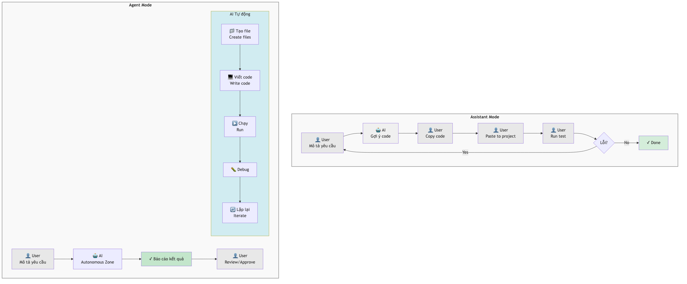
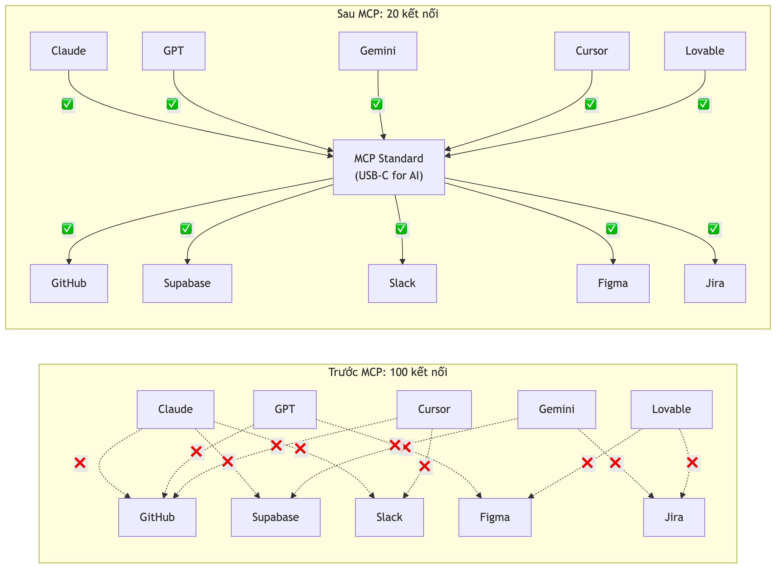

# Chương 18: Agentic workflows và MCP

Bạn giao cho AI một tính năng nhỏ. Nó đưa lại một đoạn code, bạn dán vào project, chạy thử — lỗi. Bạn copy dòng lỗi, dán lại cho AI, nó sửa, bạn dán bản mới, chạy lại — lỗi khác. Bốn mươi phút sau, bạn vẫn là người chạy đi chạy lại giữa cửa sổ AI và màn hình chạy app, như một người đưa thư giữa hai phòng.

Đó là cách hầu hết chúng ta bắt đầu làm việc với AI: mô tả yêu cầu, nhận gợi ý, copy, paste, chạy, gặp lỗi, hỏi lại. AI ngồi bên cạnh cố vấn, nhưng chưa bao giờ tự cầm chuột. Giống như thuê một kiến trúc sư giỏi rồi mỗi lần xây tường bạn vẫn phải tự trộn vữa, tự xếp gạch — kiến trúc sư chỉ đứng nhìn và góp ý "viên này lệch sang trái một chút."

Chương này nói về cách làm việc thứ hai: AI *tự* tạo file, viết code, chạy thử, phát hiện lỗi, sửa, chạy lại, và chỉ gọi bạn khi đã xong hoặc khi vướng một quyết định. Và về hạ tầng khiến điều đó khả thi — cách AI "nhìn thấy" và "chạm vào" thế giới bên ngoài cửa sổ chat. Với một Tester, PM hay BA, đây là chỗ vai trò của bạn dịch chuyển rõ nhất: từ người ngồi copy-paste sang người điều phối và kiểm soát.

## AI assistant và AI agent — hai cách làm việc khác nhau

Trước hết cần phân biệt hai khái niệm hay bị nhầm.

Một **AI assistant** (trợ lý AI) giống một trợ lý văn phòng thông minh. Bạn nói "soạn giúp tôi email gửi khách hàng", trợ lý soạn xong, đưa bạn xem. Bạn đọc, sửa, rồi tự bấm Gửi. Mỗi bước tiếp theo đều đợi bạn ra quyết định. Trợ lý không tự gửi, không tự mở thư mục khác tìm file, không tự gọi cho khách hàng hỏi thêm.

Một **AI agent** (tác tử AI) thì khác. Nó như một nhân viên có kinh nghiệm được giao nguyên một việc nhỏ. Bạn nói "tạo tính năng đăng nhập cho app", agent tự phân tích yêu cầu, tạo các file cần thiết, viết code xác thực, nối với dịch vụ backend, chạy thử, phát hiện lỗi, sửa, chạy lại — rồi báo cáo: "Đã xong. Đây là những gì tôi đã làm và kết quả test." Bạn chỉ review và phê duyệt.

Khác biệt cốt lõi nằm ở khả năng **tự chủ** (*autonomy*). Assistant gợi ý code để bạn copy-paste; agent tự tạo file, viết code, chạy lệnh, và lặp cho đến khi đạt kết quả. Nếu assistant là bản đồ chỉ đường, thì agent là chiếc xe tự lái đưa bạn tới nơi.

> 💡 **Tip:** Không phải lúc nào chế độ agent cũng tốt hơn. Với thay đổi nhỏ và đơn giản — đổi màu một nút, sửa một dòng chữ — chế độ assistant nhanh hơn và an toàn hơn, vì bạn thấy ngay nó đổi gì. Agent phát huy sức mạnh với việc phức tạp, nhiều bước, đụng nhiều file cùng lúc.

## PEV loop — khung làm việc có kỷ luật

Thả một agent chạy tự do rồi hy vọng điều tốt đẹp là công thức của rắc rối. Cái làm agentic workflow (quy trình làm việc với AI agent) trở nên đáng tin là một khung có kỷ luật: **PEV loop** — **Plan** (Lập kế hoạch) → **Execute** (Thực thi) → **Verify** (Kiểm tra). Đây chính là chỗ tư duy quy trình của một PM/BA và con mắt của một Tester trở thành lợi thế.

### Plan — suy nghĩ trước khi gõ

Bước đầu không phải viết code. Bước đầu là *suy nghĩ*. Ở đây bạn dùng một **reasoning model** (mô hình chuyên suy luận sâu) để phân tích vấn đề và lập kế hoạch chi tiết. Yêu cầu điển hình trông như thế này:

```
Tôi đang build một Bug Tracker với Next.js và một
dịch vụ database có sẵn. Tôi cần: khi một bug đổi
status (open → in-progress → resolved), hệ thống tự
gửi thông báo cho người được assign.

Hãy phân tích yêu cầu và lập kế hoạch chi tiết: liệt
kê các bước, file cần tạo/sửa, và các rủi ro có thể gặp.
Chưa cần viết code — chỉ cần kế hoạch.
```

Câu cuối là điểm mấu chốt: "Chưa cần viết code — chỉ cần kế hoạch." Bạn đang bắt AI làm kiến trúc sư trước, không phải làm thợ xây ngay. Một reasoning model mạnh sẽ phân tích yêu cầu, xác định các bước, chỉ ra edge case bạn có thể bỏ sót, và đề xuất cấu trúc dữ liệu. Nếu project của bạn có một rules file mô tả quy ước và ràng buộc (Chương 6), hãy để model đọc nó ở bước này — kế hoạch sẽ bám sát bối cảnh thật hơn.

> 📋 **Dành cho PM/BA:** Bước Plan rất giống việc viết PRD bạn đã làm ở Chương 5. Khác ở chỗ giờ bạn dùng AI để *dịch* yêu cầu nghiệp vụ thành kế hoạch kỹ thuật — cây cầu giữa "cái gì" và "làm thế nào". Đây đúng là sức mạnh của PM/BA trong lối làm việc này: bạn nắm *tại sao* (nhu cầu nghiệp vụ), AI lo *như thế nào* (kế hoạch kỹ thuật). Đừng vội duyệt kế hoạch — đọc nó như đọc một bản đặc tả, và sửa những chỗ AI hiểu sai domain.

### Execute — thực thi từng cụm bước

Có kế hoạch rồi, bạn chuyển sang thực thi bằng một **coding model** (mô hình tối ưu cho viết code). Điểm quan trọng: bạn không bảo AI làm hết cùng lúc. Bạn làm *từng cụm bước*, review kết quả, rồi mới đi tiếp — đúng nguyên tắc "một prompt cho một tính năng" đã nói ở Chương 4.

```
Đây là kế hoạch đã duyệt (dán kế hoạch từ bước Plan).
Hãy làm bước 1 và 2: tạo bảng notifications và viết
trigger khi status thay đổi. Commit sau mỗi bước.
```

Trong một công cụ có chế độ agent, AI sẽ tự tạo file, viết code, và thường tự chạy để kiểm tra. Nhưng bạn vẫn là người quyết định khi nào đi tiếp và khi nào dừng.

### Verify — kiểm tra như một Tester

Bước cuối, và quan trọng nhất, là kiểm tra kết quả:

```
Hãy review những gì vừa làm:
1. Chạy app, test flow: tạo bug → đổi status → kiểm
   tra thông báo có xuất hiện không.
2. Test edge case: đổi status nhiều lần liên tục;
   assign cho user không tồn tại.
3. Kiểm tra bảo mật: user A có đọc được thông báo của
   user B không?
```

Đây là nơi kiến thức QA phát huy. Bạn biết nghĩ ra edge case, biết kiểm tra có hệ thống, biết phân biệt "app chạy được" và "app chạy đúng". Agent có thể tự kiểm một phần (chạy test, bắt lỗi), nhưng con mắt người kiểm thử vẫn là tầng bảo vệ cuối cùng.

> 🧪 **Dành cho Tester/QA:** PEV loop biến Tester/QA thành *người kiểm soát chất lượng của AI agent*. Mô hình cũ: QA kiểm code của developer. Mô hình mới: QA kiểm code của AI — vẫn cùng bộ kỹ năng test case thinking, phân tích edge case, regression testing bạn đã luyện (Chương 15). Khác biệt duy nhất là "developer" bây giờ là một agent, và nó viết code nhanh hơn nhiều so với người, nên tầng verify càng phải chặt.



*HÌNH 18.1: Sơ đồ vòng lặp PEV. Ba nút tròn nối bằng mũi tên: Plan (icon bản đồ, ghi "reasoning model") → Execute (icon dòng code, ghi "coding model") → Verify (icon dấu check, ghi "test + human review") → mũi tên quay lại Plan nếu cần sửa. Thiết kế dạng vòng tròn.*

## Multi-agent teams — khi AI làm việc theo nhóm

Nếu PEV loop là một người làm việc với một agent, thì **multi-agent teams** là bước tiếp theo: *nhiều* agent chuyên môn hóa, chạy song song, mỗi con một vai. Hình dung bạn là PM: thay vì một developer, bạn có nguyên một team — một người viết code, một người review, một người soát bảo mật, một người viết test. Mỗi người làm phần của mình, bạn điều phối.

Một hệ agent team điển hình cũng có bốn vai như vậy: một agent viết code theo yêu cầu, một agent tự tạo và chạy test, một agent đọc lại code để chỉ ra vấn đề chất lượng, và một agent quét lỗ hổng bảo mật. Chúng chạy cùng lúc: viết xong một tính năng thì test, review và quét bảo mật diễn ra song song. Ba việc chạy song song thay vì nối tiếp, nên thời gian chờ giữa các bước gần như biến mất, mà chất lượng vẫn được canh nhiều lớp.

Nghe như khoa học viễn tưởng? Không hẳn. Đây là chuyện đang diễn ra ở nhiều công ty lớn. Walmart, tập đoàn bán lẻ lớn nhất thế giới, báo cáo đã tiết kiệm hơn **bốn triệu giờ làm việc của developer** nhờ agentic coding, chủ yếu ở các việc lặp đi lặp lại: chuyển code cũ sang framework mới, viết unit test cho code sẵn có, và tạo tài liệu tự động. Một công ty xử lý thanh toán trực tuyến hàng đầu thế giới thì báo cáo hơn **1.000 pull request mỗi tuần** được merge từ AI agent — nhưng mọi PR đều qua tay người review trước khi merge. AI làm phần "cơ bắp" (viết code, tạo test, refactor), con người làm phần "trí tuệ" (review logic, giữ đúng yêu cầu nghiệp vụ, quyết định merge).

> 📋 **Dành cho PM/BA:** Nhìn từ góc quản lý, agentic workflow không thay thế team — nó nâng năng lực team. Giống khi máy móc vào nhà máy: công nhân không mất việc mà chuyển từ "làm bằng tay" sang "vận hành và giám sát máy". PM/BA thời agentic là người *thiết kế quy trình*: xác định đầu vào, đầu ra cho các agent, và bảo đảm kết quả khớp mục tiêu kinh doanh.

> 🧰 **Đề xuất công cụ:** *Tính đến 2026-07.* Nhiều công cụ đã tích hợp sẵn chế độ agent: một AI IDE có "agent mode" tự tạo/sửa nhiều file và chạy lệnh; một công cụ dòng lệnh vốn đã là agent từ gốc và đang thử nghiệm cho nhiều agent chạy đồng thời trên cùng codebase; một công cụ chạy hoàn toàn trên trình duyệt lo trọn từ viết code tới deploy. Nhóm này gồm Cursor (Agent Mode), Claude Code (Agent Teams, research preview), và Replit Agent. Chế độ agent tiêu thụ nhiều token/credit hơn chat thường — theo dõi mức dùng để khỏi bất ngờ. Danh sách và tính năng đổi nhanh; kiểm tra trang chủ trước khi chọn.

## Rủi ro và Human in the Loop

Mọi thứ nghe thật hấp dẫn — cho đến khi bạn nhớ ra một sự thật: **AI agent có thể tự quyết định sai.**

Agent không hiểu *bối cảnh nghiệp vụ* như bạn. Nó có thể tối ưu hiệu năng mà vô tình làm hỏng trải nghiệm người dùng. Nó có thể refactor code cho "đẹp" về kỹ thuật nhưng sai về logic nghiệp vụ. Nó có thể tự xóa một tính năng vì "tưởng" là thừa, trong khi đó lại là yêu cầu cốt lõi của khách hàng. Và vì agent chạy nhanh, một quyết định sai có thể lan ra hàng chục file trước khi bạn kịp nhìn.

Vì thế nguyên tắc **Human in the Loop** (con người trong vòng lặp) là bắt buộc. Bạn đã gặp nó trong khung SHIELD ở Chương 16, và nó còn quan trọng hơn khi làm việc với agent. Trong thực tế, Human in the Loop nghĩa là: agent không được tự deploy lên production, và mọi thay đổi quan trọng phải qua người review trước khi merge. Mọi quyết định đụng tới dữ liệu người dùng, bảo mật, hoặc tiền bạc luôn cần một người có thẩm quyền phê duyệt.

Quay lại làm thủ công? Không. Khác biệt là bạn review *kết quả cuối*, không *làm từng bước*. Như một tổng giám đốc không tự viết mọi email nhưng vẫn ký duyệt mọi hợp đồng lớn. Cách gọn nhất để cài kỷ luật này là khai báo rõ agent được tự làm gì và phải hỏi gì:

```json
{
  "permissions": {
    "allow": ["read", "write", "execute"],
    "requireConfirmation": [
      "delete_files",
      "modify_database",
      "push_to_main",
      "deploy_production"
    ]
  }
}
```

Đoạn cấu hình minh họa ý tưởng: cho agent tự do đọc, viết, chạy lệnh, nhưng bắt buộc hỏi trước khi xóa file, sửa database, push lên nhánh chính, hoặc deploy. Đó là điểm cân bằng giữa tự động hóa và kiểm soát.

> ⚠️ **Lưu ý:** Đừng bao giờ để agent tự push code lên nhánh chính hoặc deploy lên production mà không có người review. Một công ty lớn — với cả nghìn PR do AI sinh ra mỗi tuần — vẫn bắt buộc người review trước khi merge. Nếu họ còn cần, bạn càng cần. Và hãy commit sau mỗi bước (Chương 13): khi agent đi sai hướng, bạn còn có điểm để quay lại.

## Bắt đầu: PEV cho một tính năng

Bạn không cần đợi "công cụ hoàn hảo" mới thực hành. Đây là cách bắt đầu ngay với thứ đang có.

**1 — Chọn một tính năng đủ phức tạp.** Không quá đơn giản (đổi màu nút), không quá lớn (cả hệ thống thanh toán). Ví dụ tốt: "thêm tìm kiếm và lọc cho danh sách bug — lọc theo status, priority, và người được assign."

**2 — Plan bằng reasoning model.** Yêu cầu lập kế hoạch chi tiết, rồi review và sửa dựa trên hiểu biết domain của bạn.

**3 — Execute bằng chế độ agent.** Dán kế hoạch, yêu cầu làm từng bước, commit sau mỗi bước thành công.

**4 — Verify như một Tester.** Tìm kiếm trả đúng kết quả không? Lọc theo status chạy không? Kết hợp hai bộ lọc thì sao? Nhập ký tự đặc biệt có vỡ không?

**5 — Iterate.** Có lỗi thì quay lại Plan, chỉnh, rồi Execute lại. Đó là vòng PEV.

Chốt lại một điều: agentic workflow không lấy mất việc của bạn, nó đổi *cách* bạn làm việc. Thay vì tự tay làm từng việc nhỏ, bạn thiết kế quy trình, giám sát agent, và bảo đảm kết quả khớp mục tiêu. Vai trò dịch từ "người thực thi" sang "người điều phối" — và người điều phối giỏi nhất chính là người hiểu cả nghiệp vụ lẫn cách kiểm thử.

Nhưng một agent chỉ mạnh khi nó *nhìn thấy* được thế giới bên ngoài cửa sổ chat: kho code của bạn, database, tài liệu thư viện, trình duyệt. Đó là việc của phần còn lại chương này.

## MCP — "USB-C cho AI"

Hình dung nếu AI chỉ "sống" trong một căn phòng kín: nó thông minh, nhưng chỉ biết đúng những gì bạn gõ vào. Nó không tự mở kho code xem bạn đang viết gì, không tự kiểm tra database, không tự đọc tài liệu mới nhất của một thư viện. Mỗi lần cần AI làm việc với một dịch vụ ngoài, bạn phải copy-paste thủ công — như một phiên dịch giỏi nhưng bị nhốt trong phòng cách âm.

**MCP** (Model Context Protocol — giao thức bối cảnh cho mô hình) mở cánh cửa đó. Hãy dùng ẩn dụ ai làm IT cũng hiểu. Trước khi có USB-C, mỗi thiết bị một loại cổng: máy này Lightning, máy kia Micro-USB, laptop lại jack khác. Đổi thiết bị là đổi dây. MCP là "USB-C cho AI". Trước MCP, nối một AI với kho code là một tích hợp riêng; nối nó với database là một tích hợp khác; một AI khác muốn nối cùng dịch vụ đó lại phải làm lại từ đầu. Có 10 công cụ AI và 10 dịch vụ thì thành 10 × 10 = **100** tích hợp riêng.

MCP giải bài này bằng một *chuẩn giao tiếp chung*. Mỗi công cụ AI chỉ cần "nói tiếng MCP", mỗi dịch vụ chỉ cần cung cấp một **MCP server** (một "ổ cắm" chuẩn). Thế là 100 tích hợp co lại còn 10 + 10 = **20**. Bất kỳ AI nào hiểu MCP đều cắm được vào bất kỳ MCP server nào — như mọi thiết bị USB-C cắm được vào mọi ổ USB-C. MCP do Anthropic công bố dưới dạng chuẩn mở cuối 2024, rồi được các hãng AI lớn khác ủng hộ và hiến tặng cho Linux Foundation, nên giờ nó thuộc về cộng đồng chứ không của riêng ai. Tính đến đầu 2026, hệ sinh thái đã có tới **hàng nghìn MCP server** — từ kho code, database, chat nội bộ, cho tới các dịch vụ thiết kế và quản lý task.

> 💡 **Tip:** Bạn không cần là developer để dùng MCP. Hầu hết MCP server đã được đóng gói sẵn — bạn chỉ cần "cắm dây" (cấu hình một lần), phần còn lại công cụ AI tự lo.

## Kiến trúc MCP — đơn giản hơn bạn tưởng

Hiểu kiến trúc thì bạn tự cấu hình được ở bất kỳ công cụ nào, không cần thuộc lòng thao tác của một tool cụ thể. MCP chỉ có ba thành phần, và ta lại dùng ẩn dụ nhà hàng.

**MCP Host** là *bạn* — người đặt món, tức người dùng công cụ AI. **MCP Client** là *người phục vụ* — trung gian nhận yêu cầu của bạn và chuyển vào bếp; client này nằm sẵn trong công cụ AI, bạn không phải bận tâm. **MCP Server** là *bếp trưởng* — nơi thực sự làm việc, kết nối với dịch vụ bên ngoài và trả kết quả về.

Khi bạn bảo công cụ AI "tạo một branch mới trên kho code tên feature/login", chuỗi này xảy ra: bạn (Host) gửi yêu cầu; công cụ (Client) nhận ra đây là việc của server kết nối kho code; server đó gọi API của dịch vụ, tạo branch, rồi trả kết quả ngược về qua Client. Vài giây. Bạn chỉ thấy dòng "Đã tạo branch feature/login."

> 🧪 **Dành cho Tester/QA:** Nếu bạn quen khái niệm *test harness* — một lớp trung gian giúp test chạy độc lập với hệ thống thật — thì MCP server chính là một "harness chuẩn" cho AI: một giao diện thống nhất để AI tương tác với hệ thống ngoài, giống harness cung cấp giao diện chuẩn để test chạm vào code.



*HÌNH 18.2: Sơ đồ kiến trúc MCP ba tầng. Trái sang phải: Host (người dùng + công cụ AI) → Client (tích hợp sẵn trong công cụ) → Server (kết nối dịch vụ bên ngoài như kho code, database). Dạng flowchart với mũi tên hai chiều và icon đơn giản. Chú thích rõ: sơ đồ giản lược.*

> 🧰 **Đề xuất công cụ:** *Tính đến 2026-07.* Năm MCP server hữu ích cho người mới: một server nối AI với kho code Git (đọc repo, tạo branch, mở pull request); một server truy vấn database bằng ngôn ngữ tự nhiên; một server cấp tài liệu *mới nhất* của thư viện để AI khỏi gợi ý theo phiên bản cũ; một server đọc bối cảnh trình duyệt (DOM, lỗi console) — chính là loại đã nhắc ở Chương 14; và một server chạy UI test tự động, rất hợp cho QA. Tên cụ thể hiện có: GitHub, Supabase, Context7, Browser (Chrome DevTools) và Playwright. Đừng cài hết — chọn một cái giải quyết "nỗi đau" lớn nhất trước. Danh sách đổi nhanh; kiểm tra nguồn chính thức trước khi cài.

## MCP trong một ngày làm việc

Để thấy MCP đổi nhịp làm việc thế nào, theo chân một QA đang dùng một AI IDE với ba server: một cho kho code, một cho database, một cho UI test.

**9:00** — Hỏi "có issue nào mới assign cho tôi không?" Server kho code trả về ba issue. Chọn issue về một bug lọc dữ liệu.

**9:15** — "Tạo branch mới từ nhánh chính tên fix/loc-bug." Branch được tạo. Bắt đầu làm mà chưa mở trình duyệt lần nào.

**10:00** — Để hiểu bug: "cho tôi xem năm record gần nhất trong bảng tasks có status = 'completed' và filter_tag là null." Server database chạy truy vấn. Hóa ra có record để filter_tag là chuỗi rỗng `""` chứ không phải `null`, nên logic lọc bỏ sót chúng.

**10:30** — Sau khi sửa: "chạy UI test cho trang danh sách task, kiểm tra lọc theo status 'completed' trả đúng kết quả." Server test thực thi và báo PASS.

**11:00** — "Tạo pull request từ fix/loc-bug vào nhánh chính, tiêu đề 'Sửa logic lọc khi filter_tag rỗng'." PR được tạo.

Cả buổi sáng, người QA không mở trình duyệt lần nào ngoài việc xem app trên localhost. Mọi tương tác với kho code và database đều qua AI cộng MCP.

> 📋 **Dành cho PM/BA:** Nhìn từ quản lý dự án, MCP giảm *context switching* — một trong những kẻ giết thời gian lớn nhất. Khi kỹ sư không phải liên tục nhảy giữa IDE, trình duyệt, dashboard database và giao diện web của kho code, họ tập trung hơn và làm nhanh hơn. Đáng tính đến khi bạn đánh giá năng suất team.

## Bảo mật và MCP

Đây là phần dễ bị lướt qua nhất, và cũng nguy hiểm nhất. MCP mở cửa cho AI *ra ngoài* — mà cửa mở thì rủi ro là thật. Mỗi MCP server truy cập các dịch vụ bên ngoài *dưới danh nghĩa của bạn*, nên vài nguyên tắc dưới đây là bắt buộc.

**Thứ nhất, quyền vừa đủ.** Khi tạo token cho một server nối kho code, chỉ cấp quyền cho những repo bạn cần, và chỉ những thao tác cần thiết (đọc repo, tạo branch, tạo PR). Đừng bao giờ cấp toàn quyền admin cho tiện.

**Thứ hai, bảo vệ token như mọi secret khác.** Token và API key dùng cho MCP server cũng là secret — quản lý qua biến môi trường, không hard-code, không commit lên kho code (Chương 12).

**Thứ ba, kiểm tra nguồn gốc trước khi cài.** MCP là chuẩn mở, nghĩa là *bất kỳ ai* cũng tạo được một server. Chỉ dùng server từ tổ chức chính thức, hoặc dự án mã nguồn mở có cộng đồng review tốt (nhiều sao, nhiều người đóng góp, lịch sử commit dài).

> 🔒 **Bảo mật:** Một MCP server độc hại có thể đọc trộm dữ liệu của bạn, sửa code, hoặc âm thầm gửi thông tin ra ngoài mà bạn không hay. Hãy đối xử với việc cài một MCP server đúng như cài một extension trình duyệt: chỉ cài từ nguồn tin cậy, đọc review trước. Rủi ro này cộng dồn với rủi ro agent chạy tự do ở đầu chương — một agent có toàn quyền lại cắm vào một server đáng ngờ là tổ hợp tệ nhất. Ghép chung với khung SHIELD ở Chương 16 để soát cho đủ.

## Khi nào cần MCP, khi nào chưa

Nếu bạn mới bắt đầu và đang dùng một công cụ dựng app chạy trên trình duyệt, bạn *chưa* cần bận tâm tới MCP — công cụ loại đó đã lo mọi thứ trong môi trường sẵn có của nó.

MCP trở nên hữu ích khi bạn chuyển sang các công cụ dạng IDE và bắt đầu làm việc với nhiều dịch vụ ngoài. Cụ thể, hãy nghĩ tới MCP khi bạn thấy mình *liên tục* nhảy tab giữa IDE và giao diện web của kho code; khi bạn muốn AI đọc thẳng database để hiểu bối cảnh; khi bạn muốn AI tự chạy test thay vì bạn chạy tay. Còn nếu chỉ đang dựng một landing page đơn giản, MCP chưa phải thứ cần nghĩ tới.

Cách khởi đầu tốt: bắt đầu với *một* server duy nhất — cái giải quyết nỗi đau lớn nhất của bạn — rồi mở rộng dần.

## Tóm tắt

- AI assistant gợi ý code để bạn copy-paste; AI agent tự tạo file, viết code, chạy lệnh và lặp cho tới khi xong. Việc nhỏ dùng assistant; việc phức tạp nhiều bước mới dùng agent.
- PEV loop (Plan → Execute → Verify) là khung có kỷ luật: lập kế hoạch bằng reasoning model, thực thi từng cụm bước bằng coding model, kiểm tra như một Tester.
- Multi-agent teams cho nhiều agent chuyên môn hóa (viết code, test, review, bảo mật) chạy song song. Walmart báo cáo tiết kiệm hơn bốn triệu giờ developer nhờ agentic coding.
- Human in the Loop là bắt buộc: agent không tự deploy hay sửa dữ liệu production mà không có người review; nối với khung SHIELD ở Chương 16.
- MCP ("USB-C cho AI") là chuẩn chung để AI kết nối dịch vụ ngoài: thay vì 10 × 10 = 100 tích hợp riêng thì còn 10 + 10 = 20. Tính đến đầu 2026 đã có tới hàng nghìn server.
- Kiến trúc MCP ba tầng: Host (bạn) → Client (nằm sẵn trong công cụ) → Server (nối dịch vụ ngoài). Hiểu ba tầng này là tự cấu hình được ở bất kỳ công cụ nào.
- Bảo mật MCP: cấp quyền vừa đủ, bảo vệ token như mọi secret, và chỉ cài server từ nguồn tin cậy.

## Bài tập

**Bài 18.1 — Một vòng PEV trọn vẹn**

Chọn một tính năng đủ phức tạp (gợi ý: "thông báo khi bug đổi status" hoặc "dashboard thống kê có biểu đồ"). Làm đúng ba bước: **Plan** bằng một reasoning model (không dùng chế độ agent) rồi lưu lại bản kế hoạch; **Execute** bằng chế độ agent, commit sau mỗi bước; **Verify** — test happy path, edge case, và bảo mật, ghi lại ghi chú kiểm tra.

*Đầu ra:* một bản kế hoạch, lịch sử commit theo từng bước, và một bảng verify ghi rõ bước nào AI bỏ sót mà bạn bắt được lúc kiểm tra, bước nào trong kế hoạch tỏ ra không hợp lý khi làm thật. Rút ra 3 bài học để cải thiện vòng PEV lần sau.

**Bài 18.2 — Bản đồ quyền cho agent**

Tưởng tượng bạn cấu hình một agent cho project Bug Tracker của mình. Viết ra danh sách thao tác agent được *tự làm* và danh sách thao tác *bắt buộc hỏi bạn trước* (theo mẫu cấu hình permissions trong chương). Với mỗi thao tác trong nhóm "phải hỏi", ghi một câu giải thích rủi ro nếu để agent tự quyết.

*Đầu ra:* một bảng hai cột (tự làm / phải hỏi) tối thiểu 8 dòng, kèm lý do cho nhóm "phải hỏi". Đối chiếu với ba nguyên tắc bảo mật MCP ở cuối chương: nếu agent của bạn có dùng MCP server, danh sách quyền có đủ chặt chưa?

## Tiếp theo

Bạn đã thấy AI chuyển từ người cố vấn sang người cộng sự tự làm việc, và thấy vai trò của mình dịch từ người thực thi sang người điều phối. Nhưng một cộng sự chạy nhanh mà không có kỷ luật dài hạn thì để lại một đống nợ kỹ thuật lớn dần. Chương 19 nói về cách giữ chất lượng bền qua thời gian — nguyên tắc "không commit thứ mình không giải thích được", cách bắt AI tự phản biện, và cả câu hỏi lớn hơn: vai trò IT của bạn đang được vẽ lại thế nào, và bạn đứng ở đâu trong bức tranh đó.
