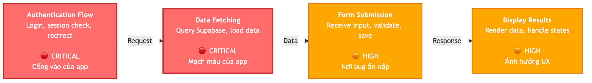
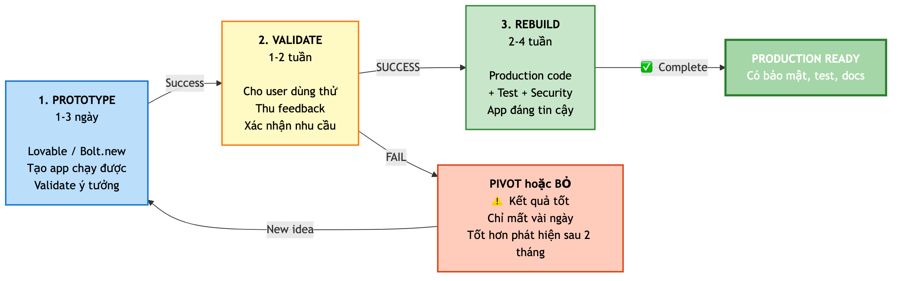
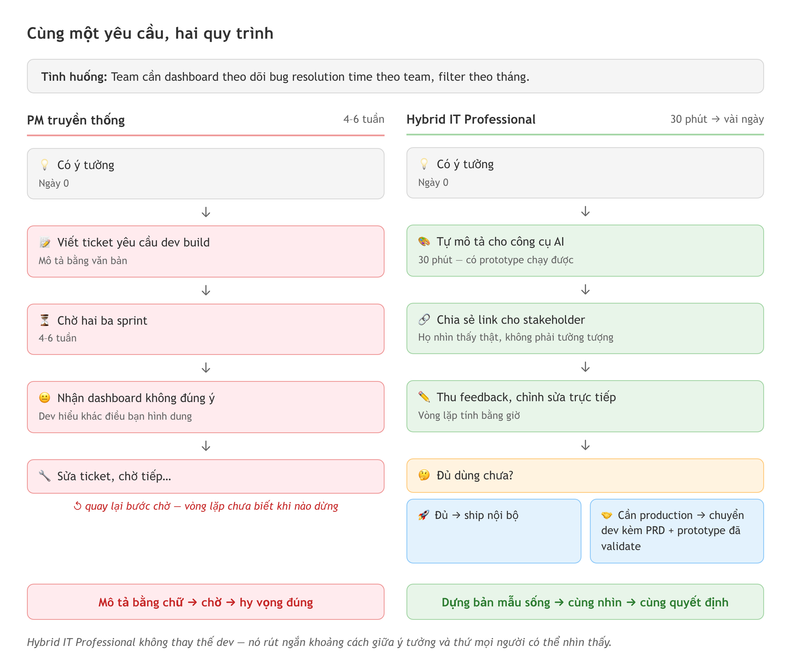

# Chương 19: Duy trì chất lượng dài hạn và lộ trình nghề

App nội bộ bạn dựng bằng AI chạy rất ngọt trong tuần đầu. Ai cũng khen. Bạn thêm một tính năng, rồi thêm nữa, mỗi lần chỉ mất vài phút vì AI làm hộ. Ba tháng sau, bạn nhờ AI sửa một bug nhỏ — và trang chủ trắng xóa. Bạn mở file ra: hai trăm dòng bạn chưa từng đọc, không biết dòng nào gọi dòng nào. Fix cái này thì hỏng cái kia.

App không tự hỏng. Nó hỏng vì không được bảo trì — giống chiếc xe chạy sướng ba tháng đầu rồi đến kỳ bảo dưỡng nhận về danh sách sửa chữa dài cả trang. Mỗi lần "thêm nhanh" là một lần vay: bạn có tính năng ngay, nhưng trả lãi bằng thời gian debug về sau.

Chương này gồm hai nửa. Nửa đầu là những thói quen giữ chất lượng code dài hạn khi làm việc với AI — làm sao để app không chỉ chạy được hôm nay mà còn đáng tin cậy trong sáu tháng tới. Nửa sau lùi lại một bước để nhìn bức tranh nghề: một Tester/PM/BA biết chỉ đạo AI đang đứng ở đâu, làm được gì thật sự, và quan trọng nhất — biết dừng ở đâu.

## Không commit code mà bạn không giải thích được

Nếu chỉ giữ lại một câu từ chương này, hãy giữ câu này: **đừng bao giờ lưu một thay đổi mà bạn không giải thích được**. Đây là quy tắc vàng của người làm việc nghiêm túc với AI.

Khi AI sinh hai trăm dòng trong vài giây, rất dễ rơi vào trạng thái "có vẻ chạy được, thôi kệ". Bạn nhấn nút, app không báo lỗi, bạn lưu lại và đi tiếp. Một tuần sau có bug, bạn mở file đó ra và nhận ra mình không hiểu một dòng nào. Lúc này bạn ở tình thế tệ nhất: phải debug code mình vừa không viết vừa không hiểu.

Giải pháp không phải là đọc hiểu từng dòng như một developer kỳ cựu. Giải pháp là hiểu được **câu chuyện của code** — nó làm gì, tại sao làm vậy, và nó nói chuyện với phần nào khác của app. Giống đọc một báo cáo tài chính: bạn không cần hiểu từng công thức trong bảng tính, nhưng cần hiểu "báo cáo này nói doanh thu tăng 20% vì có khách mới, chi phí marketing giảm".

Cách thực hành đơn giản nhất là **nhờ AI giải thích trước khi lưu**:

```
Giải thích code vừa tạo:
1. Component này làm gì? (tóm tắt 2-3 câu)
2. Nó nhận dữ liệu từ đâu và gửi dữ liệu đi đâu?
3. Có function nào chạy khi người dùng tương tác (click, submit)?
4. Có điều gì tôi cần lưu ý khi sửa nó sau này?
```

Prompt này mất 30 giây nhưng tiết kiệm hàng giờ debug về sau. AI trả lời bằng ngôn ngữ bạn hiểu, và bạn hỏi thêm được nếu chưa rõ.

Một mẹo đi kèm: khi ghi lại một thay đổi vào lịch sử phiên bản, hãy mô tả **tại sao** bạn đổi, không chỉ **đổi cái gì**. Thay vì "update UserForm", hãy viết "thêm kiểm tra định dạng email cho UserForm — chặn email sai định dạng". Lời mô tả tốt là tài liệu giá trị nhất khi bạn cần quay lại xem lịch sử — đúng như cách quản lý phiên bản đã bàn ở Chương 13.

> 🧪 **Dành cho Tester/QA:** Bạn đã quen đọc test case và hiểu logic ứng dụng mà không cần viết code. Kỹ năng đó chuyển thẳng sang đây. Khi AI giải thích "function này kiểm tra user đã đăng nhập chưa, nếu chưa thì đẩy về trang login", bạn hiểu ngay — vì bạn đã test logic tương tự hàng trăm lần. Điều quan trọng là **hỏi AI giải thích**, đừng bỏ qua bước đó.

## Critical path — hiểu phần code chạy nhiều nhất trước

Trong bất kỳ app nào, có phần code được gọi đi gọi lại hàng nghìn lần, và có phần chỉ chạy một lần lúc khởi tạo. Phần được gọi nhiều nhất là **critical path** (đường then chốt). Đây là nơi cần hiểu trước tiên.

Hình dung bạn quản lý một nhà hàng. Bạn không cần biết chi tiết cách làm mọi món, nhưng bắt buộc phải nắm quy trình của những món bán chạy nhất — vì đó là nơi sự cố xảy ra nhiều nhất và ảnh hưởng nhiều khách nhất.

Trong một app điển hình, critical path thường gồm ba luồng. **Luồng đăng nhập** — kiểm tra phiên làm việc, điều hướng người dùng; đây là cổng vào, hỏng thì không ai dùng được gì. **Luồng lấy dữ liệu** — cách app đọc dữ liệu và hiển thị lên giao diện; đây là mạch máu, chậm hoặc sai là trải nghiệm sụp. **Luồng gửi form** — cách app nhận dữ liệu người dùng và lưu lại; đây là nơi bug thích ẩn nấp.

Để xác định critical path, hỏi AI:

```
Trong project này, function/component nào được gọi nhiều nhất?
Liệt kê 5-7 phần quan trọng nhất theo thứ tự ưu tiên,
giải thích mỗi phần làm gì và vì sao quan trọng.
```

Khi đã nắm critical path, bạn review kỹ hơn mỗi khi AI đụng vào những file này, test kỹ hơn sau mỗi lần cập nhật, và hỏi AI giải thích trước khi chấp nhận thay đổi. Bạn dồn năng lượng vào nơi quan trọng nhất thay vì cố hiểu mọi thứ — chiến lược thông minh cho người không phải developer chuyên nghiệp.

> 📋 **Dành cho PM/BA:** Critical path trong code y hệt **đường găng (critical path) trong quản lý dự án** — những task nằm trên đường găng, chậm một cái là chậm cả dự án. Bạn đã biết quản lý đường găng của dự án, giờ áp dụng đúng tư duy đó cho code. Khi review sản phẩm, hãy hỏi: "Tính năng nào là cốt lõi? Luồng nào người dùng đi qua nhiều nhất?" — rồi tập trung test và review đúng những luồng đó.

## Prompt AI phản biện — bắt AI tìm lỗi, đừng để nó khen

Đây là một trong những thói quen giá trị nhất nhưng ít người làm: **yêu cầu AI đánh giá trung thực code của chính nó**.

Mặc định, AI có xu hướng chiều bạn. Hỏi "code này tốt không?", nó thường đáp "tốt!" — vì được huấn luyện để hữu ích và tích cực. Nhưng tích cực không phải lúc nào cũng trung thực. Giống một nhân viên mới luôn "vâng, sếp đúng ạ" — nghe dễ chịu nhưng không giúp bạn thấy vấn đề.

Cách vượt qua là **giao cho AI vai đối lập** — bắt nó tìm lỗi thay vì khen:

```
Phân tích code trong file [tên file] với vai một senior
developer khó tính. Chỉ ra:

1. Có vấn đề bảo mật nào không? (XSS, SQL injection,
   secret hardcode)
2. Có edge case nào chưa xử lý?
3. Có phần nào khó bảo trì khi project lớn lên?
4. Nếu chấm điểm 1-10, bạn cho mấy điểm và vì sao?

KHÔNG cần khen — chỉ cần tìm vấn đề.
```

Prompt này có ba yếu tố quan trọng. **Gán vai** — "senior developer khó tính" đẩy AI sang chế độ phản biện. **Câu hỏi cụ thể** — thay vì "tốt không", bạn chỉ rõ cần soi gì. **Cấm khen** — câu "KHÔNG cần khen" là tín hiệu mạnh để AI tập trung vào vấn đề.

Kết quả thường bất ngờ: một endpoint thiếu kiểm tra đăng nhập, một form không xử lý trường hợp mất mạng, một truy vấn sẽ chậm khi dữ liệu lớn.

> 💡 **Tip:** Chạy prompt phản biện này **trước mỗi lần đưa app lên mạng** — coi như bước kiểm tra trước khi cất cánh, như phi công rà soát máy bay. Không tốn mấy thời gian nhưng cứu bạn khỏi nhiều vấn đề nghiêm trọng.

## Nợ kỹ thuật của code AI tăng nhanh hơn

**Technical debt** (nợ kỹ thuật) là khái niệm quan trọng nhất của nửa đầu chương. Vay tiền mua nhà thì có nhà ngay nhưng trả lãi hàng tháng. Nợ kỹ thuật tương tự: bạn "vay" chất lượng để có tính năng nhanh, "lãi" là thời gian và công sức phải trả sau.

Với code AI, khoản nợ này tăng nhanh hơn bình thường. Theo phân tích của CodeRabbit năm 2025, code do AI sinh ra chứa **nhiều lỗi nghiêm trọng (major issues) gấp 1.7 lần** so với code do con người viết tay. Con số đó không có nghĩa AI viết tệ, mà đến từ ba nguyên nhân mang tính cấu trúc.

**AI không thấy bức tranh toàn cảnh.** Mỗi prompt, nó chỉ thấy context trước mắt. Nó không biết ba tháng trước bạn đã có một function làm việc tương tự, nên nó tạo function mới — giờ bạn có hai đoạn code làm cùng một việc (code trùng lặp).

**AI không tự dọn dẹp.** Đến tính năng thứ 20, AI cứ chồng code mới lên code cũ. Nó không tự bảo "code này lớn quá rồi, tổ chức lại đi đã". Con người sẽ thấy "code bắt đầu bừa", AI thì không.

**Tốc độ nhanh tạo ảo giác an toàn.** AI dựng một tính năng trong năm phút khiến bạn thấy mọi thứ trơn tru. Nhưng mỗi tính năng thêm một lớp phức tạp — đến cái thứ 15 đến 20, mọi thứ chậm đi, bug nhiều hơn, thời gian debug tăng gấp đôi.

Bốn dấu hiệu nợ kỹ thuật đang cao: **debug lâu hơn build** (fix một bug mất hai giờ trong khi thêm tính năng chỉ 30 phút); **AI bắt đầu "quên" context** và sinh code xung đột với code cũ; **một thay đổi nhỏ gây lỗi ở chỗ khác** (sửa file A thì file B hỏng — dấu hiệu code dính nhau quá chặt); và **bạn không dám sửa code cũ** vì sợ đụng vào là vỡ chỗ khác — đây là "lãi mẹ đẻ lãi con".



*HÌNH 19.1: Đồ thị nợ kỹ thuật theo thời gian — trục ngang là số tính năng, trục dọc là thời gian để thêm một tính năng mới. Đường "code được bảo trì" tăng chậm; đường "code không bảo trì" tăng vọt theo cấp số nhân sau tính năng thứ 15-20.*

> ⚠️ **Lưu ý:** Nợ kỹ thuật không phải lúc nào cũng xấu. Khi làm prototype hay MVP, "vay" để ra sản phẩm nhanh là chấp nhận được — miễn bạn biết mình đang vay và có kế hoạch trả. Vấn đề chỉ xảy ra khi bạn không nhận ra mình đang mắc nợ, hoặc khi bạn đối xử với một prototype như thể nó là code production.

## Code sạch giúp AI viết tốt hơn ở lần sau

Đây là vòng phản hồi ít người chỉ ra: **chất lượng code hiện tại ảnh hưởng trực tiếp tới chất lượng code AI sinh ra lần kế tiếp**.

Vì sao? Vì AI dựa vào context. Khi bạn nhờ nó thêm tính năng, nó đọc codebase hiện tại để hiểu "phong cách" và "cấu trúc" của project. Codebase sạch, nhất quán, có tổ chức thì AI sinh code tương tự. Codebase lộn xộn, trùng lặp thì AI "học" đúng cái lộn xộn đó và đẻ thêm code lộn xộn.

Giống dạy một nhân viên mới. Cho họ vào một văn phòng gọn gàng, quy trình rõ ràng, họ làm việc gọn gàng. Cho họ vào một văn phòng giấy tờ chồng chất, họ góp phần làm bừa thêm.

Vài thói quen giữ code sạch: **đặt tên rõ ràng** — thay vì `data`, `temp`, `handleClick`, nhờ AI đặt tên mô tả như `userData`, `filteredBugs`, `handleFormSubmission`; **một file, một nhiệm vụ** — file dài quá hai đến ba trăm dòng thường đang làm quá nhiều việc, nhờ AI tách nhỏ; **xóa code không dùng** — AI hay để lại code bị comment, dòng debug thừa, function không ai gọi, định kỳ nhờ nó dọn.

```typescript
// Trước khi dọn — code "bừa"
const d = await db.from('bugs').select('*')
const x = d.data?.filter(i => i.status !== 'closed')
// console.log('debug:', x)
// const old = data.filter(i => i.priority === 'high')

// Sau khi dọn — code sạch
const { data: allBugs } = await db
  .from('bugs')
  .select('*')

const openBugs = allBugs?.filter(
  bug => bug.status !== 'closed'
)
```

Đoạn thứ hai không chỉ dễ đọc hơn cho bạn — nó dễ đọc hơn cho AI. Lần sau bạn nhờ "thêm lọc theo priority", AI hiểu ngay context và sinh code nhất quán với phong cách hiện tại.

## Sửa lại hay làm mới — tiêu chí quyết định

Đến một lúc nào đó bạn sẽ đối mặt câu hỏi lớn: **sửa lại code cũ (refactor) hay làm mới từ đầu (start fresh)?** Không có câu trả lời đúng cho mọi trường hợp, nhưng có tiêu chí.

**Chọn sửa lại khi** code cơ bản chạy đúng và chỉ cần dọn dẹp: logic cốt lõi vẫn chính xác, chỉ cần tổ chức lại; dữ liệu người dùng và logic nghiệp vụ quá phức tạp để xây lại; và quan trọng nhất, bạn hiểu code đủ để biết cần đổi gì.

**Chọn làm mới khi** cấu trúc dữ liệu đã đổi quá nhiều lần và không còn hợp lý; thời gian debug vượt quá thời gian build lại; bạn đã rút ra nhiều bài học từ lần đầu và muốn áp dụng từ gốc; hoặc code dựng trên thư viện, cách làm cũ không còn phù hợp.

Một cách đánh giá thực tế là **phép thử 50%**: nếu bạn ước tính phải viết lại hơn 50% code, làm mới thường nhanh hơn sửa. Lý do là code cũ có nhiều "dây buộc" — sửa một chỗ hỏng chỗ khác, tốn gấp đôi so với viết mới.

```
Phân tích project này và cho tôi biết:
1. Bao nhiêu phần trăm code cần viết lại?
2. Cấu trúc dữ liệu có vấn đề gì không?
3. Có thư viện nào đã cũ không?
4. Ước tính thời gian sửa lại so với làm mới?
Dựa trên đó, khuyến nghị nên sửa hay làm mới, và giải thích.
```

Dùng prompt này khi bạn cảm thấy project "ở giai đoạn khó" — AI cho bạn góc nhìn khách quan hơn cảm giác chủ quan "code này tệ quá, làm lại đi".

> 📋 **Dành cho PM/BA:** Quyết định sửa lại hay làm mới y hệt quyết định "vá sản phẩm hiện tại" hay "làm phiên bản mới" trong quản lý sản phẩm. Bạn đã quen cân chi phí chuyển đổi, rủi ro, thời gian và giá trị mang lại — áp dụng đúng tư duy đó. Và nhớ: dữ liệu người dùng là tài sản quý nhất, mọi quyết định phải đảm bảo không mất dữ liệu.

## Prototype → Validate → Rebuild: tư duy để đi tới production

Phần cuối của nửa đầu, và có lẽ quan trọng nhất, là một thay đổi tư duy: **không có gì sai khi phiên bản đầu tiên của bạn chỉ là prototype**.

Nhiều người thấy thất bại khi app đầu tay "chỉ là prototype" — chạy được nhưng code lộn xộn, không test, bảo mật chưa chắc. Thực ra đây là quy trình hoàn toàn bình thường, và là cách tiếp cận thông minh nhất. Giống xây nhà: trước khi xây thật, kiến trúc sư làm mô hình để kiểm tra ý tưởng. Mô hình không cần "ở được", nó chỉ giúp thấy vấn đề trước khi đổ tiền vào. Duyệt mô hình xong mới xây nhà thật với nền móng vững.

Quy trình **Prototype → Validate → Rebuild** gồm ba giai đoạn:

**Prototype (một đến ba ngày).** Dùng một công cụ dựng app từ prompt để ra sản phẩm nhanh nhất có thể. Chưa cần lo bảo mật, code sạch hay edge case. Mục tiêu duy nhất: có thứ chạy được để demo và thử ý tưởng.

**Validate (một đến hai tuần).** Cho người dùng thật dùng thử, thu feedback, xác nhận ý tưởng đúng — rằng người ta thật sự cần sản phẩm này và tính năng bạn làm đúng là thứ họ muốn. Prototype có thể "chết" ở đây — và đó là kết quả tốt, vì bạn chỉ mất vài ngày thay vì vài tháng.

**Rebuild (hai đến bốn tuần).** Nếu validate thành công, giờ bạn xây lại từ đầu — nhưng lần này mang theo mọi bài học. Áp dụng khung bảo mật và checklist bảo mật từ Chương 16, viết test case theo tư duy ở Chương 15. Kết quả là một sản phẩm đạt chất lượng production.



*HÌNH 19.2: Sơ đồ Prototype → Validate → Rebuild — ba vòng nối tiếp kèm ghi chú thời gian và mục tiêu từng giai đoạn. Mũi tên từ "Validate thất bại" quay về "Prototype" với ghi chú "Đổi hướng hoặc bỏ — chỉ mất vài ngày".*

> 💡 **Tip:** Giữ prototype và production trong **hai kho mã riêng biệt**. Đừng cố nâng cấp prototype thành production — rất dễ mang theo những vấn đề cũ. Bắt đầu một kho mới, lời mô tả đầu tiên ghi rõ "Dựng lại cho production, dựa trên bài học từ prototype".

## Hybrid IT Professional: bạn thật sự làm được gì

Nửa sau chương lùi lại nhìn nghề. Ở Chương 2, chúng ta đã đặt tên cho vị trí mà cả cuốn sách hướng tới: **Hybrid IT Professional** — người làm IT lai, đứng giữa hai bờ "biết code" và "không biết code". Chương 2 giới thiệu khái niệm; ở đây ta mổ xẻ nó thật sự gồm những gì.

Hãy dùng lại hình ảnh con sông. Trước đây bạn đứng bên bờ "non-dev", nhìn sang bờ "dev" như một thế giới khác. Với AI, bạn đã bắc được cây cầu của riêng mình. Bạn không cần chuyển hẳn sang bờ dev — bạn đứng **giữa cầu**, nơi nhìn được cả hai phía. Hybrid IT Professional kết hợp ba yếu tố.

**Một, hiểu bối cảnh nghiệp vụ.** Bạn biết *vì sao* phần mềm cần được xây, không chỉ *cách* xây. Một dev có thể dựng form đăng nhập hoàn hảo về kỹ thuật, nhưng bạn là người biết user của mình ghét tạo mật khẩu và thích đăng nhập bằng link gửi qua email hơn. Kiến thức ngành (domain knowledge) này không AI nào có được.

**Hai, chỉ đạo được việc dựng phần mềm.** Không phải tự gõ code từ đầu, mà dùng AI biến ý tưởng thành sản phẩm chạy được — và biết đọc, biết đánh giá, biết yêu cầu sửa cái AI sinh ra. Bạn nắm quy trình năm giai đoạn (Chương 3), viết được prompt hiệu quả (Chương 4), viết được PRD để AI hiểu đúng (Chương 5), và dùng rules file để đặt luật cho project (Chương 6).

**Ba, và có lẽ quan trọng nhất — biết giới hạn của mình.** Bạn biết khi nào sản phẩm cần chuyên gia bảo mật review (Chương 16), khi nào cần dev chuyên nghiệp tối ưu hiệu năng, và khi nào một prototype cần được dựng lại cho production.

Ba yếu tố này soi qua ba vai trò thực tế mà bạn có thể đang đảm nhiệm mà không gọi tên. **Người điều phối** — không tự viết code mà "chỉ huy" AI viết, như nhạc trưởng không chơi nhạc cụ nào nhưng quyết bài nào được chơi, nhịp ra sao, khi nào dừng để sửa. **Người thiết kế ý định** — tập trung diễn đạt *ý định* rõ ràng (qua PRD, qua rules file) thay vì code, vì AI không tự hiểu ngầm như con người. **PM/BA thời AI** — tự tay dựng prototype, tự validate ý tưởng, tự làm tool nội bộ cho team thay vì chỉ viết yêu cầu rồi chờ. Bạn không phải chọn một trong ba: một người thường làm cả ba, tùy lúc.

Nếu bạn là Tester, có một vai trò riêng đang lớn lên: thay vì viết script test tự động bằng tay, bạn mô tả ý định — "kiểm tra form đăng ký với email sai định dạng, mật khẩu dưới tám ký tự, trường tên để trống" — và AI sinh test case. QA không còn chỉ là "người tìm bug" mà thành "người định nghĩa chất lượng": bạn thiết kế cách test, giám sát AI test, đánh giá kết quả.

> 🧪 **Dành cho Tester/QA:** Kinh nghiệm viết test case, nghĩ ra edge case, phân biệt "kết quả mong đợi và kết quả thực tế" chính là kỹ năng quý nhất của bạn trong thời AI. AI sinh được code, nhưng nó **không biết test case nào là quan trọng** — đó là việc của bạn, và không mô hình nào thay được.

Đâu là khác biệt cốt lõi của một Hybrid IT Professional? Xem một tình huống quen thuộc: team cần một dashboard theo dõi thời gian xử lý bug (bug resolution time). Cách cũ: bạn viết ticket nhờ dev, chờ hai đến ba sprint, nhận về dashboard không đúng ý, sửa ticket, chờ tiếp. Cách mới: bạn mở một công cụ dựng app từ prompt, mô tả yêu cầu trong khoảng 30 phút — dashboard theo team, lọc theo tháng, biểu đồ đường, đọc từ cơ sở dữ liệu — gửi link cho các bên liên quan xem ngay chiều đó, thu feedback, chỉnh trực tiếp. Rồi quyết định: đủ dùng thì ship nội bộ; cần chuẩn production thì chuyển cho dev kèm PRD, prototype và cấu trúc dữ liệu đã được validate.



*HÌNH 19.3: So sánh hai quy trình cho cùng một yêu cầu "dashboard theo dõi thời gian xử lý bug". Quy trình truyền thống: viết ticket → chờ 4-6 tuần → nhận sản phẩm không đúng ý → sửa lại. Quy trình Hybrid IT Professional: mô tả yêu cầu (~30 phút) → prototype → validate với các bên liên quan → quyết định ship nội bộ hoặc chuyển dev cho production.*

> 📋 **Dành cho PM/BA:** Giá trị lớn nhất của bạn không phải "code được" — mà là **toàn bộ thời gian tiết kiệm được** khi bạn tự validate ý tưởng trước khi kéo cả đội kỹ thuật vào. Một prototype 30 phút có thể thay cho ba buổi họp không đi đến đâu. Bạn không thay thế dev; bạn rút ngắn khoảng cách giữa ý tưởng và sản phẩm để mọi người cùng nhìn một bản mẫu sống mà quyết định.

## Kỳ vọng thực tế: hiểu và chỉ đạo, không phải tự làm tất cả

Cần nói thẳng về những gì cuốn sách này hứa và không hứa, để bạn đặt kỳ vọng đúng — vì kỳ vọng sai là nguồn gốc của cả sự nản lòng lẫn sự tự tin thái quá.

**Bạn sẽ làm được:** hiểu vibe coding đủ sâu để đánh giá và chỉ đạo AI thay vì phó mặc; nắm quy trình năm giai đoạn và viết được PRD, prompt cho AI; đọc hiểu được code AI sinh ra — HTML, CSS, JavaScript, cấu trúc project — đủ để biết nó đang làm gì; và biết cách test, debug, soát bảo mật cho code đó. Với những tool nội bộ và prototype không xử lý dữ liệu nhạy cảm, bạn có thể tự đi từ ý tưởng tới bản chạy được.

**Bạn chưa làm được — và không sao cả.** Cuốn sách này không hứa dạy bạn tự dựng mọi thứ từ số không. Xây hệ thống production xử lý dữ liệu nhạy cảm mà không có dev review vẫn nằm ngoài tầm; tối ưu hiệu năng cho ứng dụng hàng nghìn người dùng cùng lúc, xử lý các vấn đề hạ tầng phức tạp, hay debug những lỗi sâu về bộ nhớ, xử lý đồng thời cũng vậy.

Một ẩn dụ ai cũng hiểu: sau một thời gian học lái, bạn tự lái đi làm, đi chợ, đi chơi cuối tuần được. Nhưng bạn chưa đua Formula 1 — và cũng không cần, vì phần lớn nhu cầu đi lại hàng ngày không cần tốc độ đường đua. Tương tự, phần lớn tool nội bộ và prototype không cần kiến trúc phức tạp cấp doanh nghiệp. Giá trị của bạn nằm ở chỗ *hiểu và chỉ đạo được*, không phải ở chỗ tự tay làm mọi thứ.

> ⚠️ **Lưu ý:** Cảnh giác với hiệu ứng Dunning–Kruger trong vibe coding. Khi AI giúp bạn ra được những app trông đẹp trong thời gian ngắn, rất dễ tưởng mình "đã biết lập trình". Kỹ năng thật nằm ở chỗ biết **khi nào** cần chuyên gia, không phải ở chỗ **có thể** dựng ra app.

## Biết giới hạn: khi nào cần dev chuyên nghiệp

Đây là phần thực tế nhất, và trung thực nhất, của cả cuốn sách. Như một bác sĩ gia đình giỏi — giá trị không nằm ở việc biết mổ tim, mà ở việc biết *khi nào cần chuyển bệnh nhân tới bác sĩ mổ tim*.

**Luôn cần dev chuyên nghiệp** khi sản phẩm xử lý dữ liệu tài chính hoặc y tế; khi hệ thống phải chịu tải hàng nghìn người dùng đồng thời; khi phải tích hợp với hệ thống cũ (legacy) phức tạp; hoặc khi dự án phải tuân thủ quy định nghiêm ngặt về bảo vệ dữ liệu và thanh toán. Nói chung: bất cứ thứ gì chạy trên production với dữ liệu thật của người dùng thật đều cần một con mắt chuyên nghiệp.

**Bạn có thể tự làm (với sự thận trọng)** khi dựng dashboard nội bộ cho team dưới 50 người; làm prototype để validate ý tưởng trước khi bỏ thời gian kỹ thuật vào; dựng tool cá nhân; làm bản demo cho một buổi trình bày; hoặc tự động hóa một quy trình nội bộ đơn giản.

Ba câu hỏi giúp bạn tự quyết:

```
Cây quyết định: tự build hay nhờ dev?

1. Dữ liệu có nhạy cảm không? (thông tin cá nhân, tài chính, y tế)
   → Có → BẮT BUỘC cần dev chuyên nghiệp review

2. Bao nhiêu người dùng thực tế?
   → Trên 100 người → NÊN có dev review
   → Dưới 50 người nội bộ → Có thể tự build

3. Sẽ chạy trong bao lâu?
   → Trên sáu tháng → CẦN dev review kiến trúc
   → Demo hoặc prototype → Có thể tự build
```

Ba câu này đơn giản mà cực kỳ hiệu quả. Nếu bạn trả lời "có" cho bất kỳ câu nào, hãy dừng lại và nhờ chuyên gia — không phải vì bạn kém, mà vì *loại vấn đề* đó đòi kinh nghiệm mà vài tháng chưa đủ để tích lũy. Biết dừng đúng chỗ chính là thứ phân biệt một người dùng AI đáng tin cậy với một người sắp gây ra sự cố.

## Tóm tắt

- Đừng bao giờ lưu một thay đổi bạn không giải thích được — nhờ AI kể "câu chuyện của code" trước khi lưu, và mô tả *tại sao* bạn đổi chứ không chỉ *đổi cái gì*.
- Xác định critical path (đăng nhập, lấy dữ liệu, gửi form) và dồn công review, test vào đúng những luồng đó thay vì cố hiểu mọi thứ.
- Dùng prompt phản biện — gán vai "senior developer khó tính", hỏi cụ thể, cấm khen — trước mỗi lần đưa app lên mạng.
- Theo phân tích của CodeRabbit năm 2025, code AI sinh ra chứa nhiều lỗi nghiêm trọng gấp 1.7 lần so với code người viết tay; nhận biết sớm qua dấu hiệu debug lâu hơn build và một thay đổi nhỏ gây lỗi chỗ khác.
- Code sạch giúp AI sinh code tốt hơn ở lần sau, vì AI đọc chính codebase của bạn làm context.
- Dùng phép thử 50% để quyết định sửa lại hay làm mới; và áp dụng tư duy Prototype → Validate → Rebuild cho mọi dự án nghiêm túc.
- Hybrid IT Professional là người hiểu nghiệp vụ, chỉ đạo được AI dựng phần mềm, và biết giới hạn của mình — mục tiêu là *hiểu và chỉ đạo*, không phải tự làm tất cả.
- Biết khi nào cần dev chuyên nghiệp là kỹ năng quan trọng nhất; dùng cây quyết định ba câu hỏi (dữ liệu nhạy cảm, số người dùng, thời gian chạy) để tự phân loại.

## Bài tập

**Bài 19.1 — Code review: đọc hiểu và phản biện**

Nhờ AI sinh một component tương đối phức tạp — ví dụ một dashboard có biểu đồ, bộ lọc và bảng dữ liệu (khoảng 50–100 dòng). Sau đó tự review bằng ba câu hỏi: (1) Component này làm gì? Tóm tắt trong hai đến ba câu. (2) Critical path là gì — function nào được gọi nhiều nhất? (3) Có vấn đề tiềm ẩn nào không? Cuối cùng, chạy prompt phản biện "senior developer khó tính" để chính AI đánh giá code của nó.

*Đầu ra:* một ghi chú ngắn gồm ba câu trả lời của bạn, danh sách vấn đề AI tìm ra, và một dòng so sánh: bạn có phát hiện vấn đề nào mà AI bỏ sót, hoặc ngược lại?

**Bài 19.2 — Cây quyết định "tự build hay nhờ dev?"**

Cho năm tình huống dưới đây, phân loại mỗi cái vào một trong ba mức: (a) có thể tự build, (b) nên có dev review, (c) bắt buộc cần dev chuyên nghiệp. Áp dụng ba câu hỏi trong phần "Biết giới hạn": tính chất dữ liệu, số người dùng, thời gian dự kiến chạy.

1. Dashboard nội bộ theo dõi OKR cho team 15 người.
2. Hệ thống đặt lịch hẹn cho một phòng khám nha khoa.
3. Tool tính lương thưởng cho phòng nhân sự (50 nhân viên).
4. Prototype app di động để demo cho nhà đầu tư.
5. Hệ thống quản lý đơn hàng cho một cửa hàng online (500 đơn mỗi ngày).

*Đầu ra:* bảng năm dòng, mỗi dòng ghi mức (a/b/c) và một câu lý do bám vào ba câu hỏi.

## Tiếp theo

Bạn đã có toàn bộ nền tảng: tư duy, quy trình, kỹ thuật đọc code, dữ liệu, triển khai, phiên bản, chất lượng, bảo mật — và giờ là kỷ luật duy trì chất lượng dài hạn cùng một cái nhìn tỉnh táo về nghề. Chương 20 gom tất cả lại thành một dự án hoàn chỉnh: dựng một Bug/Issue Tracker từ yêu cầu đến bản chạy được. Không phải "làm theo tôi từng bước", mà là đi qua từng quyết định kiến trúc — từ PRD, mô hình dữ liệu, các lựa chọn, tới những cạm bẫy — để bạn tự chỉ đạo AI dựng nó theo cách của mình.
