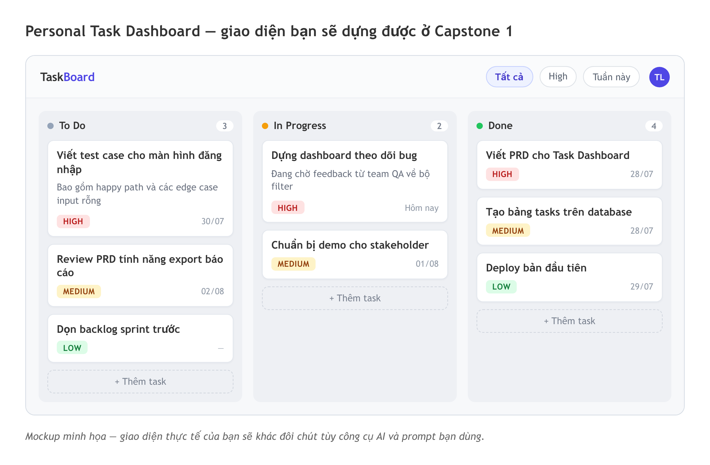
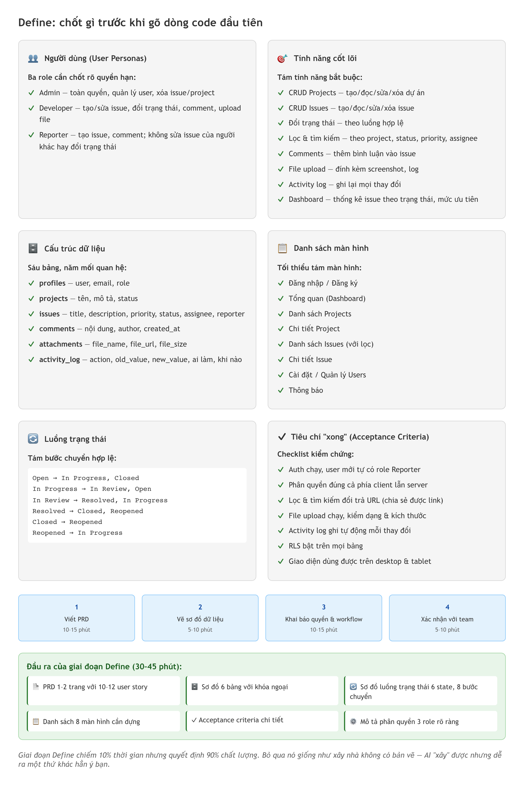
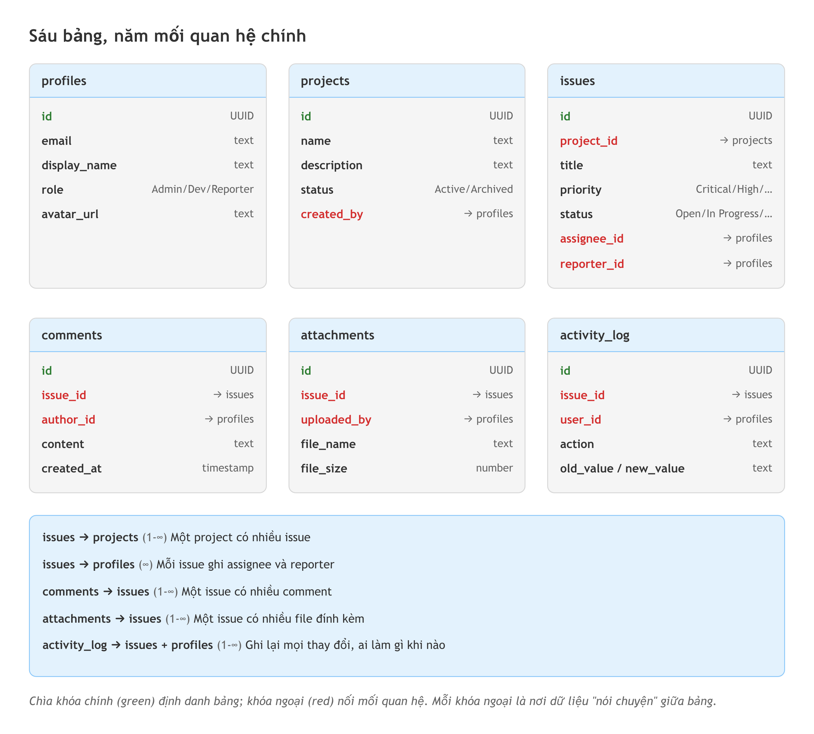
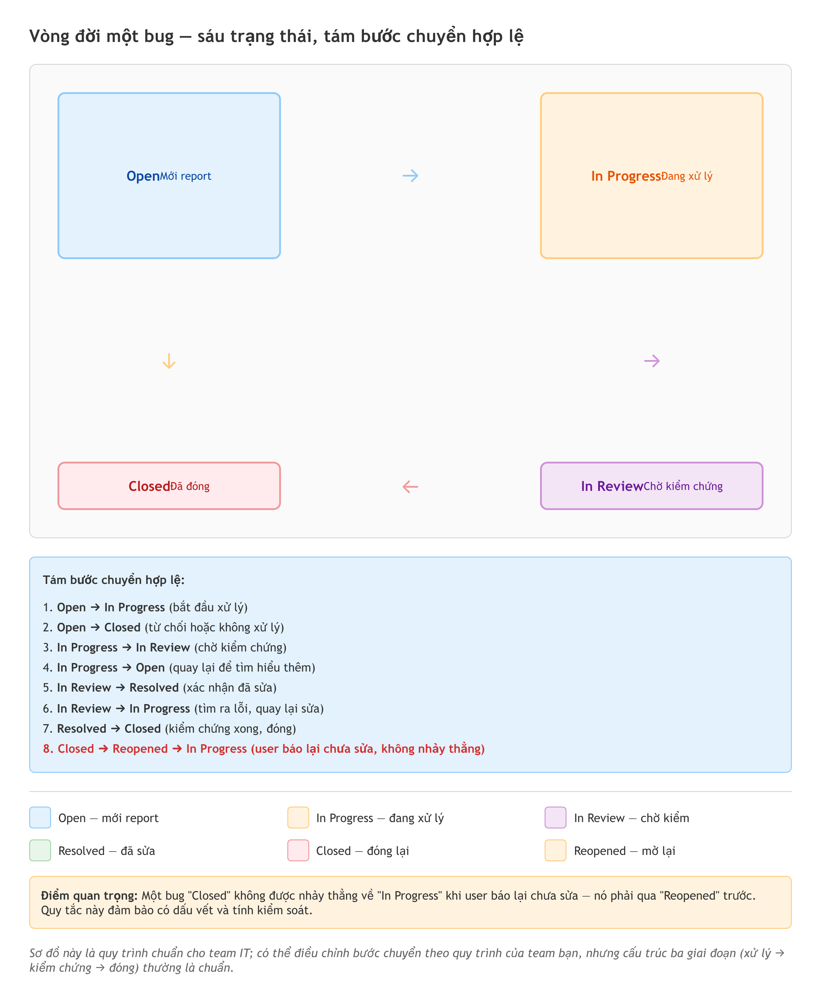

# Chương 20: Capstone — dựng Bug/Issue Tracker

Một bug được report qua tin nhắn nhóm. Một cái khác qua email. Vài cái ghi trên giấy note dán lên màn hình. Và một số bug chỉ tồn tại trong trí nhớ của người vừa phát hiện ra chúng. Nếu bạn từng làm Tester, PM hay BA, bạn biết chuyện gì xảy ra tiếp theo: bug bị quên, bug bị report trùng, bug "mất tích" giữa các kênh liên lạc. Đến cuối sprint, không ai dám chắc còn bao nhiêu vấn đề chưa xử lý.

Chương này bạn sẽ dựng lời giải cho mớ hỗn độn đó — một **Bug/Issue Tracker**, công cụ quản lý lỗi và vấn đề — và dựng nó bằng chính tay mình. Nhưng đây không phải một chương "làm theo tôi từng bước trên công cụ X". Mỗi công cụ dựng app đổi giao diện vài tháng một lần, nên một hướng dẫn bấm nút sẽ lỗi thời trước khi bạn đọc tới cuối. Thay vào đó, chương này là một **walkthrough kiến trúc**: bạn sẽ thấy các *quyết định* cần ra và các *cạm bẫy* cần tránh, kèm prompt mẫu viết theo cách không phụ thuộc bất kỳ công cụ nào. Bạn chọn công cụ; sách chỉ đường.

Đây cũng là chương gom lại tất cả những gì bạn đã học suốt cuốn sách: quy trình năm giai đoạn (Chương 3), cách viết PRD (Chương 5), tư duy database và phân quyền (Chương 11), Git làm lưới an toàn (Chương 13), debug có phương pháp (Chương 14), tư duy test case (Chương 15), và soát bảo mật (Chương 16). Bug tracker là bài tập tổng hợp lý tưởng vì nó chạm vào mọi mảnh ghép đó cùng một lúc.

## Tổng quan dự án — và vì sao chọn bài này

Bug/Issue Tracker là một ứng dụng web cho phép team ghi nhận, theo dõi và quản lý bug và issue trong dự án phần mềm. Hãy nghĩ nó như một phiên bản đơn giản của các công cụ quản lý issue mà bạn đã dùng — nhưng do chính bạn tạo ra, chỉ với những tính năng bạn thật sự cần.

Vì sao chọn đúng bài này để khép lại cuốn sách? Vì với Tester, PM và BA, đây là dự án "trên sân nhà". Bạn không phải học domain mới. Bug severity, priority, status workflow, assignee — đây là những khái niệm bạn sống cùng mỗi ngày. Bạn biết chính xác người dùng cần gì, vì người dùng chính là bạn và đồng nghiệp. Khi AI dựng ra một status workflow vô lý, bạn nhận ra ngay — còn một lập trình viên thuần túy có khi phải hỏi lại. Lợi thế đó là điều cuốn sách này muốn bạn nhìn thấy rõ nhất ở chương cuối.

Về tính năng, ứng dụng sẽ có: hệ thống **đăng nhập/đăng ký**, phân quyền theo **role** (ví dụ Admin, Developer, Reporter), tạo và quản lý **issue** với các trường như title, description, priority, status, assignee, khả năng **đính kèm file** (screenshot, log) khi tạo issue hoặc comment, một **activity log** ghi lại mọi thay đổi, một màn hình tổng quan thống kê issue theo trạng thái và mức ưu tiên, cùng bộ **lọc và tìm kiếm** để không phải cuộn qua hàng trăm issue. Nếu muốn, thêm **thông báo** khi issue được gán cho bạn hoặc đổi trạng thái.

Nếu ví các dự án khác trong sách như xây một tòa nhà bốn tầng, thì bug tracker là tòa nhà sáu tầng có thêm thang máy và hệ thống báo cháy — nhiều hơn, nhưng vẫn xếp từ những viên gạch bạn đã biết cách xếp. Thời gian ước tính khoảng 10 đến 15 giờ, chia thành nhiều buổi. Đừng "code marathon" đến 2 giờ sáng; app phức tạp thì đầu óc tỉnh táo quan trọng hơn tốc độ.

> 🧪 **Dành cho Tester/QA:** Mọi khái niệm trong dự án này — bug severity, priority, status workflow, assignee — đều là thứ bạn xử lý hằng ngày. Lợi thế của bạn không phải viết code nhanh hơn, mà là *biết trước* sản phẩm phải hành xử thế nào. Hãy tận dụng: khi AI đề xuất một workflow, đối chiếu ngay với quy trình thật của team bạn thay vì gật đầu cho qua.



*HÌNH 20.1: Mockup giao diện Bug/Issue Tracker — thanh điều hướng bên trái (Tổng quan, Issues, Projects, Cài đặt), khu vực chính hiển thị danh sách issue dạng bảng với các cột Title, Priority, Status, Assignee, Created date; mỗi trạng thái là một badge màu khác nhau.*

## Giai đoạn 1: Define — viết PRD cho bug tracker

Như đã nói ở Chương 3, giai đoạn Define chiếm khoảng 10% thời gian nhưng quyết định 90% chất lượng. Bỏ qua nó giống như xây nhà không có bản vẽ — AI vẫn "xây" cho bạn, nhưng dễ ra một thứ khác hẳn ý bạn muốn. Với bug tracker, Define còn quan trọng hơn nữa vì đây là lần bạn phải thiết kế **phân quyền**: không phải ai cũng được làm mọi thứ. Admin có thể xóa issue, Developer có thể đổi trạng thái, nhưng Reporter chỉ tạo mới và comment. Đây đúng là loại câu hỏi PM và BA trả lời hằng ngày — giờ bạn biến câu trả lời thành sản phẩm.

Sản phẩm của giai đoạn này là một **PRD** (Product Requirements Document — tài liệu mô tả yêu cầu sản phẩm). Không cần PRD 20 trang kiểu enterprise; ngắn gọn nhưng đủ thông tin là tốt nhất. Dùng khung PRD bạn đã dựng ở Chương 5, hoặc lấy sẵn từ `templates/prd-template.md` rồi điền vào. Dưới đây là prompt để nhờ AI phác PRD từ mô tả của bạn.

```text
Tôi muốn dựng một Bug/Issue Tracker cho team IT.

Mục đích: ứng dụng web để team ghi nhận, theo dõi và quản lý bug
và issue, thay cho việc rải rác qua bảng tính / tin nhắn / email.

Cấu trúc dữ liệu (dạng quan hệ):
1. profiles: id, email, display_name, role (Admin/Developer/
   Reporter), avatar_url, created_at
2. projects: id, name, description, status (Active/Archived),
   created_by, created_at
3. issues: id, project_id (FK), title, description, priority
   (Critical/High/Medium/Low), status (Open/In Progress/In Review/
   Resolved/Closed/Reopened), type (Bug/Feature/Task/Improvement),
   assignee_id (FK, nullable), reporter_id (FK), created_at,
   updated_at
4. comments: id, issue_id (FK), author_id (FK), content, created_at
5. attachments: id, issue_id (FK), uploaded_by (FK), file_name,
   file_url, file_size, created_at
6. activity_log: id, issue_id (FK), user_id (FK), action, old_value,
   new_value, created_at

Phân quyền:
- Admin: toàn quyền, quản lý user, xóa issue/project
- Developer: tạo/sửa issue, đổi trạng thái, comment, upload file
- Reporter: tạo issue, comment, upload file; KHÔNG sửa issue của
  người khác hay đổi trạng thái

Hãy viết PRD ngắn gọn gồm:
- 10-12 user story, phân biệt theo role
- Sơ đồ dữ liệu 6 bảng với quan hệ
- Danh sách màn hình cần có
- Acceptance criteria cho mỗi tính năng chính
- Sơ đồ luồng trạng thái (trạng thái nào chuyển sang trạng thái nào)
```

Điểm quan trọng nhất trong prompt này là phần phân quyền. Bạn đang nói rõ cho AI ai được làm gì. Thiếu nó, AI sẽ dựng một app mà mọi người có quyền như nhau, và bạn sẽ phải làm lại từ đầu — tốn gấp bội.

Khi AI trả PRD, kiểm ba điểm. Thứ nhất, **status workflow có hợp lý không** — một bug có nên nhảy thẳng từ "Open" sang "Closed" mà bỏ qua "In Progress"? Thường là không nên, nhưng câu trả lời tùy quy trình team bạn. Thứ hai, **sơ đồ dữ liệu có đủ sáu bảng với khóa ngoại đúng không** — đặc biệt `activity_log` phải tham chiếu tới cả issue và user. Thứ ba, **user story có bao phủ cả ba role không** — mỗi role cần story riêng.

> 📋 **Dành cho PM/BA:** PRD này giống hệt tài liệu bạn viết hằng ngày, chỉ khác một điều: lần này bạn không giao nó cho dev rồi thôi — bạn tự implement. Trải nghiệm đó dạy bạn vì sao vài requirement "dễ viết mà khó làm", và vì sao dev hay hỏi lại về edge case. Lần sau viết requirement cho notification hay phân quyền, bạn sẽ viết cụ thể và khả thi hơn hẳn.

Sau giai đoạn Define, bạn nên có: PRD với 10 đến 12 user story phân theo role, sơ đồ dữ liệu sáu bảng, danh sách sáu đến tám màn hình (Login, màn hình tổng quan, Projects, danh sách Issues, chi tiết Issue, Cài đặt/Users), sơ đồ luồng trạng thái, và acceptance criteria. Cả giai đoạn mất khoảng 30 đến 45 phút.



*HÌNH 20.2: Trang PRD một cột với các khối "User stories theo role", "Sơ đồ dữ liệu", "Màn hình", "Acceptance criteria" — minh họa PRD ngắn gọn đủ cho AI hiểu, không phải tài liệu 20 trang.*



*HÌNH 20.3: Sơ đồ mô hình dữ liệu — sáu bảng (profiles, projects, issues, comments, attachments, activity_log) nối bằng các đường khóa ngoại: một project có nhiều issue, một issue có nhiều comment và attachment, mọi hành động ghi vào activity_log; mỗi issue trỏ tới hai user là reporter và assignee.*

## Giai đoạn 2: Scaffold — dựng khung và các quyết định nền

Scaffold là lúc bạn nhờ AI dựng bộ xương của ứng dụng: cấu trúc thư mục, layout, và giao diện ban đầu với dữ liệu giả. Thao tác cụ thể tùy công cụ bạn chọn, nên ở đây ta bỏ qua phần bấm nút và tập trung vào hai **quyết định** định hình mọi thứ về sau.

Quyết định thứ nhất là **chia màn hình**. Một bug tracker gọn nhất cần khoảng sáu màn hình: trang đăng nhập, màn hình tổng quan (thống kê), danh sách projects, danh sách issues có lọc, chi tiết một issue, và trang cài đặt/quản lý user. Layout chung thường là: thanh điều hướng bên trái, thanh trên cùng chứa ô tìm kiếm và menu người dùng, phần thân đổi theo trang. Quyết định layout ngay từ đầu quan trọng vì nó là cái khó sửa nhất khi app đã phình to — như đã học ở Chương 10 về cấu trúc project, đổi bố cục lúc còn năm file dễ hơn nhiều so với lúc đã có mười lăm component đan xen.

Quyết định thứ hai là **cấu trúc dữ liệu** — thực ra bạn đã ra quyết định này ở phần Define. Điểm cần nhấn: dùng một bảng `profiles` riêng thay vì gộp thông tin user vào một bảng duy nhất. Hầu hết dịch vụ backend có sẵn auth đều tự quản lý một bảng user hệ thống để lo việc đăng nhập; bạn tạo thêm bảng `profiles` liên kết với nó để lưu những thứ của riêng app như display_name và role. Đây là pattern chuẩn khi dùng auth dựng sẵn, bạn đã gặp ở Chương 12.

Prompt scaffold nên yêu cầu AI dựng khung **với dữ liệu giả trước** — vài project, tám đến mười issue với đủ trạng thái và mức ưu tiên, ba user với ba role khác nhau — để bạn nhìn được layout trước khi nối database. Tách phần giao diện khỏi phần dữ liệu giúp bạn kiểm từng phần dễ hơn.

> 💡 **Tip:** Ngay sau khi scaffold xong, khởi tạo Git và tạo commit đầu tiên. Từ đó, **commit trước mỗi prompt lớn**. Với app phức tạp như bug tracker, khả năng cần quay lui cao hơn hẳn các dự án nhỏ — và như Chương 13 đã chỉ ra, một commit sạch trước khi thử là toàn bộ khác biệt giữa "quay lui trong 5 giây" và "ngồi gỡ nửa buổi".

## Giai đoạn 3: Build — xây theo thứ tự phụ thuộc

Đây là giai đoạn dài nhất. Nguyên tắc vàng từ Chương 4 vẫn đúng: **một prompt, một tính năng**. Đừng nhồi năm tính năng vào một prompt — AI làm tốt hơn nhiều khi được giao việc rõ ràng, từng bước.

Với bug tracker, thứ tự xây quyết định độ trơn tru. Xây theo **thứ tự phụ thuộc**: authentication trước (vì mọi thứ dựa vào việc biết "ai đang đăng nhập"), rồi Projects, rồi Issues, rồi Comments và Attachments, rồi Activity Log, cuối cùng là màn hình tổng quan và thông báo. Làm ngược thứ tự này nghĩa là liên tục quay lại sửa những thứ đã dựng.

**Bước 1 — Auth và schema.** Trước khi viết prompt, dựng sáu bảng trên dịch vụ backend bằng SQL (bạn đã có sẵn từ PRD), tạo một nơi chứa file cho attachment, và bật **RLS** (Row Level Security — bảo mật ở mức từng dòng dữ liệu) trên mọi bảng như Chương 11 đã dạy. Rồi mới nối app vào:

```text
Nối app với dịch vụ backend và thiết lập auth.
- Đăng nhập bằng email/mật khẩu.
- Khi một user đăng ký: tự tạo một dòng trong bảng profiles với
  role mặc định là 'Reporter'.
- Sau khi đăng nhập: chuyển tới màn hình tổng quan.
- Bảo vệ mọi trang khác: chưa đăng nhập thì chuyển về trang login.
- Thanh trên cùng hiển thị tên user, badge role, và nút đăng xuất.
Thay dữ liệu giả bằng dữ liệu thật. Giữ nguyên giao diện hiện tại.
```

Câu cuối — "giữ nguyên giao diện hiện tại" — rất quan trọng. AI hay "sáng tạo" thừa: bạn nhờ đổi phần dữ liệu, nó đổi luôn cả giao diện. Câu ràng buộc đó giữ lại phần đã chạy tốt.

> 🔒 **Bảo mật — quyền xem bug:** Khi thiết lập RLS, cẩn thận với bảng `profiles`. RLS quá chặt thì người dùng không đọc được tên và avatar của nhau, và danh sách assignee sẽ trống trơn. Policy hợp lý: mọi người được **đọc** mọi profile, nhưng chỉ được **sửa** profile của chính mình. Với bảng `issues` thì ngược lại — cân nhắc kỹ ai được xem issue nào. Nếu bug chứa thông tin nhạy cảm (log lỗi có dữ liệu khách hàng chẳng hạn), quyền xem phải giới hạn theo project hoặc theo team, không để mặc định "ai đăng nhập cũng thấy hết". Đây là nơi tư duy phân quyền của bạn tạo ra khác biệt thật, không phải AI.

**Bước 2 — CRUD Projects, rồi CRUD Issues.** Projects đơn giản hơn nên làm trước để làm nóng. Prompt Issues nặng hơn vì kèm bộ lọc:

```text
Xây danh sách Issues với lọc và tìm kiếm.
- Bảng issue với các cột: Title, Project, Type, Priority, Status,
  Assignee, Reporter, Created (thời gian tương đối, vd "2 giờ trước").
- Sắp xếp theo bất kỳ cột nào khi bấm tiêu đề cột.
- Thanh lọc phía trên: tìm theo title/description; lọc theo project;
  lọc nhiều lựa chọn cho Status, Priority, Type; lọc theo assignee;
  nút xóa toàn bộ bộ lọc.
- Đồng bộ bộ lọc với tham số trên URL để chia sẻ được link đã lọc.
- Trạng thái rỗng: "Không có issue nào. Tạo issue đầu tiên hoặc
  điều chỉnh bộ lọc."
```

Lọc và tìm kiếm là "trái tim" của mọi issue tracker. Không ai muốn cuộn qua 200 issue để tìm một cái — họ gõ tên, chọn trạng thái, thấy kết quả ngay. Nếu từng dùng công cụ quản lý issue, bạn biết cảm giác lọc mượt và cảm giác lọc chậm khác nhau thế nào. Hãy đảm bảo bộ lọc phản hồi nhanh.

**Bước 3 — Chi tiết issue và luồng trạng thái.** Đây là phần phức tạp nhất, vì không phải trạng thái nào cũng chuyển sang trạng thái nào được. Bạn cần khai báo rõ các bước chuyển hợp lệ:

```text
Xây trang chi tiết issue.
- Trên cùng: title, badge type, badge priority, badge status.
- Thông tin: Project, Reporter, Assignee, Created, Updated.
- Phần mô tả, phần attachment, phần comment, phần activity log.
- Cột hành động bên phải: đổi Status (chỉ hiện các bước chuyển
  hợp lệ), đổi Priority, đổi Assignee, sửa issue (Developer và
  Admin sửa mọi issue; Reporter chỉ sửa issue mình tạo), xóa
  issue (chỉ Admin).

Các bước chuyển trạng thái hợp lệ:
- Open       -> In Progress, Closed  (đóng thẳng chỉ dùng cho issue trùng/không hợp lệ)
- In Progress-> In Review, Open
- In Review  -> Resolved, In Progress
- Resolved   -> Closed, Reopened
- Closed     -> Reopened
- Reopened   -> In Progress

Phân quyền khi đổi trạng thái:
- Admin: mọi bước chuyển; Developer: mọi bước trừ xóa issue;
- Reporter: KHÔNG được đổi trạng thái, chỉ tạo issue và comment.
```

Những quy tắc chuyển trạng thái này đến từ kinh nghiệm thực tế của bạn, không phải từ AI. Một bug "Closed" không nên nhảy thẳng về "In Progress" — nó phải "Reopened" trước. Đây chính là lúc domain knowledge tạo khác biệt lớn nhất.



*HÌNH 20.4: Sơ đồ luồng trạng thái bug — sáu node (Open, In Progress, In Review, Resolved, Closed, Reopened) với các mũi tên có hướng thể hiện bước chuyển hợp lệ; đường từ Closed và Resolved quay lại Reopened được tô đậm để nhấn "không nhảy thẳng, phải reopen".*

> 🧪 **Dành cho Tester/QA:** Khi test luồng trạng thái, dựng một **test matrix**: từ mỗi trạng thái, thử chuyển sang tất cả trạng thái còn lại. Mọi bước chuyển không hợp lệ phải bị vô hiệu hóa hoặc ẩn. Đặc biệt kiểm: một user role Reporter có bị chặn khi cố đổi trạng thái không? Đây là **access control testing** — một kỹ năng QA giá trị cao, và bạn đã dựng bảng test case cho đúng loại tình huống này ở Chương 15.

**Bước 4 — Comments, Attachments và Activity Log.** File upload cần một prompt riêng nêu rõ giới hạn: chỉ nhận ảnh và PDF, tối đa 5MB mỗi file, tối đa 3 file. Activity Log ghi tự động mỗi khi có thay đổi — tạo issue, đổi trạng thái, đổi priority, đổi assignee, thêm comment, upload file — và hiển thị dạng timeline, mới nhất trên cùng.

Activity log nghe như tính năng "thêm cho vui", nhưng thực ra nó là một trong những thứ quan trọng nhất. Khi một bug được report từ tháng trước và bạn cần biết "ai đã làm gì, khi nào", activity log là nơi duy nhất có câu trả lời. Nó như camera an ninh cho dữ liệu — không cần xem mỗi ngày, nhưng khi cần thì không thể thiếu.

**Bước 5 — Màn hình tổng quan và thông báo.** Màn hình tổng quan gồm vài thẻ số (tổng issue đang mở, số issue Critical, số gán cho tôi) và biểu đồ theo trạng thái, theo priority. Yêu cầu AI dùng một thư viện biểu đồ có sẵn thay vì tự vẽ. Thông báo (khi issue được gán, đổi trạng thái, có comment) có thể để đơn giản: một chuông thông báo trên thanh trên cùng, cập nhật bằng cách hỏi lại máy chủ mỗi 30 giây nếu cách đẩy thời gian thực quá phức tạp.

## Giai đoạn 4: Debug — những lỗi đặc thù của bug tracker

Với sáu bảng, authentication, phân quyền, file upload và thông báo, khả năng gặp lỗi cao. Áp dụng phương pháp debug ở Chương 14: đọc kỹ thông báo lỗi, cô lập phạm vi, rồi mô tả cho AI cả hiện tượng lẫn kỳ vọng. Bốn lỗi dưới đây gần như chắc chắn gặp.

**Lỗi 1 — phân quyền không đúng.** Một Reporter đổi được trạng thái, hoặc một Developer xóa được project, dù lẽ ra không được. Thường do bạn chỉ ẩn nút ở giao diện mà không chặn ở máy chủ.

```text
Lỗi phân quyền:
- Hiện tượng: user role Reporter vẫn đổi được trạng thái issue;
  ô chọn trạng thái hiện cho mọi role.
- Kỳ vọng: chỉ Admin và Developer thấy ô chọn trạng thái.
- Yêu cầu: kiểm role ở CẢ giao diện (ẩn/hiện) LẪN máy chủ
  (chặn request). Nếu không đủ quyền, trả về 403 Forbidden.
```

> 🔒 **Bảo mật:** Phân quyền phải kiểm ở **cả hai** nơi: giao diện (ẩn/hiện nút) và máy chủ (chặn request). Chỉ ẩn nút ở giao diện là không đủ — người biết dùng công cụ dev của trình duyệt có thể gửi thẳng request tới API và bỏ qua lớp giao diện. Đây là nguyên tắc **defense-in-depth** đã học ở Chương 16: đừng bao giờ tin phía client.

**Lỗi 2 — file upload thất bại vì thiếu policy.** Thông báo lỗi thường nhắc tới "row-level security policy" cho nơi chứa file. Nguyên nhân: bạn đã bật RLS cho nơi lưu file nhưng chưa viết policy cho phép người đã đăng nhập upload và đọc. Mô tả cho AI để nó tạo policy, kèm giới hạn kích thước và định dạng.

**Lỗi 3 — activity log không ghi khi đổi trạng thái.** Comment thì được ghi, nhưng đổi status/priority/assignee lại không. Nguyên nhân thường là logic ghi log chưa được gọi trong tất cả các đường xử lý cập nhật issue. Nhờ AI rà mọi chỗ cập nhật issue và thêm dòng ghi log còn thiếu.

**Lỗi 4 — thông báo trùng.** Khi đổi cả trạng thái lẫn assignee cùng lúc, hệ thống tạo hai thông báo cho cùng một người. Thêm logic khử trùng: nếu đã có một thông báo chưa đọc cho cùng user và cùng issue trong vòng một phút, cập nhật thông báo cũ thay vì tạo mới.

Ba trong bốn lỗi này — phân quyền, phân trạng thái, quyền xem — là loại lỗi mà một app "chạy đúng" trong demo vẫn giấu kín, vì bạn thường test với một tài khoản duy nhất. Chúng chỉ lộ ra khi có nhiều role thật đăng nhập cùng lúc. Đó là lý do phần Debug của bug tracker đáng dành thời gian gấp đôi bình thường.

## Giai đoạn 5: Ship — đưa app lên mạng

Nguyên lý deploy giống mọi dự án đã học ở Chương 12: đẩy code lên kho Git, nối kho đó với một nền tảng hosting, khai báo các biến môi trường cho khóa kết nối, rồi để nền tảng build và xuất bản. Bug tracker có thêm một việc so với app đơn giản: cấu hình nơi chứa file cho attachment và viết policy cho nó.

Trước khi deploy, chạy đúng checklist bảo mật ở Chương 16 và Phụ lục B: mọi khóa kết nối nằm trong biến môi trường chứ không viết cứng trong code; file cấu hình chứa secret đã được Git bỏ qua; RLS bật trên **mọi** bảng, gồm cả bảng thông báo thêm sau; mọi đường xử lý ở máy chủ kiểm role trước khi làm việc. Đây là chỗ dễ để lọt lỗ hổng nhất, vì lúc này bạn đang vội xem app "lên sóng".

Sau khi deploy, tạo vài tài khoản test với ba role khác nhau và mời đồng nghiệp đăng nhập bằng chúng. Xem họ có gặp vấn đề phân quyền không, file upload có chạy không, thông báo có tới đúng người không. Đây là acceptance testing thật — và bạn đang cùng lúc đóng ba vai: người dựng, người test, và chủ sản phẩm.

> 🧰 **Đề xuất công cụ:** *Tính đến 2026-07.* Cả pipeline bug tracker có thể ghép từ ba nhóm công cụ: nhóm AI IDE để build (Cursor, Windsurf, hoặc trợ lý code tích hợp sẵn trong editor của bạn); nhóm backend có sẵn database + auth + storage (Supabase, Firebase); nhóm hosting để deploy (Vercel, Netlify). Danh sách và tính năng đổi nhanh — kiểm tra trang chủ trước khi chọn, và xem trang [Đề xuất công cụ](../de-xuat-cong-cu.md) để có bản cập nhật.

## Checklist hoàn thành và rubric chấm điểm

Trước khi tuyên bố "xong", chạy qua checklist ba nhóm.

**Tính năng:** đăng nhập/đăng ký chạy, user mới tự có role Reporter; CRUD Projects chạy (chỉ Admin tạo/sửa/xóa); CRUD Issues đầy đủ các trường; luồng trạng thái chỉ cho phép các bước chuyển hợp lệ; phân quyền đúng theo ba role; file upload chạy kèm kiểm kích thước và định dạng; comments thêm/sửa/xóa được; activity log ghi tự động; màn hình tổng quan thống kê đúng; lọc và tìm kiếm chạy.

**Chất lượng:** app tải nhanh, console không báo lỗi; có trạng thái đang tải và trạng thái rỗng; có thông báo khi thao tác thành công; giao diện dùng được trên cả desktop lẫn tablet.

**Sẵn sàng làm portfolio:** app đã deploy và mở được qua URL; kho Git có README mô tả mục đích, tech stack và cách chạy; bạn tự giải thích được cách auth, phân quyền và file upload hoạt động; ít nhất hai người khác đã test và cho feedback.

Checklist trả lời "làm chưa"; rubric trả lời "làm tốt tới đâu". Chấm mỗi tiêu chí theo ba mức — Đạt (2đ), Một phần (1đ), Chưa đạt (0đ) — tổng 10 điểm.

| # | Tiêu chí | Đạt (2) | Một phần (1) | Chưa đạt (0) |
|---|---|---|---|---|
| 1 | **Hoàn thiện tính năng** | Cả sáu nhóm tính năng chạy đầu-cuối | Thiếu 1-2 nhóm hoặc còn lỗi nhỏ | Thiếu tính năng cốt lõi (CRUD issue, auth) |
| 2 | **Cấu trúc dữ liệu** | Sáu bảng, khóa ngoại đúng, activity_log tham chiếu đủ | Có bảng nhưng quan hệ lỏng hoặc thiếu ràng buộc | Dồn dữ liệu vào ít bảng, không có quan hệ |
| 3 | **Bảo mật & quyền xem** | RLS bật mọi bảng, quyền kiểm ở cả client và server, quyền xem issue giới hạn hợp lý | Kiểm ở giao diện nhưng không đủ ở server | Ai đăng nhập cũng làm/xem được mọi thứ |
| 4 | **Chất lượng code đọc-hiểu-được** | Bạn giải thích được mọi file, đặt tên rõ, không code thừa | Hiểu phần lớn nhưng vài chỗ chưa nắm | Không giải thích được code AI sinh ra |
| 5 | **Đã deploy** | Mở được qua URL, có README, ít nhất hai người test | Deploy được nhưng thiếu README hoặc chưa ai test | Chỉ chạy trên máy, chưa lên mạng |

Tự chấm trung thực. Dưới 6 điểm nghĩa là còn một giai đoạn chưa xong — thường là tiêu chí 3 hoặc 4, hai thứ dễ bị bỏ qua nhất khi vội "ship".

## Mẹo và bài học — khép lại hành trình

Bug tracker để lại vài bài học đáng mang theo, và chúng cũng là những bài học lớn của cả cuốn sách.

Thứ nhất, **phân quyền là tính năng vô hình nhưng sống còn**. Người dùng không để ý khi nó đúng — họ chỉ để ý khi nó sai. Một Reporter xóa được issue của người khác là lỗi nghiêm trọng, nhưng nó thường không lộ ra khi build vì bạn test bằng một tài khoản duy nhất. Bài học: luôn test với nhiều tài khoản, nhiều role.

Thứ hai, **file upload phức tạp hơn vẻ ngoài**. Không chỉ là "chọn file rồi tải lên" — có kiểm định dạng và kích thước, có chuyện lưu ở đâu và ai được đọc, có xử lý lỗi khi mạng chậm hay file hỏng. Nhưng khi nó chạy, nó nâng tầm app hẳn lên: một bug report kèm screenshot rõ ràng có giá trị gấp 10 lần một report chỉ có chữ.

Thứ ba, **activity log và thông báo là dòng máu của app nhiều người dùng**. Không có chúng, người dùng phải tự hỏi "có gì mới không" và tự đi kiểm từng issue. Có chúng, thông tin tự tìm tới người cần biết. Đó là ranh giới giữa app "dùng được" và app "muốn dùng".

Và bài học lớn nhất, sau hai mươi chương: **domain knowledge của bạn là lợi thế, không phải điểm yếu**. Suốt cuốn sách, thứ khiến bạn khác một người chỉ biết gõ prompt không phải là kỹ năng code — mà là việc bạn biết một status workflow nên trông thế nào, biết edge case nào người dùng sẽ vấp, biết câu hỏi nào phải đặt trước khi viết một dòng requirement. AI sinh code nhanh; bạn là người biết code đó *nên* làm gì và *khi nào nó sai*. Bug tracker này chứng minh điều đó bằng một sản phẩm chạy được, deploy được, và bạn hiểu từng phần. Từ nỗi đau ở chương đầu — không biết vibe coding là gì và có phần nào đó nói nó không dành cho mình — tới đây, bạn đã dựng xong một hệ thống hoàn chỉnh. Đó không phải đích đến; đó là điểm bạn đủ tự tin để tự đi tiếp.

## Tóm tắt

- Bug/Issue Tracker là bài capstone lý tưởng cho Tester/PM/BA vì đây là domain "sân nhà" — bạn biết trước sản phẩm phải hành xử thế nào, và nó gom lại mọi kỹ năng của cả cuốn sách.
- Đi qua năm giai đoạn của Chương 3: Define (viết PRD, dùng `templates/prd-template.md`), Scaffold (quyết định chia màn hình và cấu trúc dữ liệu), Build, Debug, Ship.
- Xây theo **thứ tự phụ thuộc**: authentication trước, rồi Projects, Issues, Comments/Attachments, Activity Log, cuối cùng là thống kê và thông báo.
- **Luồng trạng thái phải thiết kế có chủ đích** — không phải trạng thái nào cũng chuyển sang trạng thái nào; domain knowledge của bạn quyết định workflow hợp lý, không phải AI.
- **Phân quyền và quyền xem bug phải kiểm ở cả giao diện lẫn máy chủ**, với RLS bật trên mọi bảng — chỉ làm một phía là lỗ hổng bảo mật (defense-in-depth, Chương 16).
- Bốn lỗi đặc thù hay gặp: phân quyền lọt, file upload thiếu policy, activity log không ghi khi đổi trạng thái, và thông báo trùng — phần lớn chỉ lộ khi test với nhiều role thật.
- Chấm sản phẩm bằng rubric 5 tiêu chí: hoàn thiện tính năng, cấu trúc dữ liệu, bảo mật/quyền xem, chất lượng code đọc-hiểu-được, và đã deploy — dưới 6/10 nghĩa là còn một giai đoạn chưa xong.

## Bài tập

**EX 20.1 — Dựng Bug/Issue Tracker và tự chấm rubric**

Thực hiện đầy đủ năm giai đoạn với công cụ bạn tự chọn. Mục tiêu: hoàn thành CRUD projects/issues, authentication, phân quyền, file upload, comments, activity log, màn hình tổng quan. Tạo ít nhất ba tài khoản test với ba role khác nhau và kiểm phân quyền bằng chúng.

Bắt đầu từ PRD, đi tuần tự theo thứ tự phụ thuộc. Chú ý nhất bước auth và schema — chia nhỏ, dựng bảng và bật RLS trước, xác nhận chạy được, rồi mới nối app. Ghi lại thời gian mỗi giai đoạn; dự án này mất nhiều thời gian hơn các app đơn giản, và biết mình chậm ở đâu là dữ liệu quý cho lần sau.

*Đầu ra:* một app đã deploy mở được qua URL, kèm bảng tự chấm theo rubric 5 tiêu chí ở trên — mỗi tiêu chí ghi điểm và **một câu bằng chứng** vì sao chấm điểm đó, không chấm theo cảm giác.

**EX 20.2 — Build journal và ma trận test phân quyền**

Viết một build journal ghi lại toàn bộ quá trình: prompt đã dùng, vấn đề gặp và cách sửa, đặc biệt những lúc bạn phải "dạy" AI hiểu về status workflow hay phân quyền — đó chính là lúc domain knowledge tạo giá trị lớn nhất.

Kèm theo, dựng một **ma trận test phân quyền**: cột là ba role (Admin, Developer, Reporter), hàng là các hành động (tạo issue, đổi trạng thái, xóa project, upload file, sửa issue người khác). Mỗi ô ghi "được phép / bị chặn" theo thiết kế, rồi test thật và đánh dấu ô nào lệch. Nhớ test cả phía máy chủ, không chỉ phía giao diện.

*Đầu ra:* file build journal + ma trận test phân quyền có đánh dấu kết quả thực tế so với thiết kế.

## Tiếp theo

Bạn vừa dựng xong một hệ thống hoàn chỉnh — và đến đây, cuốn sách đã đi trọn vòng. Bạn khởi đầu bằng câu hỏi vibe coding là gì và liệu nó có chỗ cho người không viết code; bạn kết thúc bằng một app có authentication, phân quyền, file upload và activity log, deploy được và bạn hiểu từng phần.

Từ đây, ba phụ lục là bộ đồ nghề để bạn tự đi tiếp. **Phụ lục A** gom 30 prompt mẫu dùng lại được cho hầu hết tình huống — mở nó ra mỗi khi bí cách diễn đạt một yêu cầu cho AI. **Phụ lục B** là checklist bảo mật trước khi deploy, hãy chạy nó trước mỗi lần đưa app lên mạng, không riêng bug tracker. **Phụ lục C** là từ điển thuật ngữ Anh–Việt cho những chỗ bạn cần tra nhanh.

Kiến thức trong hai mươi chương này sẽ cũ đi ở phần chi tiết công cụ, nhưng phần cốt lõi thì không: tư duy quy trình, thói quen viết PRD trước khi build, phản xạ hỏi "chuyện gì xảy ra nếu người dùng làm điều không ai ngờ", và sự tự tin đọc hiểu thứ AI sinh ra. Đó là những thứ bạn mang theo, dù công cụ ngày mai có tên gì đi nữa.
